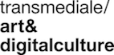

---
Pr-id: The Eternal Network:The Ends and Becomings of Network Culture
Book-type: reader

Item-id: ISBN EPUB: 978-94-92302-45-8

Editor: Kristoffer Gansing and Inga Luchs

Abstract:   ‘The network is everlasting’ wrote Robert Filliou and
George Brecht in 1967, a statement that, at first glance,
still seems to be true of today’s world. Yet there are
also signs that the omnipresence of networks is evolving
into another reality. In recent times, the limits of
networks rather than their endless possibilities have
been brought into focus. Ongoing media debates about hate
speech, fake news, and algorithmic bias swirl into a
growing backlash against networks. Perhaps it is time to
reconsider the contemporary reach and relevance of
the network imaginary.
Accompanying transmediale 2020 End to End’s exhibition
‘The Eternal Network’, this collection gathers contributions
from artists, activists, and theorists who engage
with the question of the network anew. In referencing
Filliou’s eternal notion, the exhibition and publication
project closes the loop between pre- and post-internet
imaginaries, opening up possible futures with and beyond
networks. This calls many of the collection’s authors to
turn to instances of independent and critical net cultures
as historical points of inspiration for rethinking,
reforming, or refuting networks in the present.
Contributors: Clemens Apprich, Johanna Bruckner, Daphne
Dragona, Kristoffer Gansing, Lorena Juan, Aay Liparoto,
Geert Lovink, Alessandro Ludovico, Aymeric Mansoux,
Rachel O‘Dwyer, Luiza Prado de O. Martins, Roel Roscam
Abbing, Femke Snelting, and Florian Wüst.

Keywords:   50 keywords for search and indexing
Rights: Creative Commons Attribution-NonCommercial-NoDerivatives 4.0 International.
...

#Colophon

**The Eternal Network: The Ends and Becomings of Network Culture** 
*Edited by Kristoffer Gansing and Inga Luchs*

**Authors**: Clemens Apprich, Johanna Bruckner, Daphne Dragona, Kristoffer
Gansing, Lorena Juan, Aay Liparoto, Geert Lovink, Alessandro Ludovico,
Aymeric Mansoux, Rachel O'Dwyer, Luiza Prado de
O. Martins, Roel Roscam Abbing, Femke Snelting, and Florian Wüst.

**Editorial coordination**: Tabea Hamperl

**Copy-editing**: Hannah Gregory and Rebecca Bligh

**Cover design**: The Laboratory of Manuel Bürger
(Simon Schindele, Manuel Bürger)

**Design & EPUB development**: Barbara Dubbeldam

**Publisher**: Institute of Network Cultures, Amsterdam, and transmediale
e.V., Berlin, 2020

ISBN print-on-demand: 978-94-92302-46-5

ISBN EPUB: 978-94-92302-45-8

**Contact**

Institute of Network Cultures 
Phone: +3120 5951865 
Email: [info@networkcultures.org](info@networkcultures.org) 
Web: [http://www.networkcultures.org](http://www.networkcultures.org) 

**Order** a copy or download this publication freely at
[http://networkcultures.org/publications](http://networkcultures.org/publications). The publication is also
available in German.

The Berlin-based transmediale festival publishes content related to its
program in its online journal, of which this collection is an extension,
published with the Institute of Network Cultures, Amsterdam. This
edition is realized in the framework of transmediale 2020 *End to End*
and its exhibition ‘The Eternal Network’, which takes place at Haus der
Kulturen der Welt from 28 January – 1 March 2020. The exhibition is
curated by Kristoffer Gansing with the advice of Clemens Apprich, Daphne
Dragona, Geert Lovink, and Florian Wüst.

transmediale wishes to thank Geert Lovink and INC for their
collaboration, and Miriam Rasch (INC) and Tabea Hamperl (transmediale)
for the coordination of the overall project; Inga Luchs for her great
co-editing, Hannah Gregory and Rebecca Bligh
for their thorough copy-editing, and Jen Theodor for her patient work on
the German translation. A heartfelt thanks goes out to all the authors
who contributed to this volume.

transmediale has been funded as a cultural institution of excellence by
Kulturstiftung des Bundes since 2004. For the wide range of supporters
that help make each year’s festival possible, visit
transmediale.de/partners.

This publication is licensed under the Creative Commons
Attribution-NonCommercial-NoDerivatives 4.0 International.

 
