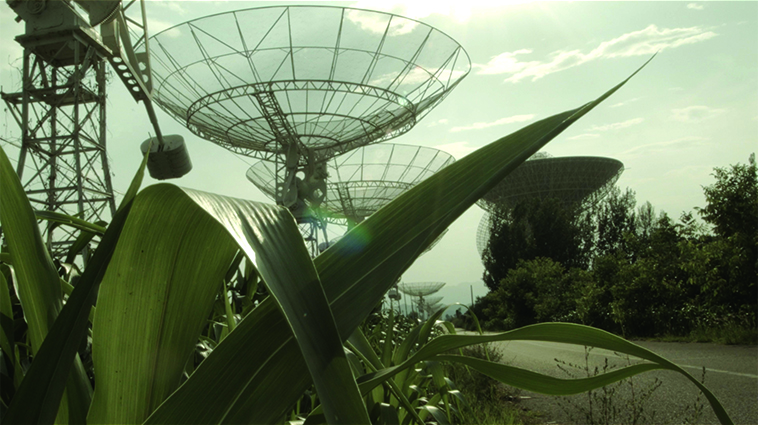

---
Pr-id: MoneyLab
P-id: INC Reader
A-id: 10
Type: article
Book-type: anthology
Anthology item: article
Item-id: unique no.
Article-title: title of the article
Article-status: accepted
Author: name(s) of author(s)
Author-email:   corresponding address
Author-bio:  about the author
Abstract:   short description of the article (100 words)
Keywords:   50 keywords for search and indexing
Rights: CC BY-NC 4.0
...

# Networks and Life-worlds: Ends and Endings

### Daphne Dragona

It might, at first, seem arbitrary to relate the ends of networks to the
so-called ‘end/s of the world’. The ‘ends’ of a network are its nodes:
the points connected through, and bounded by, its lines, forming
topologies that usually have the potential to be expanded by the
addition of more ends, or nodes, to the system. Originating in graph
theory, networks are often understood as the ‘abstract formulation’ of
elements that can have social, informational, technological, or
biological manifestations.[^05DragonaNetworksAndLifeWorlds_1] References to ‘the end of the world’
might be metaphorical or literal, depending on era, culture, and/or
context. As Gabrys explains,[^05DragonaNetworksAndLifeWorlds_2] worlds – plural – have always been
ending, due to settler colonialism, environmental racism, and ecological
exhaustion. Nowadays, the expression ‘world endings’ is mostly used as
‘the default script’[^05DragonaNetworksAndLifeWorlds_3] of the climate crisis in order to discuss its
‘(anthropic) causes and (catastrophic) consequences’;[^05DragonaNetworksAndLifeWorlds_4] it implies
forms of elimination, power, and dis/possession. Within this context, as
one may understand from Gabrys’s work, the role of networks is crucial,
and that is because it is the networked, sensing infrastructures that
provide environmental data regarding the possible ends of living worlds.
However, networks, at their conceptual inception, were not necessarily
meant to be associated with endings.

As Fritjof Capra explained, two decades ago, in his book *Web of
Life*,[^05DragonaNetworksAndLifeWorlds_5] network architectures assist us in understanding what holds
the living world together. ‘Whenever we see life, we see networks’,[^05DragonaNetworksAndLifeWorlds_6]
he argues. Capra uses the eponymous term ‘web of life’ to refer to
‘networks within networks’, ‘systems nesting within other systems.’[^05DragonaNetworksAndLifeWorlds_7]
A ‘node’, in this case, is an organism which itself constitutes a living
network, while having its place in a larger, complex architecture that
is nonhierarchical and always in a state of ‘open balance’. Such living
networks, for Capra, greatly differ from other technological or social
networks in having the capacity to constantly evolve, grow, and
self-regulate: these are networks that are able to constantly ‘make
themselves’.[^05DragonaNetworksAndLifeWorlds_8] Capra was convinced that we could learn a lot about the
principles of ecology and the ‘language of nature’ from studying what he
saw as the self-regulation of the living world and the networks that
comprise it. His interest lay in mapping and understanding these
networks, their patterns, interdependences and interrelationships. In
keeping with systems thinking and cybernetics, Capra turned to networks,
as a means to examine and comprehend the Earth’s ecosystems, their
architectures and metabolisms.

Rereading Capra’s work nowadays invites us to reflect upon the
application of the concept of networks to the Earth’s life-worlds, with
the latter understood as ecosystems:[^05DragonaNetworksAndLifeWorlds_9] the possibility to pass from
the parts to the whole manifests the human desire of the human for a
holistic vision of the living world.[^05DragonaNetworksAndLifeWorlds_10] From the 60s on, the Earth
came to be understood as a network of networks, the planet as a living
body – an object that could be both studied and controlled. Already with
the first planetary infrastructures – the satellite systems – as Gabrys
reminds us quoting McLuhan, the Earth became programmable, opening the
way for ‘new configurations \[…\] across technologies, people, practices
and nonhuman entities.’[^05DragonaNetworksAndLifeWorlds_11] Ever since that time, networked systems
have been used to capture information and to render the Earth’s
life-worlds not only legible but also sensible and available for
attempts at their management and optimization. Thanks to satellites,
drones, sensors and robotic entities, acting as nodes of highly complex
systems, it has become possible to monitor environmental conditions –
the quality of the air, the soil, the waters of the oceans – and,
increasingly, to navigate,[^05DragonaNetworksAndLifeWorlds_12] as new entanglements of machinic and
more-than-human entities come into existence.

This approach to the Earth as a ‘pilotable machine’ is defined by
Frédéric Neyrat as ‘geo-constructivism’.[^05DragonaNetworksAndLifeWorlds_13] At the heart of it, he
explains, lies the fundamental fantasy that ‘the Earth and everything
contained on it, the ecosystems and the organisms, humans and non-humans
can and must be reconstructed and entirely remade.’[^05DragonaNetworksAndLifeWorlds_14] Programming is
no longer enough: now the urge is to ‘repair, to reprogram, to
reconstruct’ the planet,[^05DragonaNetworksAndLifeWorlds_15] making use of science and technology to
measure climate change, forecast natural disasters and other phenomena.
This points to current discussions on ‘terraforming’. Albeit this term
is mostly used to refer to how *other* planets could be modified to
become habitable for humans, it is also a belief held by many that the
Earth itself must undergo such processes in order to remain viable for
its own life-forms.[^05DragonaNetworksAndLifeWorlds_16] Thus, in Neyrat’s terms, a ‘strange topology’
unfolds, with the geo-constructivists speculatively regarding themselves
as ‘residing off-planet’, detached from Earth’s ecosystems, so that
Earth can be reformatted as an object.[^05DragonaNetworksAndLifeWorlds_17]

Networks, therefore, as currently related to the understanding,
attempted management, and possible remaking of the living world, are
thus simultaneously associated with its possible endings and,
potentially, its new, human-made beginnings. Within this framework,
questions about the actors and the interests involved must come to the
fore. In his 2015 book *Capitalism and the Web of Life*, Jason W. Moore
highlights the ways in which capitalism has organized what is called now
‘nature’, and opened up the way for forms of exploitation within and
between cultures, populations, lands, and territories.[^05DragonaNetworksAndLifeWorlds_18] Should the
claim for a ‘reparation ecology’ arise, then, as Holly Jean Buck reminds
us, pointing to Moore’s work with Raj Patel, and the work of Donna
Haraway, several other ‘re-s’ must also be taken into consideration –
from recognition to redistribution, and from reimagination to recreation
or recomposition,[^05DragonaNetworksAndLifeWorlds_19] all of which would involve very different
processes than the attempted remaking, reprogramming and restoration of
the climate and the planet which prominent contemporary scientific and
technological approaches indicate.

How, then, might networks be reconsidered within the context of the
planet’s restoration? Could the web of life be understood, instead – in
terms of ‘nature as us, inside us, around us’[^05DragonaNetworksAndLifeWorlds_20] – as an open process
of ‘life-making’, with ‘no basic units, only webs within webs of
relations: “worlds within worlds”’?[^05DragonaNetworksAndLifeWorlds_21] Are there networks that could
‘suggest strategies for sensing, mapping, navigating and inventing
worlds otherwise’?[^05DragonaNetworksAndLifeWorlds_22] Could artistic practices assist in reimagining
the role of networks? In addressing these questions, I will now
introduce and examine the critical approaches and methodologies of four
artistic projects, which, in my opinion, offer grounds for a discussion
of different kinds of planetary infrastructures and/or sensory networks,
in specific cultural, geographical, and ecological contexts, and which
exemplify the ways in which specific technologies influence the
understanding and survival of life-worlds.

## Geocinema 

Asia Bazdyrieva, Alexey Orlov, and Solveig Suess initiated the
*Geocinema* project in order to examine how planetary scale sensory
networks, such as satellites, surveillance cameras, geosensors, and cell
phones, formulate the way that we see the world and its environmental
changes.[^05DragonaNetworksAndLifeWorlds_23] As in Benjamin Bratton’s words, there is a way in which
the climate crisis is ‘a figural truth that is composited together from
thousands of different kinds of sensing, each drawing a partial
image.’[^05DragonaNetworksAndLifeWorlds_24] It is only by the bringing-together of these
infrastructures of different scales and temporalities, and the
stitching-together of the raw data, that a representation of the world
and its changing climate can be produced. *Geocinema* is the name given
by this project’s creators to what they describe as a ‘vastly
distributed cinematic apparatus’ which can be used to remind us that
there is not one Earth, but many, ‘always composite \[…\] stitched
together into a montage of the world’[^05DragonaNetworksAndLifeWorlds_25] – *Geocinema* comprises
multiple angles, edits, and viewings.

 

For the production of the work the team conducted lengthy field trips
and in-depth research, exploring the planetary network of
Earth-observatories, with a focus on certain crucial nodes in Asia. One
of these is DBAR (Digital Belt and Road) in China – the Big Earth Data
counterpart to the Belt and Road Initiative[^05DragonaNetworksAndLifeWorlds_26] – which aims to operate
‘as a digital nervous system of the globe, providing information about
the events happening on (or close to) the Earth’s surface’,[^05DragonaNetworksAndLifeWorlds_27] while
engaging in a continuous rendering process.[^05DragonaNetworksAndLifeWorlds_28] The artists studied how
weather-forecasting is made possible, and how it is intertwined with
political and economic agendas, manifesting power asymmetries between
territories. As part of their research they also examined the impact on
the Earth’s body of the manufacture and construction of infrastructures
that are dependent on the extraction of rare-earth materials. Both the
locations of the network’s nodes – in this case, Earth-observatories –
and the sites of extractivism, relate to the making of pasts, presents
and futures.

*Geocinema* also comments on the ‘geopolitics of resolution’, a new form
of governance that operates through imaging – and thus allowing us to
see – the world as we think we know it.[^05DragonaNetworksAndLifeWorlds_29] The project affirms the
idea that, as T. J. Demos argues, the colonization of nature and the
colonization of its representation go hand in hand, making use of
anthropocenic imagery to reinforce the position that once ‘we’ have
mastered the imaging of nature, ‘we’ have also mastered nature
itself.[^05DragonaNetworksAndLifeWorlds_30] The final work included in the project is a documentary
based on imagery drawn from planetary scale sensory networks. Such
‘readymade material’ is reused, repurposed, and stitched together[^05DragonaNetworksAndLifeWorlds_31]
with interviews by the artists with data scientists, activists, and
guards from featured sites. With the aim of queering common narratives
about the image of the Earth and encourage the viewer to embrace
multiple new world-perspectives, the film is to a great extent narrated
by a human, or more-than-human, geo-narrator who takes the viewer to
locations across the planet.

## Asunder

In their project *Asunder,* Tega Brain, Julian Oliver, and Bengt Sjölén
address the representation and engineering of the Earth via an
examination of the role of machine learning. Vast amounts of the big
data now being captured by environmental media are processed by
artificial neural networks rather than human brains. *Asunder* takes as
its starting point the potential of Generative Adversarial Networks
(GANs) to create images from datasets and satellite imagery.[^05DragonaNetworksAndLifeWorlds_32] In
relation to the ongoing discourse about the potential of AI to monitor
and manage natural resources, this project’s creators ask: What
challenges arise in relation to the use of machine decision-making when
it comes to optimizing Earth’s landscapes and ecosystems? Whose
interests are served by its use in this context, and what would happen
if *human* needs were not in the foreground? Reflecting upon processes
of inclusion and exclusion that are now inherent to the design and
programming of various systems, Tega Brain talks about the need for a
form of ‘eccentric engineering’ whereby existing technologies could be
repurposed to include a wider diversity of agendas and perspectives, and
to keep in mind life-forms other than the human. This is a call for a
rethinking of the ‘biases and scopes’ of what ‘success and failure’ are
considered to be, when it comes to technologies of geoengineering.[^05DragonaNetworksAndLifeWorlds_33]

 

*Asunder* is a project that, while speculative in character, is based on
real data drawn from specific regions, arising from a climate modeling
system[^05DragonaNetworksAndLifeWorlds_34] that is able not only to make forecasts but also to propose
specific improvements and modifications. The installation presents
original satellite images of regions, provides specific details about
environmental conditions there, and presents the landscape modifications
proposed by the system. As the artists comment about the work,
unexpected scenarios and design strategies appear within the
installation: cities are relocated, nations are combined and coastlines
are straightened.[^05DragonaNetworksAndLifeWorlds_35] Thus, the project playfully and provocatively
discusses and calls into question approaches to geoengineering,
imagining what restoration and/or rewilding could mean, for example;
speculating on what worlds might end, and what worlds might proliferate,
depending on how the agendas in play are ‘weighted’. In a way, as Buck
notes, ‘the hard thing isn’t beginning the project, but ending it:
ensuring that what comes *after geoengineering* is livable.’[^05DragonaNetworksAndLifeWorlds_36] This
is of particular relevance to the present moment, at which more emphasis
is currently placed on research and far less on deployment.[^05DragonaNetworksAndLifeWorlds_37] That is
to say, that the ends and endings are not quite in view.

## Deep Steward 

*Machine Wilderness,* an art and science initiative connected to the
*FoAM* network[^05DragonaNetworksAndLifeWorlds_38] and initiated by Theun Karelse speaks of
‘technologies of loneliness’[^05DragonaNetworksAndLifeWorlds_39] that ‘violate natural processes,
disturb habitats and crush biodiversity’.[^05DragonaNetworksAndLifeWorlds_40] They ask why design
technologies are human-centered in the first place, not taking in mind
the complexity, biodiversity and different forms of energy of the living
environment.

 

*Machine Wilderness*, as the name implies, aims to bring wilderness
again to the center of attention, a notion that might be thought as
incompatible with technology constituting a ‘political free zone where
we are able to hide’,[^05DragonaNetworksAndLifeWorlds_41] or possibly something that in a way ‘no
longer exists’ and therefore is tried to be preserved in natural parks
or similar.[^05DragonaNetworksAndLifeWorlds_42] A call for wilderness manifests a return of nature, and
the potential to re-inhabit the world in a new way.[^05DragonaNetworksAndLifeWorlds_43] However, the
question remains as to which processes can make this possible.

Karelse argues for a form of ‘machine wilderness’ based on environmental
agents; that is, on a form of machine learning that is addressed to, and
taught by, the living world – by animals and plants. He draws
connections between robotic and biological organisms, and the forms of
agency that they have. Karelse and his colleagues work to develop
methodologies and projects that are aimed at being of help to living
organisms on the one hand, and at improving environmental literacy on
the other, helping humans to become aware of the ecosystems to which
they belong, and to become conscious participants in them. Their work is
conducted via workshops, talks and field trips in different regions,
building prototypes of wilderness machines and testing them in specific
local situations.

In their explorations of how new forms of more-than-human-oriented
environmental AI could inhabit the planet, they embrace ‘practices of
environmental solidarity, intimacy, affinity, allegiance, reverence,
commitment and kinship’.[^05DragonaNetworksAndLifeWorlds_44] They take the position that it is possible
to realize a synthetic ‘world view’ which acknowledges environmental
complexity, once living worlds are given their own voice. This is the
specific aim of *DeepSteward* – the project of Ian Ingram and Theun
Karelse – which is ‘an unsupervised field agent’, ‘built by humans but
left to interpret local trees, local plants, local animals, local
geographical features as it sees fit’,[^05DragonaNetworksAndLifeWorlds_45] as well as the project
*Zoöp*,[^05DragonaNetworksAndLifeWorlds_46] a collaboration between Klaas Kuitenbrouwer, Theun Karelse
with support by Bas van Koolwijk, whose name is derived from the words
‘*zoe*’, the Greek word for life, and ‘cooperation’. Here, they
speculate about how human, more-than-human and machine entities might
possibly all come together on equal terms, in a new entanglement, or
assemblage, of wilderness. The project is presented within a floating
globe, into which people are invited to insert their head, so as to
enter and experience a world of living organisms while it is being
captured by infrastructures of different scales and processed by machine
intelligence.

## Permaculture Network 

The potential of networks to empower wilderness is what drove Gary Zhexi
Zhang and Agnes Cameron to develop the *Permaculture Network*
project.[^05DragonaNetworksAndLifeWorlds_47] While they were the artists-in-residence of the
pedagogical organization Sakiya, based in the village of Ein Qinyya in
Palestine, the artists wanted to explore how a mesh network – a local
communication system – could grow along with the landscape itself, while
respecting and supporting its needs. Interestingly, the area in question
has self-rewilded, an ideal situation in terms of ecological
conservation and permaculture, however this is because it is part of
Area C of the West Bank, where Palestinians are not allowed to
build.[^05DragonaNetworksAndLifeWorlds_48]

 

Social and network infrastructures, technological and living systems,
political and cultural asymmetries are all featured in this project, in
relation to a specific location and its role/s in the emergence of
different networks of awareness and resistance. As the artists
specifically note, ‘there is a direct correlation between \[the\]
measurement of the land and its qualities and its subsequent
requisitioning from Palestinian hands, whether as a natural reserve, an
archaeological site or an industrial farm, on the pretext of
conservation and resource management.’[^05DragonaNetworksAndLifeWorlds_49]

Ecological, geological, and topographical features also come together in
the project’s eponymous networked-sensors infrastructure, and its web
interface.[^05DragonaNetworksAndLifeWorlds_50] In the former, local sensors are literally planted on
site, and supported by external feeds that provide satellite weather
data. As for the latter, the web interface operates as a live
simulation, or speculative fiction, of interactions in the living
environment, wherein different wild and cultivated species are
introduced, along with their supposed personalities and characteristics;
imagined dialogues between plants, animals, soil, water, the human and
the more-than-human world appear to reveal the dynamics of the soil and
the land. The attention paid here to the land and the soil can be read
as an artistic interpretation of María Puig de la Bellacasa’s
writings.[^05DragonaNetworksAndLifeWorlds_51] The soil, she explains, is not just a container of worlds
but a ‘world in itself’, which is not residual: not fixed, but alive,
thanks to all the organisms that inhabit it and offer their invisible
labor. The soil is a ‘living bioinfrastructure’, and therefore perfectly
exemplifies the ‘web of life’, along with the related endangerments.
Simulating it and animating it sheds vivid light on its actors and their
innumerable valuable movements and interactions.

Having surveyed these four art projects that attempt to reimagine the
networked systems that capture changes occurring on the body of planet,
affecting its landscapes and ecosystems, what conclusions may be drawn,
on the basis of these examples?

The projects here presented address the imbalances of power and agency
that characterize environmental media, networks, and infrastructures,
whether between territories or between the human and the more-than-human
worlds. The projects discuss satellites, artificial neural networks,
robotic prototypes and sensory networks in relation to the problematics
of monitoring the living world, as well as their potential for being
repurposed to build both new forms of awareness and/or actual
alternatives.

The creators of all four projects seem to agree that the first step in
any strategy of repair must be a much-needed change of perspective. The
urge for a more-than-human point of view is expressed in different ways
in all of the projects. However speculative these presentations might
appear – a story told through a film, a selection of artificially
generated images, an environmental AI prototype, a simulation of
interactions – each project has taken as their starting point existing
resources, real data sets, experiential knowledge. And in all of these
projects, the human is decentered; human political and economic
interests either have no place at all, or are called into question. This
can be understood as a form of ‘doing speculatively’,[^05DragonaNetworksAndLifeWorlds_52] a necessary
practice if we are to imagine anew systemic transformations: as Jussi
Parikka notes, models and simulations are ‘technologies of knowing’ that
help us to articulate the reality of abstractions.[^05DragonaNetworksAndLifeWorlds_53]

Seeing and understanding the world from multiple points of view speaks
to the need for a new form of literacy that is both environmental and
infrastructural. Against the vaunted promise of proposed human-centered
interventions on a grand scale, such as climate-engineering, these
projects argue for systems and networks of knowledge that can inform us
as to how ecosystems operate, how technologies can and do intervene, and
which life-worlds are – or are not – well-supported by such
interventions. Could it be that the potential for the emergence of what
(after Haraway) could be described as ‘kin-making technologies’ might
lie here, among these different approaches to the projected
reprogramming or remaking of the planet? Any such technologies must
acknowledge the preexisting forms of affinity found within the living
world, respect the underlying network or web of life and aim to support
it, prioritizing the viability of existing habitats. The creation of
kin-making technologies involves acts of recuperation as well as acts of
effecting sympoiesis between machinic and more-than-human
environments:[^05DragonaNetworksAndLifeWorlds_54] the creator comes in to design and/or repurpose
systems to see beyond the interests and needs of the human.

As Déborah Danowski argues, ‘when the end of the world is reached, an
entire new world, even if so desired, is impossible.’[^05DragonaNetworksAndLifeWorlds_55] Reprogramming
or remaking the world is not achievable either, and this is most likely
a disorientating direction for societies to face in, away from their
real responsibilities for effecting change.[^05DragonaNetworksAndLifeWorlds_56] What is still possible,
though, is to invent ‘new ways of living with what we have, in the ruins
of the present world.’[^05DragonaNetworksAndLifeWorlds_57] It is, principally, relationships that need
to be repaired, not just landscapes, the atmosphere, the climate.[^05DragonaNetworksAndLifeWorlds_58]
Returning to the network as a model for understanding the world, from
this relational perspective, it is not just the nodes, or ends, that
need to be taken care of; it is the ‘lines’ as well – the connections
that hopefully might prevent the acceleration of the world’s human-made
endings.

[^05DragonaNetworksAndLifeWorlds_1]: Alexander R. Galloway and Eugene Thacker, *The Exploit: A Theory
    of Networks*, Minneapolis: University of Minnesota Press, 2007, p.
    34.

[^05DragonaNetworksAndLifeWorlds_2]: Jennifer Gabrys, ‘Ocean Sensing and Navigating the End of this
    World’, *e-flux* 101 (2019),
    [https://www.e-flux.com/journal/101/272633/ocean-sensing-and-navigating-the-end-of-this-world/](https://www.e-flux.com/journal/101/272633/ocean-sensing-and-navigating-the-end-of-this-world/).

[^05DragonaNetworksAndLifeWorlds_3]: Gabrys, ‘Ocean Sensing’.

[^05DragonaNetworksAndLifeWorlds_4]: Deborah Danowski and Eduardo Viveiros de Castro, *The Ends of the
    World*, transl. Rodrigo Nunes, Cambridge/Malden: Polity Press, 2017,
    p. 1.

[^05DragonaNetworksAndLifeWorlds_5]: Fritjof Capra, *The Web of Life,* New York: Anchor Books, 1996.

[^05DragonaNetworksAndLifeWorlds_6]: Fritjof Capra, ‘The Web of Life’, 3rd annual Schrödinger Lecture,
    Trinity College Dublin, Ireland, 9 September 1997,
    [https://pdfs.semanticscholar.org/bfb6/c6a3bdfb66ad7016b6a43e18cc213bb0556b.pdf](https://pdfs.semanticscholar.org/bfb6/c6a3bdfb66ad7016b6a43e18cc213bb0556b.pdf).

[^05DragonaNetworksAndLifeWorlds_7]: Capra, *The Web of Life*, p. 5.

[^05DragonaNetworksAndLifeWorlds_8]: Here Capra refers to the biologists Humberto Maturana and
    FranciscoVarela, who famously spoke of the process of autopoiesis.
    Capra, ‘The Web of Life’.

[^05DragonaNetworksAndLifeWorlds_9]: The term was first coined by the British ecologist Arthur Tansley
    in 1936, and was further developed by G. Evelyn Hutchinson, and,
    later, Howard T. Odum and Eugene P. Odum.

[^05DragonaNetworksAndLifeWorlds_10]: Capra, *The Web of Life*, pp. 18-35.

[^05DragonaNetworksAndLifeWorlds_11]: This is a reference to the first Earth satellite, Sputnik.
    Jennifer Gabrys, *Program Earth: Environmental Sensing Technology
    and the Making of a Computational Planet*, Minneapolis: University
    Minnesota Press, 2015, p. 4.

[^05DragonaNetworksAndLifeWorlds_12]: Gabrys, ‘Ocean Sensing and Navigating the End of this World’.

[^05DragonaNetworksAndLifeWorlds_13]: Frédéric Neyrat, *The Unconstructable Earth: An Ecology of
    Separation*, trans. Drew S. Burk, New York: Fordham University
    Press, 2018, p. 1.

[^05DragonaNetworksAndLifeWorlds_14]: Neyrat, *The Unconstructable Earth*, p. 2.

[^05DragonaNetworksAndLifeWorlds_15]: Neyrat, *The Unconstructable Earth*, pp. 2f.

[^05DragonaNetworksAndLifeWorlds_16]: Benjamin Bratton, *The Terraforming*, Moscow: Strelka Press,
    2019.

[^05DragonaNetworksAndLifeWorlds_17]: Neyrat, *The Unconstructable Earth*, p. 5.

[^05DragonaNetworksAndLifeWorlds_18]: As Moore notes, the rise of capitalism gave us the idea not only
    that society was relatively independent of the web of life, but also
    that most women, indigenous peoples, slaves, colonized people were
    not fully human and thus not full members of society. Jason W.
    Moore, *Capitalism in the Web of Life: Ecology and the Accumulation
    of Capital*. London/New York: Verso, 2015.

[^05DragonaNetworksAndLifeWorlds_19]: Holly Jean Buck, *After Geoengineering: Climate Tragedy, Repair
    and Restoration*, London/New York: Verso, 2019, p. 245.

[^05DragonaNetworksAndLifeWorlds_20]: Moore, *Capitalism in the Web of Life*, p. 3.

[^05DragonaNetworksAndLifeWorlds_21]: Moore, *Capitalism in the Web of Life*, pp. 7f.

[^05DragonaNetworksAndLifeWorlds_22]: Gabrys, ‘Ocean Sensing and Navigating the End of this World’.

[^05DragonaNetworksAndLifeWorlds_23]: The *Geocinema* project was developed as part of The New Normal,
    a speculative urbanism programme at the Strelka Institute of Media,
    Architecture and Design, Moscow. A section of the project,
    *Geocinema: Framing Territories* was commissioned as part of The New
    Networked Normal (NNN), a 2019 partnership and program co-funded by
    the EU. The New Networked Normal, [https://geocinema.network/](https://geocinema.network/).

[^05DragonaNetworksAndLifeWorlds_24]: ‘Geocinema project presentation’, The New Normal 2018 Final
    Project Review, Strelka Institute Moscow, June 2018,
    [https://www.youtube.com/watch?v=UXlZdifwolE](https://www.youtube.com/watch?v=UXlZdifwolE).

[^05DragonaNetworksAndLifeWorlds_25]: ‘Geocinema project presentation’, The New Normal 2018 Final
    Project Review.

[^05DragonaNetworksAndLifeWorlds_26]: DBAR is part of the Belt and Road Initiative (BRI). BRI is a
    long-term policy and investment program aimed at infrastructural and
    economic development along the route of the historic Silk Road, from
    Beijing to Bangkok and across vast areas of Central Asia and into
    Europe.

[^05DragonaNetworksAndLifeWorlds_27]: Asia Bazdyrieva and Solveig Suess, ‘Future Cinema’ (working
    title), unpublished draft for publication in an upcoming issue of
    the *e-flux Architecture* journal.

[^05DragonaNetworksAndLifeWorlds_28]: This vision originates with Clinton’s vice-president Al Gore, who
    introduced it as another way of understanding the world based on
    advanced technologies such as geo-information systems, global
    positioning systems, communication networks, sensor webs, etc.

[^05DragonaNetworksAndLifeWorlds_29]: Geocinema, ‘Geocinema in conversation with Jussi Parikka’, 2018,
    [https://soundcloud.com/user-406692767/geocinema-in-conversation-with-jussi-parikka](https://soundcloud.com/user-406692767/geocinema-in-conversation-with-jussi-parikka).

[^05DragonaNetworksAndLifeWorlds_30]: T. J. Demos, *Against the Anthropocene: Visual Culture and
    Environment Today,* Berlin/New York: Sternberg Press, 2017, p. 28.

[^05DragonaNetworksAndLifeWorlds_31]: Stephanie Hessler, *Prospecting Ocean,* Cambridge, MA: The MIT
    Press, 2019.

[^05DragonaNetworksAndLifeWorlds_32]: Asunder, [https://asunder.earth/](https://asunder.earth/).

[^05DragonaNetworksAndLifeWorlds_33]: Tega Brain, *Eccentric Engineerin*g *blog*,
    [http://blog.eccentric.engineering/about/](http://blog.eccentric.engineering/about/).

[^05DragonaNetworksAndLifeWorlds_34]: The work runs on the CESM model. See University Corporation for
    Atmospheric Research, ‘Community Earth System Model’,
    [http://www.cesm.ucar.edu/](http://www.cesm.ucar.edu/).

[^05DragonaNetworksAndLifeWorlds_35]: Asunder, [https://asunder.earth/](https://asunder.earth/).

[^05DragonaNetworksAndLifeWorlds_36]: Buck, *After Geoengineering*, pp. 26f.

[^05DragonaNetworksAndLifeWorlds_37]: Buck, *After Geoengineering*, p. 43.

[^05DragonaNetworksAndLifeWorlds_38]: FoAM, [https://fo.am/about/](https://fo.am/about/).

[^05DragonaNetworksAndLifeWorlds_39]: Paraphrastic reference to what Edward O. Wilson terms the ‘age of
    loneliness’. Edward O. Wilson, *Half-Earth: Our Planet’s Fight for
    Life,* New York: Liveright Publishing Corporation, 2016, pp. 71, 73.

[^05DragonaNetworksAndLifeWorlds_40]: Machine Wilderness, [http://machinewilderness.net/](http://machinewilderness.net/).

[^05DragonaNetworksAndLifeWorlds_41]: transmediale, ‘Becoming Earth: Engineering Symbiotic Futures’,
    transmediale 2017,
    [https://www.youtube.com/watch?v=RvEZB3tmybs&t=1831s](https://www.youtube.com/watch?v=RvEZB3tmybs&t=1831s).

[^05DragonaNetworksAndLifeWorlds_42]: Wilson, *Half-Earth*, pp. 71, 73.

[^05DragonaNetworksAndLifeWorlds_43]: Neyrat, *The Unconstructable Earth*, p. 162.

[^05DragonaNetworksAndLifeWorlds_44]: Random Forests, [http://randomforest.nl/](http://randomforest.nl/).

[^05DragonaNetworksAndLifeWorlds_45]: Theun Karelse and Ian Ingram, ‘Deep Steward’, *FoAM blog*, 17
    April 2019, [https://fo.am/blog/2019/04/17/deep-steward/](https://fo.am/blog/2019/04/17/deep-steward/).

[^05DragonaNetworksAndLifeWorlds_46]: ‘Ecologies’, *Neuhaus blog,*
    [https://neuhaus.hetnieuweinstituut.nl/en/premises/zoop-research-facility]( https://neuhaus.hetnieuweinstituut.nl/en/premises/zoop-research-facility).

[^05DragonaNetworksAndLifeWorlds_47]: The work was commissioned as part of the ‘Rigged Systems’
    Solitude and ZKM Web Residencies,
    [https://schloss-post.com/permaculture-network/](https://schloss-post.com/permaculture-network/).

[^05DragonaNetworksAndLifeWorlds_48]: ‘Flora, Fauna and Folk Tales – A Permaculture Network. Interview
    with Gary Zhexi Zhang & Agnes Cameron’, *Schloss Post,* 5 September
    2019, [https://schloss-post.com/flora-fauna-and-folk-tales/](https://schloss-post.com/flora-fauna-and-folk-tales/).

[^05DragonaNetworksAndLifeWorlds_49]: ‘Flora, Fauna and Folk Tales’.

[^05DragonaNetworksAndLifeWorlds_50]: Schloss Post, [http://root.schloss-post.com/](http://root.schloss-post.com/).

[^05DragonaNetworksAndLifeWorlds_51]: María Puig de la Bellacasa, ‘Encountering Bioinfrastructure:
    Ecological Struggles and the Sciences of Soil’, *Social
    Epistemology: A Journal of Knowledge, Culture and Policy* 28.1
    (2014): 26-40.

[^05DragonaNetworksAndLifeWorlds_52]: Sophie Toupin and Spideralex, ‘Introduction: Radical Feminist
    Storytelling and Speculative Fiction: Creating new worlds by
    re-imagining hacking’, *Ada*: *A Journal of Gender New Media &
    Technology* 13 (2018),
    [https://adanewmedia.org/2018/05/issue13-toupin-spideralex/](https://adanewmedia.org/2018/05/issue13-toupin-spideralex/).

[^05DragonaNetworksAndLifeWorlds_53]: Jussi Parikka, ‘Abstractions – and How to be Here and There at
    the Same Time’, *FNG Research* 3.3 (May 2019),
    [https://research.fng.fi/2019/05/24/abstractions-and-how-to-be-here-and-there-at-the-same-time/](https://research.fng.fi/2019/05/24/abstractions-and-how-to-be-here-and-there-at-the-same-time/).

[^05DragonaNetworksAndLifeWorlds_54]: Donna Haraway, *Staying with the Trouble: Making Kin in the
    Chthulucene*, Durham: Duke University Press, 2016.

[^05DragonaNetworksAndLifeWorlds_55]: Déborah Danowski and Krystian Woznicki, ‘Welcoming the Ends of
    the World: an interview with philosopher Déborah Danowski about the
    problem that “there are too few people with too much world, and too
    many people with way too little”’, *Mediapart blog,* 8 April 2019,
    [https://blogs.mediapart.fr/krystian-woznicki/blog/080419/welcoming-ends-world](https://blogs.mediapart.fr/krystian-woznicki/blog/080419/welcoming-ends-world).

[^05DragonaNetworksAndLifeWorlds_56]: Neyrat, *The Unconstructable Earth*, p. 33.
[^05DragonaNetworksAndLifeWorlds_57]: Danowski and Woznicki, ‘Welcoming the Ends of the World’.

[^05DragonaNetworksAndLifeWorlds_58]: Buck, *After Geoengineering*, p. 44.
