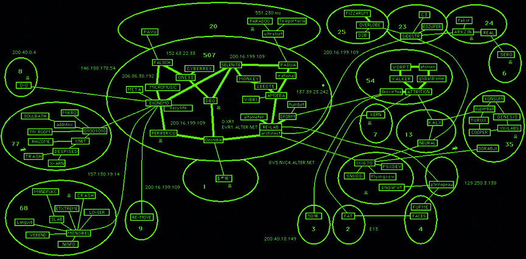
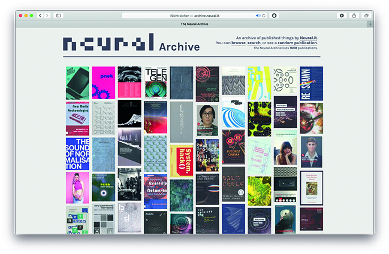

---
Pr-id: MoneyLab
P-id: INC Reader
A-id: 10
Type: article
Book-type: anthology
Anthology item: article
Item-id: unique no.
Article-title: title of the article
Article-status: accepted
Author: name(s) of author(s)
Author-email:   corresponding address
Author-bio:  about the author
Abstract:   short description of the article (100 words)
Keywords:   50 keywords for search and indexing
Rights: CC BY-NC 4.0
...

# Network Topologies: From the Early Web to Human Mesh Networks

### Alessandro Ludovico

## Network as a Paradigm, Network as a System

We live in a space of networks. The connections between people, data,
spaces, and objects have become more apparent and even assumed thanks to
the infrastructure that manifests its pulsating presence through our
screens and LED-equipped devices. Yet despite their prevalence, how can
we assign networks an adequately general definition that would be
cross-disciplinary? Here’s one attempt to compose such a definition from
various scientific and cultural domains: ‘elements, nodes, or sub-units
connected as a whole.’ The ‘whole’ defines the total networked space,
even in its potential size and shape, which is perhaps the most
ungraspable element of the contemporary moment, thanks to the average
network’s dimension and complexity. Its parts determine the
individuality of its essential components, the nodes.

The space we inhabit is filled with mostly opaque active nodes (such as
our devices), largely at a low hierarchy in the global grid of
interconnections, which privileges centralized entities being in control
of all the peripheral ones, and whose production and infrastructural use
is ascribable to a relatively small number of online and hardware
companies. Nonetheless, given that each node is individual, there
remains an autonomous capacity to conceptually redefine networks and
create sub- or separated networks at will. Using the same technical
infrastructure, we can connect with peers on almost infinite nodes that
are just a few steps away, while escaping the official ‘grids’.

The network structure must first be acknowledged as an abstract system,
and second as a manifestation of an enormous implementation of
information technology; as a paradigm, which reframes the technical
structure as a conceptual model. In this text I will try to analyze the
main changes in the evolution of network topologies through the past
decades, in line with the experiments we have accomplished with *Neural*
magazine over the same time frame. By ‘network topology’ I mean a blend
of the mathematical and more general definition of topology, applied to
networks, so something like: ‘spatial relations, whose constituent parts
are interrelated, unaffected by the continuous changes in shape, size,
or nodes.’ I will explore various embodiments of these topologies in the
interplay of networked cultures, the networking practices of *Neural*,
and the techno-cultural developments of networks.

## Early Utopia: Revealed Topologies and Personal Networks 

In the first decade of the public and then mass internet (early 90s to
early 00s) the visualization of the network structure represented the
new underlying digital structure that was forming behind the visual
appearance of single pages (typically shown as browser content). The
lack of any accurately compiled topologies, due to the constant growth
and evolution of these rapidly expanding networks, resulted in the rapid
obsolescence of any ‘visual map’ that tried to represent these network
topologies. This inspired the first generation of net artists to develop
their own visualizations, either fixed or dynamic, to express or create
an overview of physically or conceptually interconnected nodes. The *Web
Stalker* browser (1997) and JODI’s *Map* (1999) are among the most
celebrated of these net art works.

 

The former, developed by I/O/D (Matthew Fuller, Colin Green, and Simon
Pope), was a fully functioning alternative web browser whose main
feature was visualizing the links connecting to the requested page.
Fuller compared the dissection and rendering of the network to Gordon
Matta Clark’s ‘Splitting’ action (1974) where he literally bisected a
whole house (already slated for demolition).[^07Ludovico_NetworkTopologies_1] The *Web Stalker*
generated an abstract map of connections, ‘as a crawler function
gradually moving through the network. We saw the logical structure of
websites, established by the links, in and between them, as another key
resource.’[^07Ludovico_NetworkTopologies_2] Unveiling the infrastructure and relations of the network
in this way, the *Web Stalker* was antithetical to the page-centered,
accurate layout of other browsers. Net art critic Josephine Bosma writes
that ‘it embodies \[…\] art as a process.’[^07Ludovico_NetworkTopologies_3] The browser was
downloadable, and also distributed in other ways, like
surreptitiously installed on office computers and passed, for example,
via floppy disks during events, as I/O/D was also the name of a
floppy-based publication by the trio, founded in 1994.

JODI’s iconic low-tech *Map* (http://map.jodi.org) has a different,
subjective perspective, and was created by internet artist duo Joan
Heemskerk and Dirk Paesmans. It was a clickable online network diagram
representing the ‘landscape of domains and sites that most interested
them at the time’, with subjective relationships.[^07Ludovico_NetworkTopologies_4] JODI’s *Map*
accidentally formalized part of the net art avant-garde, and enlightened
some of its obscure manifestations, such as the French PAVU collective,
interested in détourning the web, and the fals.ch music/CD-ROM label.
The *Map* diagrammatically compiles an interconnected visual ‘document’
which outlived the time and context of its making. In a way it was
‘JODI’s Internet’, frozen in time and expressed through a curated
selection of entities, all within net art circles. This selection both
scaled down the network to which they were referring, to a size and
shape that could be manageably represented, and restricted it to a
sphere of mutual influence. (Incidentally, the earliest version of the
*Neural* website was one of the nodes of the JODI’s *Map*.)

Another couple of examples, developed to fill the gap between the
imaginary around emerging networks and their actual structure, help to
categorize different types of transparent network topologies further.
Lisa Jevbratt’s *1:1* (1999) was a database with ‘the addresses of every
Web site in the world and interfaces through which to view and use the
database’.[^07Ludovico_NetworkTopologies_5] The topology is represented through pixels which make
lines and stripes with various attributed colors, abstracted in order to
contain the ‘whole’ on one screen. As Rachel Greene describes, in
Jevbratt’s work ‘a landscape emerges’, which ‘tends towards the
imagistic and the representational.’[^07Ludovico_NetworkTopologies_6]

Schoenerwissen/OfCD’s *Minitasking* (2002), developed by Anne Pascual
and Marcus Hauer, was, in the words of its makers, a ‘graphical browser
for surfing the Gnutella network.’[^07Ludovico_NetworkTopologies_7] It visualized through different
color bubbles the evolution of a query and the ongoing activity and size
of the Servents. The topology of *Minitasking* represented the structure
of the first decentralized peer-to-peer network, used for the exchange
of mostly copyrighted files. The network was transparent in size and
form, while the anonymity of the participants was still protected
through the abstractions of the rendering. Compared to *1:1*, it shows
how the topologies of autonomous and mostly functional networks must be
constantly reshaped and their representations compellingly dynamic.

Somewhat ironically, a side effect of the dissemination of early mass
computer virus attacks were visualizations of the network, as they made
its topology transparent. At the peak of their infections, they could
reveal large parts of global interconnections – and indeed, weaknesses.
As I wrote in *Neural* in 2002, ‘The more computers get infected (or in
other words will accept the message), the bigger the impact and reaction
on the network will be. The critical mass of data spread around the
network, temporarily transforms the shape and the content of the
network, so it varies its own conscience.’[^07Ludovico_NetworkTopologies_8]

Yet another example of a transparent sub-network is the webring, a
circular chain of shared interest websites, at once horizontal and
sequential. This was the underlying construction of *Refresh* (1996), a
net art work by Alexei Shulgin, Vuk Ćosić, and Andreas Broeckman, which
showed how the connection between nodes required a negotiation among the
peers. Ćosić describes the work as follows:

> The Refresh Project \[…\] was a collaborative online performance done
> in October of 1996 during the opening of the St. Petersburg
> Biennial. Alexei Shulgin, Andreas Broeckman and moi have decided to
> create a loop between web pages using the simple & stupid
> &lt;refresh&gt; tag. Then we arranged for an IRC session with anybody
> interested to participate and have slowly woven something like 25
> different sites in one global ring.[^07Ludovico_NetworkTopologies_9]

A floppy disk with a ‘snapshot’ of this work was then distributed on the
cover of the third Nettime reader at the MetaForum III conference in
Budapest that year – an offline sharing of the existence and topology of
this network to other potential participants (and thereby nodes).

These works (with the exception of *1:1*) aimed to both autonomize and
connect compatible nodes in independent sub-networks, transparent but
protected, with the fascinating possibility of reconfiguring these same
nodes in order to evolve their meaning and function. They can still be
understood as what Hakim Bey (Peter Lamborn Wilson) defined in 1991 as
‘temporary autonomous zones.’[^07Ludovico_NetworkTopologies_10] A network ecology emerges from these
practices, with some key elements: transparency, the creation of
autonomous and negotiated sub-networks, the potential of
interconnections and their temporary or stable reconfigurations and
extensions, and the nodes and their respective roles.

## Networking Practices: The Interdependent Networks of *Neural*

Pre-internet alternative and radical networks of communications share
the figure of the ‘networker’: subjects developing their own networks,
within or outside predefined structures. In mail art, this figure
predominates, with the networker replacing the ‘artist’, with the
prerogative to create networks of artistic production, public sharing,
and archiving. In the words of Vittore Baroni, one of the most prominent
figures in mail art: ‘I saw the networker as a new cultural figure, a
sort of meta-author who created contexts for collective expression
rather than conventional individual works, and whose activities eluded
the “vicious circle” of the art market and therefore needed new critical
parameters and instruments to be fully analyzed and understood.’[^07Ludovico_NetworkTopologies_11]

The networker here can be related to the privileged early internet
scenario of relationships (small scale, quite unregulated, so mostly
free and still technically simple), and to the practices of net art. The
networker and early net artists share an underlying structure and
principles, if not the scope and nature of their tools. For example, the
Decentralized World-Wide Networker Congress for mail art in 1992 was a
bottom-up structure of gatherings and events, creating and expanding
upon sub-networks, including a three-day performance of eighty-six
artists exchanging copy art via fax around the world.[^07Ludovico_NetworkTopologies_12] Net artists
meanwhile were creating dynamic sub-networks, performances, and
initiatives globally, connected by the same spirit of distributed
production, collaboration, and knowledge-sharing.

These practices all inspired *Neural* magazine, its production, economy,
and associated activities. Founded in 1993, *Neural* began with one
specific concept: to be a single node within a larger network of
magazines and sources of information, all delivering content on digital
culture, both investigating and expanding the established domains. The
role of *Neural* has always been to weave together different data
domains, in order to trigger a new awareness of digital culture and the
growing network of entities producing this culture, which increasingly
break the boundaries between fields of research.[^07Ludovico_NetworkTopologies_13] Phillip Gochenour
defined this approach as ‘nodalism’, which ‘emphasizes the importance of
links and connections and stigmatizes disconnectedness and
solitude.’[^07Ludovico_NetworkTopologies_14] This is not meant as a description of a condition, but a
whole system: ‘in a network model each unit, though different in itself,
is part of an overall smoothly functioning system.’[^07Ludovico_NetworkTopologies_15]

The *Neural* project has been built to echo the networks it nurtures and
connects with, in a critical, but also open and collaborative way.
Moreover, the development of a proper focused network has transcended
the many platforms it occupies, and has entered into fruitful dialogues
with other ‘nodes’.[^07Ludovico_NetworkTopologies_16] *Neural* took a few years to develop into a
fully fledged informal network. In 2002, a network of magazines was
cofounded, whose members could support each other in their publishing
efforts, and discuss their shared condition, particularly the nodal
relationship between online and offline publishing. The network was
called Mag.net (magazine network of electronic cultural publishers) and
involved thirteen international editors whose collective slogan became
‘collaboration is better than competition’, recursively reflecting its
structure. Apart from sharing knowledge and developing projects among
groups of members, three anthologies (‘Mag.net Readers’) were co-edited
on the changing role of print and its ongoing mutation.

The mutual support network of Mag.net subsequently facilitated one of
its members, Springerin editor Georg Schöllhammer, to curate ‘Documenta
12 magazines’ in Kassel in 2007, which involved almost one hundred
independent art magazines from around the world. *Neural* contributed to
this project, also developing relationships with some of the other
featured publications, sharing similar conditions, interests, and
attitudes.

In *Neural*’s publishing practice, another networked layer was developed
a few years later, stemming from several experiments scattered in time.
The infrastructure of distribution meant that our 500 or so subscribers
included more than 150 institutional, mostly academic, libraries. These
libraries could be thought of both as a preservation strategy for the
magazine, hosting ‘back-up’ copies in distant places, and as a
distribution strategy for art works embedded within the magazine. These
art works, sometimes involving quite controversial ideological
components, mostly consisted in artists’ interventions into the space of
the page, with or without extra materials added or attached. In this way
the magazine became a limited-edition distribution platform, using the
infrastructural network of library collections.

A further layer of the *Neural* project is the Neural Archive, which
consists of the submissions and donations of publications the magazine
has received over the last twenty-five years.[^07Ludovico_NetworkTopologies_17] It is a searchable
online catalogue of print media and art publications, and acts as a
progressively growing representation of the community to which *Neural*
magazine belongs – it is an archive of this community’s production. In
the near future, the Neural Archive may become connected with other
similar archives, and already in itself shows the magazine’s connections
with the producers (publishers), and the inner connections among
publications that emerge when you search all the issues. Music is not
yet included in the archive, but could well be catalogued in the future,
given our already established network of record labels and their
contributions.

 

The funding of *Neural* is also ‘networked’, in that economic support
for the project comes from a strategic network of subscribers, rather
than from application-based funding, which *Neural* never applied for or
received. From the beginning, a kind of crowdfund *ante litteram* was
nurtured, with direct relations and communication that goes beyond the
mere exchange of goods and money. On top of this, there’s the community
of reference, or the network of artists, curators, and institutions
which periodically inform the magazine and/or are in dialogue about
their productions.

All these intertwining networks support the publishing, artistic, and
archiving practices, but they also need to be nourished. Their
interconnection generates sometimes unpredictable positive effects –
strategic information or support which resonates from one layer to
another, and from one node to another, transversally – but this is only
manageable as long as the size and complexity of the network is
maintained within a certain scale. With one-to-one relationships between
all the nodes, their incredible human capital – fueled by emotional as
well as technological resources – can become too much at some point, and
lead to dysfunctions and cracks.

What results is a cultural version of an ‘interdependent network’. The
nodes depend on each other for their ecology and economy. The technical
term for these type of networks, ‘cascading’, highlights their fragility
in case of failure, potentially causing breakdowns of the whole
system.[^07Ludovico_NetworkTopologies_18] However, when they are culturally constituted and mediated,
the networks have a different structure, as the single parts are
protected by their various roles, although still interdependent.

Such an interdependent network as we have built over time with *Neural*
might represent a possible, hopeful model or strategy for managing our
personal networks, preserving scale in direct relation to complexity,
and creating long-term or short-term nurtured connections, instead of
always looking for more – as is the pervasive commercial mantra.

## The Opaque Topology of Social Media

While these kind of interdependent networks have a relatively
transparent topology, at least in their public parts, in the case of
*Neural*, the last revolution in communication we have seen, social
media, is a self-transforming beast, which is less easy to discern.
Social media platforms structurally hide their inner topology, all the
while pushing for growth in the upper layer of users’ connections, which
boost profits, as a condition to thrive and survive. This process had
already begun in the first decade of the world wide web, when the big
players started to capitalize on the appropriation of the network
topology, through indexes and search engines, or giving private space to
host content, through ‘portals’. The topology of networks became
lucratively opaque and increasingly impenetrable.

The early need and desire to be aware of the network topology has
gradually shifted toward online corporations’ need to include an ever
larger number of users and content as assets, which has exploded with
the social media paradigm and the ‘appification’ of everything,
reiterated by most online platforms. This phenomenon is epitomized in
the near total mediation of the economy of relationships, and so of
networking, by social media. These platforms and protocols have
triggered the largest voluntary creation of valuable and contextualized
digital content, capitalizing on keeping their internal infrastructure
hidden. It is an ‘inclusive-exclusive’ model: inclusive in terms of the
functional accessibility of other users’ data and connections (the
capital of data), although dispossessing each user from their own data
ownership; and exclusive insofar as the internal network is hidden and
even adjusted by corporate technical and strategical algorithms (page
rank, timeline order, etc.), which make any attempt to interpret or
decode the model useless.

In this reality, the ‘whole’ topology is just too complex to map and
detail, even at the level of single users with a relatively low
threshold (or number of friends/followers/nodes): the user, pushed to
increase his or her contacts/nodes, loses track of the ‘whole’ of their
connections. The top-down inclusive-exclusive model works very well for
the companies in this respect, handing management of the networks to the
platform’s owners.

It is nonetheless very important to interpret these networks. If in this
model, technically ‘conflict is non-functional’, as Gochenour stated,
then we can consider that social media stores an inordinate amount of
useful contacts, which could become nodes of other focused networks,
once identified and extrapolated from the corporate platform’s
rules.[^07Ludovico_NetworkTopologies_19] Using the existing infrastructure of social media as a
source of possible nodes of new independent, and even possibly
interdependent networks, rather than number-driven platforms that
encourage obsessive self-promotion, might trigger a different economy of
networks and build new topologies.

## Human Mesh Networks

It is important then to consider to build networks of connections
creating meaning. With rising commercial attention on the amount of
connections having an impact on self-confidence, building scaled-down
networks, characterized primarily by the meaning of the exchange rather
than the quantity of exchanged signals could dismantle the popularity
paradigm. Indeed, if this paradigm evaluates the number of associations
as capital, then we’d consider that ‘the more connected, the more
individualized a point is.’[^07Ludovico_NetworkTopologies_20] The network is, as Latour affirms, a
‘privileged mode of organization thanks to the very extension of
information technology.’[^07Ludovico_NetworkTopologies_21] It is a privilege to access
infrastructures which reveal entities that could coalesce around
specific ideas and projects, forming new independent networks and
sub-networks, scaling down complexity through being aware of our
networked topography, and enabling us to better explore it. The six
degrees of separation from the potential meaningful nodes should guide
us toward finding the ‘human capital’ we want to cooperate with,
escaping the sick dream of being either a hyperactive celebrity or a
hyperactive audience. In this scenario, we’d value our discoverability
in chosen contexts, in order to gain and pass on proximity from the
nodes we want to build networks with, acting mostly outside the
industrialized platforms. We should build ‘human mesh networks’ with
interdependences that would preserve multiple potential layers of
application and collectivity. The network topology of critical cultural
forms embodies the concept of the network as a supportive
infrastructure, a flexible skeleton for vital action. Networks are
collective agents that author, facilitate, and propagate content, an
essential part of the strategies necessary for instigating rebellion and
alternative visions of society, for rethinking digital limits and
conceptual possibilities. Once we reclaim the infrastructures, and a
human scale supersedes technological complexity, we can start to
properly shape our own networks with trusted nodes, making alliances
between trusted entities of information with an open, non-self-rewarding
attitude.

[^07Ludovico_NetworkTopologies_1]: Matthew Fuller, *Behind the Blip. Essays on the Culture of
    Software*, Brooklyn, NY: Autonomedia, 2003, p. 40.

[^07Ludovico_NetworkTopologies_2]: Matthew Fuller, ‘Crawl, Map, Link, Read, Copy, Repeat’, *Rhizome*
    (17 February 2017),
    [https://rhizome.org/editorial/2017/feb/17/iod-4-web-stalker/](https://rhizome.org/editorial/2017/feb/17/iod-4-web-stalker/).

[^07Ludovico_NetworkTopologies_3]: Josephine Bosma, *Nettitudes: Let’s Talk Net Art*, Rotterdam: NAI,
    2011, p. 76.

[^07Ludovico_NetworkTopologies_4]: Alexander R. Galloway, ‘Jodi’s Infrastructure’, *e-flux Journal*
    74 (June 2016), [https://www.e-flux.com/journal/74/59810/jodi-s-infrastructure/](https://www.e-flux.com/journal/74/59810/jodi-s-infrastructure/).

[^07Ludovico_NetworkTopologies_5]: Lisa Jevbratt, 1999, [http://128.111.69.4/~jevbratt/1_to_1/description.html](http://128.111.69.4/~jevbratt/1_to_1/description.html).

[^07Ludovico_NetworkTopologies_6]: Rachel Greene, *Internet Art*, London: Thames & Hudson, 2004, p.
    140. 

[^07Ludovico_NetworkTopologies_7]: Schoenerwissen/OfCD, ‘Minitasking’, [https://rhizome.org/art/artbase/artwork/minitasking/](https://rhizome.org/art/artbase/artwork/minitasking/).

[^07Ludovico_NetworkTopologies_8]: Alessandro Ludovico, ‘Infection as Communication’, *Neural* 22
    (2002).

[^07Ludovico_NetworkTopologies_9]: Ćosić, Vuk, ‘\[-28\] The Refresh Project’, 2015,
    [https://free.janezjansa.si/blog/2015/01/28-the-refresh-project/](https://free.janezjansa.si/blog/2015/01/28-the-refresh-project/).

[^07Ludovico_NetworkTopologies_10]: Hakim Bey, *T.A.Z: The Temporary Autonomous Zone, Ontological
    Anarchy, Poetic Terrorism*, New York: Autonomedia, 1991.

[^07Ludovico_NetworkTopologies_11]: Vittore Baroni, ‘Memo from a Networker’,
    [http://www.lomholtmailartarchive.dk/texts/vittore-baroni-memo-from-a-networker](http://www.lomholtmailartarchive.dk/texts/vittore-baroni-memo-from-a-networker).

[^07Ludovico_NetworkTopologies_12]: György Galántai, Júlia Klaniczay, and Kristine Stiles, *Artpool:
    The Experimental Art Archive of East-Central Europe; History of an
    Active Archive for Producing, Networking, Curating and Researching
    Art Since 1970*, Budapest: Artpool, 2013, p. 136.

[^07Ludovico_NetworkTopologies_13]: Annette Wolfsberger, ‘Interview with Alessandro Ludovico’, in
    Nicola Mullenger and Annette Wolfsberger (eds) *Cultural Bloggers
    Interviewed*, Amsterdam: LabforCulture, 2010, pp. 69-80.

[^07Ludovico_NetworkTopologies_14]: Phillip Gochenour, ‘Nodalism’, *Digital Humanities Quarterly* 5.3
    (2011),
    [http://www.digitalhumanities.org/dhq/vol/5/3/000105/000105.html](http://www.digitalhumanities.org/dhq/vol/5/3/000105/000105.html).

[^07Ludovico_NetworkTopologies_15]: Gochenour, ‘Nodalism’.

[^07Ludovico_NetworkTopologies_16]: Wolfsberger, ‘Interview with Alessandro Ludovico’.

[^07Ludovico_NetworkTopologies_17]: The Neural Archive, [http://archive.neural.it](http://archive.neural.it).

[^07Ludovico_NetworkTopologies_18]: Alessandro Vespignani, ‘Complex Networks: The Fragility of
    Interdependency’, *Nature* 464.7291 (April 2010): 984-985.

[^07Ludovico_NetworkTopologies_19]: Gochenour, ‘Nodalism’.

[^07Ludovico_NetworkTopologies_20]: Bruno Latour, *Reassembling the Social: An Introduction to
    Actor-Network-Theory*, Oxford: Oxford University Press, 2008, p.
    133.

[^07Ludovico_NetworkTopologies_21]: Latour, *Reassembling the Social*, p. 129.
