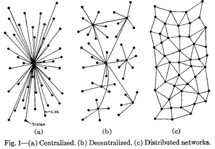

---
Pr-id: MoneyLab
P-id: INC Reader
A-id: 10
Type: article
Book-type: anthology
Anthology item: article
Item-id: unique no.
Article-title: title of the article
Article-status: accepted
Author: name(s) of author(s)
Author-email:   corresponding address
Author-bio:  about the author
Abstract:   short description of the article (100 words)
Keywords:   50 keywords for search and indexing
Rights: CC BY-NC 4.0
...

# Other Geometries

### Femke Snelting

**Editors note: This article was originally published in the Affective
Infrastructures issue of the transmediale journal.**[^12SneltingOtherGeometries_1] **In the run up
of its 2019 edition, transmediale hosted the transdisciplinary Study
Circle *Affective Infrastructures* which over a two-month period
convened in workshops and online discussions, culminating in public
events at the festival. Thinking with several non-circular topologies
that emerge from collective desire and action, Femke Snelting recounts
and reflects on this experience.**

‘I want to find a way in this conversation to not remain circling around
feelings of powerlessness and stunted outrage; we need “affective
infrastructures” that help us feel differently, such that we might act
unexpectedly. That we might act at all.’ With this call, Lou Cornum
opened the archipelagic exchange published in this same journal, now
three months ago.[^12SneltingOtherGeometries_2] Lou invited the Study Circle to explore the
dynamic tensions between ‘affect’ and ‘infrastructure’ in order to find
a way out of the paralyzing feeling of ‘circling around’.

A circle is a simple geometric shape. The term ‘circle’ can refer to the
outline of a figure, or to a round shape, including its interior.
Circles are mathematically defined as the set of all points in a plane
that are at the same distance from a shared center; its boundary or
circumference is formed by tracing the curve of a point that keeps
moving at a constant radius from the middle.

 

Circles are omnipresent in practices and imaginaries of collectivity.
However, their usefulness for thinking and moving with the kind of
‘aspirational ambivalence’[^12SneltingOtherGeometries_3] that the Study Circle was committed to,
is limited. Their flatness provides little in the way of vocabulary for
more complex relational notions that attempt to include space, matter
and time, let alone interspecies mingling and other uneasy alliances.
The obligation to always stay at the same distance from the center
promises a situation of equality but does so by conflating it with
similarity. Circles divide spaces into an interior and an exterior, a
binary separation that is never easy to overcome. We urgently need other
axes to move along.

The stage for the Study Circle had been set with a quote from Lauren
Berlant in which she introduces the combinatory concept ‘Affective
Infrastructures’ as a way to think about what could bind us together in
troubling times. In her text, Berlant takes on the complex project of
thinking a commons beyond the objective equivalency of ‘likeness’. Her
proposal is to actualize resilient structures that could work from and
with ‘non-sovereign relationality as the foundational quality of being
in common’. In other words, she asks us to think with other geometries
of relation.

 

The *Affective Infrastructures* Study Circle never formed or performed a
circle, beyond its very name. Its complex shape was carefully composed
by inviting eight geographically dispersed people, speaking and writing
through many languages with varying levels of comfort. Our diverse
gender realities, geopolitical situations, disciplinary backgrounds,
practical experiences and even age differences meant that we each came
with specific questions regarding both ‘affect’ and ‘infrastructure’.

 

The circularity of the Study Circle was further interfered with by
overlapping presences, concerns, and tools. A few months before the
festival took place, and the day after the elections in Brazil, some of
us physically met in Berlin, while others connected remotely online. As
gas canisters were thrown at migrants trying to cross border between the
U.S. and Mexico, we tried to come to terms with the consequences for
ourselves and our allies of Jair Bolsonaro having been elected
president. We rallied against political inertia in the face of climate
change and battled institutional and gender violence. We communicated
across multiple time zones, from three continents, with the help of a
mailing list, private email and messaging, video conferencing tools and
many online notepads. There were erratic sleep cycles, exhaustion, and
personal anxiety; there were network issues and failed connections.
There were misunderstandings, surprising discoveries, and quite some
funny jokes too. Meanwhile visas expired, and family members, deadlines,
and dogs needed to be taken care of.

 

Amidst our scattered connections, other geometries of togetherness start
to emerge. Some are explicit, well-known configurations and others more
opaque, drifting slowly to the surface. We briefly consider the
possibilities of distributed networks. Their iconic representation shows
them as the final step in an evolution, neatly ordered along the
increasing autonomy and resilience of individual nodes. Distributed
networks are a product of Cold War engineering and graphically argue
that they continue to perform even after a portion of nodes are
incapacitated in an attack. Distributed networks rely on load-balancing
sovereign agencies that exert power over others. The defensive drawing
does not tell us much about the possibilities for non-sovereign
relationality; the kind of infrastructural renderings that we want to
converse with need to be less one-dimensional and overly schematic. Our
intertwining bibliography orients towards queer, postcolonial and
feminist theory, but also fiction. The torsions and tensions that we try
to formulate with find companionship in work that affirmatively
critiques the regimes of the normative, the legible, and the regular.

 

What happens between nodes and edges? Zach Blas invites us to deplace
our attention to the negative space of networks, and to stop focusing on
the centralizing force of connecting points. Thinking with Ulises
Mejias, Blas calls this space ‘paranodal’, a paradigm shift which makes
thinkable ‘that which is not only outside the network but also beyond
the form of the network itself.’[^12SneltingOtherGeometries_4] His proposal for paranodal spaces
resonates with Nepantla, the locus of resistance that Gloria Anzaldúa
makes emerge in *Borderlands/La Frontera: The New Mestiza*: ‘Nepantlas
are places of constant tension, where the missing or absent pieces can
be summoned back, where transformation and healing may be possible,
where wholeness is just out of reach but seems attainable.’[^12SneltingOtherGeometries_5]

How to disentangle our experiences of stunted outrage from being caught
in the middle of universalist totalitarian apparatuses provided by the
GAFAM amalgam? Their homogenizing techno-political framework make dark
alignments between modernism, heteropatriarchy, capitalism, and
colonialism resurface. Their ongoing promises of
equality-through-variability, of optimized affect and monetized
relations, make it increasingly difficult to think opacity, contingency,
ambiguity and dirty futures beyond yet new ways of exerting power over
others (either in the shape of ownership, parenthood, law, species,
gender or state). We really need to bend our infrastructural desires in
other directions.

 

It is here that the fungal arrives in our conversation as a way to
conceptualize non-uniform collaborations under conditions of precarity.
Being more than rhizomatic, molds and mycellia seem to mingle
effectively with toxic soil, damaged trees, and polluted air as if they
were ambitious employees at an afterwork cocktail party. For a fungal
infrastructure, contamination is definitely part of the equation. These
hypertextual naturecultures also remind us of the fact that the mixing
of layers can be violent and not necessarily a voluntary affair. With
Anna Lowenhaupt Tsing we wonder how such messy geometries can be
responsible with extraction, without reverting to mere calculation. It
is curious, how hard it is to draw such non-romantic forms of
togetherness.[^12SneltingOtherGeometries_6]

 

We jump from the de-stratifying scum of fungi to the alluring promises
of hyperbolic geometry through the generous folds of the carrier bag,
from inside to outside and back again. ‘A leaf a gourd a shell a net a
bag a sling a sack a bottle a pot a box a container. A holder. A
recipient.’[^12SneltingOtherGeometries_7] Ursula K. Le Guin enlists multiple images of envelopment
and asks us to consider structures that can hold together extra-equal
agencies. Her porous containers vibrate with Berlants’ call for
non-sovereign relationality and make a diffractive topology of
interconnected surfaces appear. Could the swooping dimensionality of
Affective Infrastructures curl up the parallel postulates of solid
planes?[^12SneltingOtherGeometries_8]

And then, there is the tidal imaginary of the archipelago. With Édouard
Glissant we wonder about networks of relations in a state of permanent
transformation. Our affective infrastructural imaginations are being
moved by the unpredictable combination of changing currents, a hot
breeze and the shifting landscape of many islands. They diffract
together in a *métissage* without limits; maybe this is not another
geometry but a different world altogether? ‘Archipelagic thought is well
suited to the ways of our world. It draws from its ambiguity, its
fragility, its derivation. It is in accordance with the practice of the
detour, which is not the same as flight or resignation.’[^12SneltingOtherGeometries_9]

Our ongoing experience of knotting together different scales and
intensities, without attempting to collapse them into each other, made
increasingly clear that in order to rise to the challenge of thinking
‘affect’ with ‘infrastructure’ we needed to connect the *how* and *what*
of the Study Circle. Dispersion, insecurity, precarity, suspension,
instability, difference... How to think through and with the constraints
of non-circular togetherness?

 

When The Study Circle shared its thoughts at a public discussion, we
were asked if we had any ideas how to implement the dynamic tensions
between ‘affect’ and ‘infrastructure’ into actual tools and software.
Our replies were hesitant; not because we wanted to negate the
importance of concretization, but because to imagine togetherness with
difference, we first need to change our frames of reference to ones that
do not depend on zero eccentricity. This shifting of geometries is a
necessary step to come up with technological renderings of possible
non-utopian models that go beyond the rigidifying assumptions of
sameness and reciprocity. If affective infrastructures have any capacity
for providing us with the means for acting at all, they will need to be
simultaneously complex and concrete, or they will not be.[^12SneltingOtherGeometries_10]

[^12SneltingOtherGeometries_1]: Femke Snelting, ‘Other Geometries’, *transmediale journal* 3
    (2019), <https://transmediale.de/content/other-geometries>.

[^12SneltingOtherGeometries_2]: Lou Cornum, in: ‘Affective Infrastructures: A Tableau, Altar,
    Scene, Diorama, or Archipelago’, *transmediale journal* 3 (2019).

[^12SneltingOtherGeometries_3]: Lauren Berlant, ‘The Commons: Infrastructures for Troubling
    Times’, *Environment and Planning D: Society and Space* 34.3 (2016):
    393-419.

[^12SneltingOtherGeometries_4]: Zach Blas, ‘Contra-Internet’, *e-flux Journal* 74 (June 2016),
    <https://www.e-flux.com/journal/74/59816/contra-internet/>.

[^12SneltingOtherGeometries_5]: Gloria Anzaldúa, *Light in the Dark/Luz en lo Oscuro: Rewriting
    Identity, Spirituality, Reality*, Durham: Duke University Press,
    2015, p. 2.

[^12SneltingOtherGeometries_6]: Anna Lowenhaupt Tsing, *The Mushroom at the End of the World On
    the Possibility of Life in Capitalist Ruins*, Princeton, NJ:
    University Press, 2017.

[^12SneltingOtherGeometries_7]: Ursula K. Le Guin, ‘The Carrier Bag Theory of Fiction’, in Cheryll
    Glotfelty and Harold Fromm (eds) *The Ecocriticism Reader: Landmarks
    in Literacy Ecology*, Athens, Georgia: University of Georgia Press,
    1996 \[1988\], pp. 149-154, p. 150.

[^12SneltingOtherGeometries_8]: ‘Rolling inward enables rolling outward; the shape of life’s
    motion traces a hyperbolic space, swooping and fluting like the
    folds of a frilled lettuce, coral reef, or bit of crocheting.’ Donna
    Haraway, *Staying with the Trouble: Making Kin in the Chthulucene*,
    Durham: Duke University Press, 2016, p. 68.

[^12SneltingOtherGeometries_9]: Édouard Glissant, *Traité du Tout-Monde: Poétique IV*, Paris:
    Gallimard, 1997, p. 31. Translation by author.

[^12SneltingOtherGeometries_10]: Private conversation with Jara Rocha, 2019.
