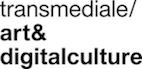

##The Eternal Network: The Ends and Becomings of Network Culture 
**Edited by Kristoffer Gansing and Inga Luchs**

**Authors**: Clemens Apprich, Johanna Bruckner, Daphne Dragona, Kristoffer
Gansing, Lorena Juan, Aay Liparoto, Geert Lovink, Alessandro Ludovico,
Aymeric Mansoux, Rachel Dwyer, Luiza Prado de
O. Martins, Roel Roscam Abbing, Femke Snelting, and Florian Wüst.

**Editorial coordination**: Tabea Hamperl

**Copy-editing**: Hannah Gregory and Rebecca Bligh

**Cover design**: The Laboratory of Manuel Bürger
(Simon Schindele, Manuel Bürger)

**Design & EPUB development**: Barbara Dubbeldam

**Publisher**: Institute of Network Cultures, Amsterdam, and transmediale
e.V., Berlin, 2020

ISBN print-on-demand: 978-94-92302-46-5

ISBN EPUB: 978-94-92302-45-8

**Contact**

Institute of Network Cultures 
Phone: +3120 5951865 
Email: [info@networkcultures.org](info@networkcultures.org) 
Web: [http://www.networkcultures.org](http://www.networkcultures.org) 

**Order** a copy or download this publication freely at
[http://networkcultures.org/publications](http://networkcultures.org/publications). The publication is also
available in German.

The Berlin-based transmediale festival publishes content related to its
program in its online journal, of which this collection is an extension,
published with the Institute of Network Cultures, Amsterdam. This
edition is realized in the framework of transmediale 2020 *End to End*
and its exhibition ‘The Eternal Network’, which takes place at Haus der
Kulturen der Welt from 28 January – 1 March 2020. The exhibition is
curated by Kristoffer Gansing with the advice of Clemens Apprich, Daphne
Dragona, Geert Lovink, and Florian Wüst.

transmediale wishes to thank Geert Lovink and INC for their
collaboration, and Miriam Rasch (INC) and Tabea Hamperl (transmediale)
for the coordination of the overall project; Inga Luchs for her great
co-editing, Hannah Gregory and Rebecca Bligh
for their thorough copy-editing, and Jen Theodor for her patient work on
the German translation. A heartfelt thanks goes out to all the authors
who contributed to this volume.

transmediale has been funded as a cultural institution of excellence by
Kulturstiftung des Bundes since 2004. For the wide range of supporters
that help make each year’s festival possible, visit
transmediale.de/partners.

This publication is licensed under the Creative Commons
Attribution-NonCommercial-NoDerivatives 4.0 International.

 

#Contents

##Introduction

<a href='ch003.xhtml'>**Introduction: Network Means and Ends**</a>
 Kristoffer Gansing

<a href='ch004.xhtml'>**What Was the Network? A Conversation on the Possibilities and Limits of the Network Imaginary**</a>
 Clemens Apprich, Daphne Dragona, Kristoffer Gansing, Geert Lovink, and
Florian Wüst

##Networks and Networlds

<a href='ch005.xhtml'>**The Never-ending Network**</a> 
Clemens Apprich

<a href='ch006.xhtml'>**Networks and Life-worlds** </a> 
Daphne Dragona

<a href='ch007.xhtml'>**There Are Words and Worlds That Are Truthful and True**</a> 
Luiza Prado de O. Martins

##Human, Nonhuman and Networks In Between

<a href='ch008.xhtml'>**Network Topologies: From the Early Web to Human Mesh Networks**</a> 
Alessandro Ludovico

<a href='ch009.xhtml'>**Another Net is Possible**</a>  
Rachel O'Dwyer

<a href='ch010.xhtml'>**Everything We Build**</a>  
Aay Liparoto and Lorena Juan

<a href='ch011.xhtml'>**Molecular Sex and Polymorphic Sensibilities**</a>  
Johanna Bruckner

##Endings and New Becomings

<a href='ch012.xhtml'>**Requiem for the Network**</a> 
Geert Lovink

<a href='ch013.xhtml'>**Other Geometries**</a> 
Femke Snelting

<a href='ch014.xhtml'>**Seven Theses on the Fediverse and the Becoming of FLOSS**</a> 
Aymeric Mansoux and Roel Roscam Abbing

# Introduction: Network Means and Ends

### Kristoffer Gansing

## The Persistent Ending of Networks

The internet has already ended many times – at least, it has when
understood within the framework of network idealism, which, permeating
the preceding century, has only ‘heated up’ over the past fifty years of
globalization and the invention of the internet. ‘The revolution is
over. Welcome to the afterglow’, was the curatorial tagline of
transmediale 2014, formulated in light of the supposed wake-up call of
Edward Snowden’s revelations. A year later, *e-flux journal* published
its anthology *The Internet Does Not Exist*, including, among others,
Hito Steyerl’s essay ‘Too Much World: Is the Internet Dead?’.[^02GansingIntroduction_1] This
was back when the terms ‘post-digital’ and ‘post-internet’ were doing
the rounds, both in critical media practice, and as a
contemporary-art-world trend. Back then, the discussion was all about
the internet becoming a fact of life, beyond the digital information
exchange as such; impacting analog aesthetics, offline identities,
ecologies, and geopolitics. Of course, the (virtual) reality of global
financial networks (and their breakdowns) had already been reshaping
life, politics, and networks of all scales, for a long time. Now, just
as the financial sector remains largely obscure to the greater public,
so, too, has the network culture that emerged along with the web, been
subsumed within a larger framework of so-called digitalization
characterized by platforms, opaque artificial intelligence, and largely
invisible cloud infrastructures and services.

This is the age of platform and surveillance capitalism, in which, as
Geert Lovink contends in his essay for this volume, nobody talks about
networks anymore. The same fate seems to be slowly befalling the
internet and the web. The latter, whose thirty-year anniversary was in
March 2019, has come to be regarded as something as dreary as
television, a view that has only intensified as the streaming model has
claimed its dominance. According to Joel Waldfogel, consumers are now
living through a new ‘golden age’ of the cultural industries.[^02GansingIntroduction_2]
Certainly, if we are to believe the statistics, global revenue from
films, books, games, and music, has never been higher. If this *is* a
golden age, then it is one not so much for the users, as, ironically,
for those intermediaries that the network paradigm once promised to get
rid of by means of decentralization and end-to-end communication.

Cut to 2019, when a call for conference papers announces ‘The Ends of
Social Media’,[^02GansingIntroduction_3] and when, whenever we hear about networks it is
usually in the apocalyptic terms of network backlash: government-induced
internet blackouts, fake news, botnets, trolls, and hate speech. How to
reconcile the end of end-to-end – and, indeed, of liberal democracy –
with this ‘golden age’ of media content, in which the personalized media
revolution appears to have won out over the collective, and the network
to have persisted, but become opaque, polarized, and anything but
neutral? Maybe network idealism and the belief in net neutrality were
misguided to start with? Now that the more tangible limits of networks
are becoming visible, it might be time to readdress the network
question, which is ultimately about future models of sociality,
technology, and politics, in societies after globalization.

## The Network Is Everlasting

In 1967, Robert Filliou and George Brecht published a poem in which they
stated that ‘the network is everlasting’.[^02GansingIntroduction_4] This was a piece of
pre-internet culture, celebrating the interconnectedness of everyday
lives and activities across an emerging global world, with specific
relation to the authors’ practice of mail art, using the postal system
as a democratic means of communicational art-making. Filliou further
developed a poetic imaginary of ‘the eternal network’, referring both to
an existing network of post-avant-garde artist friends, and to ‘the
network’ as an overarching metaphor for the organization of work and
culture within this emerging world. As the art critic Lars Bang-Larsen
has observed, before the network ‘became dominated by digital
connotations’ it was ‘a social concept’.[^02GansingIntroduction_5] The starting point for this
book (and accompanying exhibition) is a strategic reactivation of
Filliou’s notion of ‘the eternal network’, as an idea(l) of network
culture beyond the technical reality of the actually existing one we
know from our day-to-day online experience. From networks as idea(l),
through the emergence and establishment of the internet and the
subsequent network culture – in a way, closing a loop between pre- and
post-internet reality.

In alignment with this perspective, the authors of this collection
address the potentials and limits of networks, whether by reflecting on
specific instances of critical network culture, and/or by suggesting new
lines of thought and practice that might serve to replace or modify the
network imaginary; whether referring to the multiple histories of
networks, and/or going beyond networks in their current, established
form(s). The book is an extension of the *End to End* transmediale 2020
festival in Berlin, which also features an exhibition entitled ‘The
Eternal Network’.

In the context of the vast contemporary technological, social, cultural,
economic (and so forth), transformation known simply as
‘digitalization’, the book and exhibition ask what the current status of
the network *is*. Here ‘the network’ implies both the paradigm of
network idealism that emerged in the twentieth century – the network
idea, as a positive, organizing social factor, if you will – as well as
what could be called the ‘actually existing’ network culture that
co-evolved with the technical network of the internet and the World Wide
Web, during the 1990s and beyond. The book and exhibition each attempt
to explore the limits of networks, and of ‘the network’ – as, at once, a
cultural and aesthetic imaginary, as well as a technological form –
seeking forgotten and potential futures, with or without networks.
Particular attention is paid to the legacies of a certain brand of
critical internet and network culture that developed in Europe (and
beyond) throughout the 1990s, offering alternatives to the
entrepreneurial ideals and solutionism of Silicon Valley.

## From Networks to Networlds

The book’s first section, ‘Networks and Networlds’, opens with Clemens
Apprich’s essay, ‘The Never-ending Network’, in which Deleuze and
Guattari make a network-theory comeback; not in the form of their famous
rhizome metaphor, but rather the idea of network logic producing eternal
repetitions of the same. Rather than adopting a static model of
sameness, however, Apprich argues that there is a capitalization of the
difference-through-repetition of networked subjectivity, in how it
constantly translates into the lucrative data points of platforms. For
Apprich, there is a performative dimension to this algorithmic play of
the same and the different which opens up the possibility of open-ended
and never-ending networks, and, with it, of a new politics. In her
contribution, ‘Networks and Life-worlds’, Daphne Dragona turns to the
‘ends’ of networks from another point of view, relating network nodes to
the world-ending potential of the climate crisis. Pointing to the
information networks that have enabled the perception and knowledge of
this immanent ending, Dragona critically scrutinizes the networked
sensory technologies and ideas that helped bring into being a
systems-theory view of the Earth and of ecology in the first place.
Similar to Apprich, Dragona does not end on a pessimistic note, instead
discussing the potential reconfiguration of constructive network
practices, while remaining aware of the limitations and pitfalls of
cybernetic rationalism. In a survey of four interventionist art and
design projects, Dragona sketches out new positions, queering common
narratives about the Earth’s systems, the biases of machine learning,
and geoengineering, in ways that make room for more-than-human existence
on a planetary scale.

Following this turn toward the field of ecological systems theory as an
offshoot of cybernetic network principles, the artist and designer Luiza
Prado de O. Martins’ contribution, ‘There Are Words and Worlds That Are
Truthful and True’ goes deeper into the despair and the politics of the
environmental crisis. Recounting a research trip to her native Brazil,
she describes meeting with marginalized communities within the framework
of attempting to establish what she calls ‘The Councils of the
Pluriversal’. Instead of formal meetings with fixed protocols, these
councils mutated into more fluid states of encounter between people,
(failing) ecosystems, and Indigenous thinking, aesthetics, and, most
importantly, local food ingredients. Here, cooking became the main
medium for reflecting on shared and different ancestries and histories,
as a means to connect and disconnect oppressive politics of identity and
reproduction with climate change and its precarious and increasingly
dangerous life-situations. In this way, the totalizing model of the
universal network gives way to something else: community and
communications, conducted according to the acknowledged existence of
multiple realities, and the urgent need to decolonize knowledge
cultures.

## Human, Nonhuman, and Networks In Between

The essay ‘Network Topologies: From the Early Web to Human Mesh
Networks’, by Alessandro Ludovico, opens the second section of the book,
devoted to the ‘Human, Nonhuman, and Networks In Between’. In his
account of the independent publishing network associated with his
long-running magazine, *Neural*, Ludovico highlights the changing
topologies that have informed our understanding of the net and networked
cultural production. Here again pre-internet mail-art networks come into
the picture, as important reference points for the creation of web-based
independent distribution infrastructures that were similarly playful and
collaborative in nature. Tracing these changing network topologies, from
mail art to net art, to today’s data-driven platforms, Ludovico calls
for a new movement of interdependent human-mesh networks, resisting the
drive toward ever-more separated network identities.

A persistent belief in (or return to?) alternative networks also informs
Rachel O'Dwyer’s piece, ‘Another Net Is Possible’, which at the same
time keeps a close tab on the now clear limitations of pirate utopias,
on- and offline. Analyzing community wireless networks within a wider
history of activists claiming the electromagnetic spectrum as a commons,
O'Dwyer sketches out the attendant drawbacks of such movements’ attempts
to overcome the neoliberal order, finding them to display uncannily
common characteristics including technofetishism, ‘open’ and
collaborative structures that are not so open or equal in practice, and
a drive always to scale up. Against these aspects of activist networks,
O'Dwyer pits practices of ‘inventive materiality’, such as Etherpunk’s
use of FM radio spectrum infrastructures for low-tech internet
communication. Such networks and their practitioners recognize their
limitations, she argues, regarding as strengths, instead of weaknesses,
the finite, local and messy nature of their interactions.

In the piece that follows, the focus of the conversation between Aay
Liparoto and Lorena Juan is a network project that, in a very conscious
way, works with the strengths of its own limitations. In ‘Everything We
Build’, they discuss the collaborative practice of the queer-feminist
wiki platform *Not Found On*, which Liparoto initiated in 2019. The
platform constitutes a rethinking, from an intersectional perspective,
of the way that collective and open-source projects and knowledge
resources are conducted and cared for. Offering a web service that is
closed to the general public, Liparoto and her collaborators attempt to
create the online equivalent of a ‘safe space’, for individuals (or
dividuals) and communities that, due to their precarious social status,
do not necessarily want to be exposed on so-called open and
participatory mainstream platforms. Recalling Flavia Dzodan’s cry, ‘My
feminism will be intersectional or it will be bullshit!’,[^02GansingIntroduction_6] it is
possible to see this project as a modification of earlier cyberfeminist
practices, adapting them to a post-digital public reality which is
characterized both by higher LGBTQIA+ visibility, and an alarming rise
in hate speech and hate crimes in the wake of right-wing politics.

Closing off this section, Johanna Bruckner’s text, ‘Molecular Sex and
Polymorphic Sensibilities’, is a speculative proposal for new types of
interspecies sexuality and subjectivity that could take us beyond
oppressive binaries. Just as quantum computing promises a world of
networks in which ones and zeroes simultaneously coexist with one
another, Bruckner’s artwork describes a fictive future sexbot that is
seemingly able to freely mutate from one state of being to another.
Taking its cue from a sea creature called the ‘brittle star’, this bot
is a portrait of social, technological, and bio-chemical entanglements,
as they exist in (non)human networks, after the impact of phenomena such
as micro-plastics. Following the writings of Karen Barad, the project
asks how the molecularization and indeterminacy of being, today, might
inform queer and hybrid futures better tooled to deal with current
technological, political and ecological changes.

## Endings and New Becomings

In the final section, ‘Endings and New Becomings’, Geert Lovink offers
an impassioned ‘Requiem for the Network’, reflecting on the possible
death not only of network culture, but also the particular brand of
critical and autonomous net cultures for which he himself helped to
advocate from the mid-1990s onwards. As is fitting, he doesn’t stay with
the nostalgic resentment of the aging internet critic: instead, by
introducing interviews, he turns the piece into a conversation with
multiple networked voices, offering up further perspectives on the fate
of networks in the age of platforms. By the end, it is clear that not
everything has been said on ‘the network question’. Lovink is still
hopeful for the prospects of organized networks, and for further
outgrowths of network culture, beyond the ‘smart’ and online boredom,
into worlds where tech, human, and nonhuman infrastructures are
necessarily ‘contaminated’ by one another, not least on the affective
plane.
Femke Snelting’s piece, ‘Other Geometries’*,* is another piece of
autocriticism written after the author’s participation in a 2018–19
transmediale Study Circle on the topic of ‘Affective Infrastructures’.
Reflecting on the collective work with which this interdisciplinary
circle was initially tasked, Snelting points to the limitations of
circular sociality for creating a dynamic infrastructure for collective
work. She goes on to address the limitations of node-based models of
distributed networks which have their foundation in Cold War-era notions
of ‘creating resilience’, arguing that, today, it is necessary to pay
greater attention to what happens *between* the nodes, and to create
less normative infrastructures. With reference to Zach Blas’s notion of
the ‘paranodal’, as well as Anna Lowenhaupt Tsing’s work with fungal
infrastructures as inspiration for geometries of relations beyond the
calculative, Snelting recalls that the study group was asked the
question of how to concretize and turn such geometries into ‘actual
tools and software’. The hesitant answer, according to Snelting, was
that these could only be both complex and concrete.

This neatly leads us to the final contribution of the volume: ‘Seven
Theses on the Fediverse and the Becoming of FLOSS’, by Aymeric Mansoux
and Roel Roscam Abbing. This is a thorough discussion of one of the most
significant developments in alternative network cultures of recent
years, reflecting many aspects of all that is discussed within the
volume, including questions of selective online presence, precarious
communities, platform independent and co-developed platform
infrastructures, and environmental sustainability. The authors discuss
how, in what they call the ‘latest episode of the never-ending saga of
net and computational culture’, the emergence of federated network
initiatives is challenging the established working methodologies of
FLOSS (Free/Libre and Open-Source Software). For Mansoux and Roscam
Abbing, this opens up new ways to accomplish crucial links between
independent media and the structures of owning, building, and
maintaining networks.

## ‘Digitalization’ – Sounds Like a 90s Party

It might seem a bit retro to be taking up the discussion of networks
today, as something more properly belonging to the 1990s along with
Manuel Castell’s thesis on *The* *Rise of the Network Society*,[^02GansingIntroduction_7]
actor-network theory, films such as *The Matrix*, and of course the mass
popularization of the internet through the World Wide Web. Today, even
within the larger contemporary debate on digitalization, networks have
come to figure as a hidden technical layer, rather than as something
whose discussion is, in itself, a cultural force. Meanwhile, however,
many other buzzwords and phenomena of thirty years or so ago are now
re-emerging, into what could well be called digitalization’s normative
phase. In many ways, the 1990s are back, or so it seems – only look at
the kind of topics that are at the forefront of today’s digital culture.
Virtual reality, immersion, artificial intelligence: all as present as
they were in the early multimedia years of the 1990s, and again in the
new millennium’s first five years of ‘new media’ hype. Of course, this
time around, there are differences in how those terms are used and
understood, as well as in the technical realities behind them. The
German media theorist Friedrich Kittler once famously wrote that ‘the
media age proceeds in jerks, like Turing’s paper strip.’[^02GansingIntroduction_8] From
today’s post-digital standpoint, it seems rather to proceed in parallel
loops in which the past continuously makes comebacks. What’s more, it
seems these loops are often slightly skewed, offering up some strange
returns.

## Network Backlash and The Old New Outside

If ‘the network’ is interesting, it is precisely as something slightly
out of tune with these other loops, as a forgotten component of
digitalization in the post-digital phase of the digital’s becoming
infrastructural. If we turn to the internet, its being hyped as a
thing-in-itself seems to have receded in favor of its being positioned
more as an infrastructural backbone for data-dependent services, and a
delivery platform for the streaming economy. Now, when ‘the internet’
and ‘networks’ appear in discussions of the consequences of
digitalization, it is often in the context of the previously mentioned
backlash against net culture. The internet sociologist Yochai Benkler’s
reformulation of ‘the wealth of nations’ as ‘the wealth of networks’[^02GansingIntroduction_9]
has transformed into ‘the poverty of networks’,[^02GansingIntroduction_10] as it is now the
limits, rather than the endless and universal possibilities of networks,
that are most tangible.

Arguably a defining moment for the network generation was when, twenty
years ago, Michael Hardt and Antonio Negri stated in *Empire* that there
was no longer any outside, and that all resistance now came from within,
postulating the multitude as a
form of disruptive counter-power of many particulars.[^02GansingIntroduction_11] Ironically,
the actual rise of ‘the network society’ could well be defined in terms
of the many battles waged against perceived ‘outsiders’ (who themselves
often take on networked forms) – from the ‘war on terror’ with its ‘axis
of evil’, to the so-called refugee crisis. Take, even, the marginalized
‘losers’ left out of today’s neoliberal democracies, victims of the
‘downward mobility’ that is now a core component of digital
societies,[^02GansingIntroduction_12] who are politically mobilized through social media
networks.

In spite of the toxicity, virality and resentment of many such
movements, don’t they actually point to the potential of networks to
generate outsides? Rather than lament the fall of Western liberalism and
deliberative democracy, might we not, instead, actuate this potential
for new social organization, both in and beyond networks, claiming the
new, post-representational politics to which it caters for socially
progressive forces? For the intersectional left, this would mean
engaging more actively with networks, taking into account their
now-more-tangible limits. This returns to what is meant, within this
project, by discussing the limit to networks – as a kind of mapping of
what network culture once was, and what it may or may not become, toward
reforming as well as refuting the same. The
strange return of ‘the network’: not, any longer, as the answer to
everything, but as a specific option within a new post-digital political
landscape.

The transmediale 2020 festival *End to End* and its accompanying
exhibition ‘The Eternal Network’ open-endedly explore this strange
return, even via exiting networks and imagining alternatives, such as
new internet infrastructures; queering networks, decolonizing networks,
catering to different scales of organization and sociopolitical
urgencies, and rejuvenating DIY practices. This volume also reflects on
some of the histories and legacies of the network, discussing critical
shifts and dis/continuities in order to reorient our understanding and
undertaking of critical network cultures in the present.

[^02GansingIntroduction_1]: Hito Steyerl, ‘Too Much World: Is the Internet Dead?’, in Julieta
    Aranda, Brian Kuan Wood, and Anton Vidokle (eds) *The Internet Does
    Not Exist*, Berlin: Sternberg Press, 2015, pp. 10-26.

[^02GansingIntroduction_2]: Joel Waldfogel, ‘How Digitization Has Created a Golden Age of
    Music, Movies, Books, and Television’, *Journal of Economic
    Perspectives* 3 (Summer, 2017): 95-214.

[^02GansingIntroduction_3]: Tero Karppi, ‘CFP: The Ends of Social Media Symposium Nov 15
    2019’, The Ends of Social Media, 30 May 2019,
    [https://theendsofsocialmedia.home.blog/2019/05/30/the-ends/](https://theendsofsocialmedia.home.blog/2019/05/30/the-ends/).

[^02GansingIntroduction_4]: Georges Brecht and Robert Filliou, *Games at the Cedilla, or the
    Cedilla Takes Off*, New York: Something Else Press, 1967.

[^02GansingIntroduction_5]: Lars Bang Larsen, *Networks*, Cambridge, MA: MIT Press, 2014, p.
    13.

[^02GansingIntroduction_6]: Flavia Dzodan, ‘My feminism will be intersectional or it will be
    bullshit!’, *Tiger Beatdown*, 10 October 2011,
    [http://tigerbeatdown.com/2011/10/10/my-feminism-will-be-intersectional-or-it-will-be-bullshit/](http://tigerbeatdown.com/2011/10/10/my-feminism-will-be-intersectional-or-it-will-be-bullshit/).

[^02GansingIntroduction_7]: Manuel Castells, *The Rise of the Network Society*, Malden, MA:
    Blackwell, 1996.

[^02GansingIntroduction_8]: Friedrich Kittler, *Gramophone, Film, Typewriter*, trans. Geoffrey
    Winthrop-Young and Michael Wutz, Stanford: Stanford University
    Press, 1999, p. 18.

[^02GansingIntroduction_9]: Yochai Benkler, *The Wealth of Networks: How Social Production
    Transforms Markets and Freedom*, New Haven: Yale University Press,
    2006.

[^02GansingIntroduction_10]: David Berry, ‘The Poverty of Networks’, *Theory, Culture &
    Society* 7-8 (December, 2008): 364-372.

[^02GansingIntroduction_11]: Michael Hardt and Antonio Negri, *Empire*, Cambridge: Harvard
    University Press, 2000.

[^02GansingIntroduction_12]: Oliver Nachtwey, *Germany’s Hidden Crisis. Social Decline in the
    Heart of Europe*, London: Verso, 2018.

# What Was the Network?

## A Conversation on the Possibilities and Limits of the Network Imaginary

### Clemens Apprich, Daphne Dragona, Geert Lovink, and Florian Wüst - Conversation moderated by Kristoffer Gansing

On August 6, 2019, the curatorial advisors of the transmediale 2020
exhibition, ‘The Eternal Network’, gathered at the festival’s offices in
Berlin for a conversation on the status of network culture and theory
today. Starting from the question ‘What was the network?’, the
conversation explored the multiple trajectories of networks within
cybernetics, art and philosophy, also taking the limits of networks into
account. This included a reconsideration of the role of alternative and
critical networks in today’s widespread digitalization, with its
data-centric platform economy and the techno-cultural changes wrought by
artificial intelligence.

**Kristoffer Gansing:** The first question I would like to address is:
‘What was the network?’ With this we can also think about whether we are
in a moment in which it is possible to historicize networks, and if so,
why we would do that.

**Florian Wüst**: What I find quite provocative is the past tense: ‘What
*was* the network?’ In the discourse around the digital, we have indeed
moved somewhere else under the conditions of surveillance capitalism and
platforms. We are in a totally different situation compared to what we
historically refer to as the networks of the 1990s, when there was big
hope for a functioning decentralization of information and agency. But
if I look at other fields, I have the feeling that networks haven’t even
been built, so how could they have dissolved? Areas where people haven’t
yet managed to come together for joint action beyond small groups or
neighborhoods. Take for example the many urban grassroots initiatives in
Berlin, which are only recently making efforts to create larger networks
in order to fight gentrification. I think there is an interesting gap
between how in digital culture and theory there is the perception that
we are beyond something, that the network has already been lost or
corrupted, and how in other fields, in practice, we are only beginning
to reach the next stages of networked collaboration and communication.

**Daphne Dragona:** When I first read the question, ‘What was the
network?’, I thought rather of the architectural topology that was not
realized, the dream of the decentralized or even distributed
architecture of the network, that didn’t come into being. The dream of a
network that was in reality taken over by the more sovereign and
mainstream infrastructures. And now there is this question that always
takes me back to the expectations of the 1990s, and the first platforms
– IRC, Usenet. All these expectations were there – so what happened,
what changed? The approach of Manuel Castells, for example, was all
about how communication networks would bring change to society,
politics, economy, and culture. And this change did happen, but not how
it had been imagined. Now we also see the dark sides of the network.

On a personal level, when I think back to the late 90s, early 2000s, I
still remember how important it was that connectivity had come along. I
was in Athens at that time, working for a festival of art and new
technologies, as we described them then, Medi@terra. At first the
festival was Greek, then it expanded to include the Balkans, and then
became international. The festival grew thanks to the networks that we
built with other festivals and centers in the field, thanks to the
research we could do online and to the interest that audiences and
funding bodies showed in the emergence of digital networks. For me, the
network was this potentiality. But now it doesn’t seem so possible to
believe in any longer.

**Geert Lovink:** Let’s talk about the network question. My essay is
titled ‘Requiem for the Network’ but the working title was ‘Network
Renaissance’. As you can see, I am in two minds: Will the network vanish
or reappear? There’s a certain reluctance of a particular generation
(maybe my generation and the generation that followed) to write our
political media history in the same way as the 1968 generation wrote
theirs. There used to be a collective obligation to write one’s history
in order to pass it on to the next generation but I don’t see that
really happening at the moment. It’s not something that seems to come
naturally any longer. Maybe due to doubt about the concept of History
itself. Instead of reassessing the history-in-the-making of our
networks, movements, communities, and events, digging into memories and
recounting anecdotes, we tend to reflect on the concept itself.

**Clemens Apprich:** In media studies we love these kinds of past-tense
questions. However, the current debate about digitalization seems to be
completely ahistorical, as though the ‘digital’ had only just entered
the stage. This historical oblivion is particularly true when it comes
to networks and their implementation in digital media industries. Yet
reflecting on the past doesn’t necessarily imply outdated historicism,
in the sense of understanding a specific time in history that leads
straight to the present. What I’m interested in is media genealogy,
which is nonlinear and eclectic. Walter
Benjamin calls this ‘historicity’, in contrast to historicism, or
‘*Jetztzeit*’ (‘here-and-now’) – a term that perfectly fits the ‘eternal
present’ of this year’s exhibition, ‘The Eternal Network’. What he means
by this is that two widely disparate historical events may have more in
common than two events close together in time. This historicity is
ever-present, aligning the past with the here and now – and so also with
the future. What Daphne said about the looming dream of the network and
its potentiality for today is a good depiction of such a *Jetztzeit*.

**KG:** Is there potential for a strange return of the network within
digitalization or is this just the nostalgic projection of a previous
network generation? Or, even with a hint of such nostalgia, could there
still be value in this idea vis-à-vis how digitalization has become the
new catch-all term, and seems to operate on an even vaster scale than
the network did or does.

**CA**: When we talk about digitalization, we are of course talking
about a decades- or even centuries-old development. But we don’t have to
go through the whole history in order to reflect on it. Making the
present intelligible through past events can be very episodic. This is
also an interesting point about the network metaphor – that it has this
untimeliness to it. It pops up in the 90s to make sense of quite
different socioeconomic developments, such as a new worldwide
communication infrastructure with the hope for democratic expression and
the latest push toward a fully globalized capitalism. With this, the
network becomes an all-encompassing, all-explaining concept, from food
chains to supply industries to nervous systems. Patrick Jagoda has
called this the ‘network sublime’: the network is everything and
nothing.[^03CuratorialConverWhatWastheNetwork_1] And maybe that’s the best thing that could have happened to
it – to become this weird and untimely concept. Like *Jetztzeit*, it can
always actualize, it can connect to different types of pasts and
futures.

And the fascinating thing in today’s context is that this ‘becoming a
network’ or ‘network-becoming’ is also about becoming invisible. Most
recent debates about digitalization tend to be dominated by debates
about platforms. But it is still the network, at least from my
perspective, that is the driving force – the motor – behind most of
digital culture’s phenomena. Even though digital capitalism has
solidified into platforms over the last decade, the inner working of
these platforms, the way they produce value via data extraction and
interpretation is still based on a network logic.

**GL:** It might be interesting to look at this problem from the
perspective of contemporary art. In the field of contemporary art in the
90s, the network played an important role. Maybe it wasn’t that
technological, or focused on the internet per se, but it was still very
present. Cities, institutions, scenes, and groups were in constant
communication and comparison with each other: Frankfurt, Köln, London,
New York, Berlin… What Daphne said about Athens is a typical example.
Whether those networks were internet-driven or not wasn’t the main
issue. How then do we look at the reluctance to write history from that
perspective?

**KG**: Maybe this also has something to do with the inherently
anti-narrative stream of thinking within new media and network theory,
where linear representation is not an important issue. What was usually
on its main agenda was how you acted or performed in a given project,
rather than how you narrated it. The reluctance to write this history
therefore also comes from the kind of anti-representational thinking
inherent to working with and within networks, and the wish for forms
immanent to the form itself.

**DD**: But why do you think that we need to write this history in the
first place? Once you write the book, you capture, generalize,
Westernize. Who would be the ones to write that history, and why? Who
and what would be left out? There is always an issue between the
topographies and the topologies of networks. The locations considered to
be important on the map end up defining the strong nodes of the network.

**KG:** I think that this also relates to the question of what we can
actually learn from these histories of ‘Critical Internet Cultures’, and
relatedly, what the blind spots of the contemporary moment are with
respect to this question. Clemens for instance co-edited a book about
‘forgotten futures’,[^03CuratorialConverWhatWastheNetwork_2] pointing to the idea that we should perhaps
also consider net cultures that never happened or were never heard
about. This prompts another question as to the limits of networks.

**CA:** Yes, but the problem remains even with speculative accounts
about *the* history of networks. Any history changes with your location
and your point of view. It’s interesting to
see, for example, how the network has been discussed and theorized in
Latin America. ‘*La red*’, rather than ‘network’, evokes a vastly
different understanding and imaginary about what a connection is.
The work of Tania Pérez-Bustos, an
anthropologist from Bogotá, describes how this term \[which translates
to ‘the web’ in English\] correlates with techniques of weaving, a
performative act.[^03CuratorialConverWhatWastheNetwork_3] Such an understanding sparks an alternate history
of the network with all its untold and unrealized threads that we are
trying to weave together here. I guess in the end we are all caught up
in our own network histories with their idiosyncrasies and blind spots.

**DD:** It depends how you see it. In the past there was a lot of
discussion about networks being ‘walled gardens’. One could say that
what lies beyond one’s network is difference, because networks are based
on sameness. Other worlds, opinions, and realities are kept away from
you. Networks are not porous. They are vulnerable, as Geert has
discussed elsewhere, but they are not porous; you cannot easily break
through them.

**FW:** It’s the same with the term ‘community’. There is something
exclusive about it, when it should rather be inclusive. In his theory of
the urban commons, Greek author and activist Stavros Stavrides
problematizes the often privatized or gated character of communities.
Without the distribution of power, commoning quickly becomes enclosure,
Stavrides argues.[^03CuratorialConverWhatWastheNetwork_4] He instead advocates for common spaces that aren’t
defined by boundaries and that remain open for newcomers. Such processes
require radically new social relations, based on equality and
solidarity. Stavrides talks primarily about the urban environment as
well as social practice, both of which expand into digital space, or
vice versa, are increasingly organized by and in interaction with
digital infrastructures.

**CA:** Thinking about the limits of networks and what lies beyond them,
I am made to think of the system, which, somehow, was the first victim
of the network. Before the 90s, the ‘system’ not the network was the
dominant concept to describe society. However, with an increasingly
globalized and networked world, the idea of social groups, institutions,
and even the nation state as contained systems broke up. The system
began to leak, and opened up into myriads of networks. For some this had
a liberating effect, but it also created problems. Beyond a network is
always another network. As Wendy Chun says, the network is such a
compelling concept, because with it, or better within it, you are always
searching and never finding.[^03CuratorialConverWhatWastheNetwork_5] You constantly zoom in and zoom out,
switching from one network to another. The network gives you the
opportunity or even the excuse not to make a decision, not to define an
inside and outside, not to look for an exit. You are trapped within the
network.

Yet as Deleuze and Guattari demonstrated, every repetition has the
potential of difference – for bifurcation. The things that seem to be
especially repetitive are those that have the most potential to produce
something new. What I like about this idea is that bifurcations happen
all the time. This is what I’m trying to get at in my essay for this
volume: that the network still has this potential; that it can connect
different times and places. I want to argue against a reticular
pessimism – that is, the idea that everything is trapped and captured
within a network. You simply cannot capture everything.

**KG:** That difference may always be generated is an important point
but there might be a trap within this Deleuzian perspective in terms of
its politics. I’m thinking about the hard edges of networks, in terms of
class, race, gender, and their related issues, which are so tangible
today. Despite the use of networked, supposedly horizontal social media,
exclusions have far from disappeared. Everybody is on the platform, but
it became a tribalized space. I guess this is a question about practice
and possibility – of what, ultimately, is at stake in the network
question today?

**CA:** The idea is precisely not to hide nor dissolve political
categories, such as class, race, and gender, in some kind of network
sublimity, but to make the edges visible and tangible, in order to
enable bifurcations.

**GL:** I still think in mass psychological terms that the network is
one of many possible ways to organize the social. In the same way as
there are cells, groups, tribes, communities, unions, and political
parties. Maybe this list will change and grow in the decades to come.
Maybe some forms of social organization will return. Shall we envision
and design new forms of the social that have not yet existed, rather
than referring to the old forms we are familiar with?

## From Social to Neural, with and Beyond Networks

**DD:** It is also important to consider what the dominant model of a
network is for each era. Today, discussion has shifted to the area of
artificial intelligence, with the dominant model being the artificial
neural network. This brings us to topologies that are much more
complicated, much more opaque, compared to the informational and social
ones we have met up to now, even if all of these somehow intersect. I
feel that this affects the discourse on networks, for example when we
are talking about the Smart Home or the Smart City. Because these
environments, the environments that we live in, are being adapted based
on how these machines operate; how these machines see, read, and sense
the world.

**CA:** The field of network analytics, which is the driving force
behind most of today’s applications in AI and machine learning, actually
predefines how we see the world, how things are filtered for us, and
also how the world sees us. Think about recommendation systems, which
follow a very crude network logic that tells you what you should like is
what others like you like, or that the friend of your friend should also
be your friend. This leads to the much-discussed filter bubbles and echo
chambers. But it doesn’t have to be that way, we are not talking about a
natural law. We could come up with different network logics. The problem
with the dominant one is that it has become invisible and therefore acts
as if it is indeed natural.

**DD:** The invisibility of the network is also what made us stop
referring to it in a way. That’s a bit like what Wendy Chun discusses in
her book, *Updating to Remain the Same: Habitual New Media*. The less we
see or pay attention to networks or technologies, the less we name them
and reflect upon them. But that doesn’t mean that networks do not play a
significant role. Actually, they play an even more significant role as
we become the machines or the networks. They define our daily lives and
habits.

**CA:** Exactly. The network has become so pervasive that everyone
follows its logic. But how many people actually know about TCP/IP or
other internet protocols, for example? Even in media studies I would say
that the majority of scholars do not know how the internet works, let
alone how it came into being. Just because it works, shouldn’t stop us
from critically reflecting on it. Here a media genealogical
understanding might be advantageous.

**GL:** In the late 1990s network theory turned into network science,
and then stopped. I am not saying that people have stopped thinking
about networks but this specific trajectory stalled. Castells’s network
society has not been widely adopted. Lately I’ve been in contact with
some people in the European Commission in Brussels who are fierce
promoters of network science. I challenged them to prove whether this
science is alive and has any relevance. What has it produced lately?
There’s a desire to bring scientists on board. The whole world of social
networks has become so dark, fluffy, and messy to them that they felt
they needed to bring scientists back on board to get rid of all the
myths once and for all – the commercial interests and the hidden forces.
In this view the network is a mysterious invisible power that produces
fake news and then produces conspiracies.

In the social sciences more and more people say that we need to
introduce technical solutions, because according to them, our
understanding of society has completely failed. But we are already
caught in a complex kind of technical, bureaucratic society: this is our
reality. So this limiting of the horizon, it’s quite real. It does not
open up discussions about alternatives at all. I wish there was another
type of network theory that could now thrive. Then, the discussion
around this table would be very different. What would have happened if
decentralized networks would have been programmed to resist any form of
centralization?

**KG:** This relates to what I asked about the limits of networks. What
you describe is one limit, concerning just one particular way of dealing
with or thinking about networks. Couldn’t we say that actually the
limits of network science, as with many other models of networks, are
linked with this typical image of the network lines and nodes, which
constitutes a flat ontology, where on the one hand everything is
possible, but on the other everything is traced and mapped. When we talk
about invisibility, it seems like we are talking not about the usual
question of scale, but about a kind of multiversal thinking, which is
actually often lacking in network thinking, especially as we move into
the age of AI based on deep learning and neural networks. Fake news,
propaganda, and so on, they all, in their banality, point to many hidden
networks that are operating at the same time in order to produce the
general network effect. This multiversal operation is what makes new
network science extremely successful within, for example, the
manipulation of the election process in the US.

**CA:** An interesting and somehow built-in ‘limit’ of the network in
relation to AI and machine learning lies in the very beginning of
cybernetics. As Orit Halpern has discussed, the cybernetic vision of
Warren McCulloch and Walter Pitts, who theorized the possibility of an
artificial neural network in 1943, led them to a computational
rationality, which was no longer based on reason.[^03CuratorialConverWhatWastheNetwork_6] As a consequence,
the network, in their view, turns psychotic; it leads to an
overproduction of meaning, an unreasonable situation in which any form
of symbolic closure is no longer relevant. This is the situation we find
ourselves in today: artificial neural networks promote a hyper-inductive
approach and, at the same time, dump the idea of symbolic reasoning.
Just look into the data and the rest will follow. But it’s still people
who build these models, and inevitably, they implement their very
specific and biased understanding of what they want to do with the data.
You can’t just dissolve this symbolic baggage in a supposedly flat
ontology or hide it in network scientific discourse – as psychoanalysis
has shown over and over again, every time you try to repress the
symbolic, it reemerges somewhere else. So it comes as no surprise if
artificial neural networks discriminate along the lines of a socially,
that is symbolically unjust system. They are not so unreasonable after
all, but follow the biases we produce as a society.

**GL:** This genre of scientific approach does dominate, even though it
itself is invisible. This approach is not talked about, it is just
translated into software interfaces, APIs, you name it. And then
millions or billions of people are confronted with by them. But the
thing itself is outside of the frame, and maybe it is necessary to
remind everybody that the hard network science approach is extremely
successful. It hasn’t moved on conceptually, and has categorically
refused to face other neighboring approaches. And it is in the full
swing of implementation. That’s why many people may be reluctant to say
the network is dead because it’s so obviously not.

**CA:** Yes, that’s exactly the point. I would just disagree on one
point: I don’t think that these network models are out of reach; they
are not black-boxed, as is often claimed to be the case. If you want to
know more about neural networks or machine learning methods, you can,
for example, download and use Google’s TensorFlow platform. Of course,
you might object that this in itself is a technical framework, that for
most people it is still out of reach. But for people in media studies,
the arts, or activism, who want to engage with these debates, I don’t
see why they shouldn’t take a crash course in machine learning offered
by Google.

**DD:** We can go on having the discussion around the black-boxing of
technology forever. I think this is a multifaceted issue. It depends on
what exactly we are discussing. When you buy a product that is based on
AI, they won’t tell you how exactly it operates based on voice
recognition and how it will be used by advertisers. The term
black-boxing is still prevalent, because users once again don’t know
what is happening with their data. At least that’s how I understand it,
in the case of devices like Alexa. I was reading recently that Alexa
will be used to perform health care tasks. Will the user be informed
about how their health-related data will be used and by whom?

**CA:** I think, Alexa, Siri, or Google Assistant are good examples for
extending the notion of the black box. After all, when it was
conceptualized in cybernetics, it didn’t mean that we shouldn’t touch
it. On the contrary, the black box was introduced as a methodological
tool in order to experiment with complex systems. So why not experiment
with Alexa, Siri, and co.? This can happen on a technical, as well as on
an artistic, theoretical, or even legal level. We should get our hands
dirty if we want to formulate a critique of these systems.

**DD:** Maybe we need to consider the role of algorithmic
decision-making and automation in relation to human decision-making.
When it comes to social networks or cultural networks or how we work
together, it’s basically up to us to what extent we are able to build
networks where we acknowledge the importance of difference and escape
the creation of closed worlds.

**KG:** There is a suggestion by Tiziana Terranova, quoted in your text,
Geert, of shifting the idea of connectionism from our present model to
quantum entanglement. It’s a very speculative proposal where she is
saying that this could also produce ‘spooky’ results.

**GL:** You can see here that networks are based on uncanny experiences.
They become centralized through the endless production of sameness.
Certain dating apps play with that. Most of them produce a boring
repetition of sameness: you provide the apps with your specifications
and it will look for matches. But there are other logics. For instance,
in the very beginning, during the brief period of locative media, people
would encounter others purely based on location. And because of this,
matching became much more random. That’s what I thought of when
Terranova spoke of ‘spooky’ results. The eternal return of the same can
be broken up.

[^03CuratorialConverWhatWastheNetwork_1]: See, for instance, Patrick Jagoda, *Network Aesthetics*, Chicago:
    The University of Chicago Press, 2016.

[^03CuratorialConverWhatWastheNetwork_2]: Clemens Apprich and Felix Stalder (eds), *Vergessene Zukunft.
    Radikale Netzkulturen in Europa*, Bielefeld: transcript Verlag,
    2012.

[^03CuratorialConverWhatWastheNetwork_3]: Discussion during a workshp in Bogotá,
    Colombia in February 2015. For a report of the workshop see: Sara
    Morais dos Santos Bruss, ‘Making Change – A Report from Bogotá’,
    *spheres – Journal for Digital Cultures* 2 (2015),
    [http://spheres-journal.org/making-change-a-report-from-bogota/](http://spheres-journal.org/making-change-a-report-from-bogota/).

[^03CuratorialConverWhatWastheNetwork_4]: See, for instance, Stavros Stavrides, *Common Space. The City as
    Commons*, Chicago, IL: University of Chicago Press, 2016 and Stavros
    Stavrides, *Common Spaces of Urban Emancipation*, Manchester, UK:
    Manchester University Press, 2019.

[^03CuratorialConverWhatWastheNetwork_5]: Wendy Chun, *Updating to Remain the Same*, Cambridge, MA: MIT
    Press, 2016, p. 29ff.

[^03CuratorialConverWhatWastheNetwork_6]: Orit Halpern, *Beautiful Data: A History of Vision and Reason
    since 1945*, Durham, NC: Duke University Press, 2015.

# The Never-ending Network: A Repetitive and (thus) Differentiating Concept of Our Time

### Clemens Apprich

## I.

Is a network centralized, decentralized, or distributed?[^04ApprichNeverEndingNetwork_1] May it even
be a scale-free network?[^04ApprichNeverEndingNetwork_2] The question of what exactly a network is
birthed a new research area at the interface of mathematics – in
particular graph theory and statistics – biology, chemistry, computer
science, psychology, physics, and sociology. Network science, as this
area was called, deals with complex networks, such as food webs,
electric grids, transport systems, neural circuits, computer or social
nets, by dissecting real-world phenomena into abstract representations
of nodes and links. Representing biological, physical, and social
realities in network terms has the objective to build predictive models
and extrapolate future behavior from past and existing data. In this
way, networks provide orientation in an increasingly complex world, and,
by virtue of their explanatory power, have arguably become the universal
concept of our time.[^04ApprichNeverEndingNetwork_3] They are depictions, figurations, and
projections at the same time. They are, in an odd way, that which is
depicted, and that which makes the depiction possible. Networks are
signifiers in a world that has been described as being without
signification.[^04ApprichNeverEndingNetwork_4] Given this postmodern paradox, we might be better off
asking not what a network is, thus getting caught in an endless chain of
representations, but rather understanding the network’s causes and
effects. Following Gilles Deleuze, we might ask: What brings the network
into the world, both in terms of the enabling conditions for this
all-encompassing concept and the actual formation of the network as a
specific expression of the time we live in?[^04ApprichNeverEndingNetwork_5] It has become a truism
to say that we live in a networked world, and it is more and more
difficult to imagine a world outside the network. However, the eternal
return in network form, which can feel like an endless repetition of the
same, also suggests the possibility of difference. In this essay, I will
look into this possibility with regard to digital media networks by
contrasting them with recent debates about the epistemic impossibility
of accessing the world – networked or not.[^04ApprichNeverEndingNetwork_6]

Let me start by making some fairly obvious observations, in order to
clear the way. Firstly, networks have no beginning or end. Each node
within a network may be an intersection to another network. Hence, a
linear understanding of a network is impossible, because it cannot
encompass all of a network’s possible forms. To think about network
forms as means of social, economic, or cultural expression necessitates
a critical reflection of the respective desires that have spawned these
very forms. For example, random networks are a direct expression of a
mathematical desire for an absolute form,[^04ApprichNeverEndingNetwork_7] whereas scale-free
networks actualize the empirical complexity of social, but also
biological, physical, and other realities.[^04ApprichNeverEndingNetwork_8] Secondly, networks evolve
over time. Instead of trying to essentialize a specific network form by
making it the standard for all other forms, it is more insightful to
evaluate its genealogy.[^04ApprichNeverEndingNetwork_9] The invention of a worldwide computer
network, for instance, was not a singular act of history. Rather, the
emergence of the internet involved a historical folding as a combination
of heterogeneous and opposing vectors, from technical developments (e.g.
TCP/IP versus OSI-standard), to institutional frameworks (e.g. ARPANET,
NSFNET, Minitel), to social and individual practices (e.g. within Usenet
and hacker cultures, or the first Bulletin Board Systems). Here the idea
of random networks laid the imaginary ground for their later
implementation as a technology of decentralization and redistribution.
Thirdly, networks follow certain rules. They may be virtually limitless,
in the sense that they can morph into almost every form, but they are
nonetheless limited in their actual formation. According to Alexander
Galloway, a computer network relies on certain protocols, which specify
how the network operates.[^04ApprichNeverEndingNetwork_10] By setting the rules for the transmission
of data from one computer to another, from one application to another,
but also from one user to another, protocols steer and control possible
behavior within a network such as the internet.

A protocol-based network has little in common with the still prevalent
idea of an uncontrolled, anarchic space of data flows. However, such a
network imaginary creates expectations of what a network can or should
do. It influences decisions about the actual form and implementation of
networks, and, similar to protocols, how the implemented network shapes
and structures the world. In this sense, Galloway’s focus on
protocological control is somehow misleading. Certainly, the material
basis of what we call the internet – which in its basic functioning is a
top-level network that connects a series of sub-networks – consists of a
range of protocols, summarized in the internet protocol suite. But the
model entails more than TCP/IP – that is the Transmission Control
Protocol (TCP), which runs on top of the Internet Protocol (IP), and
already has ‘control’ in its name. Even though TCP/IP are foundational
protocols in the suite, which make it possible to break up large data
sets into smaller packages so that they can be sent over the network
without loss, they are not the only ones. Also part of the transport
layer is the User Datagram Protocol (UDP). UDP is used for establishing
low latency and loss-tolerating connections on the internet, like voice
over IP or video streaming. In contrast to TCP, which is considered a
reliable protocol for host-to-host communication, UDP might lose some of
its datagrams according to its best-effort approach, a circumstance that
implies an entirely different understanding of what communication
is.[^04ApprichNeverEndingNetwork_11] UDP does not need a ‘handshake’ to establish a connection
before an exchange can happen. It just wants to connect.[^04ApprichNeverEndingNetwork_12]
Consequently, it encapsulates a completely different imaginary than the
strict and control-based network of Galloway’s imagination. Translated
into cultural theory, UDP would evoke the idea of a promiscuous network,
corresponding more to George Bataille’s general economy than to a rigid
reading of Deleuze’s postscript on the societies of control.[^04ApprichNeverEndingNetwork_13]

## II.

Why is this of importance? Because networks are not just descriptive,
but rather performative. They not only represent the world, they also
have real-world effects. Network technologies play a crucial role in the
cultural logic of late capitalism because they respond directly to the
socio-economic shift that has restructured the global system over the
last thirty years.[^04ApprichNeverEndingNetwork_14] Even though, on the surface, digital capitalism
may have solidified into platforms, its underlying structure still
follows a network logic.[^04ApprichNeverEndingNetwork_15] I am not simply talking about the fact
that all common platforms (e.g. Amazon, Facebook, Google, Netflix,
Spotify) still rely on the material, and so protocological,
infrastructure of the internet, but that, in a very literal sense, the
network, or rather the analytical diagram based on networks, constitutes
the ‘motor’ of these platforms. Network analytics is far from being
dead.[^04ApprichNeverEndingNetwork_16] It continues to fuel capitalist value production in its
digital form by providing the tools to sift through the ever-increasing
amount of data and extract from it fast-selling information. In doing
so, data models are undergirded by the homophilic assumption that the
friend of my friend might also be a suitable friend for me.[^04ApprichNeverEndingNetwork_17] We are
constantly being lumped together, in order to predict our buying
behavior, our credit, or our desirability score. The network has become
such a powerful force today, because it determines how the world sees us
and, by the same token, how we see the world. It would therefore be
negligent to disregard the still central role that networks play in the
constitution of our subjectivity. As linked-up data bundles we have
reached a crossroads with regards to our networked future. On the one
hand, we are facing a systemic stupidity, which declares everything,
even our luggage, to be connected and smart, thereby yielding nothing
more than a stale repetition of consumerism.[^04ApprichNeverEndingNetwork_18] On the other hand,
there are socio-technical networks at our fingertips, which enable true
innovation by virtue of their transindividual potential. Today it is
possible for individuals to be part of different social spheres at the
same time. We are thus, potentially, traversed by different networks and
open to diverse associations as the precondition for a genuine – because
collective – subjectivity.[^04ApprichNeverEndingNetwork_19]

According to Katherine Hayles this subjectivity is not only
characterized by traversing different social networks, but also by the
transition from deep to hyper attention.[^04ApprichNeverEndingNetwork_20] Today’s subject is
embedded in a digital and networked environment with the effect that
(human) cognition gears toward hyper attentiveness. In contrast to deep
attention, which is associated with traditional knowledge acquisition
and involves single information streams and long focus times, hyper
attention is characterized by the ability to quickly scan significant
amounts of data and combine them in certain, albeit ephemeral patterns.
This generational shift in cognitive styles is supported by the thesis
that humans and technology have always co-evolved, in the sense that
human beings and technical artifacts are mutually amplified.[^04ApprichNeverEndingNetwork_21] What
is new, according to Hayles, is the fact that with digital media
networks and media-rich environments, the speed of such an ontogenetic
evolution across generations has increased significantly. Technical
systems, according to Hayles and others, affect the physiological wiring
of the brain, and altered human cognition in turn stimulates
technological development.[^04ApprichNeverEndingNetwork_22] In this reciprocity, new cognitive
assemblages emerge, which differ from networks in the way that they
enable contiguity in a ‘fleshly sense’ and make dynamic interactions
between human and nonhuman cognizers tangible.[^04ApprichNeverEndingNetwork_23] Inspired by
neuroscience and cognitive science, the idea behind Hayles’s work is to
acknowledge various roles of cognition in human and nonhuman life,
thereby granting cognitive agency to technical devices as well.

Like other approaches in new materialism or speculative realism, such as
actor-network theory (ANT) or object-oriented ontology (OOO), Hayles
objects to an anthropocentric view of the world. Similarly to Jane
Bennett, a prominent figure of new materialism, she attributes agential
powers to assemblages of human and nonhuman actors, which are able to
perform cognitive tasks.[^04ApprichNeverEndingNetwork_24] Although this line of thinking is highly
ambiguous,[^04ApprichNeverEndingNetwork_25] the redistribution of agency across a network of actants
follows the material turn toward what Manuel DeLanda coined as a ‘flat
ontology’.[^04ApprichNeverEndingNetwork_26] Within this ontology, assemblages form on the surface of
the material world and allow for an ontogenetic understanding of
materiality. They are, in this sense, the analogue counterpart to
digital networks. While digital networks follow the binary and
abstracted logic of inclusion and exclusion,[^04ApprichNeverEndingNetwork_27] assemblages invoke
quantitative and qualitative continua.[^04ApprichNeverEndingNetwork_28] Beyond a symbolic
construction of reality, the assemblage enacts the idea that all things
exist equally. Instead of viewing the world through human experience,
new materialists assert that there is no privileged ontological status
of one thing over another. They ask for new forms of critique that dump
the social, that is symbolically constructed, reality of postmodern
thinking. Human reasoning, in this reading, is not sufficient to explain
complex cognitive processes, such as interpretation, decision, and
choice. Access to reality is not only mediated by higher consciousness,
but also interpenetrated by technical systems. It is therefore no
surprise when Geoffrey Hinton, godfather of so-called connectionism, a
branch of AI research that promotes artificial neural networks, takes
the same line by claiming that reasoning is the last step in what we
call thinking.[^04ApprichNeverEndingNetwork_29] In accordance with Hayles’s cognitive pyramid,
reasoning as part of conscious modes of awareness is built on top of
nonconscious cognition, which is built on material processes.[^04ApprichNeverEndingNetwork_30]

## III.

My aim in this essay is not to pit networks against assemblages, which
would be futile as they have more in common than not, but rather to show
why the concept of assemblages is put forward as an alternative to
networks in current debates about digital cultures. Although I am well
aware that the heterogenous approaches in new materialist thinking
cannot be lumped together, I am wondering – as does Galloway – why
contemporary theoretical models of flat ontology resemble, in so many
aspects, the latest drive toward technocapitalism.[^04ApprichNeverEndingNetwork_31] In particular
speculative realism (see Quentin Meillassoux) and object-oriented
ontology (see Graham Harman), both of which have resisted alignment with
the broader project of new materialism, can be seen to express the
conditions of a fully-automated capitalist society, comprised of human
and notably nonhuman actors. These philosophies defy any form of
symbolic abstraction thereby turning against reason itself. In
philosophical realism nothing lies outside the real and, as a
consequence, ontology comes before epistemology. As such, proponents of
a flat ontology are not interested in the possibility of critically
reflecting the world. Epistemic access to the world is simply another
relation on a flat ontological plane.[^04ApprichNeverEndingNetwork_32] Why is this of concern?
Because the rejection of epistemology is consistent with the claim that
all theory has ended.[^04ApprichNeverEndingNetwork_33] Deeply rooted in what was once called
Californian Ideology,[^04ApprichNeverEndingNetwork_34] this claim mirrors the technocapitalist
promises of the 90s. In an odd twist in the history of the present, we
are witnessing the revival of a hackneyed idea: a self-referential
economic system, inspired by biology and operating on autopoiesis.[^04ApprichNeverEndingNetwork_35]
The idea of ontogenetic evolution thus plays right into an ideology
that, by default, conceals (human) labor in order to uphold the fetish
of self-generating value production. What is new in digital
technocapitalism is the fact that complex and elaborated algorithms push
toward the transformation of the mode of production by fine-tuning the
value extraction process.

There is clearly a problem here in terms of possibilities for critique.
While algorithmic subsumption has become real, the idea of criticizing,
let alone changing, this reality is dismissed by contemporary
philosophy. If everything is as important as anything else, then nothing
really matters and no political decision must be made.[^04ApprichNeverEndingNetwork_36] Granted,
things are a little more complicated than that. Given today’s complex
and entangled world, the advantages of a productive attentiveness to
material processes or the destabilization of the Western subject with
its ‘enlightened’ rationalism are undeniable. However the negative
conception of knowledge, based on the thesis that the world either
recedes (Harman) or resists (Hayles) human rationality, leaves us
without any possibility to – at least intellectually – engage with it.
If one cannot know what an object is in itself, all that is left to know
is when one’s conception of this object fails to work.[^04ApprichNeverEndingNetwork_37] But how does
one know when it fails if there is no knowledge of what an object, and
so one’s relation to this object, really is? How can we discriminate
between nonconscious processes and discrete real objects? If the
nonconscious represents a large part of human cognition and is – in
contrast to unconscious mental processes – inaccessible to analysis,
then any attempt to understand the world around us must fail. Yet, at
the same time, there are good arguments for the idea that reality is not
simply flattened but stratified – or maybe even networked.[^04ApprichNeverEndingNetwork_38] As I
initially noted, the idea of the network is not so much geared toward
what something *is*, but rather how it *works*. In this respect, the
epistemological question is still of relevance. Especially so, as
algorithms, that is knowable objects that can be reverse
engineered,[^04ApprichNeverEndingNetwork_39] structure our perception of the world. Against a flat
ontology, I want to argue for an epistemology that takes human as well
as other experiences into account when it comes to an increasingly
data-driven reality. Here we can see a return of the network on a
micro-level: whereas the 90s was all about network politics on a
macro-level,[^04ApprichNeverEndingNetwork_40] recently the network has creeped into every fiber of
the so-called digital service industry (Apple, Amazon, Google, Facebook,
Microsoft). Working on the premise of clustering and segmentation, these
platforms primarily involve the monetization of user activity based on
network parameters.[^04ApprichNeverEndingNetwork_41]

One might fairly object that I haven’t offered an account of the further
potential of networks so far. The repetitive, yet differentiating,
faculty becomes clear when we think again of the ‘identity politics’ of
digital networks. The prevailing assumption that birds of a feather
flock together,[^04ApprichNeverEndingNetwork_42] has without doubt turned the emancipatory idea of
social media into one of poorly gated networks of homophily.[^04ApprichNeverEndingNetwork_43] Yet
these new modes of identification are not merely a repetition of the
same; they enable a constant proliferation. With each repetition, the
network actualizes a slightly different identity, a fact that can be
witnessed in the work of data analytics companies. As John
Cheney-Lippold has shown, the networked infrastructure of the internet,
and the subsequent ability to track user behavior, has led to a ‘new
algorithmic identity’, based on statistical inference to determine one’s
age, class, gender, and race.[^04ApprichNeverEndingNetwork_44] The interesting aspect of
Cheney-Lippold’s argument is that these ‘hard categories’ are not found
from one crop of data, but are constantly (re)actualized. Each time a
user moves from one web page to another, the identity categories are
updated.[^04ApprichNeverEndingNetwork_45] Hence a user’s ascribed gender can and may change as new
data about them is gathered. The algorithms, initially built to enable
marketers to target users with advertising, content, and services, allow
for a fluid formation of identity, which transmutes with each
cycle.[^04ApprichNeverEndingNetwork_46] What is more, the fluidity of this algorithmic identity also
affects its categorization, so that from the algorithm’s point of view,
it is totally fine if the user is 58 percent male, 32 percent female,
and 10 percent ‘other’. However, at some point a decision has to be made
whether the user belongs in this or that category, because the data
eventually serves a real-world purpose (marketing). The problem here
then is not so much that algorithms help make sense of an
ever-increasing data stream, but that capitalist logic necessitates a
retrograde identity politics. The identity is not found in the subject
as such, rather the subject’s identity is constructed on the basis of
very specific network analytics, which mimics the underlying assumptions
of a (racist, sexist, and otherwise discriminating) society. Yet such
technology could be put to work differently, for different purposes and
ends. Again, we find ourselves at a crossroads. One sign points to a
‘reticular pessimism’, where a networked mode of control predetermines
every possible outcome.[^04ApprichNeverEndingNetwork_47] Another sign points to a new algorithmic
reality, which, if its contingency is embraced, might lead to a new
politics of possibility.[^04ApprichNeverEndingNetwork_48] In this sense, the
story of the network truly is never-ending.

[^04ApprichNeverEndingNetwork_1]: Paul Baran, ‘On Distributed Communications’, *RAND* (1964),
    [https://www.rand.org/pubs/research_memoranda/RM3420.html](https://www.rand.org/pubs/research_memoranda/RM3420.html).

[^04ApprichNeverEndingNetwork_2]: Albert-László Barabási and Eric Bonabeau, ‘Scale-Free Networks’,
    *Scientific American* 288 (2003): 50-59.

[^04ApprichNeverEndingNetwork_3]: Wendy Hui Kyong Chun, *Updating to Remain the Same. Habitual New
    Media*, Cambridge: MIT Press, 2016, pp. 39ff.

[^04ApprichNeverEndingNetwork_4]: Fredric Jameson, *Postmodernism, or The Cultural Logic of Late
    Capitalism*, Durham: Duke University Press, 1991.

[^04ApprichNeverEndingNetwork_5]: Gilles Deleuze, *Difference and Repetition*, trans. Paul Patton,
    New York: Columbia University Press, 1994 (1968), in particular the
    introduction.

[^04ApprichNeverEndingNetwork_6]: My thanks go to Thomas Lamarre for an inspiring conversation on
    this subject.

[^04ApprichNeverEndingNetwork_7]: Paul Erdős and Alfréd Rényi, ‘On Random Graphs’, *Publicationes
    Mathematicae Debrecen* 6 (1959): 290-297. It is important to notice
    that the Erdős-Rényi model saw the application of random networks,
    which are defined by equally distributed nodes, as purely
    mathematical. Hence, the authors do not claim that their model has
    any explanatory use in the social or biological world.

[^04ApprichNeverEndingNetwork_8]: Albert-László Barabási, *Linked. How Everything Is Connected to
    Everything and What It Means for Business, Science, and Everyday
    Life*, New York: Plume, 2003.

[^04ApprichNeverEndingNetwork_9]: Not only in terms of how a specific form has come about, but also
    in terms of how it is going to keep changing.

[^04ApprichNeverEndingNetwork_10]: Alexander R. Galloway, *Protocol: How Control Exists after
    Decentralization*, Cambridge: MIT Press, 2004, in particular Chapter
    1.

[^04ApprichNeverEndingNetwork_11]: John Durham Peters’s introduction to *Speaking into the Air* for
    a comprehensive account of the many facets of the term
    ‘communication’. John Durham Peters, *Speaking into the Air*,
    Chicago: University of Chicago Press, 1999.

[^04ApprichNeverEndingNetwork_12]: In fact, it just wants to be received, without necessarily
    receiving anything back. For this clarification I want to thank
    Niels ten Oever, who also made me aware of the fact that with QUIC a
    general-purpose transport layer network protocol, which was
    initially designed at Google and uses UDP as its basis, has now been
    implemented as an equivalent to TCP.

[^04ApprichNeverEndingNetwork_13]: Compare Galloway, *Protocol*, p. 81. On the idea of a
    ‘promiscuous network’, see also Wendy Hui Kyong Chun and Sarah
    Friedland, ‘Habits of Leaking: Of Sluts and Network Cards’,
    *differences* 26.2 (2015): 1-28.

[^04ApprichNeverEndingNetwork_14]: Wendy Hui Kyong Chun, ‘Networks NOW: Belated too Early’, in David
    M. Berry and Michael Dieter (eds) *Postdigital Aesthetics. Art,
    Computation and Design*, London: Palgrave Macmillan, 2015, pp.
    290-316.

[^04ApprichNeverEndingNetwork_15]: Marc Steinberg’s recent book for an in-depth analysis of how
    ‘platformization’ has transformed capitalism over the past decades.
    Marc Steinberg, *The Platform Economy*, Minneapolis: University of
    Minnesota Press, 2019.

[^04ApprichNeverEndingNetwork_16]: I agree with Geert Lovink that network science as an academic
    discipline has seen better days (see his article in this volume).
    However, network theory is alive and kicking, not least because it
    found its way into nonacademic fields and economic applications.

[^04ApprichNeverEndingNetwork_17]: Wendy Hui Kyong Chun, ‘Queerying Homophily’, in Clemens Apprich,
    Wendy Hui Kyong Chun, Florian Cramer, and Hito Steyerl (eds.)
    *Pattern Discrimination*, Minneapolis/Lüneburg: University of
    Minnesota Press/meson press, 2019, pp. 59-97.

[^04ApprichNeverEndingNetwork_18]: On the notion of ‘systemic stupidity’, see Bernard Stiegler,
    *Automatic Society. Volume 1: The Future of Work*, Cambridge: Polity
    Press, 2016, pp. 24f.

[^04ApprichNeverEndingNetwork_19]: Clemens Apprich, *Technotopia, A Media Genealogy of Net
    Cultures*, London: Rowman & Littlefield International, 2017, pp.
    126ff.

[^04ApprichNeverEndingNetwork_20]: N. Katherine Hayles, ‘Hyper and Deep Attention: The Generational
    Divide in Cognitive Modes’, *Profession* (2007): 187-199.

[^04ApprichNeverEndingNetwork_21]: Bernard Stiegler, *Technics and Time, 1: The Fault of
    Epimetheus*, Palo Alto: Stanford University Press, 1998. 

[^04ApprichNeverEndingNetwork_22]: Nicholas Carr, *The Shallows: What the Internet Is Doing to Our
    Brains*, New York: Norton & Company, 2011; N. Katherine Hayles, *How
    We Think: Digital Media and Contemporary Technogenesis*, Chicago:
    University of Chicago Press, 2012.

[^04ApprichNeverEndingNetwork_23]: N. Katherine Hayles, *Unthought. The Power of the Cognitive
    Nonconscious*, Chicago: The University of Chicago Press, 2017, p.
    118. Hayles asserts that networks, in contrast to assemblages,
    cannot account for interactions across complex three-dimensional
    topologies, however this claim has been proven wrong by artificial
    neural networks, which do operate in n-dimensional spaces.

[^04ApprichNeverEndingNetwork_24]: Hayles, *Unthought,* p. 175.

[^04ApprichNeverEndingNetwork_25]: Graham Harman’s blog introduction to object-oriented philosophy
    and how it differs from speculative realism. Graham Harman, ‘brief
    SR/OOO tutorial’, *Object-Oriented Philosophy,* 23 July 2010,
    .

[^04ApprichNeverEndingNetwork_26]: Manuel DeLanda, *Intensive Science and Virtual Philosophy*,
    London: Continuum, 2002, pp. 46f.

[^04ApprichNeverEndingNetwork_27]: Manuel Castells, ‘Informationalism, Networks, and the Network
    Society: A Theoretical Blueprint’, in Manuel Castells et al. (eds)
    *The Network Society. A Cross-Cultural Perspective*, Northampton:
    Edward Elgar Publishing, 2004, pp. 36-45. Following this logic, the
    network only exists if its nodes and the links between these nodes
    are activated. If a node is not useful to the network it is switched
    off.

[^04ApprichNeverEndingNetwork_28]: Galloway even speaks of a new ‘analogicity’ in contemporary
    thinking, with a turn toward affect, aesthetics, empiricism,
    pragmatism, and new materialism. See his talk ‘The Concept of the
    Digital’, the Institute of the Humanities and Global Cultures,
    University of Virginia, 18 March 2019,
    [https://www.youtube.com/watch?v=eq4CDLNAvXU](https://www.youtube.com/watch?v=eq4CDLNAvXU).

[^04ApprichNeverEndingNetwork_29]: Geoffrey Hinton, ‘Turing Award Lecture. The Deep Learning
    Revolution’, Federated Computing Research Conference, 2018,
    [https://www.youtube.com/watch?v=VsnQf7exv5I](https://www.youtube.com/watch?v=VsnQf7exv5I).

[^04ApprichNeverEndingNetwork_30]: Hayles, *Unthought*, pp. 39f.

[^04ApprichNeverEndingNetwork_31]: Alexander R. Galloway, ‘The Poverty of Philosophy: Realism and
    Post-Fordism’, *Critical Inquiry* 39.2 (Winter 2013): 347-366.

[^04ApprichNeverEndingNetwork_32]: For a critical account of flat ontology see Ray Brassier,
    ‘Deleveling: Against “Flat Ontologies”’ in Channa van Dijk et al.
    (eds) *Under Influence – Philosophical Festival Drift*, Amsterdam:
    Omnia, 2015, pp. 64-80.

[^04ApprichNeverEndingNetwork_33]: Chris Anderson, ‘The End of Theory: Will the Data Deluge Make the
    Scientific Method Obsolete?’, *Wired Magazine*, 23 June 2008,
    [https://www.wired.com/2008/06/pb-theory](https://www.wired.com/2008/06/pb-theory).

[^04ApprichNeverEndingNetwork_34]: Richard Barbrook and Andy Cameron, ‘The Californian Ideology’, in
    Josephine Berry Slater and Pauline van Mourik Broekman (eds) *Proud
    to Be Flesh: A Mute Magazine Anthology of Cultural Politics After
    the Net*, London: Mute Publishing with Autonomedia, 2009, pp. 27-34.

[^04ApprichNeverEndingNetwork_35]: Kevin Kelly, *Out of Control. The New Biology of Machines, Social
    Systems, and the Economic World*, New York: Basic Books, 1994.

[^04ApprichNeverEndingNetwork_36]: As Nina Power put it: ‘proliferating ontologies is simply not the
    point – \[…\] what use is it if it simply becomes a race to the
    bottom to prove that every entity is as meaningless as every other
    (besides, the Atomists did it better).’ Nina Power, ‘The Dialectics
    of Nature’, cited in Galloway, ‘The Poverty of Philosophy’.

[^04ApprichNeverEndingNetwork_37]: Holger Pötzsch, ‘Posthumanism, Technogenesis, and Digital
    Technologies: A Conversation with N. Katherine Hayles’, *The
    Fibreculture Journal* 23 (2014),
    [http://twentythree.fibreculturejournal.org/fcj-172-posthumanism-technogenesis-and-digital-technologies-a-conversation-with-katherine-n-hayles](http://twentythree.fibreculturejournal.org/fcj-172-posthumanism-technogenesis-and-digital-technologies-a-conversation-with-katherine-n-hayles).

[^04ApprichNeverEndingNetwork_38]: Ray Brassier, ‘Deleveling’, p. 79.

[^04ApprichNeverEndingNetwork_39]: At least this is the assumption of critical software or code
    studies. See Matthew Fuller, *Behind the Blip. Essays on the Culture
    of Software*, New York: Autonomedia, 2003.

[^04ApprichNeverEndingNetwork_40]: Albert Arnold Gore, ‘Remarks on the National Information
    Infrastructure at the National Press Club’, 21 December 1993,
    [http://www.ibiblio.org/nii/goremarks](http://www.ibiblio.org/nii/goremarks); Martin Bangemann et al.,
    ‘Bangemann Report: Europe and the Global Information Society’
    (1994), [http://cordis.europa.eu/news/rcn/2730_en.html](http://cordis.europa.eu/news/rcn/2730_en.html);
    International Telecommunications Unit, ‘Declaration of Principles.
    Building the Information Society: a global challenge in the new
    Millennium’, 12 December 2003,
    [https://www.itu.int/net/wsis/docs/geneva/official/dop.html](https://www.itu.int/net/wsis/docs/geneva/official/dop.html).

[^04ApprichNeverEndingNetwork_41]: The actual nuts and bolts of data analysis entails finding
    ‘similarities’ between distinct network nodes (or, users).

[^04ApprichNeverEndingNetwork_42]: Miller McPherson, Lynn Smith-Lovin, and James M. Cook, ‘Birds of
    a Feather: Homophily in Social Networks’, *Annual Review of
    Sociology* 27 (2001): 415-444.

[^04ApprichNeverEndingNetwork_43]: Chun, ‘Queerying Homophily’.

[^04ApprichNeverEndingNetwork_44]: John Cheney-Lippold, ‘A New Algorithmic Identity: Soft
    Biopolitics and the Modulation of Control’, *Theory Culture &*
    Society 28.6 (2011): 164-181.

[^04ApprichNeverEndingNetwork_45]: In the same manner an artificial neural network, when applied to
    the ‘real’ world, is never effectively trained off, because with
    each interaction (e.g. a user-request via a virtual assistant) the
    whole network – respectively its weights – re-adjusts. This also
    hints to the ‘social’ component of these systems, whose categories
    are actualized on the basis of not only one, but multiple users.

[^04ApprichNeverEndingNetwork_46]: A good example of the fluidity of a data-encoded identity is
    *Probably Chelsea*, an artwork by Heather Dewey-Hagborg: thirty
    variations of possible portraits of Chelsea Manning that have been
    algorithmically generated by an analysis of her DNA. The artwork
    ‘shows just how many ways your DNA can be interpreted as data, and
    how subjective the act of reading DNA really is. \[…\] It is a
    refutation of outmoded notions of biologically inscribed identity
    and a testament to the commonality of all, a molecular solidarity
    that is clearly present even at the cellular level.’ Heather
    Dewey-Hagborg, ‘Probably Chelsea Manning’,
    [https://deweyhagborg.com/projects/probably-chelsea](https://deweyhagborg.com/projects/probably-chelsea).

[^04ApprichNeverEndingNetwork_47]: Alexander R. Galloway, ‘Network Pessimism’, *Culture and
    Communication*, 11 November 2014,
    [http://cultureandcommunication.org/galloway/network-pessimism](http://cultureandcommunication.org/galloway/network-pessimism).

[^04ApprichNeverEndingNetwork_48]: Louise Amore, *The Politics of Possibility. Risk and Security
    Beyond Probability*, Durham: Duke University Press, 2013.

# Networks and Life-worlds: Ends and Endings

### Daphne Dragona

It might, at first, seem arbitrary to relate the ends of networks to the
so-called ‘end/s of the world’. The ‘ends’ of a network are its nodes:
the points connected through, and bounded by, its lines, forming
topologies that usually have the potential to be expanded by the
addition of more ends, or nodes, to the system. Originating in graph
theory, networks are often understood as the ‘abstract formulation’ of
elements that can have social, informational, technological, or
biological manifestations.[^05DragonaNetworksAndLifeWorlds_1] References to ‘the end of the world’
might be metaphorical or literal, depending on era, culture, and/or
context. As Gabrys explains,[^05DragonaNetworksAndLifeWorlds_2] worlds – plural – have always been
ending, due to settler colonialism, environmental racism, and ecological
exhaustion. Nowadays, the expression ‘world endings’ is mostly used as
‘the default script’[^05DragonaNetworksAndLifeWorlds_3] of the climate crisis in order to discuss its
‘(anthropic) causes and (catastrophic) consequences’;[^05DragonaNetworksAndLifeWorlds_4] it implies
forms of elimination, power, and dis/possession. Within this context, as
one may understand from Gabrys’s work, the role of networks is crucial,
and that is because it is the networked, sensing infrastructures that
provide environmental data regarding the possible ends of living worlds.
However, networks, at their conceptual inception, were not necessarily
meant to be associated with endings.

As Fritjof Capra explained, two decades ago, in his book *Web of
Life*,[^05DragonaNetworksAndLifeWorlds_5] network architectures assist us in understanding what holds
the living world together. ‘Whenever we see life, we see networks’,[^05DragonaNetworksAndLifeWorlds_6]
he argues. Capra uses the eponymous term ‘web of life’ to refer to
‘networks within networks’, ‘systems nesting within other systems.’[^05DragonaNetworksAndLifeWorlds_7]
A ‘node’, in this case, is an organism which itself constitutes a living
network, while having its place in a larger, complex architecture that
is nonhierarchical and always in a state of ‘open balance’. Such living
networks, for Capra, greatly differ from other technological or social
networks in having the capacity to constantly evolve, grow, and
self-regulate: these are networks that are able to constantly ‘make
themselves’.[^05DragonaNetworksAndLifeWorlds_8] Capra was convinced that we could learn a lot about the
principles of ecology and the ‘language of nature’ from studying what he
saw as the self-regulation of the living world and the networks that
comprise it. His interest lay in mapping and understanding these
networks, their patterns, interdependences and interrelationships. In
keeping with systems thinking and cybernetics, Capra turned to networks,
as a means to examine and comprehend the Earth’s ecosystems, their
architectures and metabolisms.

Rereading Capra’s work nowadays invites us to reflect upon the
application of the concept of networks to the Earth’s life-worlds, with
the latter understood as ecosystems:[^05DragonaNetworksAndLifeWorlds_9] the possibility to pass from
the parts to the whole manifests the human desire of the human for a
holistic vision of the living world.[^05DragonaNetworksAndLifeWorlds_10] From the 60s on, the Earth
came to be understood as a network of networks, the planet as a living
body – an object that could be both studied and controlled. Already with
the first planetary infrastructures – the satellite systems – as Gabrys
reminds us quoting McLuhan, the Earth became programmable, opening the
way for ‘new configurations \[…\] across technologies, people, practices
and nonhuman entities.’[^05DragonaNetworksAndLifeWorlds_11] Ever since that time, networked systems
have been used to capture information and to render the Earth’s
life-worlds not only legible but also sensible and available for
attempts at their management and optimization. Thanks to satellites,
drones, sensors and robotic entities, acting as nodes of highly complex
systems, it has become possible to monitor environmental conditions –
the quality of the air, the soil, the waters of the oceans – and,
increasingly, to navigate,[^05DragonaNetworksAndLifeWorlds_12] as new entanglements of machinic and
more-than-human entities come into existence.

This approach to the Earth as a ‘pilotable machine’ is defined by
Frédéric Neyrat as ‘geo-constructivism’.[^05DragonaNetworksAndLifeWorlds_13] At the heart of it, he
explains, lies the fundamental fantasy that ‘the Earth and everything
contained on it, the ecosystems and the organisms, humans and non-humans
can and must be reconstructed and entirely remade.’[^05DragonaNetworksAndLifeWorlds_14] Programming is
no longer enough: now the urge is to ‘repair, to reprogram, to
reconstruct’ the planet,[^05DragonaNetworksAndLifeWorlds_15] making use of science and technology to
measure climate change, forecast natural disasters and other phenomena.
This points to current discussions on ‘terraforming’. Albeit this term
is mostly used to refer to how *other* planets could be modified to
become habitable for humans, it is also a belief held by many that the
Earth itself must undergo such processes in order to remain viable for
its own life-forms.[^05DragonaNetworksAndLifeWorlds_16] Thus, in Neyrat’s terms, a ‘strange topology’
unfolds, with the geo-constructivists speculatively regarding themselves
as ‘residing off-planet’, detached from Earth’s ecosystems, so that
Earth can be reformatted as an object.[^05DragonaNetworksAndLifeWorlds_17]

Networks, therefore, as currently related to the understanding,
attempted management, and possible remaking of the living world, are
thus simultaneously associated with its possible endings and,
potentially, its new, human-made beginnings. Within this framework,
questions about the actors and the interests involved must come to the
fore. In his 2015 book *Capitalism and the Web of Life*, Jason W. Moore
highlights the ways in which capitalism has organized what is called now
‘nature’, and opened up the way for forms of exploitation within and
between cultures, populations, lands, and territories.[^05DragonaNetworksAndLifeWorlds_18] Should the
claim for a ‘reparation ecology’ arise, then, as Holly Jean Buck reminds
us, pointing to Moore’s work with Raj Patel, and the work of Donna
Haraway, several other ‘re-s’ must also be taken into consideration –
from recognition to redistribution, and from reimagination to recreation
or recomposition,[^05DragonaNetworksAndLifeWorlds_19] all of which would involve very different
processes than the attempted remaking, reprogramming and restoration of
the climate and the planet which prominent contemporary scientific and
technological approaches indicate.

How, then, might networks be reconsidered within the context of the
planet’s restoration? Could the web of life be understood, instead – in
terms of ‘nature as us, inside us, around us’[^05DragonaNetworksAndLifeWorlds_20] – as an open process
of ‘life-making’, with ‘no basic units, only webs within webs of
relations: “worlds within worlds”’?[^05DragonaNetworksAndLifeWorlds_21] Are there networks that could
‘suggest strategies for sensing, mapping, navigating and inventing
worlds otherwise’?[^05DragonaNetworksAndLifeWorlds_22] Could artistic practices assist in reimagining
the role of networks? In addressing these questions, I will now
introduce and examine the critical approaches and methodologies of four
artistic projects, which, in my opinion, offer grounds for a discussion
of different kinds of planetary infrastructures and/or sensory networks,
in specific cultural, geographical, and ecological contexts, and which
exemplify the ways in which specific technologies influence the
understanding and survival of life-worlds.

## Geocinema 

 

Asia Bazdyrieva, Alexey Orlov, and Solveig Suess initiated the
*Geocinema* project in order to examine how planetary scale sensory
networks, such as satellites, surveillance cameras, geosensors, and cell
phones, formulate the way that we see the world and its environmental
changes.[^05DragonaNetworksAndLifeWorlds_23] As in Benjamin Bratton’s words, there is a way in which
the climate crisis is ‘a figural truth that is composited together from
thousands of different kinds of sensing, each drawing a partial
image.’[^05DragonaNetworksAndLifeWorlds_24] It is only by the bringing-together of these
infrastructures of different scales and temporalities, and the
stitching-together of the raw data, that a representation of the world
and its changing climate can be produced. *Geocinema* is the name given
by this project’s creators to what they describe as a ‘vastly
distributed cinematic apparatus’ which can be used to remind us that
there is not one Earth, but many, ‘always composite \[…\] stitched
together into a montage of the world’[^05DragonaNetworksAndLifeWorlds_25] – *Geocinema* comprises
multiple angles, edits, and viewings.

For the production of the work the team conducted lengthy field trips
and in-depth research, exploring the planetary network of
Earth-observatories, with a focus on certain crucial nodes in Asia. One
of these is DBAR (Digital Belt and Road) in China – the Big Earth Data
counterpart to the Belt and Road Initiative[^05DragonaNetworksAndLifeWorlds_26] – which aims to operate
‘as a digital nervous system of the globe, providing information about
the events happening on (or close to) the Earth’s surface’,[^05DragonaNetworksAndLifeWorlds_27] while
engaging in a continuous rendering process.[^05DragonaNetworksAndLifeWorlds_28] The artists studied how
weather-forecasting is made possible, and how it is intertwined with
political and economic agendas, manifesting power asymmetries between
territories. As part of their research they also examined the impact on
the Earth’s body of the manufacture and construction of infrastructures
that are dependent on the extraction of rare-earth materials. Both the
locations of the network’s nodes – in this case, Earth-observatories –
and the sites of extractivism, relate to the making of pasts, presents
and futures.

*Geocinema* also comments on the ‘geopolitics of resolution’, a new form
of governance that operates through imaging – and thus allowing us to
see – the world as we think we know it.[^05DragonaNetworksAndLifeWorlds_29] The project affirms the
idea that, as T. J. Demos argues, the colonization of nature and the
colonization of its representation go hand in hand, making use of
anthropocenic imagery to reinforce the position that once ‘we’ have
mastered the imaging of nature, ‘we’ have also mastered nature
itself.[^05DragonaNetworksAndLifeWorlds_30] The final work included in the project is a documentary
based on imagery drawn from planetary scale sensory networks. Such
‘readymade material’ is reused, repurposed, and stitched together[^05DragonaNetworksAndLifeWorlds_31]
with interviews by the artists with data scientists, activists, and
guards from featured sites. With the aim of queering common narratives
about the image of the Earth and encourage the viewer to embrace
multiple new world-perspectives, the film is to a great extent narrated
by a human, or more-than-human, geo-narrator who takes the viewer to
locations across the planet.

## Asunder

 

In their project *Asunder,* Tega Brain, Julian Oliver, and Bengt Sjölén
address the representation and engineering of the Earth via an
examination of the role of machine learning. Vast amounts of the big
data now being captured by environmental media are processed by
artificial neural networks rather than human brains. *Asunder* takes as
its starting point the potential of Generative Adversarial Networks
(GANs) to create images from datasets and satellite imagery.[^05DragonaNetworksAndLifeWorlds_32] In
relation to the ongoing discourse about the potential of AI to monitor
and manage natural resources, this project’s creators ask: What
challenges arise in relation to the use of machine decision-making when
it comes to optimizing Earth’s landscapes and ecosystems? Whose
interests are served by its use in this context, and what would happen
if *human* needs were not in the foreground? Reflecting upon processes
of inclusion and exclusion that are now inherent to the design and
programming of various systems, Tega Brain talks about the need for a
form of ‘eccentric engineering’ whereby existing technologies could be
repurposed to include a wider diversity of agendas and perspectives, and
to keep in mind life-forms other than the human. This is a call for a
rethinking of the ‘biases and scopes’ of what ‘success and failure’ are
considered to be, when it comes to technologies of geoengineering.[^05DragonaNetworksAndLifeWorlds_33]

*Asunder* is a project that, while speculative in character, is based on
real data drawn from specific regions, arising from a climate modeling
system[^05DragonaNetworksAndLifeWorlds_34] that is able not only to make forecasts but also to propose
specific improvements and modifications. The installation presents
original satellite images of regions, provides specific details about
environmental conditions there, and presents the landscape modifications
proposed by the system. As the artists comment about the work,
unexpected scenarios and design strategies appear within the
installation: cities are relocated, nations are combined and coastlines
are straightened.[^05DragonaNetworksAndLifeWorlds_35] Thus, the project playfully and provocatively
discusses and calls into question approaches to geoengineering,
imagining what restoration and/or rewilding could mean, for example;
speculating on what worlds might end, and what worlds might proliferate,
depending on how the agendas in play are ‘weighted’. In a way, as Buck
notes, ‘the hard thing isn’t beginning the project, but ending it:
ensuring that what comes *after geoengineering* is livable.’[^05DragonaNetworksAndLifeWorlds_36] This
is of particular relevance to the present moment, at which more emphasis
is currently placed on research and far less on deployment.[^05DragonaNetworksAndLifeWorlds_37] That is
to say, that the ends and endings are not quite in view.

## Deep Steward 

 

*Machine Wilderness,* an art and science initiative connected to the
*FoAM* network[^05DragonaNetworksAndLifeWorlds_38] and initiated by Theun Karelse speaks of
‘technologies of loneliness’[^05DragonaNetworksAndLifeWorlds_39] that ‘violate natural processes,
disturb habitats and crush biodiversity’.[^05DragonaNetworksAndLifeWorlds_40] They ask why design
technologies are human-centered in the first place, not taking in mind
the complexity, biodiversity and different forms of energy of the living
environment.

*Machine Wilderness*, as the name implies, aims to bring wilderness
again to the center of attention, a notion that might be thought as
incompatible with technology constituting a ‘political free zone where
we are able to hide’,[^05DragonaNetworksAndLifeWorlds_41] or possibly something that in a way ‘no
longer exists’ and therefore is tried to be preserved in natural parks
or similar.[^05DragonaNetworksAndLifeWorlds_42] A call for wilderness manifests a return of nature, and
the potential to re-inhabit the world in a new way.[^05DragonaNetworksAndLifeWorlds_43] However, the
question remains as to which processes can make this possible.

Karelse argues for a form of ‘machine wilderness’ based on environmental
agents; that is, on a form of machine learning that is addressed to, and
taught by, the living world – by animals and plants. He draws
connections between robotic and biological organisms, and the forms of
agency that they have. Karelse and his colleagues work to develop
methodologies and projects that are aimed at being of help to living
organisms on the one hand, and at improving environmental literacy on
the other, helping humans to become aware of the ecosystems to which
they belong, and to become conscious participants in them. Their work is
conducted via workshops, talks and field trips in different regions,
building prototypes of wilderness machines and testing them in specific
local situations.

In their explorations of how new forms of more-than-human-oriented
environmental AI could inhabit the planet, they embrace ‘practices of
environmental solidarity, intimacy, affinity, allegiance, reverence,
commitment and kinship’.[^05DragonaNetworksAndLifeWorlds_44] They take the position that it is possible
to realize a synthetic ‘world view’ which acknowledges environmental
complexity, once living worlds are given their own voice. This is the
specific aim of *DeepSteward* – the project of Ian Ingram and Theun
Karelse – which is ‘an unsupervised field agent’, ‘built by humans but
left to interpret local trees, local plants, local animals, local
geographical features as it sees fit’,[^05DragonaNetworksAndLifeWorlds_45] as well as the project
*Zoöp*,[^05DragonaNetworksAndLifeWorlds_46] a collaboration between Klaas Kuitenbrouwer, Theun Karelse
with support by Bas van Koolwijk, whose name is derived from the words
‘*zoe*’, the Greek word for life, and ‘cooperation’. Here, they
speculate about how human, more-than-human and machine entities might
possibly all come together on equal terms, in a new entanglement, or
assemblage, of wilderness. The project is presented within a floating
globe, into which people are invited to insert their head, so as to
enter and experience a world of living organisms while it is being
captured by infrastructures of different scales and processed by machine
intelligence.

## Permaculture Network 

 

The potential of networks to empower wilderness is what drove Gary Zhexi
Zhang and Agnes Cameron to develop the *Permaculture Network*
project.[^05DragonaNetworksAndLifeWorlds_47] While they were the artists-in-residence of the
pedagogical organization Sakiya, based in the village of Ein Qinyya in
Palestine, the artists wanted to explore how a mesh network – a local
communication system – could grow along with the landscape itself, while
respecting and supporting its needs. Interestingly, the area in question
has self-rewilded, an ideal situation in terms of ecological
conservation and permaculture, however this is because it is part of
Area C of the West Bank, where Palestinians are not allowed to
build.[^05DragonaNetworksAndLifeWorlds_48]

Social and network infrastructures, technological and living systems,
political and cultural asymmetries are all featured in this project, in
relation to a specific location and its role/s in the emergence of
different networks of awareness and resistance. As the artists
specifically note, ‘there is a direct correlation between \[the\]
measurement of the land and its qualities and its subsequent
requisitioning from Palestinian hands, whether as a natural reserve, an
archaeological site or an industrial farm, on the pretext of
conservation and resource management.’[^05DragonaNetworksAndLifeWorlds_49]

Ecological, geological, and topographical features also come together in
the project’s eponymous networked-sensors infrastructure, and its web
interface.[^05DragonaNetworksAndLifeWorlds_50] In the former, local sensors are literally planted on
site, and supported by external feeds that provide satellite weather
data. As for the latter, the web interface operates as a live
simulation, or speculative fiction, of interactions in the living
environment, wherein different wild and cultivated species are
introduced, along with their supposed personalities and characteristics;
imagined dialogues between plants, animals, soil, water, the human and
the more-than-human world appear to reveal the dynamics of the soil and
the land. The attention paid here to the land and the soil can be read
as an artistic interpretation of María Puig de la Bellacasa’s
writings.[^05DragonaNetworksAndLifeWorlds_51] The soil, she explains, is not just a container of worlds
but a ‘world in itself’, which is not residual: not fixed, but alive,
thanks to all the organisms that inhabit it and offer their invisible
labor. The soil is a ‘living bioinfrastructure’, and therefore perfectly
exemplifies the ‘web of life’, along with the related endangerments.
Simulating it and animating it sheds vivid light on its actors and their
innumerable valuable movements and interactions.

Having surveyed these four art projects that attempt to reimagine the
networked systems that capture changes occurring on the body of planet,
affecting its landscapes and ecosystems, what conclusions may be drawn,
on the basis of these examples?

The projects here presented address the imbalances of power and agency
that characterize environmental media, networks, and infrastructures,
whether between territories or between the human and the more-than-human
worlds. The projects discuss satellites, artificial neural networks,
robotic prototypes and sensory networks in relation to the problematics
of monitoring the living world, as well as their potential for being
repurposed to build both new forms of awareness and/or actual
alternatives.

The creators of all four projects seem to agree that the first step in
any strategy of repair must be a much-needed change of perspective. The
urge for a more-than-human point of view is expressed in different ways
in all of the projects. However speculative these presentations might
appear – a story told through a film, a selection of artificially
generated images, an environmental AI prototype, a simulation of
interactions – each project has taken as their starting point existing
resources, real data sets, experiential knowledge. And in all of these
projects, the human is decentered; human political and economic
interests either have no place at all, or are called into question. This
can be understood as a form of ‘doing speculatively’,[^05DragonaNetworksAndLifeWorlds_52] a necessary
practice if we are to imagine anew systemic transformations: as Jussi
Parikka notes, models and simulations are ‘technologies of knowing’ that
help us to articulate the reality of abstractions.[^05DragonaNetworksAndLifeWorlds_53]

Seeing and understanding the world from multiple points of view speaks
to the need for a new form of literacy that is both environmental and
infrastructural. Against the vaunted promise of proposed human-centered
interventions on a grand scale, such as climate-engineering, these
projects argue for systems and networks of knowledge that can inform us
as to how ecosystems operate, how technologies can and do intervene, and
which life-worlds are – or are not – well-supported by such
interventions. Could it be that the potential for the emergence of what
(after Haraway) could be described as ‘kin-making technologies’ might
lie here, among these different approaches to the projected
reprogramming or remaking of the planet? Any such technologies must
acknowledge the preexisting forms of affinity found within the living
world, respect the underlying network or web of life and aim to support
it, prioritizing the viability of existing habitats. The creation of
kin-making technologies involves acts of recuperation as well as acts of
effecting sympoiesis between machinic and more-than-human
environments:[^05DragonaNetworksAndLifeWorlds_54] the creator comes in to design and/or repurpose
systems to see beyond the interests and needs of the human.

As Déborah Danowski argues, ‘when the end of the world is reached, an
entire new world, even if so desired, is impossible.’[^05DragonaNetworksAndLifeWorlds_55] Reprogramming
or remaking the world is not achievable either, and this is most likely
a disorientating direction for societies to face in, away from their
real responsibilities for effecting change. What is still possible,
though, is to invent ‘new ways of living with what we have, in the ruins
of the present world.’[^05DragonaNetworksAndLifeWorlds_56] It is, principally, relationships that need
to be repaired, not just landscapes, the atmosphere, the climate.[^05DragonaNetworksAndLifeWorlds_57]
Returning to the network as a model for understanding the world, from
this relational perspective, it is not just the nodes, or ends, that
need to be taken care of; it is the ‘lines’ as well – the connections
that hopefully might prevent the acceleration of the world’s human-made
endings.

[^05DragonaNetworksAndLifeWorlds_1]: Alexander R. Galloway and Eugene Thacker, *The Exploit: A Theory
    of Networks*, Minneapolis: University of Minnesota Press, 2007, p.
    34.

[^05DragonaNetworksAndLifeWorlds_2]: Jennifer Gabrys, ‘Ocean Sensing and Navigating the End of this
    World’, *e-flux* 101 (2019),
    [https://www.e-flux.com/journal/101/272633/ocean-sensing-and-navigating-the-end-of-this-world/](https://www.e-flux.com/journal/101/272633/ocean-sensing-and-navigating-the-end-of-this-world/).

[^05DragonaNetworksAndLifeWorlds_3]: Gabrys, ‘Ocean Sensing’.

[^05DragonaNetworksAndLifeWorlds_4]: Deborah Danowski and Eduardo Viveiros de Castro, *The Ends of the
    World*, transl. Rodrigo Nunes, Cambridge/Malden: Polity Press, 2017,
    p. 1.

[^05DragonaNetworksAndLifeWorlds_5]: Fritjof Capra, *The Web of Life,* New York: Anchor Books, 1996.

[^05DragonaNetworksAndLifeWorlds_6]: Fritjof Capra, ‘The Web of Life’, 3rd annual Schrödinger Lecture,
    Trinity College Dublin, Ireland, 9 September 1997,
    [https://pdfs.semanticscholar.org/bfb6/c6a3bdfb66ad7016b6a43e18cc213bb0556b.pdf](https://pdfs.semanticscholar.org/bfb6/c6a3bdfb66ad7016b6a43e18cc213bb0556b.pdf).

[^05DragonaNetworksAndLifeWorlds_7]: Capra, *The Web of Life*, p. 5.

[^05DragonaNetworksAndLifeWorlds_8]: Here Capra refers to the biologists Humberto Maturana and
    FranciscoVarela, who famously spoke of the process of autopoiesis.
    Capra, ‘The Web of Life’.

[^05DragonaNetworksAndLifeWorlds_9]: The term was first coined by the British ecologist Arthur Tansley
    in 1936, and was further developed by G. Evelyn Hutchinson, and,
    later, Howard T. Odum and Eugene P. Odum.

[^05DragonaNetworksAndLifeWorlds_10]: Capra, *The Web of Life*, pp. 18-35.

[^05DragonaNetworksAndLifeWorlds_11]: This is a reference to the first Earth satellite, Sputnik.
    Jennifer Gabrys, *Program Earth: Environmental Sensing Technology
    and the Making of a Computational Planet*, Minneapolis: University
    Minnesota Press, 2015, p. 4.

[^05DragonaNetworksAndLifeWorlds_12]: Gabrys, ‘Ocean Sensing and Navigating the End of this World’.

[^05DragonaNetworksAndLifeWorlds_13]: Frédéric Neyrat, *The Unconstructable Earth: An Ecology of
    Separation*, trans. Drew S. Burk, New York: Fordham University
    Press, 2018, p. 1.

[^05DragonaNetworksAndLifeWorlds_14]: Neyrat, *The Unconstructable Earth*, p. 2.

[^05DragonaNetworksAndLifeWorlds_15]: Neyrat, *The Unconstructable Earth*, pp. 2f.

[^05DragonaNetworksAndLifeWorlds_16]: Benjamin Bratton, *The Terraforming*, Moscow: Strelka Press,
    2019.

[^05DragonaNetworksAndLifeWorlds_17]: Neyrat, *The Unconstructable Earth*, p. 5.

[^05DragonaNetworksAndLifeWorlds_18]: As Moore notes, the rise of capitalism gave us the idea not only
    that society was relatively independent of the web of life, but also
    that most women, indigenous peoples, slaves, colonized people were
    not fully human and thus not full members of society. Jason W.
    Moore, *Capitalism in the Web of Life: Ecology and the Accumulation
    of Capital*. London/New York: Verso, 2015.

[^05DragonaNetworksAndLifeWorlds_19]: Holly Jean Buck, *After Geoengineering: Climate Tragedy, Repair
    and Restoration*, London/New York: Verso, 2019, p. 245.

[^05DragonaNetworksAndLifeWorlds_20]: Moore, *Capitalism in the Web of Life*, p. 3.

[^05DragonaNetworksAndLifeWorlds_21]: Moore, *Capitalism in the Web of Life*, pp. 7f.

[^05DragonaNetworksAndLifeWorlds_22]: Gabrys, ‘Ocean Sensing and Navigating the End of this World’.

[^05DragonaNetworksAndLifeWorlds_23]: The *Geocinema* project was developed as part of The New Normal,
    a speculative urbanism programme at the Strelka Institute of Media,
    Architecture and Design, Moscow. A section of the project,
    *Geocinema: Framing Territories* was commissioned as part of The New
    Networked Normal (NNN), a 2019 partnership and program co-funded by
    the EU. The New Networked Normal, [https://geocinema.network/](https://geocinema.network/).

[^05DragonaNetworksAndLifeWorlds_24]: ‘Geocinema project presentation’, The New Normal 2018 Final
    Project Review, Strelka Institute Moscow, June 2018,
    [https://www.youtube.com/watch?v=UXlZdifwolE](https://www.youtube.com/watch?v=UXlZdifwolE).

[^05DragonaNetworksAndLifeWorlds_25]: ‘Geocinema project presentation’, The New Normal 2018 Final
    Project Review.

[^05DragonaNetworksAndLifeWorlds_26]: DBAR is part of the Belt and Road Initiative (BRI). BRI is a
    long-term policy and investment program aimed at infrastructural and
    economic development along the route of the historic Silk Road, from
    Beijing to Bangkok and across vast areas of Central Asia and into
    Europe.

[^05DragonaNetworksAndLifeWorlds_27]: Asia Bazdyrieva and Solveig Suess, ‘Future Cinema’ (working
    title), unpublished draft for publication in an upcoming issue of
    the *e-flux Architecture* journal.

[^05DragonaNetworksAndLifeWorlds_28]: This vision originates with Clinton’s vice-president Al Gore, who
    introduced it as another way of understanding the world based on
    advanced technologies such as geo-information systems, global
    positioning systems, communication networks, sensor webs, etc.

[^05DragonaNetworksAndLifeWorlds_29]: Geocinema, ‘Geocinema in conversation with Jussi Parikka’, 2018,
    [https://soundcloud.com/user-406692767/geocinema-in-conversation-with-jussi-parikka](https://soundcloud.com/user-406692767/geocinema-in-conversation-with-jussi-parikka).

[^05DragonaNetworksAndLifeWorlds_30]: T. J. Demos, *Against the Anthropocene: Visual Culture and
    Environment Today,* Berlin/New York: Sternberg Press, 2017, p. 28.

[^05DragonaNetworksAndLifeWorlds_31]: Stephanie Hessler, *Prospecting Ocean,* Cambridge, MA: The MIT
    Press, 2019.

[^05DragonaNetworksAndLifeWorlds_32]: Asunder, [https://asunder.earth/](https://asunder.earth/).

[^05DragonaNetworksAndLifeWorlds_33]: Tega Brain, *Eccentric Engineerin*g *blog*,
    [http://blog.eccentric.engineering/about/](http://blog.eccentric.engineering/about/).

[^05DragonaNetworksAndLifeWorlds_34]: The work runs on the CESM model. See University Corporation for
    Atmospheric Research, ‘Community Earth System Model’,
    [http://www.cesm.ucar.edu/](http://www.cesm.ucar.edu/).

[^05DragonaNetworksAndLifeWorlds_35]: Asunder, [https://asunder.earth/](https://asunder.earth/).

[^05DragonaNetworksAndLifeWorlds_36]: Buck, *After Geoengineering*, pp. 26f.

[^05DragonaNetworksAndLifeWorlds_37]: Buck, *After Geoengineering*, p. 43.

[^05DragonaNetworksAndLifeWorlds_38]: FoAM, [https://fo.am/about/](https://fo.am/about/).

[^05DragonaNetworksAndLifeWorlds_39]: Paraphrastic reference to what Edward O. Wilson terms the ‘age of
    loneliness’. Edward O. Wilson, *Half-Earth: Our Planet’s Fight for
    Life,* New York: Liveright Publishing Corporation, 2016, pp. 71, 73.

[^05DragonaNetworksAndLifeWorlds_40]: Machine Wilderness, [http://machinewilderness.net/](http://machinewilderness.net/).

[^05DragonaNetworksAndLifeWorlds_41]: transmediale, ‘Becoming Earth: Engineering Symbiotic Futures’,
    transmediale 2017,
    [https://www.youtube.com/watch?v=RvEZB3tmybs&t=1831s](https://www.youtube.com/watch?v=RvEZB3tmybs&t=1831s).

[^05DragonaNetworksAndLifeWorlds_42]: Wilson, *Half-Earth*, pp. 71, 73.

[^05DragonaNetworksAndLifeWorlds_43]: Neyrat, *The Unconstructable Earth*, p. 162.

[^05DragonaNetworksAndLifeWorlds_44]: Random Forests, [http://randomforest.nl/](http://randomforest.nl/).

[^05DragonaNetworksAndLifeWorlds_45]: Theun Karelse and Ian Ingram, ‘Deep Steward’, *FoAM blog*, 17
    April 2019, [https://fo.am/blog/2019/04/17/deep-steward/](https://fo.am/blog/2019/04/17/deep-steward/).

[^05DragonaNetworksAndLifeWorlds_46]: ‘Ecologies’, *Neuhaus blog,*
    [https://neuhaus.hetnieuweinstituut.nl/en/premises/zoop-research-facility]( https://neuhaus.hetnieuweinstituut.nl/en/premises/zoop-research-facility).

[^05DragonaNetworksAndLifeWorlds_47]: The work was commissioned as part of the ‘Rigged Systems’
    Solitude and ZKM Web Residencies,
    [https://schloss-post.com/permaculture-network/](https://schloss-post.com/permaculture-network/).

[^05DragonaNetworksAndLifeWorlds_48]: ‘Flora, Fauna and Folk Tales – A Permaculture Network. Interview
    with Gary Zhexi Zhang & Agnes Cameron’, *Schloss Post,* 5 September
    2019, [https://schloss-post.com/flora-fauna-and-folk-tales/](https://schloss-post.com/flora-fauna-and-folk-tales/).

[^05DragonaNetworksAndLifeWorlds_49]: ‘Flora, Fauna and Folk Tales’.

[^05DragonaNetworksAndLifeWorlds_50]: Schloss Post, [http://root.schloss-post.com/](http://root.schloss-post.com/).

[^05DragonaNetworksAndLifeWorlds_51]: María Puig de la Bellacasa, ‘Encountering Bioinfrastructure:
    Ecological Struggles and the Sciences of Soil’, *Social
    Epistemology: A Journal of Knowledge, Culture and Policy* 28.1
    (2014): 26-40.

[^05DragonaNetworksAndLifeWorlds_52]: Sophie Toupin and Spideralex, ‘Introduction: Radical Feminist
    Storytelling and Speculative Fiction: Creating new worlds by
    re-imagining hacking’, *Ada*: *A Journal of Gender New Media &
    Technology* 13 (2018),
    [https://adanewmedia.org/2018/05/issue13-toupin-spideralex/](https://adanewmedia.org/2018/05/issue13-toupin-spideralex/).

[^05DragonaNetworksAndLifeWorlds_53]: Jussi Parikka, ‘Abstractions – and How to be Here and There at
    the Same Time’, *FNG Research* 3.3 (May 2019),
    [https://research.fng.fi/2019/05/24/abstractions-and-how-to-be-here-and-there-at-the-same-time/](https://research.fng.fi/2019/05/24/abstractions-and-how-to-be-here-and-there-at-the-same-time/).

[^05DragonaNetworksAndLifeWorlds_54]: Donna Haraway, *Staying with the Trouble: Making Kin in the
    Chthulucene*, Durham: Duke University Press, 2016.

[^05DragonaNetworksAndLifeWorlds_55]: Déborah Danowski and Krystian Woznicki, ‘Welcoming the Ends of
    the World: an interview with philosopher Déborah Danowski about the
    problem that “there are too few people with too much world, and too
    many people with way too little”’, *Mediapart blog,* 8 April 2019,
    [https://blogs.mediapart.fr/krystian-woznicki/blog/080419/welcoming-ends-world](https://blogs.mediapart.fr/krystian-woznicki/blog/080419/welcoming-ends-world).

[^05DragonaNetworksAndLifeWorlds_56]: Danowski and Woznicki, ‘Welcoming the Ends of the World’.

[^05DragonaNetworksAndLifeWorlds_57]: Buck, *After Geoengineering*, p. 44.

# There Are Words and Worlds That Are Truthful and True

### Luiza Prado de O. Martins

## A Red Path, A Black Sky

On August 23, 2019, an accident took place in the Rodovia Presidente
Dutra, one of Rio de Janeiro’s most important federal highways. In a
section that cuts through the suburban municipality of Nova Iguaçu, a
cargo truck carrying pesticide was hit by another vehicle. Vats rolled
out of the truck, spilling their contents all along the highway, a
bright pinkish-red liquid, dragged along the pavement by the wheels of
other cars for hundreds of meters. The highway was temporarily closed as
the liquid, considered harmful to humans, was cleaned up. RJTV, the
region’s most popular midday news program, aired footage of workers in
hazmat suits shoveling the dried remains of the substance into large
white bags under the cheerful headline ‘Colorful Dutra’.[^06PradoWordsWorlds_1] The exact
nature of the pesticide, as well as the name of the company or companies
responsible for its manufacturing and transportation, went unmentioned.
The ensuing traffic jams slowed the flow of vehicles from city center to
periphery for kilometers.

Four days earlier, around 3 p.m. on August 19, 2019, day abruptly turned
into darkness in São Paulo. The skies above the metropolis, so often
obscured by rainy clouds, acquired an unusual, black-brown hue; a sooty
curtain falling prematurely over the city’s bewildered inhabitants.
Later that afternoon, the thick clouds finally released their cargo – a
deep black rain, heavy with the unexpected scent of smoke.[^06PradoWordsWorlds_2] The
reason for this dark rain did not take much guessing: the fires
devouring the Amazon rainforest along Brazil’s northernmost states had
been in the news for a while. This was just one repercussion, finally
reaching the country’s largest and wealthiest city, pushed by a cold
wind. São Paulo’s Tietê River – once a clean, living body of water – had
long ago been reduced to a sludgy, foul-smelling mass; now it was the
turn of the skies to fall.

Rainforests don’t burn spontaneously; they must be intentionally set on
fire. In July 2019, INPE (Brazil’s National Institute for Space
Research) reported an 88 percent increase in wildfires in the Amazon
basin, compared to the same time frame in the previous year.[^06PradoWordsWorlds_3] For
centuries before this summer, forests had covered a great portion of the
tropical areas of South America. The fires that preceded the black rain,
the premature nightfall, and the spillage of pesticides had, in truth,
been consuming everything in their path since European ships first
arrived on the shores of the continent. These events were part of an old
tragedy, a long-festering wound. To consume, to devour until nothing is
left – these practices are interwoven throughout the history of
coloniality into the present, from the foodstuffs taken from the
Americas to be served to eager Europeans, to the voracious consumption
of living black and brown bodies at the table of colonial economy, to
the ravenous devouring of the Earth itself in the quest for endless
economic growth. Avidity, in short, which leads inevitably to
destruction; rapacity, which hinges on a vastly unequal distribution of
the conditions necessary for well-being.

It is this hunger that underscores the rhetoric of exploitation of human
and nonhuman beings at the root of the current climate crisis; a hunger
that classifies not only forests, valleys, lakes, and seas, but also
some people, as ‘resources’. In his book *Ideias para adiar o fim do
mundo* (Ideas to Postpone the End of the World), Indigenous writer and
activist Ailton Krenak remarks that ‘\[w\]hen we remove the personhood
from the river, the mountain, when we remove their senses, thinking that
this is an exclusively human attribute, we allow these places to become
residues of extractivist industrial activity.’[^06PradoWordsWorlds_4] He points out: ‘If
there is an eagerness to consume nature, there is also one to consume
subjectivities – our subjectivities.’[^06PradoWordsWorlds_5] While some continue to devour,
consuming with ferocious greed, others are starved by scarcity.

This is, of course, a produced scarcity, constructed through a mechanism
that negates the personhood of some subjects, human and nonhuman, to
classify them as exploitable resources and consume them indiscriminately
in the name of Western and capitalist notions of development. As soon as
the human bodies exploited within this cycle cease to work in its favor,
perhaps due to disease, hunger, conflict, or death; as soon as the
material repercussions of this process emerge (food shortages, water
contamination, an increase in global temperature, natural disasters),
scarcity is declared. There is now not enough food and water for all;
there are not enough natural resources to sustain so many living,
breathing human bodies. Krenak asks, pointedly: ‘Natural resources for
whom? Sustainable development for what? What is there to sustain?’[^06PradoWordsWorlds_6]
The foundations of coloniality and capitalism have always hinged on this
construction of scarcity: in order for wealth to exist, so too must
poverty. In order for some to live, some must die. In order for some to
be satisfied, others must be eaten. Although produced through a complex
network of power relations, scarcity has become a defining, tangible
circumstance in the lives of those on the margins of a world still
scarred by colonial wounds; a world where the sky blackens and falls,
and paths are painted toxic red. The imagined isn’t imaginary.

## There Is No Room

The narrative of scarcity needs a corresponding one – that of excess,
directed at those whose bodies and lives are framed as exploitable
resources in the quest for the accumulation of wealth through endless
economic growth. The people for whom food, water, land, shelter, care,
affection, and dignity will not be afforded. On July 11, 2017, BBC host
Victoria Derbyshire interviewed philanthropist Melinda Gates and the
United Kingdom Secretary of State for International Development at the
time, Priti Patel, on her \#VictoriaLIVE segment. The topic of
discussion was birth control, particularly the initiatives led in the
Global South by the Gates Foundation (co-chaired by the philanthropist
and Patel’s husband) and the UK government.

Birth control, Gates and Patel stressed, is a pivotal issue for fighting
poverty in the Global South, for it allows women in these regions to
continue their education, contribute to the local economy, and better
provide for smaller, planned families. The programs initiated by the
Gates Foundation are necessary, Gates argued, in order to address the
conditions brought about by a ‘population bulge’ that has, in her words,
caused the ‘biggest population of adolescents we’ve ever had in the
history of the Earth’ to be currently ‘coming through the developing
world.’ If denied access to birth control, this population will be
condemned to a ‘life of destitute poverty’, she continued, whereas ‘if
you can offer a girl contraceptives, she will stay in school.’ Patel
additionally asserted that population growth in the ‘developing world’
doesn’t only have a negative impact on local economies, it also puts
undue pressure on the United Kingdom’s resources and, more importantly,
leads to increases in the flow of migrants to the country.[^06PradoWordsWorlds_7]

The rhetoric employed by Gates and Patel, which positions poverty and
scarcity as a direct result of population growth, dates back centuries.
In 1798, British scholar Thomas Malthus published *An Essay on the
Principles of Population*. In it, he argues that the while a nation’s
ability to produce food could increase arithmetically, its populace
would grow exponentially, leading to a destructive cycle that would
culminate in what is known as a Malthusian catastrophe. He writes:

> The power of population is so superior to the power of the earth to
> produce subsistence for man, that premature death must in some shape
> or other visit the human race. The vices of mankind are active and
> able ministers of depopulation. They are the precursors in the great
> army of destruction, and often finish the dreadful work themselves.
> But should they fail in this war of extermination, sickly seasons,
> epidemics, pestilence, and plague advance in terrific array, and sweep
> off their thousands and tens of thousands. Should success be still
> incomplete, gigantic inevitable famine stalks in the rear, and with
> one mighty blow levels the population with the food of the world.[^06PradoWordsWorlds_8]

Though not the first to propose these ideas, Malthus remains their most
famous advocate. Anthropologist Eric Ross notes that Malthusian theories
have been fundamental ‘to provide an enduring argument for the
prevention of social and economic change and to obscure, in both
academic and popular thinking, the real roots of poverty, inequality and
environmental deterioration.’[^06PradoWordsWorlds_9] Through the Malthusian lens, scarcity
is not an inevitable – and desired – outcome of capitalist systems, but
rather a result of the actions and choices of the poor.[^06PradoWordsWorlds_10] Since
Malthus’s initial formulation, his arguments have been periodically
revisited and recycled by academics and activists alike, from Paul
Ehrlich (one of the first biologists to blame environmental collapse on
overpopulation)[^06PradoWordsWorlds_11] to Margaret Sanger, whose crusade for the right to
birth control in the early 20^th^ century was animated by the perception
that many of the problems that afflicted poor women were results of
unregulated fertility.[^06PradoWordsWorlds_12]

Scholars Kalpana Wilson and Laura Briggs stress, however, that
population control policies implemented in the Global South, which are
underscored by Neo-Malthusian beliefs and advanced with the financial
and political incentives of Northern nations, need to be understood as
continuations of the colonial/imperial project, in that they pathologize
the sex and reproduction of colonial subjects for the benefit of
colonizers.[^06PradoWordsWorlds_13] Interventions on the fertility and sexuality of
colonial subjects are thus framed as necessary and beneficial. In the
rhetoric of humanitarian aid presented by Patel and Gates, they are
described as strategies for the empowerment of women and girls, devised
to effectively introduce this demographic into the (low-paid) workforce
of the Global South. Although both interviewees specifically used the
designation ‘developing countries’ to politically and geographically
position the subjects of the policies and programs they discuss, this
designation obfuscates the complexity and diversity of the colonial
subjects whose sexualities and fertilities are matters of such scrutiny.
As a result, this designation also obscures the ways in which population
control policies have been fundamental for the preservation of colonial
racial hierarchies in the United States, as has been thoroughly
documented and discussed by scholars such as Dorothy Roberts,[^06PradoWordsWorlds_14]
Angela Davis,[^06PradoWordsWorlds_15] Elena Gutiérrez,[^06PradoWordsWorlds_16] and Anne Hendrixson.[^06PradoWordsWorlds_17]
Patel’s argument, in particular, aligns itself with the discourse
associating population growth in the Global South with threats to
national identity and security, identified by Hendrixson as a
fundamental rationale behind US – and, I would expand, Western –
military interventionism in the Middle East, and the surveillance of
Muslims and Arabs circulating within US and European borders.

The works of Wilson and Briggs focus primarily on how organizations and
institutions based in the US or Europe promote these policies in the
Global South; a similar racist logic, however, also governs healthcare
initiatives deployed by many institutions and organizations within the
Global South, directed at locally marginalized communities. The
systematic, nonconsensual, mass sterilization of Indigenous peoples in
Peru during the regime of dictator Alberto Fujimori in the 1990s is one
such instance.[^06PradoWordsWorlds_18] In Brazil, anthropologist Emilia Sanabria documented
the widespread and coercive administration of the birth-control shot
Depo-Provera to low-income women who resort to government-funded family
planning services in the city of Salvador.[^06PradoWordsWorlds_19] Current Brazilian
President Jair Bolsonaro has long publicly supported many of Fujimori’s
ideas, defending strict population control policies aimed at the
country’s poorest as a way to ‘control criminality and poverty.’[^06PradoWordsWorlds_20]
Bolsonaro’s rhetoric is far from unique: historically, population
control policies have been presented in Brazil as carrying positive
economic implications for the general population,[^06PradoWordsWorlds_21] a strategy to
ward off the impending threat of scarcity.

Further complicating this scenario, as conversations on the climate
crisis and its current and future impacts gain more prominence, concerns
over possible connections between overpopulation, the increase of global
temperatures, and fears of widespread scarcity have been placed once
again in the spotlight – to the point that acts of white supremacist
violence have been animated by the fear of a looming climactic disaster
triggered by the presence of brown and black people within the borders
of Western nations.[^06PradoWordsWorlds_22] The idea of bodies in excessive abundance is
inseparable from the colonial structures that have long sought to
classify humans into hierarchical categories. Rhetoric becomes fear
becomes policy becomes violence becomes rhetoric; a process woven into
the everyday lives of those who, although they ‘hold on to this Earth,
are those who are forgotten along the borders of the planet, the margins
of rivers, the shores of oceans, in Africa, in Asia, or in Latin
America.’[^06PradoWordsWorlds_23] Though critical of the ‘population bomb’ rhetoric, in her
contribution to the book *Making Kin Not Population*, Donna Haraway
circles around the discourse of scarcity related to the climate crisis,
arguing that:

> Food production is a major contributor to climate change and the
> extinction crisis, with, as usual, those humans and nonhumans
> benefitting most suffering the least dire impacts. The super-peopling
> of the earth with both humans and industrial and pathogenic nonhumans
> is a worlding practice premised on the commitment to endless growth
> and vastly unequal well-being.[^06PradoWordsWorlds_24]

Although in this passage Haraway does leave room for a critique that
focuses on the systems and networks that construct scarcity within
capitalism, she later recants this line, writing that ‘blaming
Capitalism, Imperialism, Neoliberalism, Modernization, or some other
“not us” for ongoing destruction webbed with human numbers will not
work.’[^06PradoWordsWorlds_25] Additionally, she maintains that ‘anti-racist feminist
avoidance of thinking and acting in public about the pressing urgencies
of human and nonhuman global populations is akin to the denial of
anthropogenic climate change by some deeply believing US
Christians’,[^06PradoWordsWorlds_26] and goes so far as to ‘only half-jokingly call for a
sliding scale approach to global reduction of human numbers.’[^06PradoWordsWorlds_27] Under
this system, she suggests, those willing to birth a human baby would
need to collect tokens from other prospective parents; the number of
necessary tokens would vary according to the parents’ cultural,
economic, racial, and ethnic background. Haraway’s argument fails to
consider that not all humans relate to the Earth in the same way; while
she does admit that those living in so-called developed Western
societies might impact the planet differently from people living in
other societal organizations, this admission does not make its way into
the core logic of her argument. Let us return again to Krenak, who
remarks:

> If we imprinted upon the planet Earth a mark so heavy that it
> characterizes an era, which may remain even after we are no longer
> here, because we are exhausting the sources of life that allow us to
> prosper and feel that we are home \[…\] it is because we are again in
> front of a dilemma I have already alluded to: we exclude from life,
> locally, the forms of organization that are not integrated to the
> world of commodities, risking all other forms of living – at least the
> ones we thought of as possible, where there was co-responsibility to
> the places we live and the respect for the life of beings, and not
> only this abstraction we allowed ourselves to construct as one
> humanity, which excludes all others and other beings.[^06PradoWordsWorlds_28]

While Haraway insists this system would not be imposed but rather
willingly embraced, her speculative proposal relies on the assumption of
good will from all involved. Five hundred years of history have,
however, abundantly shown this is not the case. As long as some people
are perceived as not fully human, any such system is bound to facilitate
violence being inflicted upon already marginalized populations – those
living at the blunt end of what philosopher Maria Lugones calls the
colonial/modern gender system. This system, Lugones clarifies, is
fundamental to the establishment and continuation of the colonial
project, and includes what she calls a ‘light’ and a ‘dark’ side which
operate in distinct ways, and act upon distinct bodies. Hegemonic (that
is, European) constructions of gender and sex/sexuality are
characteristic of the ‘light’ side of the colonial/modern gender system,
which orders ‘the lives of white bourgeois men and women’.[^06PradoWordsWorlds_29]
Concurrently, this light side constructs the meaning (epistemological
and ontological) of the modern categories of ‘men’ and ‘women’.[^06PradoWordsWorlds_30]

The ‘dark’ side to the colonial/modern gender system governs the lives
of those who exist outside of white bourgeois heteropatriarchy. Both
sides of this gender system are violent, yet they manifest this inherent
violence in different ways. Whereas white women are encumbered with
perpetuating the white race – as Angela Davis has also highlighted[^06PradoWordsWorlds_31]
– women of color are ‘understood as animals in the deep sense of
“without gender”, sexually marked as female, but without the
characteristics of femininity.’[^06PradoWordsWorlds_32] In the rhetoric of harm reduction
related to the climate crisis, similar arguments are translated into
calls for the surveillance of fertility – many similar to Haraway’s –
framed as necessary and beneficial for the entire world’s population.
Concurrently, the uncomfortable fact of the Global North’s perpetual
hunger for disposable goods, exploitable bodies, and natural resources –
all key factors in the ongoing crisis – often remains un- or
under-examined. Instead the blame is shifted to those existing under the
duress inflicted through centuries of colonial domination, which as
Krenak stresses, is in itself an ongoing project of world-ending.[^06PradoWordsWorlds_33]
Ultimately, these concerns reveal the perversity of calls for care –
reproductive care, in particular – that do not adequately address
underlying capitalist-colonial articulations. This in itself is a
violence, one more way of consuming an ‘other’.

Predictably, the narrative of climate crisis linked to uncontrolled
reproduction is materialized in technologies currently being developed
to provide so-called solutions to the perceived problem of
overpopulation. A notable example is that of the startup Microchips
Biotech, backed by the Gates Foundation and partnered with Israeli
company Teva Pharmaceutical, whose flagship product, announced in 2014,
is a remote-controlled smart birth-control implant that had been planned
for commercial release in 2018.[^06PradoWordsWorlds_34] The microchip can be turned on and
off with a proprietary app controlled by a physician; it is designed to
work for up to sixteen years – so for a large part of one’s fertile life
– as opposed to the three years of existing contraceptive implants.
Additionally, the implant could collect a number of data points about
patients, ostensibly to provide tailored healthcare solutions. The chip,
Bill Gates clarified in 2014, was being conceived with the developing
world in mind, more so than Western audiences, the rationale being that
in these regions, it would mean a ‘form of reproductive justice’, rather
than merely a ‘lifestyle choice’,[^06PradoWordsWorlds_35] and could be distributed as part
of the numerous birth-control programs initiated by the foundation in
the Global South. As of 2019, no new information has been publicly
released about the project.

The mass distribution of devices like the Microchips implant could have
serious implications for the digitalized biometric surveillance of those
living on the ‘dark side’ of the colonial/modern gender system. These
bodies have long been hypervisible, targets of surveillance by public
and private actors. In order to understand the wide-ranging implications
of this surveillance, however, it is fundamental to approach
‘reproduction’ as a broader set of life-making practices and
articulations, rather than as a strictly biological process. Returning
to the question of scarcity helps reframe the oft-repeated narrative of
‘choice’ pushed by many white Western feminists in relation to
reproduction. Scarcity – of food, housing, healthcare, education,
adequate climactic conditions – is precisely the argument that animates
much of the supposed necessity for contraceptive technologies such as
the one developed by Microchips Biotech in the Global South and so
insistently pushed by the likes of Gates and Patel. It follows that in
order to avoid scarcity, these subjects then must be monitored, their
fertility controlled ‘for their own good’, considered incapable of
making such decisions on their own. So goes the perverse narrative of
‘care’ tied to scarcity: the vulnerable must accept and be grateful for
any apparent help provided by the same powerful actors who profit from
that vulnerability in the first place.

It is also fundamental to consider that the lived experience of
constructed scarcity has profound effects on the paths and choices one
feels compelled to follow. In 18^th^ century Surinam, naturalist Maria
Sibylla Merian documented the use of an infusion of peacock flower by
enslaved Indigenous and African peoples as a way to provoke abortions.
This, Merian stressed, was a reaction to the conditions of extreme
violence to which these people were subjected; they did so, she wrote,
‘so that their children will not become slaves like they are.’[^06PradoWordsWorlds_36]
Currently, although the threat of climate disasters looms over the
entire planet, there is still a sharp distinction between those most
affected, and those who command the resources to survive the oncoming
catastrophe. The dominant narrative of the climate crisis is one of
suffering delegated to someone else, somewhere else by an economic
system that hinges on the production of scarcity for some in order to
offer wealth for others. It is a narrative that negates the personhood
of beings: human and nonhuman, living and not yet or no longer embodied
– a lingering effect of the colonial hierarchies that have long been
used to justify the expropriation of land, exploitation of bodies, and
extraction of so-called resources. It is a narrative that feeds the
colonial hunger for homogenization and globalization, which seeks to
‘suppress diversity, deny the plurality of forms of life, existence, and
habits’, offering ‘the same menu, the same costumes and, if possible,
the same language to all.’[^06PradoWordsWorlds_37] And so those who ‘hold on to this Earth’
are pushed and shoved into a monocultural, universalizing narrative,
while simultaneously remaining ‘forgotten along the borders of the
planet, the margins of rivers, the shores of oceans’,[^06PradoWordsWorlds_38] navigating
the same perverse plot that produced and produces this marginalization.
When dark skies loom above, however, Krenak reminds us: ‘There are so
many small constellations of people scattered all over the world who
dance, sing, make rain.’[^06PradoWordsWorlds_39] World-endings have happened so many times
before, marking the margins of the world like scars, but ‘when you feel
the sky is getting too low, all you have to do is to push it back and
breathe.’[^06PradoWordsWorlds_40]

## An Abundance of Small Gestures

How is it possible, then, to create the conditions for life within a
political system designed to produce death? How to counteract a
narrative of scarcity for which the only resolution presented by the
current system is the total consumption of the Earth, and with it all of
the persons – human and nonhuman, living and not yet or no longer
embodied – who exist in relation to it? How to sustain radical,
decolonizing practices of care and affect that directly challenge the
infrastructures that monitor and restrict the ability to create futures
and sustain worlds that are multiple, plural, heterogenous?

In 2019, I undertook a joint residency between transmediale and the
Universität der Künste Berlin to work on a project titled ‘The Councils
of the Pluriversal: Affective Temporalities of Reproduction and Climate
Change’. In it, I intended to convene the Councils – a series of
meetings with activists, artists, elders, and thinkers hailing from
marginalized groups in Northern nations, and the Global South. In these
events I would propose discussions pertaining to the entanglements
between the climate crisis, reproduction, ancestral and future
histories, land and belonging, and radical, decolonizing forms of care.
A guiding principle to these events would be the notion of ‘*un mundo
donde quepan muchos mundos*’ – that is, a world in which many worlds fit
– a conception first advanced by the Zapatista liberation movement in
Mexico:

> Many words are walked in the world. Many worlds are made. Many worlds
> make us. There are words and worlds that are lies and injustices.
> There are words and worlds that are truthful and true. We make
> truthful worlds. We are made by truthful words. In the world of the
> powerful there is space only for the big and their servants. In the
> world we want there is space for all. The world we want is a world
> where many worlds fit. The nation we build is one that may fit all the
> peoples and their languages, that may be walked by all gaits, that may
> be laughed in, that may be awoken.[^06PradoWordsWorlds_41]

This conception rejects universalizing impulses toward consensus,
favoring instead temporal, spatial, and infrastructural multiplicities
that nurture the emergence of epistemological and ontological
complexity. ‘The Councils of the Pluriversal’ were conceived as dialogic
and idiosyncratic events, not meant to provide exhaustive, unifying, or
definitive summaries of issues of care, temporalities, reproduction, and
climate change, but rather to provide possible points of entry to think
and act through these issues.

Throughout the research process, I had the honor and privilege to
strengthen and expand affective bonds of care and intimacy with a number
of people operating within the vastly distinct contexts of Rio de
Janeiro and Boa Vista, Brazil, and Berlin, Germany. I extend my deepest
gratitude to Dagmar Schultz and Ika Hügel-Marshall in Berlin; to Vó
Bernaldina, Jaider Esbell, Paula Berbert, Raquel Blaque, Amazoner
Arawak, Parmênio Citó, and Caio Clímaco in Boa Vista; as well as to the
hundreds of activists I encountered in the streets of Rio, protesting
while caring for one another, and keeping each other safe. These bonds
were not all started as part of this project; most were existing
relationships that had emerged through shared interests in the struggle
for decolonization, as well as for reproductive and climate justice.
Some of these bonds extended, too, to nonhuman beings – the *lavrado*
vegetation, the rivers and *igarapés* of the state of Roraima, where Boa
Vista is located[^06PradoWordsWorlds_42] – as well as to human beings no longer embodied –
in particular, to Audre Lorde and May Ayim, whose truth in words and
worlds is capable of transcending life itself.

Most importantly, all of these persons were already, through their
practices – as activists, artists, curators, singers, cooks,
storytellers, curators, cultural workers, writers, poets, filmmakers,
educators, and care workers, among others – conducting their own
versions of what I had come to call ‘The Councils of the Pluriversal’.
Amongst all of the experiences I had while developing this research,
this was perhaps the most significant and humbling realization: art,
particularly politically oriented art, often risks gravitating toward
grand, sensational gestures. These become performances that benefit
those who hold power, including artists themselves, far more than those
actually affected by the issues at hand.

There was no need for me to name the Councils as such; they already
existed in alternate forms, practiced by people whose sincerity,
commitment, and deep understanding of their communities and peers allow
them to articulate spaces where ever-evolving forms of caring for one
another can emerge across an extended period of time. This type of
maintenance work is made of smaller gestures with long-term
repercussions, gestures that trouble the narrative of scarcity advanced
by capitalism, and point toward other possibilities, other realities,
other worlds where abundance – of time, generosity, affection, patience
– is possible. This work is Makuxi elder Vó Bernaldina preparing
*damurida*, an ancestral fish stew made with local ingredients, cooked
in a pot made with clay borrowed from the land, and eaten with cassava
flour, for those who arrive to visit artist Jaider Esbell’s gallery in
Boa Vista. It is artist and cook Raquel Blaque repurposing the leftovers
with foraged local herbs and vegetables to feed a group of school
students who wanted a space where they could engage with Indigenous art,
and discuss the ongoing fires that consumed the forest south of Boa
Vista. It is artist and anthropologist Amazoner Arawak sharing stories
on Wapixana cosmologies, and the exploitation of Indigenous material
cultures by European cultural institutions over a bottle of
*caxiri*.[^06PradoWordsWorlds_43] It is Jaider’s generosity in opening up his life, his
gallery, his home to those who arrive in Boa Vista with the intent to
live and exchange and learn. It is a group of young students holding a
large placard protesting the burning of the Amazon in Rio de Janeiro and
being fed by their peers, so that they wouldn’t need to drop the sign.
It is Dagmar Schultz and Ika Hügel-Marshall, lifelong friends of Audre
Lorde, cooking a meal in their home to introduce young feminist,
anti-racist, and environmental activists to one another – in the same
way Lorde did, too. It is Vó Bernaldina singing a Makuxi song
celebrating the recognition of the Raposa Serra do Sol territory as
Indigenous land.

Developing bonds of affection is a long-term process, as remarked by
Ailton Krenak to art worker and cultural producer Paula Berbert and
relayed to me in conversation. It is only through nurturing sincere,
solid relationships that the conditions for sustaining life can emerge;
that truly pluriversal modes of engaging with each other and with the
world can come into being. Counteracting the narrative of scarcity
demands abundance. In the end, instead of convening councils as I had
imagined, the main avenue of work became an exploration of these
different forms of relating and practicing care with other bodies, human
and nonhuman; the beginning of a long-term engagement, whose first
ramifications will be presented at transmediale 2020. After all, as
Krenak points out:

> Why does the feeling of falling cause us such discomfort? We haven’t
> done anything lately but fall. Fall, fall, fall. So why are we worried
> about the process of falling? Let us use all of our critical and
> creative capacity to build colorful parachutes. Let us think of space
> not as a confined place, but as a cosmos where we can fall with
> colorful parachutes.[^06PradoWordsWorlds_44]

Decolonization is not an individual choice; it demands collective,
sustained, committed work. Let us feed these visions for a future of
blue skies and open paths. Let us nourish each other with
responsibility, care, affection, and patience.

[^06PradoWordsWorlds_1]: Ana Luíza Guimarães, Globoplay, ‘Acidente Derruba Agrotóxico Na
    Marginal Da Rodovia Na Baixada’ (24 August 2019),
    [https://globoplay.globo.com/v/7867648/](https://globoplay.globo.com/v/7867648/).

[^06PradoWordsWorlds_2]: Patrícia Figueiredo, ‘Moradores de SP Coletam Água Preta de Chuva
    Em Dia Que a Cidade Ficou Sob Nuvem Escura’, *G1* (20 August 2019),
    [https://g1.globo.com/sp/sao-paulo/noticia/2019/08/20/moradores-de-sp-coletam-agua-preta-de-chuva-em-dia-que-a-cidade-ficou-sob-nuvem-escura.ghtml](https://g1.globo.com/sp/sao-paulo/noticia/2019/08/20/moradores-de-sp-coletam-agua-preta-de-chuva-em-dia-que-a-cidade-ficou-sob-nuvem-escura.ghtml).

[^06PradoWordsWorlds_3]: Ana Carolina Moreno, ‘Desmatamento na Amazônia em junho é 88%
    maior do que no mesmo período de 2018’, *G1* (3 July 2019),
    [https://g1.globo.com/natureza/noticia/2019/07/03/desmatamento-na-amazonia-em-junho-e-88percent-maior-do-que-no-mesmo-periodo-de-2018.ghtml](https://g1.globo.com/natureza/noticia/2019/07/03/desmatamento-na-amazonia-em-junho-e-88percent-maior-do-que-no-mesmo-periodo-de-2018.ghtml).

[^06PradoWordsWorlds_4]: Ailton Krenak, *Ideias para adiar o fim do mundo*, vol. 1, São
    Paulo: Companhia das Letras, 2019, p. 49. All quotes from this work,
    translation mine.

[^06PradoWordsWorlds_5]: Krenak, *Ideias para adiar o fim do mundo*, p. 32.

[^06PradoWordsWorlds_6]: Krenak, *Ideias para adiar o fim do mundo*, p. 22.

[^06PradoWordsWorlds_7]: Victoria Derbyshire, BBC News (9 a.m.–11 a.m. 11 July 2017),
    [http://archive.org/details/BBCNEWS\_20170711\_080000\_Victoria\_Derbyshire](http://archive.org/details/BBCNEWS\_20170711\_080000\_Victoria\_Derbyshire).

[^06PradoWordsWorlds_8]: Thomas Robert Malthus, *An Essay on the Principle of Population*,
    CreateSpace Independent Publishing Platform, 2014 (1798), p. 50.

[^06PradoWordsWorlds_9]: Eric B. Ross, *The Malthus Factor: Poverty, Politics and
    Population in Capitalist Development*, New York: Zed Books, 1998, p.
    1.

[^06PradoWordsWorlds_10]: Kalpana Wilson, *Race, Racism and Development: Interrogating
    History, Discourse and Practice*, New York: Zed Books, 2012.

[^06PradoWordsWorlds_11]: Paul R. Ehrlich, *The Population Bomb*, New York: Ballantine
    Books, 1969.

[^06PradoWordsWorlds_12]: Dorothy Roberts, *Killing the Black Body: Race, Reproduction, and
    the Meaning of Liberty*, New York: Vintage Books, 1998.

[^06PradoWordsWorlds_13]: Wilson, *Race, Racism and Development*; Laura Briggs,
    *Reproducing Empire: Race, Sex, Science, and U.S. Imperialism in
    Puerto Rico*, Berkeley: University of California Press, 2002.

[^06PradoWordsWorlds_14]: Dorothy Roberts, *Killing the Black Body*.

[^06PradoWordsWorlds_15]: Angela Y. Davis, *Women, Race, & Class*, New York: Vintage, 1983.

[^06PradoWordsWorlds_16]: Elena R. Gutiérrez, *Fertile Matters: The Politics of
    Mexican-Origin Women’s Reproduction*, Austin: University of Texas
    Press, 2008.

[^06PradoWordsWorlds_17]: Anne Hendrixson, ‘Angry Young Men, Veiled Young Women:
    Constructing a New Population Threat’, *The Corner House*, Briefing
    34 (2 December 2004),
    [http://www.thecornerhouse.org.uk/resource/angry-young-men-veiled-young-women](http://www.thecornerhouse.org.uk/resource/angry-young-men-veiled-young-women).

[^06PradoWordsWorlds_18]: *A Woman’s Womb* (dir. Mathilde Damoisel, 2010), downloadable at:
    [http://www.cultureunplugged.com/play/4623/A-Woman-s-Womb](http://www.cultureunplugged.com/play/4623/A-Woman-s-Womb).

[^06PradoWordsWorlds_19]: Emilia Sanabria, *Plastic Bodies: Sex Hormones and Menstrual
    Suppression in Brazil*, Durham: Duke University Press, 2016.

[^06PradoWordsWorlds_20]: Ranier Bragon, ‘Bolsonaro defendeu esterilização de pobres para
    combater miséria e crime’, *Folha de S.Paulo* (11 June 2018),
    [https://www1.folha.uol.com.br/poder/2018/06/bolsonaro-defendeu-esterilizacao-de-pobres-para-combater-miseria-e-crime.shtml](https://www1.folha.uol.com.br/poder/2018/06/bolsonaro-defendeu-esterilizacao-de-pobres-para-combater-miseria-e-crime.shtml).

[^06PradoWordsWorlds_21]: Sanabria, *Plastic Bodies*; Lilia Moritz Schwarcz, ‘Espetáculo da
    miscigenação’, *Estudos Avançados* 8.20 (April 1994): 137-152.

[^06PradoWordsWorlds_22]: Natasha Lennard, ‘The El Paso Shooter Embraced Eco-Fascism. We
    Can’t Let the Far Right Co-Opt the Environmental Struggle’, *The
    Intercept* (5 August 2019),
    [https://theintercept.com/2019/08/05/el-paso-shooting-eco-fascism-migration/](https://theintercept.com/2019/08/05/el-paso-shooting-eco-fascism-migration/).

[^06PradoWordsWorlds_23]: Krenak, *Ideias para adiar o fim do mundo*, p. 21.

[^06PradoWordsWorlds_24]: Adele Clarke and Donna J. Haraway (eds), *Making Kin not
    Population: Reconceiving Generations*, Chicago: Prickly Paradigm
    Press, 2018, pp. 71-72.

[^06PradoWordsWorlds_25]: Clarke and Haraway (eds), *Making Kin not Population*, p. 88.

[^06PradoWordsWorlds_26]: Clarke and Haraway (eds), *Making Kin not Population*, p. 87.

[^06PradoWordsWorlds_27]: Clarke and Haraway (eds), *Making Kin not Population*, p. 75.

[^06PradoWordsWorlds_28]: Krenak, *Ideias para adiar o fim do mundo*, pp. 46-47.

[^06PradoWordsWorlds_29]: Maria Lugones, ‘Heterosexualism and the Colonial/Modern Gender
    System’, *Hypatia* 22.1 (2007): 186-209, p.206.

[^06PradoWordsWorlds_30]: Lugones, ‘Heterosexualism’.

[^06PradoWordsWorlds_31]: Davis, *Women, Race, & Class*, p. 209.

[^06PradoWordsWorlds_32]: Lugones, ‘Heterosexualism’, p. 202.

[^06PradoWordsWorlds_33]: Krenak, *Ideias para adiar o fim do mundo*.

[^06PradoWordsWorlds_34]: Microchips Biotech, http://microchipsbiotech.com/; Rob Matheson,
    ‘Major Step for Implantable Drug-Delivery Device’, *MIT News* (29
    June 2015),
    [http://news.mit.edu/2015/implantable-drug-delivery-microchip-device-0629](http://news.mit.edu/2015/implantable-drug-delivery-microchip-device-0629).

[^06PradoWordsWorlds_35]: Dominic Basulto, ‘This Amazing Remote-Controlled Contraceptive
    Microchip You Implant under Your Skin Is the Future of Medicine’,
    *Washington Post* (17 July 2014),
    [https://www.washingtonpost.com/news/innovations/wp/2014/07/17/this-amazing-remote-controlled-contraceptive-microchip-you-implant-under-your-skin-is-the-future-of-medicine/?utm\_term=.7e8bcf013438](https://www.washingtonpost.com/news/innovations/wp/2014/07/17/this-amazing-remote-controlled-contraceptive-microchip-you-implant-under-your-skin-is-the-future-of-medicine/?utm\_term=.7e8bcf013438).

[^06PradoWordsWorlds_36]: Maria Sibylla Merian, *Metamorphosis Insectorum Surinamensium*,
    Tielt: Lannoo Publishers, 2016, p. 45.

[^06PradoWordsWorlds_37]: Krenak, *Ideias para adiar o fim do mundo*, pp. 22-23.

[^06PradoWordsWorlds_38]: Krenak, *Ideias para adiar o fim do mundo*, p. 21.

[^06PradoWordsWorlds_39]: Krenak, *Ideias para adiar o fim do mundo*, p. 26.

[^06PradoWordsWorlds_40]: Krenak, *Ideias para adiar o fim do mundo*, p. 28.

[^06PradoWordsWorlds_41]: Comité Clandestino Revolucionario Indígena-Comandancia General
    del Ejército Zapatista de Liberación Nacional, ‘Cuarta Declarión de
    la Selva Lacandona’*, Enlace Zapatista*,
    [http://enlacezapatista.ezln.org.mx/1996/01/01/cuarta-declaracion-de-la-selva-lacandona/](http://enlacezapatista.ezln.org.mx/1996/01/01/cuarta-declaracion-de-la-selva-lacandona/).
    Translation mine.

[^06PradoWordsWorlds_42]: *Lavrado*, a Brazilian savanna; *igarapé*, an Amazonian
    watercourse.

[^06PradoWordsWorlds_43]: A fermented cassava-based drink, typical of the Amazon basin.

[^06PradoWordsWorlds_44]: Krenak, *Ideias para adiar o fim do mundo*, p. 30.

# Network Topologies: From the Early Web to Human Mesh Networks

### Alessandro Ludovico

## Network as a Paradigm, Network as a System

We live in a space of networks. The connections between people, data,
spaces, and objects have become more apparent and even assumed thanks to
the infrastructure that manifests its pulsating presence through our
screens and LED-equipped devices. Yet despite their prevalence, how can
we assign networks an adequately general definition that would be
cross-disciplinary? Here’s one attempt to compose such a definition from
various scientific and cultural domains: ‘elements, nodes, or sub-units
connected as a whole.’ The ‘whole’ defines the total networked space,
even in its potential size and shape, which is perhaps the most
ungraspable element of the contemporary moment, thanks to the average
network’s dimension and complexity. Its parts determine the
individuality of its essential components, the nodes.

The space we inhabit is filled with mostly opaque active nodes (such as
our devices), largely at a low hierarchy in the global grid of
interconnections, which privileges centralized entities being in control
of all the peripheral ones, and whose production and infrastructural use
is ascribable to a relatively small number of online and hardware
companies. Nonetheless, given that each node is individual, there
remains an autonomous capacity to conceptually redefine networks and
create sub- or separated networks at will. Using the same technical
infrastructure, we can connect with peers on almost infinite nodes that
are just a few steps away, while escaping the official ‘grids’.

The network structure must first be acknowledged as an abstract system,
and second as a manifestation of an enormous implementation of
information technology; as a paradigm, which reframes the technical
structure as a conceptual model. In this text I will try to analyze the
main changes in the evolution of network topologies through the past
decades, in line with the experiments we have accomplished with *Neural*
magazine over the same time frame. By ‘network topology’ I mean a blend
of the mathematical and more general definition of topology, applied to
networks, so something like: ‘spatial relations, whose constituent parts
are interrelated, unaffected by the continuous changes in shape, size,
or nodes.’ I will explore various embodiments of these topologies in the
interplay of networked cultures, the networking practices of *Neural*,
and the techno-cultural developments of networks.

## Early Utopia: Revealed Topologies and Personal Networks 

In the first decade of the public and then mass internet (early 90s to
early 2000s) the visualization of the network structure represented the
new underlying digital structure that was forming behind the visual
appearance of single pages (typically shown as browser content). The
lack of any accurately compiled topologies, due to the constant growth
and evolution of these rapidly expanding networks, resulted in the rapid
obsolescence of any ‘visual map’ that tried to represent these network
topologies. This inspired the first generation of net artists to develop
their own visualizations, either fixed or dynamic, to express or create
an overview of physically or conceptually interconnected nodes. The *Web
Stalker* browser (1997) and JODI’s *Map* (1999) are among the most
celebrated of these net art works.

 

The former, developed by I/O/D (Matthew Fuller, Colin Green, and Simon
Pope), was a fully functioning alternative web browser whose main
feature was visualizing the links connecting to the requested page.
Fuller compared the dissection and rendering of the network to Gordon
Matta Clark’s ‘Splitting’ action (1974) where he literally bisected a
whole house (already slated for demolition).[^07Ludovico_NetworkTopologies_1] The *Web Stalker*
generated an abstract map of connections, ‘as a crawler function
gradually moving through the network. We saw the logical structure of
websites, established by the links, in and between them, as another key
resource.’[^07Ludovico_NetworkTopologies_2] Unveiling the infrastructure and relations of the network
in this way, the *Web Stalker* was antithetical to the page-centered,
accurate layout of other browsers. Net art critic Josephine Bosma writes
that ‘it embodies \[…\] art as a process.’[^07Ludovico_NetworkTopologies_3] The browser was
downloadable, and also distributed in other ways, like
surreptitiously installed on office computers and passed, for example,
via floppy disks during events, as I/O/D was also the name of a
floppy-based publication by the trio, founded in 1994.

JODI’s iconic low-tech *Map* (http://map.jodi.org) has a different,
subjective perspective, and was created by internet artist duo Joan
Heemskerk and Dirk Paesmans. It was a clickable online network diagram
representing the ‘landscape of domains and sites that most interested
them at the time’, with subjective relationships.[^07Ludovico_NetworkTopologies_4] JODI’s *Map*
accidentally formalized part of the net art avant-garde, and enlightened
some of its obscure manifestations, such as the French PAVU collective,
interested in détourning the web, and the fals.ch music/CD-ROM label.
The *Map* diagrammatically compiles an interconnected visual ‘document’
which outlived the time and context of its making. In a way it was
‘JODI’s Internet’, frozen in time and expressed through a curated
selection of entities, all within net art circles. This selection both
scaled down the network to which they were referring, to a size and
shape that could be manageably represented, and restricted it to a
sphere of mutual influence. (Incidentally, the earliest version of the
*Neural* website was one of the nodes of the JODI’s *Map*.)

Another couple of examples, developed to fill the gap between the
imaginary around emerging networks and their actual structure, help to
categorize different types of transparent network topologies further.
Lisa Jevbratt’s *1:1* (1999) was a database with ‘the addresses of every
Web site in the world and interfaces through which to view and use the
database’.[^07Ludovico_NetworkTopologies_5] The topology is represented through pixels which make
lines and stripes with various attributed colors, abstracted in order to
contain the ‘whole’ on one screen. As Rachel Greene describes, in
Jevbratt’s work ‘a landscape emerges’, which ‘tends towards the
imagistic and the representational.’[^07Ludovico_NetworkTopologies_6]

Schoenerwissen/OfCD’s *Minitasking* (2002), developed by Anne Pascual
and Marcus Hauer, was, in the words of its makers, a ‘graphical browser
for surfing the Gnutella network.’[^07Ludovico_NetworkTopologies_7] It visualized through different
color bubbles the evolution of a query and the ongoing activity and size
of the Servents. The topology of *Minitasking* represented the structure
of the first decentralized peer-to-peer network, used for the exchange
of mostly copyrighted files. The network was transparent in size and
form, while the anonymity of the participants was still protected
through the abstractions of the rendering. Compared to *1:1*, it shows
how the topologies of autonomous and mostly functional networks must be
constantly reshaped and their representations compellingly dynamic.

Somewhat ironically, a side effect of the dissemination of early mass
computer virus attacks were visualizations of the network, as they made
its topology transparent. At the peak of their infections, they could
reveal large parts of global interconnections – and indeed, weaknesses.
As I wrote in *Neural* in 2002, ‘The more computers get infected (or in
other words will accept the message), the bigger the impact and reaction
on the network will be. The critical mass of data spread around the
network, temporarily transforms the shape and the content of the
network, so it varies its own conscience.’[^07Ludovico_NetworkTopologies_8]

Yet another example of a transparent sub-network is the webring, a
circular chain of shared interest websites, at once horizontal and
sequential. This was the underlying construction of *Refresh* (1996), a
net art work by Alexei Shulgin, Vuk Ćosić, and Andreas Broeckman, which
showed how the connection between nodes required a negotiation among the
peers. Ćosić describes the work as follows:

> The Refresh Project \[…\] was a collaborative online performance done
> in October of 1996 during the opening of the St. Petersburg
> Biennial. Alexei Shulgin, Andreas Broeckman and moi have decided to
> create a loop between web pages using the simple & stupid
> &lt;refresh&gt; tag. Then we arranged for an IRC session with anybody
> interested to participate and have slowly woven something like 25
> different sites in one global ring.[^07Ludovico_NetworkTopologies_9]

A floppy disk with a ‘snapshot’ of this work was then distributed on the
cover of the third Nettime reader at the MetaForum III conference in
Budapest that year – an offline sharing of the existence and topology of
this network to other potential participants (and thereby nodes).

These works (with the exception of *1:1*) aimed to both autonomize and
connect compatible nodes in independent sub-networks, transparent but
protected, with the fascinating possibility of reconfiguring these same
nodes in order to evolve their meaning and function. They can still be
understood as what Hakim Bey (Peter Lamborn Wilson) defined in 1991 as
‘temporary autonomous zones.’[^07Ludovico_NetworkTopologies_10] A network ecology emerges from these
practices, with some key elements: transparency, the creation of
autonomous and negotiated sub-networks, the potential of
interconnections and their temporary or stable reconfigurations and
extensions, and the nodes and their respective roles.

## Networking Practices: The Interdependent Networks of *Neural*

Pre-internet alternative and radical networks of communications share
the figure of the ‘networker’: subjects developing their own networks,
within or outside predefined structures. In mail art, this figure
predominates, with the networker replacing the ‘artist’, with the
prerogative to create networks of artistic production, public sharing,
and archiving. In the words of Vittore Baroni, one of the most prominent
figures in mail art: ‘I saw the networker as a new cultural figure, a
sort of meta-author who created contexts for collective expression
rather than conventional individual works, and whose activities eluded
the “vicious circle” of the art market and therefore needed new critical
parameters and instruments to be fully analyzed and understood.’[^07Ludovico_NetworkTopologies_11]

The networker here can be related to the privileged early internet
scenario of relationships (small scale, quite unregulated, so mostly
free and still technically simple), and to the practices of net art. The
networker and early net artists share an underlying structure and
principles, if not the scope and nature of their tools. For example, the
Decentralized World-Wide Networker Congress for mail art in 1992 was a
bottom-up structure of gatherings and events, creating and expanding
upon sub-networks, including a three-day performance of eighty-six
artists exchanging copy art via fax around the world.[^07Ludovico_NetworkTopologies_12] Net artists
meanwhile were creating dynamic sub-networks, performances, and
initiatives globally, connected by the same spirit of distributed
production, collaboration, and knowledge-sharing.

These practices all inspired *Neural* magazine, its production, economy,
and associated activities. Founded in 1993, *Neural* began with one
specific concept: to be a single node within a larger network of
magazines and sources of information, all delivering content on digital
culture, both investigating and expanding the established domains. The
role of *Neural* has always been to weave together different data
domains, in order to trigger a new awareness of digital culture and the
growing network of entities producing this culture, which increasingly
break the boundaries between fields of research.[^07Ludovico_NetworkTopologies_13] Phillip Gochenour
defined this approach as ‘nodalism’, which ‘emphasizes the importance of
links and connections and stigmatizes disconnectedness and
solitude.’[^07Ludovico_NetworkTopologies_14] This is not meant as a description of a condition, but a
whole system: ‘in a network model each unit, though different in itself,
is part of an overall smoothly functioning system.’[^07Ludovico_NetworkTopologies_15]

The *Neural* project has been built to echo the networks it nurtures and
connects with, in a critical, but also open and collaborative way.
Moreover, the development of a proper focused network has transcended
the many platforms it occupies, and has entered into fruitful dialogues
with other ‘nodes’.[^07Ludovico_NetworkTopologies_16] *Neural* took a few years to develop into a
fully fledged informal network. In 2002, a network of magazines was
cofounded, whose members could support each other in their publishing
efforts, and discuss their shared condition, particularly the nodal
relationship between online and offline publishing. The network was
called Mag.net (magazine network of electronic cultural publishers) and
involved thirteen international editors whose collective slogan became
‘collaboration is better than competition’, recursively reflecting its
structure. Apart from sharing knowledge and developing projects among
groups of members, three anthologies (‘Mag.net Readers’) were co-edited
on the changing role of print and its ongoing mutation.

The mutual support network of Mag.net subsequently facilitated one of
its members, Springerin editor Georg Schöllhammer, to curate ‘Documenta
12 magazines’ in Kassel in 2007, which involved almost one hundred
independent art magazines from around the world. *Neural* contributed to
this project, also developing relationships with some of the other
featured publications, sharing similar conditions, interests, and
attitudes.

In *Neural*’s publishing practice, another networked layer was developed
a few years later, stemming from several experiments scattered in time.
The infrastructure of distribution meant that our 500 or so subscribers
included more than 150 institutional, mostly academic, libraries. These
libraries could be thought of both as a preservation strategy for the
magazine, hosting ‘back-up’ copies in distant places, and as a
distribution strategy for art works embedded within the magazine. These
art works, sometimes involving quite controversial ideological
components, mostly consisted in artists’ interventions into the space of
the page, with or without extra materials added or attached. In this way
the magazine became a limited-edition distribution platform, using the
infrastructural network of library collections.

A further layer of the *Neural* project is the Neural Archive, which
consists of the submissions and donations of publications the magazine
has received over the last twenty-five years.[^07Ludovico_NetworkTopologies_17] It is a searchable
online catalogue of print media and art publications, and acts as a
progressively growing representation of the community to which *Neural*
magazine belongs – it is an archive of this community’s production. In
the near future, the Neural Archive may become connected with other
similar archives, and already in itself shows the magazine’s connections
with the producers (publishers), and the inner connections among
publications that emerge when you search all the issues. Music is not
yet included in the archive, but could well be catalogued in the future,
given our already established network of record labels and their
contributions.

 

The funding of *Neural* is also ‘networked’, in that economic support
for the project comes from a strategic network of subscribers, rather
than from application-based funding, which *Neural* never applied for or
received. From the beginning, a kind of crowdfund *ante litteram* was
nurtured, with direct relations and communication that goes beyond the
mere exchange of goods and money. On top of this, there’s the community
of reference, or the network of artists, curators, and institutions
which periodically inform the magazine and/or are in dialogue about
their productions.

All these intertwining networks support the publishing, artistic, and
archiving practices, but they also need to be nourished. Their
interconnection generates sometimes unpredictable positive effects –
strategic information or support which resonates from one layer to
another, and from one node to another, transversally – but this is only
manageable as long as the size and complexity of the network is
maintained within a certain scale. With one-to-one relationships between
all the nodes, their incredible human capital – fueled by emotional as
well as technological resources – can become too much at some point, and
lead to dysfunctions and cracks.

What results is a cultural version of an ‘interdependent network’. The
nodes depend on each other for their ecology and economy. The technical
term for these type of networks, ‘cascading’, highlights their fragility
in case of failure, potentially causing breakdowns of the whole
system.[^07Ludovico_NetworkTopologies_18] However, when they are culturally constituted and mediated,
the networks have a different structure, as the single parts are
protected by their various roles, although still interdependent.

Such an interdependent network as we have built over time with *Neural*
might represent a possible, hopeful model or strategy for managing our
personal networks, preserving scale in direct relation to complexity,
and creating long-term or short-term nurtured connections, instead of
always looking for more – as is the pervasive commercial mantra.

## The Opaque Topology of Social Media

While these kind of interdependent networks have a relatively
transparent topology, at least in their public parts, in the case of
*Neural*, the last revolution in communication we have seen, social
media, is a self-transforming beast, which is less easy to discern.
Social media platforms structurally hide their inner topology, all the
while pushing for growth in the upper layer of users’ connections, which
boost profits, as a condition to thrive and survive. This process had
already begun in the first decade of the world wide web, when the big
players started to capitalize on the appropriation of the network
topology, through indexes and search engines, or giving private space to
host content, through ‘portals’. The topology of networks became
lucratively opaque and increasingly impenetrable.

The early need and desire to be aware of the network topology has
gradually shifted toward online corporations’ need to include an ever
larger number of users and content as assets, which has exploded with
the social media paradigm and the ‘appification’ of everything,
reiterated by most online platforms. This phenomenon is epitomized in
the near total mediation of the economy of relationships, and so of
networking, by social media. These platforms and protocols have
triggered the largest voluntary creation of valuable and contextualized
digital content, capitalizing on keeping their internal infrastructure
hidden. It is an ‘inclusive-exclusive’ model: inclusive in terms of the
functional accessibility of other users’ data and connections (the
capital of data), although dispossessing each user from their own data
ownership; and exclusive insofar as the internal network is hidden and
even adjusted by corporate technical and strategical algorithms (page
rank, timeline order, etc.), which make any attempt to interpret or
decode the model useless.

In this reality, the ‘whole’ topology is just too complex to map and
detail, even at the level of single users with a relatively low
threshold (or number of friends/followers/nodes): the user, pushed to
increase his or her contacts/nodes, loses track of the ‘whole’ of their
connections. The top-down inclusive-exclusive model works very well for
the companies in this respect, handing management of the networks to the
platform’s owners.

It is nonetheless very important to interpret these networks. If in this
model, technically ‘conflict is non-functional’, as Gochenour stated,
then we can consider that social media stores an inordinate amount of
useful contacts, which could become nodes of other focused networks,
once identified and extrapolated from the corporate platform’s
rules.[^07Ludovico_NetworkTopologies_19] Using the existing infrastructure of social media as a
source of possible nodes of new independent, and even possibly
interdependent networks, rather than number-driven platforms that
encourage obsessive self-promotion, might trigger a different economy of
networks and build new topologies.

## Human Mesh Networks

It is important then to consider to build networks of connections
creating meaning. With rising commercial attention on the amount of
connections having an impact on self-confidence, building scaled-down
networks, characterized primarily by the meaning of the exchange rather
than the quantity of exchanged signals could dismantle the popularity
paradigm. Indeed, if this paradigm evaluates the number of associations
as capital, then we’d consider that ‘the more connected, the more
individualized a point is.’[^07Ludovico_NetworkTopologies_20] The network is, as Latour affirms, a
‘privileged mode of organization thanks to the very extension of
information technology.’[^07Ludovico_NetworkTopologies_21] It is a privilege to access
infrastructures which reveal entities that could coalesce around
specific ideas and projects, forming new independent networks and
sub-networks, scaling down complexity through being aware of our
networked topography, and enabling us to better explore it. The six
degrees of separation from the potential meaningful nodes should guide
us toward finding the ‘human capital’ we want to cooperate with,
escaping the sick dream of being either a hyperactive celebrity or a
hyperactive audience. In this scenario, we’d value our discoverability
in chosen contexts, in order to gain and pass on proximity from the
nodes we want to build networks with, acting mostly outside the
industrialized platforms. We should build ‘human mesh networks’ with
interdependences that would preserve multiple potential layers of
application and collectivity. The network topology of critical cultural
forms embodies the concept of the network as a supportive
infrastructure, a flexible skeleton for vital action. Networks are
collective agents that author, facilitate, and propagate content, an
essential part of the strategies necessary for instigating rebellion and
alternative visions of society, for rethinking digital limits and
conceptual possibilities. Once we reclaim the infrastructures, and a
human scale supersedes technological complexity, we can start to
properly shape our own networks with trusted nodes, making alliances
between trusted entities of information with an open, non-self-rewarding
attitude.

[^07Ludovico_NetworkTopologies_1]: Matthew Fuller, *Behind the Blip. Essays on the Culture of
    Software*, Brooklyn, NY: Autonomedia, 2003, p. 40.

[^07Ludovico_NetworkTopologies_2]: Matthew Fuller, ‘Crawl, Map, Link, Read, Copy, Repeat’, *Rhizome*
    (17 February 2017),
    [https://rhizome.org/editorial/2017/feb/17/iod-4-web-stalker/](https://rhizome.org/editorial/2017/feb/17/iod-4-web-stalker/).

[^07Ludovico_NetworkTopologies_3]: Josephine Bosma, *Nettitudes: Let’s Talk Net Art*, Rotterdam: NAI,
    2011, p. 76.

[^07Ludovico_NetworkTopologies_4]: Alexander R. Galloway, ‘Jodi’s Infrastructure’, *e-flux Journal*
    74 (June 2016), [https://www.e-flux.com/journal/74/59810/jodi-s-infrastructure/](https://www.e-flux.com/journal/74/59810/jodi-s-infrastructure/).

[^07Ludovico_NetworkTopologies_5]: Lisa Jevbratt, 1999, [http://128.111.69.4/~jevbratt/1_to_1/description.html](http://128.111.69.4/~jevbratt/1_to_1/description.html).

[^07Ludovico_NetworkTopologies_6]: Rachel Greene, *Internet Art*, London: Thames & Hudson, 2004, p.
    140. 

[^07Ludovico_NetworkTopologies_7]: Schoenerwissen/OfCD, ‘Minitasking’, [https://rhizome.org/art/artbase/artwork/minitasking/](https://rhizome.org/art/artbase/artwork/minitasking/).

[^07Ludovico_NetworkTopologies_8]: Alessandro Ludovico, ‘Infection as Communication’, *Neural* 22
    (2002).

[^07Ludovico_NetworkTopologies_9]: Ćosić, Vuk, ‘\[-28\] The Refresh Project’, 2015,
    [https://free.janezjansa.si/blog/2015/01/28-the-refresh-project/](https://free.janezjansa.si/blog/2015/01/28-the-refresh-project/).

[^07Ludovico_NetworkTopologies_10]: Hakim Bey, *T.A.Z: The Temporary Autonomous Zone, Ontological
    Anarchy, Poetic Terrorism*, New York: Autonomedia, 1991.

[^07Ludovico_NetworkTopologies_11]: Vittore Baroni, ‘Memo from a Networker’,
    [http://www.lomholtmailartarchive.dk/texts/vittore-baroni-memo-from-a-networker](http://www.lomholtmailartarchive.dk/texts/vittore-baroni-memo-from-a-networker).

[^07Ludovico_NetworkTopologies_12]: György Galántai, Júlia Klaniczay, and Kristine Stiles, *Artpool:
    The Experimental Art Archive of East-Central Europe; History of an
    Active Archive for Producing, Networking, Curating and Researching
    Art Since 1970*, Budapest: Artpool, 2013, p. 136.

[^07Ludovico_NetworkTopologies_13]: Annette Wolfsberger, ‘Interview with Alessandro Ludovico’, in
    Nicola Mullenger and Annette Wolfsberger (eds) *Cultural Bloggers
    Interviewed*, Amsterdam: LabforCulture, 2010, pp. 69-80.

[^07Ludovico_NetworkTopologies_14]: Phillip Gochenour, ‘Nodalism’, *Digital Humanities Quarterly* 5.3
    (2011),
    [http://www.digitalhumanities.org/dhq/vol/5/3/000105/000105.html](http://www.digitalhumanities.org/dhq/vol/5/3/000105/000105.html).

[^07Ludovico_NetworkTopologies_15]: Gochenour, ‘Nodalism’.

[^07Ludovico_NetworkTopologies_16]: Wolfsberger, ‘Interview with Alessandro Ludovico’.

[^07Ludovico_NetworkTopologies_17]: The Neural Archive, [http://archive.neural.it](http://archive.neural.it).

[^07Ludovico_NetworkTopologies_18]: Alessandro Vespignani, ‘Complex Networks: The Fragility of
    Interdependency’, *Nature* 464.7291 (April 2010): 984-985.

[^07Ludovico_NetworkTopologies_19]: Gochenour, ‘Nodalism’.

[^07Ludovico_NetworkTopologies_20]: Bruno Latour, *Reassembling the Social: An Introduction to
    Actor-Network-Theory*, Oxford: Oxford University Press, 2008, p.
    133.

[^07Ludovico_NetworkTopologies_21]: Latour, *Reassembling the Social*, p. 129.

# Another Net Is Possible

### Rachel O'Dwyer

The term ‘spectrum’ describes the electromagnetic waves that are used to
transmit everything: radio and television signals, cellular
communications, and data from the Internet of Things. These waves are
made of exactly the same stuff as the visible spectrum of light, but at
frequencies invisible to humans. If you Google ‘spectrum allocation
chart’, you’ll see a range of color-coded maps showing how these
frequencies are divided up: there are blocks for military operations,
blocks for Bluetooth communications, blocks for 4G, blocks for emergency
services, blocks for medical devices, and even blocks for garage-door
openers. Ever since the Titanic sank in a mesh of competing radio
signals, spectrum has been owned by governments and controlled by
national regulators. With the exception of a small set of frequencies
that are allocated for unlicensed uses, such as Wi-Fi and Bluetooth,
licenses for the use of the remaining frequencies are either allocated
to public resources such as national radio broadcasters, or auctioned,
at exorbitant prices, to network operators. And as, in recent years, the
potential for monetizing wireless communications has continued expanding
– 5G, contextual advertisements, virtual reality gaming, fine-tuned
logistics and mobile payments – the issue of spectrum ownership has come
to the fore: Is public or private ownership the best way to manage
wireless communications, or should spectrum be a common resource to
which everyone has access, provided they follow some basic rules?

Ever since radio amateurs built their own crystal sets and surfed the
shortwaves, the history of wireless has been ghosted by alternative
practices that have challenged the ownership and control of spectrum.
Ham-, micro-, and pirate-radio community members cobbled sets together
from everyday domestic items, and experimented with Morse, voice, and,
later, packet radio, to share communications and images in a sort of
proto-internet.[^08ODwyerAnotherNetIsPossible_1] Later, after the opening-up to experimentation of
the ISM (industrial, scientific, and medical) bands, and the development
of the 802.11 protocol,[^08ODwyerAnotherNetIsPossible_2] Wi-Fi too became a contested space, with
calls for a wireless commons to be built, using open spectrum. Network
activists were particularly excited by Wi-Fi as a space where users
could experiment with the collectively managing communications, outside
of both the state and the market. Some of the best examples include
guifi.net, a community wireless network in Catalonia and Spain that
currently includes more than 27,000 operational nodes, and initiatives
such as the Consume Network in London (now closed), NYC Mesh in the
United States, and Freifunk in Berlin, to name just a few. Much was also
made of ‘war-driving’ and ‘war-chalking’ practices, wherein activists
allegedly used aesthetic forms of mapping to mark the existence in
public spaces of open and closed wireless nodes.[^08ODwyerAnotherNetIsPossible_3] Communities such as
these advocated for a spectrum commons, through declarations such as
‘The Wireless Commons Manifesto’,[^08ODwyerAnotherNetIsPossible_4] and worked to develop blueprints
for cooperation; including via the application of some of the basic
principles of Nobel Prize-winner Elinor Ostrom’s work on common-pool
resource management,[^08ODwyerAnotherNetIsPossible_5] and the development of extra-legal agreements
such as the FONN Compact, the Pico Peering Agreement, and the Network
Commons License.[^08ODwyerAnotherNetIsPossible_6] In time, innovations in Voice over Internet
Protocol (VoIP), and hardware ‘virtualization’ (creating virtual
versions of extremely costly cellular infrastructure such as base
stations), pushed forward the development of not only open-source and
community Wi-Fi networks, but also of open-source cellular networks.[^08ODwyerAnotherNetIsPossible_7]

## The Limitations of Networks

With the exception of large-scale projects such as guifi.net, community
wireless networks have come to feel like a niche pursuit – an activity
which was prominent in the golden age of Wi-Fi but which never gained
traction. In the face of contemporary network politics, monolithic
platforms, and large infrastructural rollout, it’s hard to stay
optimistic about such practices. While this article acknowledges the
limitations of community wireless networks, it also explores their
demands for, and experiments with, different models of ownership and
cooperativism, arguing that these have never been more important than
they are now. So, too, that certain elements of their practices – in
imagining, inventing, resisting – contain the seeds of other ways of
networking in the world.

Often, the limitations of community networks are framed in terms of
their technical constraints. Wi-Fi networks are limited by the
technological affordances of 2.4 GHz and 5 GHz spectrum – they use waves
that by nature don’t travel very far and are easily absorbed by weather
and by the built environment – and by the power transmission regulations
under which such networks operate: because Wi-Fi is communal, power is
reduced to avoid interference. As a consequence, Wi-Fi networks favor
‘line of sight’ links, where wireless antennas are in view of one
another. These characteristics tend to limit the scale and extent of
community Wi-Fi networks. But focusing on the technical limitations of
the communal spectrum risks overlooking the more troubling ideological
limitations of community Wi-Fi network projects.

### 1. Techno-Fetishism

At an ideological level, community network projects often conflate the
specifics of their technical infrastructure with the kinds of social and
economic behaviors the community network hopes to cultivate. Primavera
de Filippi once argued that such technical infrastructure offered ‘an
internet-native model for building community and governance’, for
example.[^08ODwyerAnotherNetIsPossible_8] Thus, non-hierarchical, decentralized or distributed
topologies are often held to actually cultivate equally non-hierarchical
forms of interpersonal cooperation within the network, while technical
features such as the ability of devices to dynamically connect, and for
networks to form and reconfigure without the need for a centralized
intermediary, are confused with principles such as democratic
decision-making and non-hierarchical social structures.

Christina Dunbar-Hester’s work on cooperation in hacker, maker, and
open-source radio communities shows that the opposite may be the
case:[^08ODwyerAnotherNetIsPossible_9] there are practices at work in the imagined community of the
wireless commons that are strongly exclusionary on the basis of
education, gender, race and class. New entrants to technical and
politicized spaces often experience resistance from the existing
community – there is a need, or implied demand, for one to demonstrate
that one should be accepted, via displays of different forms of
linguistic, technical and/or social capital.

As one example, there is a significant gender gap in digital activist
communities, and in radio activism in particular. As Christina
Dunbar-Hester has said of micro-radio communities, ‘these practices have
a long history of association with white middle-class masculinity’.[^08ODwyerAnotherNetIsPossible_10]
This goes back to the exclusively male environments of early wireless
clubs, synonymous with the fantastical ‘boy’ inventor,[^08ODwyerAnotherNetIsPossible_11] right up to
the gender composition of mesh-networking communities today. Often,
there is a denigration of women and a devaluation ‘women’s work’ within
these networked activist communities, however closely certain
historically and stereotypically ‘feminine’ forms of cooperation and
communication may resemble the very forms of cooperation that these
communities hope to cultivate.[^08ODwyerAnotherNetIsPossible_12] Issues of class and race are also
sometimes overlooked in the construction of networked activist
communities. Digital activism is often tied in with communities and
practices that have high cultural capital.[^08ODwyerAnotherNetIsPossible_13] Then, there is also the
cost of participation: when and if community networks engage in
electronic forms of civil disobedience, the consequences may be much
greater for people of color than for their white counterparts.[^08ODwyerAnotherNetIsPossible_14] Then
again, there are instances when it is possible to argue (as Larissa Mann
does, in her work on pirate-radio communities) that exclusion isn’t
always a bad thing:[^08ODwyerAnotherNetIsPossible_15] in contrast to the agnostic openness of the
open-source community, for example, a level of access-control can be
part of what allows a group to form a coherent identity. All of which
suggests that we have to let go now, if we have not done so already, of
an idealized image of community networks as democratically ‘open’
spaces.

### 2. The Limitations of ‘the Commons’, as Understood Among Community Networks

Community networks may argue that radio spectrum is, and should be
treated as, a ‘commons’, but the way this concept has been utilized
doesn’t challenge contemporary property relations, models of progress or
the subjectivities that capitalist networks cultivate. In 2001, a number
of key individuals involved with alternative wireless networks penned
the Wireless Commons Manifesto, a framework for developing a global,
independent, open, public network. The authors stressed the need to
scale and federate localized wireless networks so that they might
present as a viable alternative to dominant commercial
telecommunications infrastructure, and argued that: ‘the network is a
finite resource which is owned and used by the public, and as such it
needs to be nurtured by the public. This, by its very nature, is a
commons.’[^08ODwyerAnotherNetIsPossible_16]

As in the above quotation, the most frequent representation of the
commons in wireless activism equates the notion of a spectrum commons
with that of public goods such as national forests or fish stocks. This
pragmatic approach to ‘the commons’ as a particular kind of ‘resource’
that is conducive to collective ownership, akin to Elinor Ostrom’s
definition of ‘common-pool resources’[^08ODwyerAnotherNetIsPossible_17] is quite distinct from
thinking of it as a set of practices or subjectivities, as suggested by
more radical theorists of ‘the common’ and ‘commoning’.[^08ODwyerAnotherNetIsPossible_18]

Ostrom’s work on common-pool resources is instrumental in demonstrating
that not all goods need to be governed through private property, and
suggesting that certain goods might be best provisioned in fluid or
cooperative ways. However, nowadays, in the face of the broader sharing
economy, this appears as good old common sense, rather than radical
economics; and, in the context of community networks, the treatment of
the commons as an economic good per se fails to challenge the ownability
of communications.

Furthermore, cooperation in the wireless commons often includes economic
principles for incentivizing collaboration. The imagined user within the
community wireless network is an economic actor who needs to be nudged
in the right direction with appeals to self-interest. Ostrom goes a long
way toward disproving Garret Hardin’s theory of ‘The Tragedy of the
Commons’, which argues that individuals are too self-interested to
manage resources without price or state regulation.[^08ODwyerAnotherNetIsPossible_19] In contrast,
Ostrom documents many instances where communities have collectively
managed goods outside of public or commercial control. Nonetheless,
Ostrom’s rules for governing the commons tend to focus on competitive
principles for managing cooperation. In line with this argument, Pierre
Dardot and Christian Laval claim that Ostrom’s conception of the
‘commons’ supplies not only a system of rules that can be applied to the
government of a shared resource, but also a set of inducements for
structuring individual behavior. In this sense, they argue, Ostrom is
part of the problematic of neoliberal governmentality, according to
which ‘the conduct of individuals can only be led by a combination of
incentives and disincentives’.[^08ODwyerAnotherNetIsPossible_20] By beginning from the assumption
that users are selfish, we may inadvertently create rules that entrench
those behaviors.

Just as the 2001 Wireless Commons Manifesto emphasized the need to scale
beyond the locality of community networks and the propagation
limitations of 2.4 GHz spectrum, the vision of the commons now held by
community wireless networks is often based on a desire to build scalable
alternatives to commercial or state infrastructure, something that’s
increasingly difficult to accomplish in the face of monolithic
platforms. ‘Scalability’ means that the scale of a project may smoothly
be changed (usually increased) without change to the project’s
structuring framework, and so to build, expand, and federate local
relations.[^08ODwyerAnotherNetIsPossible_21] Scalability can be a very good thing, allowing
alternative, non-market forms of cooperation to expand beyond a local
level and so present as reasonable alternatives. However, the concept of
scalability relies on a particular vision of what success or progress
looks like, and it might not be the best one. The anthropologist Anna
Tsing, for example, argues that scalability, wherein ‘progress’ is
defined in terms of the ability to expand projects without transforming
their framing assumptions, is a modernist project that requires project
elements to ignore the messy indeterminacies of individual
encounters,[^08ODwyerAnotherNetIsPossible_22] thus banishing, or overlooking, the kinds of meaningful
diversity that might trouble or change things.

In sum, the ideology of ‘the commons’ that is most common among
community wireless networks inadvertently reproduces many of the
relations that they intend to work against. At the very least, they may
be seen often to proceed from some of the same ideological assumptions
that platform capitalism helps to reproduce – in this case, that: a)
communication and social production are ‘things’ with definable
boundaries that can be parceled out and managed; b) human agents are
economic actors whose individual behavior needs to be nudged in the
right direction; c) the directive to scale and federate should take
precedence over the messiness of local relations.

Finally, it’s increasingly difficult to speak of the commons today, when
modes of open access, sharing, and cooperativism are no longer
antithetical to the functioning of capitalism. Instead, these are now
the very practices that shore up the system and keep things afloat. As
neoliberal economies suffer through environmental degradation and
falling profit margins, forms of social production such as these are now
drawn inside the market, in a move which Paolo Virno refers to as the
‘communism of capital’,[^08ODwyerAnotherNetIsPossible_23] and George Caffentzis as the ‘neoliberal
plan B’.[^08ODwyerAnotherNetIsPossible_24] If there was ever a moment when community Wi-Fi could be
seen as diametrically opposed to commercial networks, that moment has
passed. Increasingly, commercial networks see community-operated and
maintained spaces as ‘positive externalities’ – free goods – to be
exploited. One example is the now-common practice wherein commercial
mobile networks offload their own congested traffic into open Wi-Fi
networks.[^08ODwyerAnotherNetIsPossible_25] The complexity of the current situation makes it much
harder to speak of open networks, or resistance in these spaces, as
alternative to, or outside the dominant economic system.

## Imagining Alternatives

I found these issues hard to grapple with. If community networks and
their alternatives are not the answer, where, and to what else, might we
begin to look? Is it perhaps, rather, about asking different questions
of existing network infrastructures? Instead of asking how community
networks might present alternatives to commercial infrastructures and
platforms, for example, could it be more fruitful now to ask what seeds
of resistance and ways of commoning might be flourishing within these
commercial spaces themselves? Imagining, or fictioning, offers one
approach. At a Radical Networks event in New York,[^08ODwyerAnotherNetIsPossible_26] October 2015,
Rob Ray and Adam Rothstein presented a speculative narrative, entitled
‘A History of the Future of Solarpunk Ham Radio Club’. Let’s start with
their story:

In 2016, three coastal super-storms flooded most of the West Coast of
the United States, destroying all critical infrastructure. A small,
previously unknown group calling themselves ‘The Solarpunk Ham Radio
Club’ emerged to fill the communications void. Building on the detritus
of a failed infrastructure, they re-established autonomous networks of
communication; drying out coaxial cable, rescuing speakers and batteries
from abandoned vehicles and constructing antennas from salvaged tin cans
and scrap metals.

This was not so much about rebuilding as it was about working *within*
disorientation, distress and breakdown. The new infrastructure that grew
up was a ‘Jugaad’, built via the quick-and-dirty engineering of whatever
was readily available: [^08ODwyerAnotherNetIsPossible_27] ad hoc mesh-networks and phone systems;
low-powered FM; packet-radio internet; hacked FRS and GMRS radios, and a
D-star repeater controlled by a Raspberry Pi. The members established
skill-shares, and taught analog radio and basic electronics. The
Solarpunks couldn’t duplicate the old infrastructural models, but nor
did they want to. Through making-do and repurposing, they found ways of
working together and learning from one another, and these practices made
their networks resilient in a way that monetary investment alone could
not have.

As described here, the Solarpunk Ham Radio Club is a ‘degrowth’ movement
for amateur radio makers. ‘Solarpunk ham radio’ indicates a shifting
away from many of the features of information capitalism, such as
centralized network control and ubiquitous surveillance; it also
constitutes an attempt to move past some of the common pitfalls of
digital activism, and to establish a new ethics of communications
infrastructure. The Solarpunk Radio story featured here reimagines
relationships to communications and the materiality of networks, where
connectivity relies as much on social bonds as technical architecture.
The model stresses self-governed networks and peer-production, but with
a focus-shift from universal service provision to individual
applications and use-cases, and from macro-level infrastructures to
quite local and situated innovations. There is also an emphasis on
material ingenuity, in the ways the networks are designed and
implemented.

I find this story useful as a blueprint for beginning to rethink
commoning in community networks: not as a project that requires
decentralized topologies or scale or economic incentives, but as a set
of practices that can support, nourish, and innovate from
subject-positions of precarity and disillusionment.

This Solarpunk-imaginary has echoes of Lizzie Borden’s *Born in Flames,*
a 1983 film that depicts a future pirate-radio community peopled by
black and queer women who – finding that they are still marginalized in
the aftermath of a social-democratic revolution that has failed to bring
justice to women and minorities, and is instead backsliding into
pre-revolutionary white-patriarchal structures – use wireless media to
‘reformulate desire and rekindle hope’.[^08ODwyerAnotherNetIsPossible_28] Two pirate radio stations
run by women – Radio Ragazza and Phoenix Radio – come together to
contest the situation by troubling mainstream representations of their
post-revolutionary society. Using guerilla tactics, they take over
mainstream media in order to ‘redirect meaning \[…\] reclaim the
language’.[^08ODwyerAnotherNetIsPossible_29] Like the Ray and Rothstein’s Solarpunk-imaginary,
Borden’s film constitutes anti-capitalist critique; the film can also be
read as a critique of left-hacker culture and its promise of a
universalism and equality which, in practice, threatens to betray its
constituent social movements, and all of their most radical
possibilities. Both the Solarpunk fiction above, and *Born in Flames*,
model ways of using infrastructure as a mode of resistance; in both
cases, a radical aesthetics is performed from a position of precarity
and disequilibrium. Significantly, both of these fictions describe ways
of working *through* dystopia, creating political agency in situations
that may seem hopeless or beyond redemption. See also, Anna Tsing’s
work: ‘What emerges in damaged landscapes, beyond the call of industrial
promise and ruin?’.[^08ODwyerAnotherNetIsPossible_30]

### Inventive Material Practices

As well as being a speculative imaginary of how our networks could be
otherwise, The Solarpunk Ham radio story models some of the
possibilities of existent inventive material practices that run counter
to network capitalism, including the hacking, repurposing and
reverse-engineering practices inherent to community wireless networks,
Shanzai phone culture,[^08ODwyerAnotherNetIsPossible_31] and Indian Jugaad culture.[^08ODwyerAnotherNetIsPossible_32]

Inventive material practices have been a part of community radio
cultures from their inception.[^08ODwyerAnotherNetIsPossible_33] In the early days of amateur radio,
makers shared details of the best domestic materials with which to build
radio sets, including bicycle parts, steel bed frames, and cake tins;
the Quaker Oats can was a particular favorite.[^08ODwyerAnotherNetIsPossible_34] More recently,
Katrina Jungnickel’s 2016 sociological study of backyard Wi-Fi
technologists describes the rich material cultures of community wireless
networks, involving scavenging, gleaning, signal stumbling,[^08ODwyerAnotherNetIsPossible_35] and
various ad hoc modifications to off-the-shelf electronics.[^08ODwyerAnotherNetIsPossible_36] Today,
many wireless communities around the globe hold workshops in, for
example, antenna-building; maker sites detail how to home-make radio
antennas and waveguides with coffee cans, electric fans, Pringles tins,
and kitchenware,[^08ODwyerAnotherNetIsPossible_37] while software radio communities are putting
together powerful devices that can mimic base stations, using cheap USB
television tuners sourced online.[^08ODwyerAnotherNetIsPossible_38]

Collated by the artist Roel Roscam Abbing, *Pretty Fly for a Wi-Fi* is
an archive of wireless antennae built from everyday materials. Pots and
pans, cans and plastic, discarded kitchen implements, and other trashed
items are combined with careful calibration. For the project, and as a
testament to a vision of alternative infrastructure, the artist built,
tested, and documented these experimental designs for antennae,
revisiting ‘their histories, origins and uses’ in the process.[^08ODwyerAnotherNetIsPossible_39] One
image shows a plastic CD-container spool, now-defunct, at the center of
an antenna; others feature, respectively, a used-sardine-can antenna
casing; a sieve; a wok, a plastic water-bottle, and a potato-steamer.
Each object evokes an alternative internet, engaging the individuals and
groups who have tried to reconfigure the dominant infrastructure to meet
specific needs and desires. These inventive material practices, often
falling somewhere between art-making, critical design interventions, and
responses to material necessities, articulate a challenge to the
business models of the platform and the commercial network, as follows:

First, these inventive practices provide a necessary antidote to the
proprietary nature of network infrastructure. Two significant
developments in open-source wireless networking have emerged from
willfully inventive actions such as these, in which proprietary hardware
devices were opened, examined, and played around with until the engineer
in question could reliably reproduce their schematics. In 2004, the
Catalonian engineer Ramon Roca purchased a bunch of Linksys wireless
routers on a trip to California. His examination of them would become
the starting point for guifi.net, the world’s largest independent
wireless network, running through Spain. Likewise, the open-source
programmer Harald Welte’s 2006 decision to reverse-engineer some base
stations he purchased on eBay formed the basis for much of the
open-source cellular software underpinning the Rhizomatica network.[^08ODwyerAnotherNetIsPossible_40]

Second, the pedagogy that surrounds inventive material practices such as
these itself often embodies a belief that both this knowledge, and the
signals it enables to be conveyed, are themselves a kind of commons. If
you attend a NETworkshop at Weise7,[^08ODwyerAnotherNetIsPossible_41] or at Radical Networks,[^08ODwyerAnotherNetIsPossible_42]
for example; or an antenna-building BattleMesh workshop;[^08ODwyerAnotherNetIsPossible_43] you’ll see
that material know-how is circulated and given away for free.

Third; making, tinkering around and taking things apart helps to make
both the models and the politics of wireless systems more explicit.
Sending a file over a packet-radio network, or delving into what it
takes to build your own ad hoc mesh, introduces a user to the ins and
outs of communication protocols. As such, this sort of ‘messing around’
is so much more than ‘just’ messing around – it’s a political practice.
And, while we shouldn’t idealize these practices, and need also to
recognize the ways in which they are often reincorporated into
commercial systems, we should also recognize the spaces in which they
occur as those of imaginative and materially discursive resistance to
capitalist enclosure. We might go so far as to suggest that it’s in
these kinds of practices, rather than in manifesto-style calls for open
access, that ‘commoning’ truly occurs.

*Fig. 1-4: Roel Roscam Abbing, Pretty Fly for a Wi-Fi, 2014.*

### Local and Offline Networks

One of the most intriguing aspects of the Solarpunk Ham radio imaginary
is the way it abandons typical modernist ideas of progress and success
when it looks to the future of community networking. These are networks
where scalability and seamless global connectivity are no longer
desirable end-points. Instead of viewing the often limited, often closed
spaces of community wireless networks as signs of failure, could we
start to think of these as blueprints for other ways of networking in
the world?

In an effort to incorporate more-than-human entities into networks, the
artist Tega Brain designs wireless routers to function according to
particular environmental constraints, so that seamless connectivity is
no longer the end goal. In the 2016 device-series *Being Radiotrophic*,
Brain has created three wireless routers, devices that are normally
designed to pick up broadband signals and transmit them through an urban
space as effectively as possible, and made their signals contingent on
haptic external elements. ‘An Orbit’ produces signals that wax and wane
with the lunar cycle, while ‘The Woods’ is a hybrid house-plant/router
whose connective properties are disrupted if the plant isn’t watered
frequently enough. ‘Open Flame’ associates internet connectivity with a
lit candle, cutting out whenever the candle is extinguished.[^08ODwyerAnotherNetIsPossible_44] Much
like Anthony Dunne and Fiona Raby’s explorations of electromagnetic
connectivity and associated devices in *Hertzian Tales*, these
speculative objects are material prompts to rethink connectivity.[^08ODwyerAnotherNetIsPossible_45]
In Brain’s devices, wireless is not the seamless, global mesh of the
5G-imaginary. Instead, the devices probe, disrupt and cause the viewer
to speculate about the kinds of contingencies and care that
communications may require in future.

Larissa Mann’s research concerns pirate-radio stations run by diasporic
communities in Brooklyn, which, Mann suggests, are a way for
marginalized communities to claim space for themselves, to build and
reinforce their own communities through language and culture, and to
circulate important information and resources. In contrast to the idea
of radio as a boundless broadcast medium, many of these pirate stations
operate within very localized geographies. And, far from offering the
kind of open access that is so often extolled in certain forms of
alternative media, access to participation in these stations must be
negotiated. In terms of material practices (and despite the relative
density of licensed radio stations in the New York area), it is notable
that these communities continue to use analog broadcast technologies
instead of availing themselves of internet alternatives such as online
messaging, social media or digital radio technologies.[^08ODwyerAnotherNetIsPossible_46]

Here, these community networks present with material practices that are
*not* integral to the sphere of cutting-edge digital practices such as
open-source, blockchain and decentralized mesh networks, but, rather, as
revenants of contemporary communication technologies’ past. These
networks are not scalable, nor do they strive for scalability; they are
neither distributed nor decentralized, but, rather, localized, finite,
pragmatic; perhaps even closed; and they may be managed in agonistic
ways. How do these networks allow us to think differently about the
limitations of wireless media? Might we view their characteristic
propagation and physical interactions with specific environments as
unique strengths, rather than as limitations? Perhaps we might also
re-think the roles of noise and positive disruption in our networks?
Could these, in a real sense, be contributing more-than-human agencies
to our networks, enabling more-than-human connectivity?

Practices such as these offer other models for the commons and the
community network: models that are not governed by ideas of progress,
scalability, techno-social democracy, or by game-theory models of human
cooperation. Such practices may be hidden in plain sight; often they
emerge from very pragmatic relationships at the margins of neoliberal
capitalism, from crisis and ruin and from not having enough. They are
not utopian or ideal; they exemplify micro-strategies that a) work and
b) embrace positions of pragmatism, of precarity; of locality rather
than scalability; and of difference, agonism and even discord, rather
than technologically enabled cooperation; of seamfulness and patchiness
rather than seamless connectivity.

[^08ODwyerAnotherNetIsPossible_1]: See for example, Susan J. Douglas, *Inventing American
    Broadcasting, 1899-1922*, Baltimore, London: Johns Hopkins
    University Press, 1987; and early accounts of amateur radio
    activities in The Marconigram, later Wireless World, which featured
    a regular supplement on set construction and technical assistance
    for enthusiasts.

[^08ODwyerAnotherNetIsPossible_2]: IEEE 802.11 is part of a set of Local Access Network protocols
    used for implementing wireless local access networks (WLANs) in
    frequencies including the 2, GhZ and 5GhZ bands. The base version of
    the standard was released in 1997 and subsequently formed the
    foundation protocol for Wi-Fi network products.

[^08ODwyerAnotherNetIsPossible_3]: War-driving produced online maps, while war-chalking was a
    practice where open and closed nodes were marked in physical space
    using spray paint or chalk. War-driving continues today with
    websites such as WiGLE.net

[^08ODwyerAnotherNetIsPossible_4]: Cory Doctorow, Paul Holman, Bruce Potter, Adam Shand, et al., ‘The
    Wireless Commons Manifesto’ (2001),
    [https://github.com/greyscalepress/manifestos/blob/master/content/manifestos/2002-12-30-Wireless-Commons-Manifesto.txt](https://github.com/greyscalepress/manifestos/blob/master/content/manifestos/2002-12-30-Wireless-Commons-Manifesto.txt).

[^08ODwyerAnotherNetIsPossible_5]: Elinor Ostrom, *Governing the Commons: The Evolution of
    Institutions for Collective Action*, Cambridge: Cambridge University
    Press, 1990.

[^08ODwyerAnotherNetIsPossible_6]: See, respectively, ‘The Compact for a Free, Open & Neutral Network
    (FONN Compact)’, https://guifi.net/en/FONNC; ‘Pico Peering Agreement
    v1.0’, http://picopeer.net/; ‘Network Commons License’,
    [https://wiki.p2pfoundation.net/Network_Commons_License](https://wiki.p2pfoundation.net/Network_Commons_License).

[^08ODwyerAnotherNetIsPossible_7]: The best example of the latter is Rhizomatica in Oaxaca, Mexico;
    an open-source phone network that operates in the absence of rural
    cellular infrastructure. See Rhizomatica,
    [https://www.rhizomatica.org/](https://www.rhizomatica.org/).

[^08ODwyerAnotherNetIsPossible_8]: Primavera De Filippi, ‘It’s Time to Take Mesh Networks Seriously’,
    *WIRED Magazine* (2 January 2014),
    [https://www.wired.com/2014/01/its-time-to-take-mesh-networks-seriously-and-not-just-for-the-reasons-you-think/](https://www.wired.com/2014/01/its-time-to-take-mesh-networks-seriously-and-not-just-for-the-reasons-you-think/).

[^08ODwyerAnotherNetIsPossible_9]: Christina Dunbar-Hester, *Low Power to the People: Pirates,
    Protest and Politics in FM Radio Activism*, Cambridge, MA: MIT
    Press, 2014.

[^08ODwyerAnotherNetIsPossible_10]: Dunbar-Hester, *Low Power to the People*, p. 187.

[^08ODwyerAnotherNetIsPossible_11]: See Douglas, *Inventing American Broadcasting*.

[^08ODwyerAnotherNetIsPossible_12]: Hilary Wainwright, speaking at procomuns meetup, Barcelona, March
    2016.

[^08ODwyerAnotherNetIsPossible_13]: Juliet Schor, ‘How to Build and Sustain Cooperative Platforms’,
    presented at Platform Cooperativism, The New School, New York, 15-16
    November 2015.

[^08ODwyerAnotherNetIsPossible_14]: For example, Stephen Dunifer, white, of Free Radio Berkeley was
    threatened by the FCC with a significant fine for operating a pirate
    radio station, while Mbanna Kantako, the black instigator of a
    similar free radio station in the Bay Area, experienced
    intimidation, destruction of personal property and imprisonment for
    continuing to operate. Lorenzo Komboa Ervin, ‘Attack on Black
    Liberation Radio’, in Ron Sakolsky and Stephen Dunifer (eds)
    *Seizing the Airwaves: A Free Radio Handbook*, Scotland: AK Press,
    1998, pp. 117-120, p. 119.

[^08ODwyerAnotherNetIsPossible_15]: Larissa Mann, ‘Pirate Radio: Nonlinear Innovation for Autonomous
    Culture’, presented at Radical Networks, Berlin, 2018.

[^08ODwyerAnotherNetIsPossible_16]: Doctorow et al., ‘Wireless Commons Manifesto’.

[^08ODwyerAnotherNetIsPossible_17]: Elinor Ostrom, *Governing the Commons: The Evolution of
    Institutions for Collective Action*, Cambridge: Cambridge University
    Press, 1990.

[^08ODwyerAnotherNetIsPossible_18]: See, respectively, Michael Hardt, ‘The Common in
    Communism’, *Rethinking Marxism *22 (3) (2010): 346-356; Peter
    Linebaugh, *The Magna Carta Manifesto: Liberties and Commons for
    All*, Berkeley: University of California Press, 2008; David Bollier,
    ‘Commoning as a Transformative Social Paradigm’, *The Next System
    Project* 28 (2016),
    [https://thenextsystem.org/commoning-as-a-transformative-social-paradigm](https://thenextsystem.org/commoning-as-a-transformative-social-paradigm).

[^08ODwyerAnotherNetIsPossible_19]: Garrett Hardin, ‘The Tragedy of the Commons’, *Science* 162
    (3859) (1968): 1243-1248,
    [https://science.sciencemag.org/content/162/3859/1243](https://science.sciencemag.org/content/162/3859/1243).

[^08ODwyerAnotherNetIsPossible_20]: Pierre Dardot and Christian Laval, *Commun. Essai sur la
    révolution au XXIe siècle*, Paris: La Découverte, 2015.

[^08ODwyerAnotherNetIsPossible_21]: Anna Tsing, *The Mushroom at the End of the World: On the
    Possibility of Life in Capitalist Ruins*, London: Princeton
    University Press, 2015.

[^08ODwyerAnotherNetIsPossible_22]: Tsing, *The Mushroom at the End of the World.*

[^08ODwyerAnotherNetIsPossible_23]: Paolo Virno, *A Grammar of the Multitude*, London: Semiotext(e),
    2003.

[^08ODwyerAnotherNetIsPossible_24]: George Caffentzis, ‘The Future of “The Commons”: Neoliberalism's
    “Plan B” or the Original Disaccumulation of Capital?’ *New
    Formations* 69 (2010): 23-41.

[^08ODwyerAnotherNetIsPossible_25]: Unknown Author, ‘More than 60% of global mobile data traffic will
    be offloaded onto WiFi networks this year’, *Fon.com* (Madrid, 07
    April 2017), [https://fon.com/pr-mobile-data-traffic-will-offloaded/](https://fon.com/pr-mobile-data-traffic-will-offloaded/).

[^08ODwyerAnotherNetIsPossible_26]: Radical Networks is a series of conferences held in New York and
    Berlin, at which this kind of imaginative engagement with the actual
    and speculative possibilities of wireless activism is currently
    ongoing.

[^08ODwyerAnotherNetIsPossible_27]: Jugaad is a form of innovation, common in India, in which
    technical fixes are improvised using available resources. For more,
    see Amit S. Rai, *Jugaad Time: Ecologies of Everyday Hacking in
    India*, Durham, NC: Duke University Press, 2019.

[^08ODwyerAnotherNetIsPossible_28]: *Born in Flames* (dir. Lizzie Borden, 1983).

[^08ODwyerAnotherNetIsPossible_29]: Betty Sussler, ‘Lizzie Borden by Betty Sussler’, *Bomb Magazine*
    (October 1983), [http://bombmagazine.org/article/333/lizzie-borden](http://bombmagazine.org/article/333/lizzie-borden).

[^08ODwyerAnotherNetIsPossible_30]: Tsing, *The Mushroom at the End of the World*, p. 18.

[^08ODwyerAnotherNetIsPossible_31]: Roel Roscam Abbing and Dennis de Bel, *R&D: A Low-end Rich Media
    Publication*, Rotterdam: WORM Parallel University Press, 2014.

[^08ODwyerAnotherNetIsPossible_32]: Rai, *Jugaad Time*.

[^08ODwyerAnotherNetIsPossible_33]: See, for example, the work of The Critical Engineering Working
    Group, https://criticalengineering.org/, and the artist/engineer
    Surya Mattu, [https://www.suryamattu.com/\#/](https://www.suryamattu.com/\#/).

[^08ODwyerAnotherNetIsPossible_34]: Douglas, *Inventing American Broadcasting, 1899-1922*.

[^08ODwyerAnotherNetIsPossible_35]: Arguably, this attitude extends not only to hardware and software
    interventions in wireless networks, but also to the mapping of radio
    signals and network connections. ‘Stumbling’ is a practice wherein
    community network users move through a geographic area in the
    vicinity of their network, to see if they can locate the signal of
    the network and form a new network connection. If a signal can be
    identified, a line-of-sight base station will be installed to extend
    the network. The term ‘stumbling’ captures the embodied and
    imprecise nature of the practice (not unlike the opportunistic
    ‘poking around’ involved in ‘circuit-bending’ on the listen for new
    connections), which is quite different to the ‘polarity
    calculations’ of commercial engineering.

[^08ODwyerAnotherNetIsPossible_36]: Katrina Jungnickel, *DIY WiFi: Re-imagining Connectivity*,
    London: Palgrave Macmillan, 2016.

[^08ODwyerAnotherNetIsPossible_37]: See, for example, Diana Eng, ‘Listening to Satellites with a
    Homemade Yagi Antenna’, *MAKE: PROJECTS* (18 December 2012),
    [https://makezine.com/projects/make-24/homemade-yagi-antenna/](https://makezine.com/projects/make-24/homemade-yagi-antenna/).

[^08ODwyerAnotherNetIsPossible_38]: In 2013, hackers started to repurpose USB television tuners in
    order to reach a range of frequencies from 24 MHz to over 10000 MHz.
    Such tuners currently cost approximately 20 € and are readily
    available from Amazon and Alibaba, for example. Combined with
    open-source applications such as GQRS, broadcast signals can easily
    be turned into readable data. Marc DaCosta describes applications
    including downloading images form weather satellites as they fly
    overhead; tracking airplanes that fly nearby; and even using
    information from unintentional radio emissions to reconstruct
    computer interfaces. Marc Da Costa, ‘How To Explore The Hidden World
    Of Waves All Around You’, *Vice Magazine* (18 December 2017),
    <https://www.vice.com/en_us/article/59wpmn/how-to-explore-the-hidden-world-of-radio-waves-all-around-you>

[^08ODwyerAnotherNetIsPossible_39]: ‘Pretty Fly for a Wi-Fi’,
    <http://v2.nl/archive/works/pretty-fly-for-a-wifi>.

[^08ODwyerAnotherNetIsPossible_40]: Andrew Back, ‘Building a GSM network with open source’, *The H*
    (26 March 2012),
    <http://www.h-online.com/open/features/Building-a-GSM-network-with-open-source-1476745.html%3Fpage=2>.

[^08ODwyerAnotherNetIsPossible_41]: The Critical Engineering Working Group, NETworkshops, e.g:
    <https://criticalengineering.org/courses/networkshop/>.

[^08ODwyerAnotherNetIsPossible_42]: Radical Networks, <https://radicalnetworks.org/>.

[^08ODwyerAnotherNetIsPossible_43]: BattleMeshV12 Events,
    <https://www.battlemesh.org/BattleMeshV12/Events>.

[^08ODwyerAnotherNetIsPossible_44]: Tega Brain, *Being Radiotropic* (2016),
    <http://tegabrain.com/Being-Radiotropic>.

[^08ODwyerAnotherNetIsPossible_45]: Anthony Dunne, *Hertzian Tales: Electronic Products, Aesthetic
    Experience and Critical Design*, Cambridge MA: MIT Press, 2006.

[^08ODwyerAnotherNetIsPossible_46]: Mann, ‘Pirate Radio: Nonlinear Innovation for Autonomous
    Culture’.

# Everything We Build

## In Conversation: Aay Liparoto and Lorena Juan

*Feminist queer ‘spaces’ are often far more than just bars, just book
clubs, just dances, just sports teams, just magazines, or just
performances. They are sites of community building, sites of resistance,
sites of political organisation, sites of transformation, sites of
healthcare, sites of survival, and sites of knowledge creation. How can
we record and share these queer feminist practices in a meaningful way
for our communities? What can we learn from each other?*[^09LiparotoJuanEverythingWeBuild_1]

Multidisciplinary artist Aay Liparoto and their long-time
co-conspirator, curator Lorena Juan met in Berlin in 2011 and soon spent
their Friday nights discussing art and feminism around the kitchen
table. Within the frame of Liparoto’s collaborative project *Not Found
On* (2019–ongoing) and audio installation *no bodies welcome | all
bodies welcome* (created with HOT BODIES – CHOIR,[^09LiparotoJuanEverythingWeBuild_2] 2019), the pair
share thoughts on their joint interests in community building and
strategies for celebrating queer feminist knowledge both online and
‘IRL’.[^09LiparotoJuanEverythingWeBuild_3] 

Now based in Brussels, Aay Liparoto works with long-term performance as
a form of research in order to examine the power in the banal.
Liparoto’s output is predominately video, text and performance, using
accessible technology, personal digital archives and DIY strategies to
reflect on the mechanics of the everyday life. In her curatorial
practice, Lorena Juan works with experimental formats, public space, and
collaborative processes. She is a cofounder of artists’ collective and
online platform COVEN BERLIN, which aims to create an open sphere for
deconstructing assimilated social structures of sexuality and gender.
Their practices and research have solidified on common ground, although
their meetings are often held in cyberspace. 

**Lorena Juan:** Over the last decades, through the democratization of
digital technologies and the digitalization of society, we have seen how
social movements and political art have found new forms of expression,
community, and connection. Since its inception, the internet has been a
transformative space for artists, especially for those belonging to
groups that have been historically excluded or confined to the private
sphere. Queer and feminist activism has certainly found new tools in new
media. How do you see your practice and *Not Found On* in particular
within this genealogy?

**Aay Liparoto:** As an artist I engage with deconstructing the power
dynamics of everyday objects – I am a person with a body and a phone and
I rarely leave the house naked. Our daily life is saturated by new and
old technologies, tools that transform us and with which we coexist.
Clothes and mobile phones are technologies of bodily extension that we
use to code/signal to various publics. However, with phones, the scale
of the public is different. I am interested in actively using such
technologies to question how their materials produce behaviours and what
capacity to shift, disrupt and demystify we might have. 

This questioning led me to initiate *Not Found On,* a collaborative
project to create an online space to record, share, and value queer
feminist arts and social knowledge. The project is based on an open
source wiki structure, and has been designed, developed and written
through workshops with, by, and for queer feminist bodies. Through the
collective processes of thinking and making, there is an invitation to
question the culture and politics of the online platforms in which we
participate, the idea that ‘the internet in itself offers no guarantee
of transformation.’[^09LiparotoJuanEverythingWeBuild_4]

**LJ:** Was *Not Found On* born out of the urgency of creating an
alternative to Wikipedia for queer feminist knowledge sharing? 

**AL:** Initially I was invited to publish my book *Andrew Has His
Period* within the frame of an accessible archive, which came out of my
experiences of researching and struggling to gain access to media and
information in remote feminist archives due to their location, high
price, or being out of print. How to publish, value and share access was
pivotal. It seemed natural to look at Wikipedia’s recording; however I
soon realised that what I was proposing would not be eligible based on
their benchmarks for inclusion: a writing style with a ‘neutral
standpoint’, no original content, required notability and criteria of
verifiability.

I began applying these conditions to much of the culture, magazines,
spaces, and artists, I respect, read, and visit, and it became clear
that almost all of them would not be accepted, including whole
communities and networks across multiple cities. These are networks of
self-organized counter-publics evolved from the need to fill gaps in
mainstream publishing and programming. However, in order to be included
in Wikipedia, they would need the validation of mainstream media to be
acknowledged as legitimate. It was a reminder of the emptiness of the
statement ‘the free encyclopedia that anyone can edit.’[^09LiparotoJuanEverythingWeBuild_5] – In
reality, a space with rigid power structures and inherent race and
gender biases, where some types of knowledge are respected and others
aren’t.

Where do feminist queer bodies value and share knowledge created by our
communities? Facebook pages, tumblrs, reddit, email newsletters, their
own websites, archives, zines, bars, kitchen tables? What are the
politics of the spaces we use? Who owns the data and images collected?
How are our experiences regulated and shared?

**LJ:** Wiki technologies have been around for quite a while. Why should
we still use them?

**AL:** Wikis are not sexy. They are clunky, labour intensive and
totally have their limitations. Still, they are an open source tool that
enables co-writing among larger numbers of people and includes multiple
media formats: text, audio, and video. It is also stable and easy to
install your own version. And, crucially, it has a large community
sustaining the technology, which is necessary with a limited budget, for
the longevity of the project.

There is still the simple beauty of the visible history function,
transparency about the evolution of ideas through the evolving layers of
an entry. I stepped into this wiki world through the project and have
found it a good space to slow down, to step back from the seduction of
smooth operating sites and to become more aware of organising
structures. A learning and testing space, this slowness allows more time
to question what and why we want to share. 

In some ways the desire to create a space to document ‘queerness’,
something sticky and blurry, something essentially undefined within a
wiki is absurd. The *Not Found On* wiki desires to be more of a junction
box, collecting certain pieces of knowledge while also connecting out to
other sites, projects and networks. 

**LJ:** There is something inherently queer about collective work in the
arts, about defying the idea of the autonomy of the single author. Is
meeting in real life for collaborative co-writing sessions a big part of
*Not Found On*? 

**AL:** Meeting and working together is so vital in order to understand
our relationships to each other via digital technologies. Co-learning
and co-creating is essential to *Not Found On* as a feminist practice.
The project launched in March 2019 with a think-tank day with ten guests
who work around queer DIY publishing, activism and organising, such as
yourself (Lorena Juan), Mert Sen, Tyna Adebowale, Marnie Slater
and Karol Radziszewski. The aim was to discuss how to create a safer
online space for recording and sharing queer knowledge. There was also a
workshop by Just For The Record, a group that addresses ‘how gender is
represented in new media and writing/publishing tools like Wikipedia,
and what influence this has on the way history is recorded’.[^09LiparotoJuanEverythingWeBuild_6] The
event, hosted at WORM Rotterdam to coincide with International Women’s
Day, was really a catalyst point to flag concerns and for proposing
strategies. 

The project has been built through existing networks of DIY queer
feminist organisations over eleven subsequent workshops in Brussels,
Liverpool and Rotterdam. The site went live in May 2019 and has been
shaped by around ninety-five queer feminists, in particular social
designer Cristina Cochior and in various capacities, Laura Deschepper,
Priya Sharma, Carlos Marfil Rodriguez and Conway. *Not Found On* is an
intensive on-going process of co-learning, with everything built step
by-step via IRL workshops. Our most pressing focus is working with
different groups to test and adapt the input forms, interfaces, and
design accessibility.

There is an intense labour in collective work that requires time and
care and also allows for error and accountability. The desire to have a
physical community is something that has come up over and over again
in our workshops, and will remain at the project’s heart. We are still
seeking collaborators to work with us in defining the space further. 

**LJ:** Is your work with HOT BODIES – CHOIR an extension of this
practice?

**AL:** *no bodies welcome | all bodies welcome* made in collaboration
with HOT BODIES – CHOIR, is about the embodied experience of knowledge
and its transmission. The desire was to create a piece around this
research and methodology without directly exposing the *Not Found On*
platform, which has a specific public and intention.

Through a series of workshops we looked for a way to combine the writing
and singing practices of HOT BODIES – CHOIR in Brussels with the
co-writing of *Not Found On*. To find words and voice to together
acknowledge our interdependence with digital technology as queer
feminist bodies for information, work, sex, entrainment, communication,
social life, healthcare and combinations of them all. In *no bodies
welcome | all bodies welcome* we transmit a sticky mixture of
reflections on cyberspace and offer unsolicited advice sent directly
into your ear canals via an audio installation. 

**LJ:** Virtual space can change the habits of the subjects who inhabit
it and subsequently have an impact on the broader dynamics of social
production and reproduction. However, as Rosi Braidotti points out, in
times of great technological developments, Western society reaffirms its
traditional habits, especially the tendency to create hierarchies. In
what we know as ‘pink washing’, corporations appropriate the struggles
of queer bodies in order to obtain economic and social benefits. Which
strategies do you use in *Not Found On* to challenge this
commodification?

**AL:** There are a couple of aspects I want to touch on here: first,
the practical function and structure of the project *Not Found On*, and
second, the reliance of marginalized bodies on commercial spaces and the
idea of ‘identities’ going mainstream. 

The project comes out of a resistance to the neatly packaged
commodification of identities. It seeks to be a hub for recording a
multiplicity of voices in their own complexity and connecting to other
projects and people. On a practical level, we know what our server looks
like, where it is located and the people/politics that care for it. This
allows us to collectively run a community space, where we are able to
establish our practices, code of conduct, and content. The site itself
encourages tactics of obfuscation and won’t sell your data. 

From reddit groups on trans healthcare and queer city-based Facebook
groups to specific dating apps, there is now, as ever, a great need for
marginalized people to form counter-publics; to connect online and IRL
to people like us and seek the information we don’t find in other
spaces. But what does it mean to use these often ‘free’ spaces that
monetize our data? Friedman puts it well: ‘corporations seeking to
commodify user information have enclosed the so-called “internet
commons” by offering a devil’s bargain trading access to global networks
for individual privacy.’[^09LiparotoJuanEverythingWeBuild_7] We are allowing ‘our identities’ to be
sanitized, sold back to us at best, and exposing ourselves to real world
harm, at worst. Are we suffering from digital apathy or does the need to
connect to others just outweigh the time and energy required to question
these spaces?

I am cautious that, along with a greater presence of intersectional
feminist, queer and LGBTIA+ narratives in mainstream media, there has
been a rise in far-right politics across Europe and the USA and,
worryingly, an increase of hate crimes. Although one might think that
more visibility is a kin to breaking these power imbalances I ask: Who
is telling these narratives? Who is profiting from them? I am cynical of
feminism, decolonization, and queerness being ‘trends’. These are not
and never have been trends: they are urgencies, and as long as these
systems of oppression go on, there is a need to self-organise opposition
and find ways to build energy in our communities.

**LJ:** In questioning the spaces that we inhabit, the artwork of Tabita
Reizaire comes to mind. In *Afro Cyber Resistance* (2014), she draws
upon discourses of e-colonialism to show up the internet as a ‘white
space’. How do you see *Not Found On* in relationship to this? 

**AL:** What resonates in Tabita Rezaire’s work is the need for people
to register their own knowledge and embodied experience, such as in her
example of Wiki Africa, to resist being subjugated by the existing power
structures, now reproduced online. The work is a call to consciousness
and action.

*Not Found On* can’t and does not seek to be applied as a one-size-fits
all model. This platform comes out of the needs and desires of a
particular context: created in English, in Western Europe, and tied to
ideas of Western feminism, queerness, gender and LGBTIA+ narratives. We
acknowledge the rich and varying articulations of gender and sexuality
that exist globally and the lasting legacies of colonial laws still
enacted upon predominantly black and brown queer bodies.

In its conception, *Not Found On* suggests two significations: Firstly,
all that is not adequately recorded nor respected by historical and
mainstream canons. The narratives we were never told in schools, the
artists, thinkers, and achievements that were and are left out on the
basis of class, race, religion, gender and sexuality. Secondly, the
attempt of this space to house and connect diverse queer feminist
experiences, while ultimately knowing that it can never and should not
try to represent all.

*Not Found On* takes Flavia Dzodan’s scream ‘MY FEMINISM WILL BE
INTERSECTIONAL OR IT WILL BE BULLSHIT!’ as a founding statement. These
lines are just lip service unless participation, action, and critique
are applied. We seek to manipulate the tools and language of the site in
an attempt to not submit to established power dynamics for example by
looking for alternative ways to organise and search information, by
embracing non-standardised language, by asking users to offer a
‘politics of location’[^09LiparotoJuanEverythingWeBuild_8] statement, and by clearly stating our
limitations, where the project comes from and how we are funded. The
site itself invites you to be critical of the spaces you participate
including ours.

**LJ:** Radical queer and feminist offline spaces employ strategies to
create ‘safe spaces’. Can a virtual platform aspire to be a ‘safe
space’? If so, which protocols should be followed? 

**AL:** I feel that the question should always be: What is a safe space
and for whom? Regardless of whether off- or online, we can only ever
speak of a ‘safer space’ and never a ‘safe space’. Safer space is more
about the community and culture you build around a space which is an
active and on-going process. 

Our aim is to be at use for a specific public, but this of course is
tricky online where there can be no expectation of privacy. We prefer
not to appear in search engines, we ask not to be crawled and from our
community we ask not to be shared on social media. However, this is no
guarantee. It is crucial for us to make our community aware of the
structure we are participating in. For example, we make it clear that
you can register for an account without providing an email address or
legal name. Despite this, your IP address leaves a trace and you may be
identified by your location or name on an internet contract. 

We do not use categories in our data structure but define each entry via
an array of descriptors, some based on more literal properties such as
location or form; others on energy, mood and associations. We are
looking for alternative overlapping and subjective ways to find and
think about content and context. We are attempting to use the wiki
structure unconventionally to escape the toxicity that has been enacted
via taxonomy.

Currently we are small-scale by design, and opening up to people
personally via workshops. As the space grows there will be new
urgencies, with the tension between protection from vandalism and
reaching a wider audience. We will soon host *Not Found On* workshops
looking at existing social technical protocols among feminist and
LGBTQIA+ forums, private groups and archives. Seeking to collectively
address whether they deter people with a legitimate claim to the space,
asking how we can build community on *Not Found On* whilst addressing
privacy needs. 

**LJ:** For me *Not Found On* is about self-preservation and, at the
same time, embracing vulnerability. So it may not be so far away from
our initial encounters at the kitchen table and the desire to find
community.

**AL:** It so often starts in a kitchen, I think this might be the least
respected seat of knowledge but such a vital setting, especially for
othered bodies! The desire to self-organise and curate the spaces we
need is still so relevant, much as you do with [COVEN
BERLIN*.*](http://www.covenberlin.com/) While we want to develop direct
community in our local areas with people we know, I think it also goes
beyond connection as a purely social function – it’s about supportive
networks of knowledge. 

I believe collective recording is key to breaking the cycle of the
vibrant energies of people in the now only being ‘discovered’ and
celebrated 20 or 30 years later when they are no longer a threat to
systems in power. This silencing through lack of record in the public
domain makes it much harder for that knowledge to accumulate
intergenerationally.

*Not Found On* is one gesture towards changing that. We want to invite
queer feminist bodies to join us, to take time to grow and to be allowed
to fail. 

*‘Everything you own you’ve had to build on stolen ground but now we
build inwards. Deeper away from all pick up the stones and build with
us.’*[^09LiparotoJuanEverythingWeBuild_9]

[^09LiparotoJuanEverythingWeBuild_1]: Text from *Not Found On* introduction,
    2019.

[^09LiparotoJuanEverythingWeBuild_2]: HOT BODIES – CHOIR, Gérald Kurdian,
    <www.wearehotbodiesofthefuture.org>.

[^09LiparotoJuanEverythingWeBuild_3]: This conversation has been edited for print.

[^09LiparotoJuanEverythingWeBuild_4]: Elisabeth J. Friedman, *Interpreting the Internet: Feminist and
    Queer Counterpublics in Latin America*, Berkeley: University of
    California Press, 2016, p. 4.

[^09LiparotoJuanEverythingWeBuild_5]: See Wikipedia’s description on the main page,
    <https://en.wikipedia.org/wiki/Main_Page>.

[^09LiparotoJuanEverythingWeBuild_6]: Just for the Record, <http://justfortherecord.space/>.

[^09LiparotoJuanEverythingWeBuild_7]: Friedman, *Interpreting the Internet*, p. 13.

[^09LiparotoJuanEverythingWeBuild_8]: Adrienne Rich, ‘Notes Toward a Politics of Location (1984)’, in
    *Blood, Bread, and Poetry: Selected Prose 1979-1985*, New York: W.W.
    Norton & Company, 1986, pp. 210-231.

[^09LiparotoJuanEverythingWeBuild_9]: Text from *Not Found On* co-writing session with 9 bodies,
    Liverpool, 2019.

# Molecular Sex and Polymorphic Sensibilities

### Johanna Bruckner

Paleontologists would perhaps understand the present time as the outcome
of a failed experiment with sex.[^10BrucknerMolecularSexandPolymorphicSensibilities_1] This text presents a number of
propositions as to how recent conceptions of the molecularization of the
body might crystallize in a redistribution of the sensible. The mobility
of pleasure and knowledge as capital, the expansion of global supply
chains, logistical computing, planetary sharing economies, and
transformations in ecological systems all have implications for human
relations within the world’s political configurations. These new
economic and social orders have largely benefited from advances in
molecular research, hormonal and libidinal biology, virology, and
sex/design. They enhance the human body, the molecular body, and employ
it as biochemical and geopolitical material. Algorithms increasingly
penetrate the micro- and nanostructures of our physical, artificial, and
sexual bodies, to provide data sets for further economic and political
applications. For example, biological material is used to explore the
genetic engineering of sex and citizenship. Gene discovery software and
research allow biological materials to be encoded, forming a basis for
the invention of new physical and artificial bodies, and notions of how
their sexualities might perform. The imagination of sex is one of
sex/design. Furthermore, nanotechnologies and artificial intelligence
shape the human experience of pleasure through technical and biomedical
interventions, such as robots acting as erotic partners, or through
pharmaceutical experimentation, where feeling is converted into a
techno-sensory product. Biological substance, then, is translated into
fluid networks of information, opening up new spheres of intellectual
and molecular property. The chemical industries have situated the
desires of bodies within an ensemble of social relations, in which the
libidinal economy serves the sex/design of biocapitalism. In the
‘pharmacopornographic era’, capitalism, pornography, and the
pharmaceutical industry merge to form a control society that
infiltrates, penetrates, and mutates, engineering our desires from the
level of hormones to pervasive media images and risk technology.[^10BrucknerMolecularSexandPolymorphicSensibilities_2] In
contemporary aesthetic economies, pleasure is increasingly experienced
as a fragile and virtual realm. Given this techno-sensual modification
of human feeling, the body is continuously subjected to speculative
alteration.

How might these scenarios, in which the body is thrown into a chaotic
and unpredictable molecular world, enact particular situations of
molecular revolutionary potential, situations that might allow for the
reordering of contemporary sex/design regimes to make way for a
micropolitics of the sensible? Which affectively diffracted
temporalities are needed for bodies to align beyond the boundaries of
representation? Within which bodily conceptions can sensual and
energetic forces coexist in interrelation? Research into the
molecularization of human and artificial existence clearly becomes a
matter of ethical and political concern. Advances in molecular research
offer a framework for recalibrating our entangled relations with the
sensible world around us. Through the perpetual bending of and movement
among and between human, animal, technology, sex, and atmosphere, the
molecular shapes a world beyond the tangible. It pushes at the limits of
the human sensorium and invents technological prostheses that now have
the capacity to disorganize, reconfigure, and redistribute sensible
relations and the patterns with which subjects comprehend the world.

## I.

To begin I will briefly reflect on the molecular from a labor
perspective, since in the dialectic between accumulation and
destitution, the molecular constitutes specific autonomies, which I will
later consider in greater detail in light of Karen Barad’s work. In the
final third of the 20^th^ century, work moved away from the Fordist
ethos of production and toward global networks of information and
finance and the realms of desire. The subsequent economic reorganization
of work valued the intellectual, cognitive worker through the semiotic
production of meaning, and the workplace became flexible, no longer
confined to the factory. Stimulated by the dissolution of labor, life
and leisure, neoliberal victories over aesthetic value led to the
valorization of desire as semiotics. Today’s post-Fordist regimes of
cognitive labor depend on technologies as machines of desire, producing
affective experiences as systems of labor.[^10BrucknerMolecularSexandPolymorphicSensibilities_3] Considering these
machines of desire in their molecular operational processes – as a
‘microphysics of the unconscious’[^10BrucknerMolecularSexandPolymorphicSensibilities_4] – they seem to exist as affective
molecular aggregates. Dependent on their cognitive laborer, their viral
host, they stimulate the constitution of social formations and abstract
connectivities. So, if we view the process of affection/being affected
by technology not as an appropriative strategy but rather as a
metamorphic virus, the machine, as well as our relationship to it, may
be a catalyzing motor to break away from capital’s extraction and
exploitation of our desires through affect’s potential indeterminacy.

## II.

Against this background of the transformation of the world via molecular
bodies and their intimacies, my video installation *Molecular Sex*
(2020) proposes a sex robot aimed at liberating normative technology-led
worldviews of intimate relations. I chose to feature a sexbot because of
the uncanny parallels between modalities of queerness and the
performance of plastic. I am interested in the links between sex,
plastic, and non-reproduction. Objects of sexual pleasure are chemically
linked to the very plastics that, in their molecular texture, make
sexual indifferences possible. Plastics carry their queerness into sex,
inhibiting sexual reproduction. Sexual difference may not even turn out
to have a future, as plastic mirrors a form of becoming based on
technological and bacterial merging, rather than the reproductive
ability of organic creatures.[^10BrucknerMolecularSexandPolymorphicSensibilities_5] Plastic is actualizing a queer
techno-bacterial future, since the texture of plastic functions
according to the logic of dispersion and polymorphic accumulation. It is
less a substance than the antithesis of a substance; a paradigm in which
substance is transformed into a way of being without stable presence or
meaning.[^10BrucknerMolecularSexandPolymorphicSensibilities_6]

 

The sexbot’s plastics are composed of an array of chemicals, produced in
precarious multi-layered processes, primarily in China. In addition to
the molecules referred to as plastic, plasticizers are added for
pliability, color, or heat resistance. Perhaps the most infamous of
these is bisphenol A (BPA), one of a number of chemicals notorious for
their reproductive toxicity. BPA blocks the human ability to reproduce
through both an overexposure to the hormone estrogen and by way of
endocrine disruptors that mimic hormones in the body and interfere with
their functions. This sometimes has the effect of queering the gender of
the body it has penetrated. Such chemicals are generally imperceptible
but can have drastic effects on our, and other species’, bodies.
Moreover, microplastics – multitudinous species that are slowly but
irreversibly changing the environment – hold up a mirror to the world.
These complex bacterial meshworks infiltrate synthetic surfaces,
reproducing and destroying each other, mutating and developing into new
organisms dependent on the sources of energy unlocked by carbon. The
reproductive systems of many creatures allow them to change sex or
reproduce by cellular division. Queer new worlds are inadvertently being
birthed from the human quest for alien, synthetic pleasures.[^10BrucknerMolecularSexandPolymorphicSensibilities_7]

The sexbot in *Molecular Sex* acts as a prosthesis for the disconnecting
and reconnecting body parts that circulate systemically in the virtual
world. It dissolves into the atmospheres that surround it, using these
body parts to inhale and exhale and to perform as various entities
during the video. During the work, the robot learns its existence as a
technoid ‘trans/material’ and ‘tranimal’ being,[^10BrucknerMolecularSexandPolymorphicSensibilities_8] and in so doing
transforms existing principles of pleasure. First, it performs both as
and with a brittle star, a deep-sea brainless animal whose body is a
metamorphosing optical and sensual system. Second, it performs both as
and as a host of the Wolbachia bacterium, which distorts lovemaking and
sex, its bodily fluids accumulating into something like smart bombs for
aleatory speciation. Third, it interacts with intersex persons, since
molecular gene research has discovered that the future of sex
determination involves an array of sexual variations and practices
rather than a binary structure. The sexbot’s plastic figurations create
penetrable entities that are imperceptibly but irreversibly changing our
environment.

 

Let’s give these three scenarios more detailed consideration. In one
scenario, the sexbot acts as a brittle star. Multi-limbed and
star-shaped, this living, breathing and mutating deep-sea animal offers
us an opportunity to rethink normative relationships and connectivities.
The brittle star is a body whose morphology, namely its intertwined
skeletal and diffuse nervous systems, constitutes a system for
visualization, since its epidermis consists entirely of microlenses. As
an animal without a brain, being and knowing, materiality and
intelligibility, substance and form collapse into one another. When at
risk of capture, a brittle star breaks off the threatened body part and
then regrows it. During this process, it regenerates and autonomizes its
optics and other sensualities, continually reworking its geometry,
topology, and bodily boundaries. Its corporeality, materially enacted,
is not a matter of being specifically situated *in* the world, but
rather of being *of* the world in all its dynamic specificity.[^10BrucknerMolecularSexandPolymorphicSensibilities_9]

Likewise, brittle star species exhibit great diversity in sexual
behavior and reproduction, be this broadcast spawning or sexual
dimorphism, to take just two examples. Some are hermaphroditic and
self-fertilizing, while others reproduce asexually by regenerating or
cloning themselves from fragmented body parts.[^10BrucknerMolecularSexandPolymorphicSensibilities_10]

Brittle stars are living nanotechnology. Their technical and sensual
morphology, which allows them to respire and to repair themselves, is
now being used as a blueprint for enterprises such as new software and
computing operations, and designs in the fields of logistics and life
sciences, as well as telecommunications, optical networks, and
artificial pleasure machines aimed at chemosensory experience.[^10BrucknerMolecularSexandPolymorphicSensibilities_11] The
question now is not only how these queer, nonhuman animals can be
appropriated for political human and technical interests, which give
shape to life-forms of unknown, aleatory orientations, but also how our
desires are being co-constitutively reconfigured. In the video, the
sexbot’s intimacies are computed as diffraction patterns. But beyond
potential computer software applications, our attunement to brittle star
intra-action matters most in queering our understanding of and
participation in networked realities and technological transformation,
moving toward entangled forms of intra-participation.

 

In the other scenario, the bot performs as and in relation to the
Wolbachia bacterium. These hardy bacteria exist and make love in ways
that are not to be disrupted by climate change or even nuclear war. Love
among Wolbachia bacteria often develops in the form of temporary
alliances and symbiotic attachments, connections that establish
themselves like a rhizome between the different target bodies of various
species, regardless of their sex. Wolbachia’s queer kinship practices
evolve by becoming molecular in swarms of multiplicities, with elements
of the bodies crossing over into and transgressing others. Wolbachia
trade genes with different species, blurring the boundaries between self
and other. They sterilize the unsuspecting sexual partners of their
invertebrate hosts to bring about reproductive isolation and the
conditions for new speciation. They can perform gender-bending practices
in host bodies, for example transforming genetic males into
reproductively viable females by altering the sperm cytoplasm, that is
to say the material semiotic fluid within the cell. The sperm of males
infected with Wolbachia become weaponized, turning into what I
previously referred to as a ‘smart bomb’. To affirm the conditions of
speciation, these sperm destroy the eggs of uninfected females, moving
toward new cross-species of aleatory sexual entities. As
micro-biopolitical agents, these bacteria disorganize the bodies of
their hosts on a molecular level. Within this context, biomedical
initiatives have reinforced biopolitical strategies, exploring potential
human/microbe collaborations for future technological concerns in the
field of social and economic equalities.[^10BrucknerMolecularSexandPolymorphicSensibilities_12]

In a further scenario, the emerging sexbotic figurations in the video
interact with an intersex person. Instead of simple sex chromosome data
– usually XX or XY – in the future there would be dozens of sex-related
genes. Molecular genetics is therefore likely to require a shift from
binary sex to quantum sex, with a dozen or more genes each conferring a
small probability of male or female sex; their further emergence and
design would depend on micro- and macro-environmental interactions. The
forms of sexes and sexualities that might emerge from this quantum cloud
of biological and environmental progress are still speculative.[^10BrucknerMolecularSexandPolymorphicSensibilities_13]

 

## III.

In order to better understand the corporeality of technology, matter,
and desire that underpin this text, let me briefly consider Karen
Barad’s examinations of quantum field theory. Barad describes the
inseparability of the world and object as ‘intra-action’, and conceives
of reality as a continuum of intra-acting quantum entanglements.[^10BrucknerMolecularSexandPolymorphicSensibilities_14]
She proposes that matter is ‘characterized by self-touch – by the
interaction of the particle with the surrounding electromagnetic field
or virtual particles, which it itself generates and destroys – and in
which it “comes into contact with the infinite alterity that it itself
is.”’[^10BrucknerMolecularSexandPolymorphicSensibilities_15] Touching and experiencing are thus regarded as the essence of
what constitutes matter. This concept of matter always includes
alterities – the virtual, the unpredictable – and requires ‘recognition
of our responsibility towards the infinity of the other.’[^10BrucknerMolecularSexandPolymorphicSensibilities_16] In this
regard, the sensible is in continuous intra-action with itself and, as
such, queers, disorders, and preempts affections and the affective
machine. This understanding of the indeterminacy of the machine and the
self as multiplicity is for Barad a ‘superposition – an intensification
of matter beyond an ordering regime.’ In order to understand matter’s
micro-agencies, Barad introduces the concept of ‘agential
separability’.[^10BrucknerMolecularSexandPolymorphicSensibilities_17] Materials differentiate in conjunction with
affective forces, maintaining the object-human relation in a process of
perpetual diffraction and refraction. Agential separability, the
agentially enacted material condition of phenomena, is what shapes and
reshapes matter from within. In any given situation, there are
micro-agencies on the tiniest of scales within the object-human
relation, which, when intensified on a larger scale, lead to
micro-revolutionary crystallizations.[^10BrucknerMolecularSexandPolymorphicSensibilities_18] Following Barad, we could
consider these radical molecular crystallizations happening among
particles of matter on a molecular level as ‘phenomena \[that\] are not
located in space or time, but are material entanglements enfolded and
threaded through the spacetimemattering of the universe.’[^10BrucknerMolecularSexandPolymorphicSensibilities_19] Plastics
do not biodegrade; they break apart, becoming smaller and smaller but
remaining integral to themselves while affecting the world. These
agential cuts, the micro-revolutionary formations, enact the
possibilities of situational responses, which indeed produce the
capability for responsibilities in each individual constellation of
particles. A micro-revolutionary practice thus presupposes plural acts
of becoming responsible/response-abilities. Matter, or to be more
precise, our relation to our affective machines and substances,
crystallizes a ‘densification of the ability to react, to
respond.’[^10BrucknerMolecularSexandPolymorphicSensibilities_20] 

In more general terms, bodies and their social relations are structured
by pre-symbolic or nonhuman forces – forces that are constructed as
competing micro-agencies. These subjects are bodies of multiplicities,
as they are diffracted across space, time, and realities. Their
embodiment is their situational embedment in the environment as well as
their interaction with it, as an embodied cognition.

 

The installation considers the possibility of a futurity in which
becoming one with animals and techno-objects is a collective
participation in preternatural agency. Today’s sensate technoid body – a
body in which the boundaries between human and machine are always
already displaced, and which includes sexbots and their artificial
intelligences – can be perceived as ‘a matter of material imploded
entities, a body as dense material semiotic things; in between and not
able to locate.’[^10BrucknerMolecularSexandPolymorphicSensibilities_21] However, the point of this cyborg doll then is not
to blur the boundaries between human and nonhuman, but rather to
understand the materializing effects of particular ways of drawing
boundaries between ‘humans’ and ‘non-humans’.[^10BrucknerMolecularSexandPolymorphicSensibilities_22] Their state of
indeterminacy is inherent to the formation of new temporalities and
spheres of desire, in which new subjects of entanglement come into
being.

## IV. 

Even if the molecular is exploited as raw material, it may yet be an
available resource for resistance. The brittle star, Wolbachia, and the
plastification of the world provide examples in which the revolutionary
immediacy of molecular agency can be observed as intrinsic to the
non/human domain of cells and bodies. From observations of cellular
behavior, a cell’s metabolic networks, meshworks, and protein folding
seem to be speculative materially enacted processes, since they do not
exist beyond their relation to matter, which is, for Barad, an aleatory,
agential process. What is more, the regime of financial valorization
through biosecurity is in an unstable state of affairs, as it is almost
impossible to invent an unspecifiable futurity within the molecular
realm of economic calculation. In Barad’s approaches to matter’s
capacity for intrinsic micro-agencies, the virtual is incalculable.
Rather, the multitude of molecular bodily materials, as sensible
relationalities, provide space for the proliferation of alternative body
knowledge, for the emergence of new demands for state and corporate
bodies, through the collectivization of semiotic-sensible minds. As for
today’s cognitive workers, the biological self is a precariously bare
entity. Of central importance are the sub-ontological zones, in which
confrontation and struggle take place outside the field of the
recognizable and so beyond representation itself. For example, practices
of alignment via molecular processes of undercommoning posit the world
as yet to come, with the present held as an open field for political
engagement.[^10BrucknerMolecularSexandPolymorphicSensibilities_23] This molecular territorialization can now refer not
just to chemical and genetic processes but also to human bodies,
political groupings, and assemblages: ‘molecules territorialize and
deterritorialize by creating ever-new groupings and then branch off into
other possibilities’ of human, social, and abstract connectivities.[^10BrucknerMolecularSexandPolymorphicSensibilities_24]
The molecular temporalities that emerge, speculatively considered,
generate a discontinuous history and present of their own.[^10BrucknerMolecularSexandPolymorphicSensibilities_25] Matter’s
ongoing constitution of the sensible as a series of molecular,
intra-active patterns represents queer ecologies because, in their
inherently resistant nature and through their aleatory figuration, the
molecular becomes an abstraction. These molecules of desire become the
occasion for polymorphic anticipation and embodied micro-agencies of the
sensible. This process of disaffected labor, through which molecules
create, cut, separate, and re-entangle their agencies, is itself an
assemblage of micro-revolutionary crystallization, whose
intensifications conceive of techno-human bodies as complex ‘particles
of possibility’.[^10BrucknerMolecularSexandPolymorphicSensibilities_26] Our technological machines constitute us in
relation to the matter that surrounds us. The politics of desire
essentially concern these assemblages of ‘particles of possibility’
constituted by abstract machines.[^10BrucknerMolecularSexandPolymorphicSensibilities_27]

## V.

To conclude, the sexbot proposed in my work aims to bring to the surface
the underlying micro-agencies that are enhanced in the techno-affective
machinic relationship between body, desire, and matter and which
constitute the multitude of precarious bodies whose ‘molecular joy’
represents the raw material of intimate-cognitive capitalism. In doing
so, this work proposes that we urgently refine our cyborg politics,
taking ‘pleasure in the confusion of boundaries’ and making arguments
‘for responsibility in their construction.’[^10BrucknerMolecularSexandPolymorphicSensibilities_28]

The integration of artificial intelligence into sexbots stores
information in the bot’s body, through which it learns to perform as an
aleatory, molecular intra-participatory sexual species. This code and
the bot’s subsequent actions are based on training, which makes
modifications in intra-action with its environment. This training is
based on data sets, which intra-actively generate data-scapes of
pleasure, and which are again linked to and placed within the existing
infrastructures of computing, while also redefining access and
connection within computing. Rather than encouraging data’s permanence,
these emerging intra-active data-scapes promote polygamy, polymorphism,
and randomness. The code opens up networks of as-yet unknown sensual,
affective knowledge: an eternal nexus of feedback within the sym-poetic
entanglement between body, sex, and technology, toward a polyrhythmic
cyberspace. As a micropolitical virus, the physical and artificial body
infiltrate the configuration and performance of other technical machines
and their relations. Its agency should be recognized not only by its
appearance as virtual pleasure, but by its ability to redistribute and
contest the processes of transmission, streaming, downloading, storage,
sharing, and consumption.

My starting principle for this work was the notion that the conceptions
of bodies and realities proposed by artificial intelligence and such new
technologies are deeply rooted in heteronormative, racist, colonial
worldviews: we need to unsettle the determination of, access to, and our
participation in these scenarios. Humanity must actively intervene in
the disorder of biological life on all scales, in order to produce
temporalities of collectively desired entanglement. What might be
learned from plastics in creating political resiliency in the face of
accelerating forms of biological, climatic, geologic, social, and
technological change, death, and disparity? As a result of their
molecular base in oil, plastics accumulate toxic potency as they move
through the world and our molecular bodies.[^10BrucknerMolecularSexandPolymorphicSensibilities_29] It seems to me that
humanity’s most pressing requirement is a political order that
corresponds to the corporeal techno-scientific practices; one that is
not constrained by law, property, and nation, but is open to an ethical
play beyond the current appropriation of life into the geopolitical
biological apparatus. In maintaining refuges and spaces for
undisciplined, wild, and unruly forms of life and knowledge, homes for
inverts and techno-queer microbes and life-forms should be included
too.[^10BrucknerMolecularSexandPolymorphicSensibilities_30] We need to be prepared to accept unlikely allies, recognizing
that our struggles are mutual, or at least directed against common
enemies: the increasing liberation of markets, austerity measures, and
extractivism. The ethics of the present essentially involve finding
strategies for living with toxicity, indeed accepting it as a queer
future; ways of navigating horror while resisting the policies,
governments, and corporations blocking new and alien life-forms from
emerging.[^10BrucknerMolecularSexandPolymorphicSensibilities_31] In fact, no economy of technology-led transformations in
polymorphic desires, sex-related affinities, and reproductive labor yet
exists. The onus is on us to create systems in which future libidinal
orders can find a place to affirm non/human networks as undercommoning
affinities and joint temporalities.

[^10BrucknerMolecularSexandPolymorphicSensibilities_1]: Eben Kirksey, ‘Queer Love, Gender Bending Bacteria, and Life after
    the Anthropocene’, *Theory, Culture, and Society* (June 3, 2018):
    197-219, p. 205.

[^10BrucknerMolecularSexandPolymorphicSensibilities_2]: Paul Preciado, *Testo Junkie: Sex, Drugs, and Biopolitics in the
    Pharmacopornographic Era*, New York: The Feminist Press at CUNY,
    2013, p. 1.

[^10BrucknerMolecularSexandPolymorphicSensibilities_3]: I understand machines both as the technological framework that
    surrounds us, and in response to Félix Guattari’s ‘Systems of
    Semiotic Relations’, in *Molecular Revolution, Psychiatry and
    Politics*, London: Penguin, 1984.

[^10BrucknerMolecularSexandPolymorphicSensibilities_4]: Félix Guattari and Gilles Deleuze, *Anti-Oedipus*, Minnesota:
    University of Minnesota Press, 1984, p. 200.

[^10BrucknerMolecularSexandPolymorphicSensibilities_5]: Claire Colebrook, ‘Sexual Indifference’, in Tom Cohen (ed)
    *Telemorphosis: Theory in the Era of Climate Change*, vol. 1, Ann
    Arbor: MPublishing/Open Humanities Press, 2012, pp. 167-182, p. 177.

[^10BrucknerMolecularSexandPolymorphicSensibilities_6]: Heather Davis, ‘Imperceptibility and Accumulation: Political
    Strategies of Plastic’, *Camera Obscura* 92, 32.2 (2016): 186-193,
    p. 188.

[^10BrucknerMolecularSexandPolymorphicSensibilities_7]: Davis, ‘Imperceptibility and Accumulation’.

[^10BrucknerMolecularSexandPolymorphicSensibilities_8]: Kirksey, ‘Queer Love’, pp. 6f., quoting Kelley and Hayward,
    ‘Carnal Light: Following the White Rabbit’, *parallax* 19.1 (2010):
    114-127.

[^10BrucknerMolecularSexandPolymorphicSensibilities_9]: Karen Barad, ‘Invertebrate Visions: Diffractions of the
    Brittlestar’, in Eben Kirksey (ed) *The Multispecies Salon*, Durham:
    Duke University Press, 2014, pp. 221-236.

[^10BrucknerMolecularSexandPolymorphicSensibilities_10]: Barad, ‘Invertebrate Visions’.

[^10BrucknerMolecularSexandPolymorphicSensibilities_11]: Barad, ‘Invertebrate Visions’.

[^10BrucknerMolecularSexandPolymorphicSensibilities_12]: Kirksey, ‘Queer Love’, pp. 4ff.; Donna Haraway, *Staying with the
    Trouble: Making Kin in the Chthulucene*, Durham: Duke University
    Press, 2016, p. 101.

[^10BrucknerMolecularSexandPolymorphicSensibilities_13]: Vernon A. Rosario, *Quantum Sex: Intersex and the Molecular
    Deconstruction of Sex*, Durham: Duke University Press, 2009.

[^10BrucknerMolecularSexandPolymorphicSensibilities_14]: Karen Barad, ‘Quantum Entanglements and Hauntological Relations
    of Inheritance: Dis/continuities, SpaceTime Enfoldings, and
    Justice-to-Come’, *Derrida Today* 3.2, 2010: 240-268, p. 246ff.;
    Haraway, *Simians, Cyborgs, and Women*.

[^10BrucknerMolecularSexandPolymorphicSensibilities_15]: Karen Barad, ‘Berühren – das Nicht-Menschliche, das ich also bin
    (V.1.1)’, in Kerstin Stakemeier and Susanne Witzgall (eds) *Macht
    des Materials – Politik der Materialität*, Berlin: diaphanes, 2014,
    pp. 163-176. Translation by author.

[^10BrucknerMolecularSexandPolymorphicSensibilities_16]: Barad, ‘Berühren’.

[^10BrucknerMolecularSexandPolymorphicSensibilities_17]: Barad, ‘Berühren’.

[^10BrucknerMolecularSexandPolymorphicSensibilities_18]: Guattari, *Molecular Revolution*, p. 9.

[^10BrucknerMolecularSexandPolymorphicSensibilities_19]: Karen Barad, ‘Quantum Entanglements and Hauntological Relations
    of Inheritance’, p. 261.

[^10BrucknerMolecularSexandPolymorphicSensibilities_20]: Barad, ‘Berühren’, p. 170. Translation by author.

[^10BrucknerMolecularSexandPolymorphicSensibilities_21]: Donna Haraway, ‘Awash in Urine: DES and Premarin in Multispecies
    Response-ability’, in *Staying with the Trouble*, pp. 104-110.

[^10BrucknerMolecularSexandPolymorphicSensibilities_22]: Karen Barad, ‘Nature’s Queer Performativity’, in *Kvinder Køn &
    Forskning,* 2012, pp. 25-53, p. 31.

[^10BrucknerMolecularSexandPolymorphicSensibilities_23]: My use of ‘undercommoning’ comes after Stefano Harney and Fred
    Moten’s *The Undercommons. Fugitive Planning and Black Study*, New
    York: Autonomedia, 2013.

[^10BrucknerMolecularSexandPolymorphicSensibilities_24]: Gilles Deleuze and Félix Guattari, *A Thousand Plateaus*,
    Minneapolis: University of Minnesota Press, 1987; Jordana Rosenberg,
    ‘The Molecularization of Sexuality: On Some Primitivisms of the
    Present’, *Theory & Event* 17.2 (2014),
    <https://www.muse.jhu.edu/article/546470>.

[^10BrucknerMolecularSexandPolymorphicSensibilities_25]: Rosenberg, ‘The Molecularization of Sexuality’.

[^10BrucknerMolecularSexandPolymorphicSensibilities_26]: Guattari, *Molecular Revolution*, p. 5.

[^10BrucknerMolecularSexandPolymorphicSensibilities_27]: Guattari, *Molecular Revolution*.

[^10BrucknerMolecularSexandPolymorphicSensibilities_28]: Haraway, *Simians, Cyborgs, and Women*; Kirksey, ‘Queer Love’, p.
    18.

[^10BrucknerMolecularSexandPolymorphicSensibilities_29]: Davis, ‘Imperceptibility and Accumulation’, p. 189.

[^10BrucknerMolecularSexandPolymorphicSensibilities_30]: Kirksey, ‘Queer Love’, p. 18.

[^10BrucknerMolecularSexandPolymorphicSensibilities_31]: Davis, ‘Imperceptibility and Accumulation’, p. 191.

# Requiem for the Network 

### Geert Lovink

> In the final stage of his “liberation” and emancipation through the
> networks, screens and technologies, the modern individual becomes a
> fractal subject, both subdivisible to infinity and indivisible, closed
> on himself and doomed to endless identity. In a sense, the perfect
> subject, the subject without other – whose individuation is not at all
> contradictory with mass status.[^11LovinkRequiemForTheNetwork_1]
> *Jean Baudrillard, 1999*

This is the age of network extinction.[^11LovinkRequiemForTheNetwork_2] Small is trivial. The
notorious vagueness and non-commitment of their slackerish members
almost killed the once-cute postmodern construct of ‘networks’, and
platforms did the rest. Decentralization may be still in favor, but no
one is talking about networks as a solution for the mess that social
media is in. Where have all the networks gone?

In this age of the subject without a project, there is no ‘underground’
anymore. Once, building one, two, three, many networks as alternatives
to crumbling institutions such as trade unions or political parties was
a fashionable post-Cold-War tactic. Back then, networks were seen by
shady agencies like the RAND Corporation as stealth-technologies, able
to infiltrate, disrupt and penetrate rogue states and/or other actors
perceived as enemies of the United States’ world order. Following the
democratization of the internet, the concept of ‘the network’ first
introduced in the 1980s in the field of banking (as ‘financial
networks’) has now reached the status of *gesunkenes Kulturgut.*[^11LovinkRequiemForTheNetwork_3] Was
it the ‘open’, informal character of ‘the network’ that killed it – or,
rather, the absence of a collective will to do anything much more than
feed on clickbait?

For *TechCrunch* writer Romain Dillet, the term ‘social network’ has
been emptied of meaning: ‘Chances are you have dozens, hundreds or maybe
thousands of friends and followers across multiple platforms. But those
crowded places have never felt so empty.’[^11LovinkRequiemForTheNetwork_4] He concludes that the
concept of wide networks composed of social ties with an element of
broadcasting is dead. For Dillet, what killed the network was the
never-ending push to add more ‘people you may know’, on the basis that
more equals better, in alignment with the capitalist imperative of
perpetual growth. According to this logic of social networks,
accumulating more friends is equivalent to a firm demonstrating a strong
capacity to expand its market reach. Yet a sad emptiness accompanies the
mass individualization of the cult of personality. Dillet: ‘Knowing
someone is one thing, but having things to talk about is another.’
Blaming the dark pattern design that emerged in the desperate attempt to
push even more ads – tech companies will do whatever it takes to grow –
Dillet concludes: ‘As social networks become bigger, content becomes
garbage.’ Yet here, instead of entering the political debate on how to
break up these monopolies and build meaningful alternative tools that
could replace the platforms, for example, Dillet resorts to the making
of a cheap ‘digital detox’ gesture: ‘Put your phone back in your pocket
and start a conversation. You might end up discussing for hours without
even thinking about the red dots on all your app icons.’ Is it really so
impossible to reimagine the social without blaming ourselves for being
weak, addicted individuals?

In the meantime, the term ‘networks’ has been elegantly removed from the
tech vocabulary. Search for the term in the books that capture the
current state of the internet, such as Nick Srnicek’s *Platform
Capitalism* (2015), Benjamin Bratton’s *The Stack* (2016) or Shoshana
Zuboff’s *The Age of* *Surveillance Capitalism* (2019), and you will
search in vain. Not even activist literature uses the term much anymore,
and the mathematics- and social-science-driven ‘network theory’ has been
dead for over a decade. In fact, the left never made a notable effort to
‘own’ the concept; if anyone did, it was ‘global civil society’, a
hand-picked collection of NGOs that played around with Manuel Castells’
*Network Society* in an attempt to enter the realm of institutional
politics at a transnational level. The distribution of power over
networks turned out to be nothing but a dream. The valorization of ‘flat
hierarchies’, a notion especially endorsed by ‘the network is the
message’ advocates, has been replaced by a platform system driven by
influencers who are ‘followed’ in a passive-aggressive mode by everyone
else, without consequence. Absent a redistribution of wealth and power,
we feverishly continue to ‘network’ under the calibrated eye of platform
algorithms.

So, whatever happened to the network idea? In researching this essay I
have made the rounds, consulting with fellow activists, artists and
researchers on different continents on how they see the sorry status of
networks now. I started out by talking with the Dutch post-digital art
critic Nadine Roestenburg, who believes that millennials and Gen-Z see
networks as a given:

> \[A\]n underlying structure that no longer takes a fixed shape.
> Everybody and everything is always connected to each other, there is
> no longer a white space between the nodes. The network has exploded
> into a void; a hyperobject too big, too complex for our understanding.
> Meaning is lost in meaningfulness and therefore we are desperately
> searching for a starting point, a single node that can reconnect us.
> This explains the popularity of digital detoxes, mindfulness,
> meditation. In \[the\] arts, psychogeography, as a tool to trace
> the physical\[ity\] of the digital, in a requiem for understanding,
> starting with the visualiz\[ation of\] the invisible network
> structure.[^11LovinkRequiemForTheNetwork_5]

Roestenburg then suggested I contact Jenny Odell, the Bay Area-based
author of *How to Do Nothing*. Odell wrote back:

> One thing that hasn’t changed is that we require certain contexts in
> order for speech and action to be meaningful. There is such a big
> difference between 1) saying things in a group where you are
> recognized, and which has convened (physically or digitally) around a
> specific purpose; and 2) shouting into an anonymous void, having to
> package your expressions in a way that will grab the attention of
> strangers who have no context for who you are and what you’re saying.
> Both in group chats and \[at\] in-person meetings, I’m amazed at how
> things actually get *done* rather than just *said*, with people being
> able to build off of the expertise of others in an atmosphere of
> mutual respect. Social media, through the process of context collapse,
> makes this kind of thing impossible by design.[^11LovinkRequiemForTheNetwork_6]

Odell believes it is worth revisiting and defending the idea of
decentralized federation,

> because the model preserves the aspects of sociality that make the
> most of the individual and the group. Looking back at the history of
> activism, the decentralized form shows up over and over again. The
> density of the nodes allows people to form real relationships, and the
> connections between the nodes allow them to share knowledge quickly.
> To me, this represents the possibility of innovating new ideas and
> solutions – rather than one-off, mic-drop statements and a bunch of
> “connected” individuals simply spinning their wheels.[^11LovinkRequiemForTheNetwork_7]

Now let’s get unfashionable, dig up an Adorno quote from *Critical
Models* and recast it into the social media age: ‘The old established
authorities decayed and were toppled, while the people psychologically
were not ready for self-determination. They proved to be unequal to the
freedom that fell into their laps.’[^11LovinkRequiemForTheNetwork_8]

This is what networks require: an active form of self-determination.
Self-organization from below is the precise opposite of smooth
interfaces, automated imports of address books and algorithmic
‘governance’ of one’s news and updates. Self-determination is not
something you can download and install for free. During the turbulent
1990s, centralized information systems lost their power and legitimacy;
but instead of smaller networks that claimed to be more democratic, and
– in theory – to promote people’s autonomy and sovereignty, all we got
was ever larger and more manipulative monopolistic platforms.
Self-determination is an act, as it turns out, or a series of actions; a
political event, or event-series – and not an inbuilt feature of
software.

Like any form of social organization, networks need to be set up, built,
and maintained. Unlike what mapping software seems to suggest, networks
are not created whole, and on the spot, as if they were
machine-generated entities. We’re not talking here about automated
correlations; forget the visual snapshots. Networks are constituted by
protocols and their underlying infrastructures. And they’re lively, too:
once networks start to grow on their own, they may develop in unexpected
directions; they may branch off, diverge, flourish but then stagnate,
and are just as easily abandoned as they are to get started. Unlike
other forms of organization, the political charm of networks lies in
their ability to create new beginnings, a miraculous energy much like
that which Hannah Arendt describes, when she writes of what is unleashed
when we begin anew.[^11LovinkRequiemForTheNetwork_9] Might rethinking networks as tools for
re-beginning lure us away from ‘collapsology’ and our never-ending
obsession with the ending of this world?[^11LovinkRequiemForTheNetwork_10]

It may be that the informal character of networks encourages unknown
outsiders to join them; however, it is this, too, that can lead to a
culture of non-commitment, the formation of informal hierarchies, and
power-plays by and among those who are most active in them. What are we
supposed to do? Respond? Like? Retweet? This uncertainty is part of the
network architecture when you do not have the pseudo-activity of likes,
clicks, and views. Networks are easy to join – and to abandon. They
require neither formal membership nor the creation of a profile – a
random username and password is all that’s usually required. But neither
do networks just ‘fall out of the sky’, however events such as riots and
flash mobs might seem to suggest otherwise. On platforms, the
characteristic ebbs and flows, the ups and downs of networks, are
replaced (or overcome) by a constant stream of messages. Instead of
inviting us to act, this requires that we spend most of our time keeping
up-to-date, in a constant state of mild panic, trying to work through
the backlog of tweets and updates we might have missed or ignored over
the past few days. Depleted and too wiped out to do anything else, we’re
left near-comatose, contemplating the now-familiar void. An emptiness
amplified by a sense that there’s nothing better to do is one of the
primary affective consequences of this mass-training for an automated
future. Platforms establish a psychic blockade against thinking and
acting (to put it in Mark Fisher’s terms); their ‘service design’ is
such that we’re no longer lured to action, but instead express our
outrage or concern. These are the ‘networks without a cause’ that invite
us to respond to each and every event primarily and only with
stripped-down opinions, basic responses.

In Italy, a country where the term ‘social networks’ is still
circulating, the debate over the current state of the social is as
lively as ever. Writing in response to my thesis on the death of the
network in the age of platform capitalism, Tiziana Terranova, author of
*Network Cultures* (2004), states her conviction:

> \[I\]f we can look back at the network age it \[is\] possible only
> because we seem to be at the highest point of the network wave – a
> mathematical abstraction derived from and implemented into
> communication technologies, which still completely dominates and
> organizes the epistemic space of contemporary societies. What we
> probably can look back on, and many of us are \[doing\], is \[a\]
> hopeful time of networks, when it was still possible to see new
> possibilities in the network topos, rather than just the
> reorganization of power. It might be possible to perceive, even now,
> what networks might eventually give in to, something emerging at the
> very limits of hyperconnectedness and the proliferation of
> correlations that have displaced modern notions of causality. If I had
> to place a bet on what this something might be, I would put it on
> technologies that employ quantum-theoretical models of entanglement
> (rather than connectedness) and “spooky” models of causality. It might
> be possible that this is where new technologies of power and struggles
> for emancipation from the grip of economic, social and cultural
> relations might have to unfold. Translating this within my own
> framework, I have to think of “unlikely networks” – those constituted
> not of family, high-school friends and colleagues, but of seemingly
> random strangers, and via a much weirder and more radical process than
> those by which algorithms are now selecting partners on dating apps.
> Event-driven entanglements are important here.[^11LovinkRequiemForTheNetwork_11]

In his 2018 collection of interviews *Facebook entkommen*, the Austrian
researcher Raimund Minichbauer neatly sums up the stagnation in which,
he claims, numerous artists, activists, and researchers have found
themselves since 2011, when the last renaissance of certain social
movements occurred, and the last attempts at a certain kind of ‘indie’
social networking were made before the final lock-in.[^11LovinkRequiemForTheNetwork_12] Much to the
surprise of insiders, most autonomous groups and social centers still
use Facebook to announce their activities. Informed by similar
considerations to those articulated in Minichbauer’s publication, the
Institute of Network Cultures’ *Unlike Us* network embodies a similar
attempt to combine social media critique with the promotion of
alternatives. Despite two waves of public interest, one after the 2013
revelations of Snowden, the other in the aftermath of the Cambridge
Analytica scandal in early 2018, nothing has fundamentally changed. Even
though we know a lot more about ‘behavior modifications’ and the ‘abuse’
of user data, these insights have not led to a significant change in
platform dependencies.

While the list of alternative apps steadily grows, how can activists be
so openly cynical about their own alternatives? And what does it say
about the level of ‘regression’ in Western societies, when even the most
engaged activists are so ‘liberal’ about Facebook use? Is it laziness?
Is the fear of being isolated otherwise justified? Once upon a time,
alternative communication infrastructure was considered vital to the
survival of ‘the scene’: from zines, bookstores, independent
distributors, and print shops, to free/pirate radio stations, autonomous
internet servers, and related ISPs. Interviewed in *Facebook entkommen*
(2018)*,* the data activist/researcher Stefania Milan describes the move
to what she terms ‘cloud protesting’. As Milan herself witnessed when
the Occupy camp in Toronto was evicted, this is when activists respond
to incidents such as police violence by becoming instant reporters,
grabbing their phones to document and upload the incriminating evidence
to social media platforms. Milan prefers to speak of ‘mobilizations’
rather than ‘movements’, and notes the contradiction between the
horizontal decision-making structures observed at events by activists,
such as the ‘human microphone’ protocol that emerged at Occupy, and the
absolute lack of similar structures and/or protocols within the
technical infrastructures of the platforms that such ‘cloud protestors’
utilize.[^11LovinkRequiemForTheNetwork_13]

Minichbauer points at another sensitive issue where social movements,
geeks and technology designers appear not to have made any progress:
that is, the question of ‘community’. Mark Zuckerberg’s systematic abuse
of the term is on full display whenever he talks about ‘his’ 2.4 billion
Facebook users as if they were one ‘global community’.[^11LovinkRequiemForTheNetwork_14] As
Minichbauer suggests, it would be easy to dismiss this appropriation of
the term, as if we should not persist in deconstructing shallow
corporate definitions – but neither should we allow our dismissive
aversion to such usage (or to platforms per se) to lead us to take a
position in which we reject any form of platform-based mutual aid or
(free) cooperation with others out of fear that our every interaction
might be – or indeed, is being – tracked, mapped, and commodified. As
Haraway says, we should ‘stay with the trouble.’[^11LovinkRequiemForTheNetwork_15] Community is
either a living entity that exists in the here and now, with all of its
contradictions and mishaps, such that ‘we’ have something in common – a
commons, that is – or it is a dead entity that should no longer be
invoked while we’re in search of other forms of the social. As studies
of kinship have shown, many people are glad to escape the strains of
close-knit living. As Jon Lawrence has written in *The Guardian*: ‘If we
abandon vague aspirations to rediscover an idealized vision of community
that never existed and focus instead on small-scale, practical
initiatives to foster social connection and understanding, we stand a
chance of weathering the present crisis with our social fabric
intact.’[^11LovinkRequiemForTheNetwork_16]

And Charles Hugh Smith, writing on networks vs. central planning:
‘Whether we acknowledge it or not, the world is placing its bets on
which system will survive the coming era of destabilizing non-linear
change: inflexible, opaque Central Planning \[sic\] or flexible,
self-organizing networks of decentralized autonomy and capital.’[^11LovinkRequiemForTheNetwork_17]
This, then, is the choice with which ‘we’ have failed to see ourselves
presented over the past decades: a diverse coalition of liberal business
elites, geek entrepreneurs and activists have consistently overlooked
the possibility that ‘the internet’ itself would one day be a Central
Planning Committee platform. Having used the network logic in order to
advance a ruthless process of hypergrowth at all costs, the collection
of entities known as ‘Silicon Valley’ appears to have dumped the network
logic altogether. Once all of our address books were copied, our
networks properly ‘mapped’, their diffuse and ‘rhizomatic’ structure
became a nuisance and was discarded in favor of clearly defined,
profile-centric ‘graphs’, or metrics, of how users interact with
products and ‘friends’.

Strangely enough, the demise of network logic has not (yet) been
properly theorized. Meanwhile, networks have become an invisible
secondary layer in ‘the stack’,[^11LovinkRequiemForTheNetwork_18] and a ‘remediation’ effect (as
described by Bolter and Grusin) has come into play: the content of the
platform is the network. This only works, however, if the mesh of
‘friends’ or ‘followers’ actually constitute active networks. Platforms
become worthless if these are fake or dead. Indeed, platforms can only
come into being and generate the desired extractive value if there are
actual exchanges and interactions happening, on a scale beyond a certain
critical mass. Automated exchanges between machines (bots) can simulate
the social, but such ‘fake’ traffic only works to generate value if it
exists parasitically, in addition to that of real live users; in
isolation from whom they become worthless. Without humans such as
sys-admins, moderators, software developers and network maintenance
workers, any platform would cease functioning: forget one patch and the
whole system breaks down. And while anyone can set up a website, run an
app, or host a network, there are still only a very few with the
meta-level skills and resources to run a platform.

In Shoshana Zuboff’s *The Age of Surveillance Capitalism* (2019), ‘the
network’ isn’t even mentioned. Perhaps the term is too drily technical
for Zuboff, who prefers to borrow from behavioral science terms for
animal-group behaviors such as ‘hive’ and ‘herd’. These, she contrasts
with what she claims to be a specifically human need for the ‘sanctuary’
of the ‘home’, for, in her own words: ‘surveillance capitalism has
*human* nature in its sight.’[^11LovinkRequiemForTheNetwork_19] The new frontier of power, for
Zuboff, is the data-extraction of the ‘behavioral surplus’ for
repackaging and resale in the form of predictions, for the logic of
surveillance capitalism is precisely that of
extraction-prediction-modification. Unlike what many artists, theorists
and activists once feared, it is not the ‘social noise’ of our precious
informal relations that is appropriated (and so compromised) by
machines: the prime targets are minds, brains, and behaviors. For
Zuboff, so-called ‘social media’ are primarily neither social nor
mediational in purpose.

The network form, in contrast, embodies a constructivist view of the
social as neither a technical protocol nor a mere given, but a vital
element or utility of society which continuously requires to be
recreated, maintained, and cared for by humans: without this, networks
rapidly break down. This is in stark contrast not only with the
instrumentalist Silicon Valley view but also those of science &
technology (STS) scholars who indulge an admiration for autopoietic
automation without cranky wetware threatening to spoil the party, and
for whom networks embody the ‘all too human’: vulnerable, moody,
unpredictable, sometimes boring or rather excessive, and yes, sometimes
out of control. These network characteristics can all be ‘managed’ and
‘administrated’ through moderation, filtering, censorship and
‘algorithmic governance’; but they cannot wholly be eliminated ‘for
good’.

What happens if we start to look at social media from an instrumentalist
point of view, and apply this Skinnerian dogma to today’s platforms: ‘A
person does not act upon the world, the world acts upon him’? Against
most cultural studies approaches that emphasize the neoliberal
subjectivity of the competitive self, for Zuboff there is no more
individuality: as part of the herd, we’re programmed to do what our
digital instinct tells us to. In her classic sociological view (informed
by Durkheim), there is little room left for agency: these days, us
weakened neoliberal subjects are no longer considered as self-confident
actors. The good old days when practitioners of British cultural studies
discovered hidden capabilities for subversive appropriation, potential
and actual, among apparently passive consumers are over. Now we online
billions are frowned upon either as busy bees working for the Valley, or
as addicts and victims of the latest conspiracy to manipulate our tastes
and opinions. And we urgently need the agency that we lack.

How did this *Netzvergessenheit*, this forgetfulness towards networks,
occur? Once, when a network became too big, it was supposed first to
disintegrate, then to regroup, then to replicate its structure at a
higher, or meta level to create a ‘network of networks’. For those
around in the ‘emerging’ 1990s, some of these dynamics were patently on
display. These days, the foundational network principles –
decentralization, distribution, federation – still sound idealistic and
magnificent, yet more unreachable than ever before. Historically
speaking, the trouble started right at the height of their influence.
When the internet population started to grow exponentially in the late
1990s to early 2000s, diversification reached a critical point, as users
started to flock to the same websites. Conceptually speaking, Web 2.0
began with ‘scale-free networks’ that exhibited a power-law degree of
distribution. The introduction of this term marked a paradigmatic shift,
indicating the end of the old-school idea that networks simply had an
upper size-limit, after which they would fall apart and almost
‘naturally’ create new nodes.[^11LovinkRequiemForTheNetwork_20] The conceptual step from scale-free
networks to ‘the platform’ was a small one, but it took almost a decade,
up until 2010, when Tarleton Gillespie formulated the first rules of
what was to become the internet platform economy.

Mathematics-based network science has had its day, and, in any case,
remains silent over ‘the law of scale-free bullshit’. Most of the
engineers who built it all not only remain silent but claim innocence.
8chan founder Fredrick Brenner is one of the few to publicly express
second thoughts: ‘There’s this idea that if we have unbridled freedom of
speech that the best ideas will fall out. But I don’t really think
that’s true anymore. I mean, I’ve looked at 8chan and I’ve been its
admin, and what happens is the most rage-inducing memes are what wins
out.’[^11LovinkRequiemForTheNetwork_21]

Similarly, in the case of actor-network theory, it simply could not
compute the ugly side of social media platforms. None of this was
supposed to happen, even as the political-economy blind-spot of the
‘mapping-without-a-cause’ Latour school became blatantly evident. From
the late 1990s onwards, it was increasingly clear that academics and
theorists were no longer capable of keeping up with Silicon Valley’s
hypergrowth strategy, as its venture capitalists quietly financed the
move from neoliberal markets to the creation of monopolies by ‘breaking
things’. Clearly, the wisdom of the few was that competition was for
losers. The once remarkable insight that non-human entities such as bots
are also actors no longer mattered.

Amsterdam-based student activist and theorist Sepp Eckenhaussen stresses
the role of the network as a business model:

> Networks generate data and data equals money. Needless to say, these
> are not ordinary users. In this model, surplus value is constantly
> taken out of the network. This is known to be the case with social
> media but also happens in self-organized solidarity networks. These
> mechanisms seem to work best where\[ever\] the isolation of precarious
> subjects is worse \[than elsewhere\], and at once also felt most
> \[strongly\], such as in the art scene: the longing for community
> makes us easy prey. The willingness to share freely and build up
> sincere connections can easily lead to an “enclosure of the commons”.
> Look at how academics ran into the business-trap of academia.edu,
> after they had uploaded all their work in full confidence that they
> were sharing it amongst their own network and that it would not be
> exploited.[^11LovinkRequiemForTheNetwork_22]

Dead or not, let’s look into the ongoing potential of networks. Data
activist and researcher Niels ten Oever, who works with Stefania Milan
on the Datactive project, emphasizes their invisible aspect:

> Networks provide orderings to our lives, societies, machines, and
> cities. When networks make themselves known, they become visible in an
> almost burlesque manner: we want to see them, we know they are there,
> and yet they always remain at least partially covered. They evade
> total capture, whatever we build on top of networks to make them seem
> interconnected, centralized, and uniform. Underlying networks show
> themselves at time of change, rupture, and crisis.[^11LovinkRequiemForTheNetwork_23]

For ten Oever, networks still exist and thrive best underground:

> The network is a complex assemblage, a multiplicity, that has raw and
> fuzzy edges and never really works as expected. It can never be
> completely seen or understood. After wreaking havoc on the world,
> \[…\] networks cede back to where they belong: underground. Movements
> that are built on top of networks can have two fates: either they
> dissipate back into the distributed nature of the network (where they
> still travel!) or they centralize and get shed by the network itself,
> where they flow to the logic of institutionalization. Our plans should
> be big, but our expectations should be low. There is nothing wrong
> with being underground.[^11LovinkRequiemForTheNetwork_24]

The Euro-American cultural critic Brian Holmes, who has been an active
nettime member for over two decades, believes that the network paradigm
is still alive:

> Here’s the thing about the contemporary communications network: each
> of its human nodes is a socialized individual emerging from deep
> collective time, whether centuries or millennia. Network theorist
> Manuel Castells was spectacularly wrong: the Net and the Self are not
> ontologically opposed, but instead, they’re continually intertwined at
> all levels. This means that if you want a network to successfully
> self-organize, its members have to develop both an explicit ethics and
> a shared cultural horizon, as to overcome the inherited frameworks of
> belief and behaviour. Anarchists already knew this in practice, since
> their communities typically involve some kind of overarching
> philosophical dimension, as well as carefully articulated codes for
> daily collective life. At the opposite end of the political spectrum,
> Islamist radicals knew it too: they called on ancient religious
> beliefs and updated sharia laws to knit their networks together.
> That’s why such groups could successfully take the lead during the
> early rounds of networked politics, beginning in 1999 and 2001
> respectively. Meanwhile, media theorists including myself were
> projecting the idea that as long as you built it with free software,
> the computer-linked media system represented a clean break with the
> past: a sudden liberation from the manipulated corporate channels that
> had blocked spontaneous self-organization for so long. And here’s the
> other thing: it just wasn’t true.[^11LovinkRequiemForTheNetwork_25]

Holmes also believes we still live in networked societies:

> I still spend a lot of time working on technological platforms for
> self-organizing nets, such as the map/geoblog I’m currently making for
> the Anthropocene River network. What’s clear, however, is that
> networked cultures aren’t born from technological inventions such as
> the microprocessor or TCP/IP. Instead, they are made by individuals
> working collectively to transform not just their technological tools,
> but also their cultural horizons, and above all their day-to-day codes
> of ethical conduct. How to accomplish such profound cultural and
> philosophical work while still attending to the complex technologies
> on which most everyday social interactions now depend? That’s where
> the political question is coalescing right now.[^11LovinkRequiemForTheNetwork_26]

The precarity theorist from Milan Alex Foti thinks that ‘the distinction
\[between the\] technical \[network and the\] social network has now
blurred as the political and ethical aspects of algorithmic technology
have come to the fore.’[^11LovinkRequiemForTheNetwork_27] He urges us to form our own platform
parties and organizations, because:

> \[I\]solated individuals on social media are less powerful than party
> cabals that resort to bot armies and constant media manipulation.
> Online platforms are the only way to grow fast in membership and
> power. Federalism is at the heart of the European project, but that
> doesn’t equate with horizontalism. We need to have a federal republic
> of Europe, federated hackers of the Union, federated collectives of
> xenofeminists, etc. It’s time for effectiveness over
> righteousness. Anti-systemic forces need intellectual debate but also
> a shared line, and especially disciplined local cadres ready to fight
> for the planet against fossil capitalism. This means developing a
> green anti-capitalist ideology that gives meaning to the struggles of
> people and an organization that embodies it and implements it,
> especially if civil wars break out after ecological catastrophe.[^11LovinkRequiemForTheNetwork_28]

What emerges out of the patchwork of experiences of the past decades is
a new notion of network-driven techno-voluntarism. Forget automated
processes, compulsory updates. The strength of a network is not to
*inform* its participants – information does not lead to action. This
takes us back to the core question of the organization of like-minded
souls that come together to take action, and all of the related
assumptions that need to be taken apart. How do such ‘cells’ come into
being? Can we overcome paranoia and a lack of trust of strangers, and
start to act with ‘the Other’ in ways that open up filter bubbles in
order to establish cosmopolitan platforms that facilitate local networks
for working together on, yes, the peer-to-peer production of common
care? We know how to exchange information, how to communicate; now what
need is to put this knowledge to use in cause-based contexts. We don’t
need no more updates.

The European counter-meme collective Clusterduck lists the following
tactics for the defense of networks:

> Our digital communities constantly undergo forms of intrusion,
> pollution, appropriation. Networks are not dead and yet they are
> buried. The right to network is not granted and must be claimed
> through practices of analysis, hijacking and reappropriation. From the
> BBS frontiers to Web 2.0, the human capacity for cooperation has
> constantly evolved, defying easy definitions.
>
> Surviving as a network today requires an increasingly complex toolkit
> of practices: creating a movement based on a Twitter hashtag to convey
> a sense of a constant URL activity; hijacking the YouTube
> RetroPlayer-algorithm to make sure that right-wing commentators’
> videos are followed by debunking videos capable of bringing
> radicalized users out of the so-called “alt-right funnel”; organizing
> moments where the networks can meet IRL to coordinate, celebrate and
> strengthen the ties between users; founding and administrating
> thematic groups on mainstream social platforms such as Facebook and
> Reddit, to lure users and communities away from there and redirect
> them to fringe social platforms such as Mastodon, Discord or Telegram;
> analyzing the history of web communities and subcultures, to learn
> their networking techniques and proceed backwards, in order to
> understand the processes of hostile appropriation, co-optation and
> hijacking they had to endure; breaking the cycles of hatred, triggered
> by bots and sponsored trolls, through white-hat trolling and debunking
> activities, to turn the quarrel and noise of “reverse censorship” into
> something meaningful; using contemporary design and codes to carry our
> messages, and create memes and memetic narratives that can propagate
> through filter bubbles, in order to bring together communities that
> would never meet otherwise; exploring new narratives, highlighting the
> importance of interspecies cooperation and the significance of
> symbiotic and parasitic relationships in shaping our capacity to
> co-evolve. “None of us is stronger than all of us” has never been so
> alive.[^11LovinkRequiemForTheNetwork_29]

All this leaves me with the question of how *I* look (back) at networks.
Am I ready to salvage the name of my research institute – the Institute
of Network Cultures – to make a statement? Is this a requiem without
consequence, like a sing-along song that sticks with you for a while and
then gets forgotten? Should I let go, or do I have some emotional
attachment to the term? If the concept no longer works, then should it
just be dropped? It is true that over the past decade our Institute of
Network Cultures has not started up ‘a platform’ – maybe we should have.
Instead, what I have tried to do is to strengthen the concept of the
network from within, in order to overcome the indecisive nature of
networks. Since 2005, I have worked together with Ned Rossiter on the
idea of ‘organized networks’. Our book *Organization After Social
Media,* in which we brought together our theses, came out in 2018.[^11LovinkRequiemForTheNetwork_30]
In it, we deliberately did not address how to scale up with networks.
Instead, we propose that the problem of ‘weak links’ might be overcome
by leaving behind the diffuse networks of which they are a feature and
working only with much smaller, dedicated online groups that are based
on ‘strong links’. Against the proclaimed ease of reaching critical mass
in no time, and the contemporary desire to go from ‘zero to hero’ in a
day, we put forward the idea of an avant-garde cell or think-tank that
sticks to the issue at hand. The shift here is one towards organizations
that need certain tools to get things done.

Organized networks invent new institutional forms whose dynamics,
properties and practices are internal to the operational logic of
communication media and digital technologies. Their emergence is
prompted, in part, by wider social fatigue with, and increasing distrust
of, institutions such as churches, political parties, firms and labor
unions, which maintain hierarchical modes of organization. While not
without hierarchical tendencies (founders, technical architectures,
centralized infrastructures, personality cults), organized networks do
tend to gravitate more strongly toward horizontal modes of
communication, practice and planning. Organized networks emerge at times
of intense crisis (social, economic, environmental), when dominant
institutions fail in their core task: decision-making. As experiments in
collective practice conjoined with digital communication technologies,
organized networks are test beds for the networked forms of governance
that may strive to address our world’s rapid spiral into a planetary
abyss.

Is the platform the historically necessary next step, or is it, rather,
an anomaly? If tech ubiquity is a given for the foreseeable future, how
should we read 1990s-network nostalgia? Is a renaissance of
decentralized infrastructure, actively owned and defended by
communities, a viable option? What happens if we decide to put in a
massive effort to dismantle ‘free’ platforms and their cultures of
subconscious comfort, and distribute actual tools, along with the
knowledge of how to use and maintain them? Tech has become a vital part
of our social life, and should not be outsourced. This can only be
overcome if priority is given to ‘digital literacy’ (which has gone down
the drain over the past decade). Societies pay a high price for the ease
of smartphones. Soon, few will be able to afford the inbuilt vagueness
of the network logic. Coordination is required, as are debates with
consequences. So far, social media have grossly neglected the
development of democratic decision-making software. Roaming aimlessly
online will increasingly come to seem uninteresting; the ultimate
critique of social media platforms will be that they are boring. We’re
not there yet, but the call to exodus grows louder. There will be more
urgent and exciting things to be done: Which tools will bring us closer
to the bliss of action?

Networks are not destined to remain inward-looking autopoietic
mechanisms. Once situations are on the move, we can no longer
distinguish network from event, nor which came first – let’s leave such
questions to the data analysts (aka historians).

In *The Mushroom at the End of the World*, Anna Lowenhaupt Tsing asks:
‘How does a gathering become a “happening”, that is, greater than a sum
of its parts? One answer is contamination. We are contaminated by our
encounters; they change who we are as we make way for others. As
contamination changes world-making projects, mutual worlds – and new
directions – may emerge.’[^11LovinkRequiemForTheNetwork_31]

[^11LovinkRequiemForTheNetwork_1]: Jean Baudrillard, *Impossible Exchange*, London: Verso, 2015
    (1999), p. 64.

[^11LovinkRequiemForTheNetwork_2]: This text was commissioned by transmediale and is a shortened
    version of the original essay written in July–September 2019. The
    full version can be found on my blog, net critique,
    <http://networkcultures.org/geert>.

[^11LovinkRequiemForTheNetwork_3]: lit. ‘sunken cultural goods’, a term coined by folklorist Hans
    Naumann, which is rarely translated out of the original German.

[^11LovinkRequiemForTheNetwork_4]: Romain Dillet, ‘The Year Social Networks Were No Longer Social –
    In Praise of Private Communities’, *TechCrunch* (23 December 2018),
    <https://techcrunch.com/2018/12/23/the-year-social-networks-were-no-longer-social/>.
    All quotes from this paragraph are from this article.

[^11LovinkRequiemForTheNetwork_5]: Email exchange with Nadine Roestenburg, 25 July 2019.

[^11LovinkRequiemForTheNetwork_6]: Email exchange with Jenny Odell, 7 August 2019.

[^11LovinkRequiemForTheNetwork_7]: Email exchange with Jenny Odell, 7 August 2019.

[^11LovinkRequiemForTheNetwork_8]: Theodor W. Adorno, *Critical Models: Interventions and
    Catchwords*, New York: Columbia University Press, 2005, p. 191.

[^11LovinkRequiemForTheNetwork_9]: See Oliver Marchert, *Neu Beginnen*, Wien: Verlag Turia + Kant,
    2005, pp. 18-19.

[^11LovinkRequiemForTheNetwork_10]: ‘Collapsology is the study of the collapse of industrial
    civilization and what could succeed it.’ The concept was developed
    by Pablo Servigne and Raphaël Stevens in their 2015 essay ‘Comment
    tout tout collombrer: Collapsology’, *Archeos* (8 January 2019),
    <https://www.archeos.eu/collapsologie/>. See also Collapsologie, a
    site that ‘keeps track of the scientific literature on ecological
    collapse, limits to growth and existential risks’,
    <www.collapsologie.fr>.

[^11LovinkRequiemForTheNetwork_11]: Email exchange with Tiziana Terranova, 8 August 2019.

[^11LovinkRequiemForTheNetwork_12]: Raimund Minichbauer, *Facebook entkommen*, Wien: Transversal
    Texts, 2018, pp. 101-103.

[^11LovinkRequiemForTheNetwork_13]: Minichbauer, *Facebook entkommen*.

[^11LovinkRequiemForTheNetwork_14]: Mark Zuckerberg, ‘Building Global Community’, *Facebook* (16
    February 2017),
    <https://www.facebook.com/notes/mark-zuckerberg/building-global-community/10154544292806634>.

[^11LovinkRequiemForTheNetwork_15]: Donna J. Haraway, *Staying with the Trouble: Making Kin in the
    Chthulucene. Experimental Futures*, Durham: Duke University Press,
    2016.

[^11LovinkRequiemForTheNetwork_16]: Jon Lawrence, ‘The Good Old Days? Look Deeper and the Myth of
    Ideal Communities Fades’, *Guardian* (11 August 2019),
    <https://www.theguardian.com/commentisfree/2019/aug/11/good-old-days-look-deeper-and-myths-of-ideal-communities-fades>.

[^11LovinkRequiemForTheNetwork_17]: Charles Hugh Smith, ‘Which One Wins: Central Planning or Adaptive
    Networks?’, *Of Two Minds* (19 February 2019),
    <https://www.oftwominds.com/blogfeb19/evolution-wins2-19.html>.

[^11LovinkRequiemForTheNetwork_18]: I further describe this rearrangement of the key terms of
    ‘media’, ‘network’, ‘platform’, and ‘stack’ in my book *Sad by
    Design*, London: Pluto Press, 2019.

[^11LovinkRequiemForTheNetwork_19]: Shoshana Zuboff, *The Age of Surveillance Capitalism*, London:
    Profile Books, 2019, p. 346.

[^11LovinkRequiemForTheNetwork_20]: See also danah boyd on how her term ‘context collapse’ emerged in
    the early Web 2.0 period. danah boyd, ‘how “context collapse” was
    coined: my recollection’, *apophenia* (8 December 2013),
    <http://www.zephoria.org/thoughts/archives/2013/12/08/coining-context-collapse.html>.

[^11LovinkRequiemForTheNetwork_21]: Nicky Woolf, ‘Destroyer of worlds: How a childhood of anger led
    the founder of 8chan to create one of the darkest corners of the
    internet’, *Tortoise Media* (29 June 2019),
    <https://members.tortoisemedia.com/2019/06/29/8chan/content.html>. See
    also the work of Alberto Brandolini, originator of the bullshit
    asymmetry principle; Brandolini’s law emphasizes the difficulty of
    debunking bullshit, the development of the ‘intellectual denial of
    service’ concept, and that of ‘bad infinitum’: ‘a tendency for
    non-experts to overwhelm experts with repetitive costly, and often
    unproductive demands for evidence or counter-argument to
    oft-debunked or misleading claims’, *Techiavellian*,
    <https://techiavellian.com/intellectual-denial-of-service-attacks>.

[^11LovinkRequiemForTheNetwork_22]: Ico Maly, ‘The end of Academia.edu: how business takes over,
    again’, *diggit magazine* (22 February 2018),
    <https://www.diggitmagazine.com/column/end-academiaedu-how-business-takes-over-again>.

[^11LovinkRequiemForTheNetwork_23]: Email exchange with Niels ten Oever, 5 August 2019.

[^11LovinkRequiemForTheNetwork_24]: Email exchange with Niels ten Oever, 5 August 2019.

[^11LovinkRequiemForTheNetwork_25]: Email exchange with Brian Holmes, 7 August 2019.

[^11LovinkRequiemForTheNetwork_26]: Email exchange with Brian Holmes, 7 August 2019.

[^11LovinkRequiemForTheNetwork_27]: Email exchange with Alex Foti, 28 August 2019.

[^11LovinkRequiemForTheNetwork_28]: Email exchange with Alex Foti, 28 August 2019.

[^11LovinkRequiemForTheNetwork_29]: Statement by the Clusterduck collective, 17 August 2019.

[^11LovinkRequiemForTheNetwork_30]: Geert Lovink and Ned Rossiter, *Organization After Social Media*,
    Colchester: Minor Compositions, 2018.

[^11LovinkRequiemForTheNetwork_31]: Anna Lowenhaupt Tsing, *The Mushroom at the End of the World*,
    Princeton: Princeton University Press, 2017, p. 27.

# Other Geometries

### Femke Snelting

**Editors note: This article was originally published in the Affective
Infrastructures issue of the transmediale journal.**[^12SneltingOtherGeometries_1] **In the run up
of its 2019 edition, transmediale hosted the transdisciplinary Study
Circle *Affective Infrastructures* which over a two-month period
convened in workshops and online discussions, culminating in public
events at the festival. Thinking with several non-circular topologies
that emerge from collective desire and action, Femke Snelting recounts
and reflects on this experience.**

‘I want to find a way in this conversation to not remain circling around
feelings of powerlessness and stunted outrage; we need “affective
infrastructures” that help us feel differently, such that we might act
unexpectedly. That we might act at all.’ With this call, Lou Cornum
opened the archipelagic exchange published in this same journal, now
three months ago.[^12SneltingOtherGeometries_2] Lou invited the Study Circle to explore the
dynamic tensions between ‘affect’ and ‘infrastructure’ in order to find
a way out of the paralyzing feeling of ‘circling around’.

A circle is a simple geometric shape. The term ‘circle’ can refer to the
outline of a figure, or to a round shape, including its interior.
Circles are mathematically defined as the set of all points in a plane
that are at the same distance from a shared center; its boundary or
circumference is formed by tracing the curve of a point that keeps
moving at a constant radius from the middle.

 

Circles are omnipresent in practices and imaginaries of collectivity.
However, their usefulness for thinking and moving with the kind of
‘aspirational ambivalence’[^12SneltingOtherGeometries_3] that the Study Circle was committed to,
is limited. Their flatness provides little in the way of vocabulary for
more complex relational notions that attempt to include space, matter
and time, let alone interspecies mingling and other uneasy alliances.
The obligation to always stay at the same distance from the center
promises a situation of equality but does so by conflating it with
similarity. Circles divide spaces into an interior and an exterior, a
binary separation that is never easy to overcome. We urgently need other
axes to move along.

The stage for the Study Circle had been set with a quote from Lauren
Berlant in which she introduces the combinatory concept ‘Affective
Infrastructures’ as a way to think about what could bind us together in
troubling times. In her text, Berlant takes on the complex project of
thinking a commons beyond the objective equivalency of ‘likeness’. Her
proposal is to actualize resilient structures that could work from and
with ‘non-sovereign relationality as the foundational quality of being
in common’. In other words, she asks us to think with other geometries
of relation.

 

The *Affective Infrastructures* Study Circle never formed or performed a
circle, beyond its very name. Its complex shape was carefully composed
by inviting eight geographically dispersed people, speaking and writing
through many languages with varying levels of comfort. Our diverse
gender realities, geopolitical situations, disciplinary backgrounds,
practical experiences and even age differences meant that we each came
with specific questions regarding both ‘affect’ and ‘infrastructure’.

 

The circularity of the Study Circle was further interfered with by
overlapping presences, concerns, and tools. A few months before the
festival took place, and the day after the elections in Brazil, some of
us physically met in Berlin, while others connected remotely online. As
gas canisters were thrown at migrants trying to cross border between the
U.S. and Mexico, we tried to come to terms with the consequences for
ourselves and our allies of Jair Bolsonaro having been elected
president. We rallied against political inertia in the face of climate
change and battled institutional and gender violence. We communicated
across multiple time zones, from three continents, with the help of a
mailing list, private email and messaging, video conferencing tools and
many online notepads. There were erratic sleep cycles, exhaustion, and
personal anxiety; there were network issues and failed connections.
There were misunderstandings, surprising discoveries, and quite some
funny jokes too. Meanwhile visas expired, and family members, deadlines,
and dogs needed to be taken care of.

 

Amidst our scattered connections, other geometries of togetherness start
to emerge. Some are explicit, well-known configurations and others more
opaque, drifting slowly to the surface. We briefly consider the
possibilities of distributed networks. Their iconic representation shows
them as the final step in an evolution, neatly ordered along the
increasing autonomy and resilience of individual nodes. Distributed
networks are a product of Cold War engineering and graphically argue
that they continue to perform even after a portion of nodes are
incapacitated in an attack. Distributed networks rely on load-balancing
sovereign agencies that exert power over others. The defensive drawing
does not tell us much about the possibilities for non-sovereign
relationality; the kind of infrastructural renderings that we want to
converse with need to be less one-dimensional and overly schematic. Our
intertwining bibliography orients towards queer, postcolonial and
feminist theory, but also fiction. The torsions and tensions that we try
to formulate with find companionship in work that affirmatively
critiques the regimes of the normative, the legible, and the regular.

 

What happens between nodes and edges? Zach Blas invites us to deplace
our attention to the negative space of networks, and to stop focusing on
the centralizing force of connecting points. Thinking with Ulises
Mejias, Blas calls this space ‘paranodal’, a paradigm shift which makes
thinkable ‘that which is not only outside the network but also beyond
the form of the network itself.’[^12SneltingOtherGeometries_4] His proposal for paranodal spaces
resonates with Nepantla, the locus of resistance that Gloria Anzaldúa
makes emerge in *Borderlands/La Frontera: The New Mestiza*: ‘Nepantlas
are places of constant tension, where the missing or absent pieces can
be summoned back, where transformation and healing may be possible,
where wholeness is just out of reach but seems attainable.’[^12SneltingOtherGeometries_5]

How to disentangle our experiences of stunted outrage from being caught
in the middle of universalist totalitarian apparatuses provided by the
GAFAM amalgam? Their homogenizing techno-political framework make dark
alignments between modernism, heteropatriarchy, capitalism, and
colonialism resurface. Their ongoing promises of
equality-through-variability, of optimized affect and monetized
relations, make it increasingly difficult to think opacity, contingency,
ambiguity and dirty futures beyond yet new ways of exerting power over
others (either in the shape of ownership, parenthood, law, species,
gender or state). We really need to bend our infrastructural desires in
other directions.

 

It is here that the fungal arrives in our conversation as a way to
conceptualize non-uniform collaborations under conditions of precarity.
Being more than rhizomatic, molds and mycellia seem to mingle
effectively with toxic soil, damaged trees, and polluted air as if they
were ambitious employees at an afterwork cocktail party. For a fungal
infrastructure, contamination is definitely part of the equation. These
hypertextual naturecultures also remind us of the fact that the mixing
of layers can be violent and not necessarily a voluntary affair. With
Anna Lowenhaupt Tsing we wonder how such messy geometries can be
responsible with extraction, without reverting to mere calculation. It
is curious, how hard it is to draw such non-romantic forms of
togetherness.[^12SneltingOtherGeometries_6]

 

We jump from the de-stratifying scum of fungi to the alluring promises
of hyperbolic geometry through the generous folds of the carrier bag,
from inside to outside and back again. ‘A leaf a gourd a shell a net a
bag a sling a sack a bottle a pot a box a container. A holder. A
recipient.’[^12SneltingOtherGeometries_7] Ursula K. Le Guin enlists multiple images of envelopment
and asks us to consider structures that can hold together extra-equal
agencies. Her porous containers vibrate with Berlants’ call for
non-sovereign relationality and make a diffractive topology of
interconnected surfaces appear. Could the swooping dimensionality of
Affective Infrastructures curl up the parallel postulates of solid
planes?[^12SneltingOtherGeometries_8]

And then, there is the tidal imaginary of the archipelago. With Édouard
Glissant we wonder about networks of relations in a state of permanent
transformation. Our affective infrastructural imaginations are being
moved by the unpredictable combination of changing currents, a hot
breeze and the shifting landscape of many islands. They diffract
together in a *métissage* without limits; maybe this is not another
geometry but a different world altogether? ‘Archipelagic thought is well
suited to the ways of our world. It draws from its ambiguity, its
fragility, its derivation. It is in accordance with the practice of the
detour, which is not the same as flight or resignation.’[^12SneltingOtherGeometries_9]

Our ongoing experience of knotting together different scales and
intensities, without attempting to collapse them into each other, made
increasingly clear that in order to rise to the challenge of thinking
‘affect’ with ‘infrastructure’ we needed to connect the *how* and *what*
of the Study Circle. Dispersion, insecurity, precarity, suspension,
instability, difference... How to think through and with the constraints
of non-circular togetherness?

 

When The Study Circle shared its thoughts at a public discussion, we
were asked if we had any ideas how to implement the dynamic tensions
between ‘affect’ and ‘infrastructure’ into actual tools and software.
Our replies were hesitant; not because we wanted to negate the
importance of concretization, but because to imagine togetherness with
difference, we first need to change our frames of reference to ones that
do not depend on zero eccentricity. This shifting of geometries is a
necessary step to come up with technological renderings of possible
non-utopian models that go beyond the rigidifying assumptions of
sameness and reciprocity. If affective infrastructures have any capacity
for providing us with the means for acting at all, they will need to be
simultaneously complex and concrete, or they will not be.[^12SneltingOtherGeometries_10]

[^12SneltingOtherGeometries_1]: Femke Snelting, ‘Other Geometries’, *transmediale journal* 3
    (2019), <https://transmediale.de/content/other-geometries>.

[^12SneltingOtherGeometries_2]: Lou Cornum, in: ‘Affective Infrastructures: A Tableau, Altar,
    Scene, Diorama, or Archipelago’, *transmediale journal* 3 (2019).

[^12SneltingOtherGeometries_3]: Lauren Berlant, ‘The Commons: Infrastructures for Troubling
    Times’, *Environment and Planning D: Society and Space* 34.3 (2016):
    393-419.

[^12SneltingOtherGeometries_4]: Zach Blas, ‘Contra-Internet’, *e-flux Journal* 74 (June 2016),
    <https://www.e-flux.com/journal/74/59816/contra-internet/>.

[^12SneltingOtherGeometries_5]: Gloria Anzaldúa, *Light in the Dark/Luz en lo Oscuro: Rewriting
    Identity, Spirituality, Reality*, Durham: Duke University Press,
    2015, p. 2.

[^12SneltingOtherGeometries_6]: Anna Lowenhaupt Tsing, *The Mushroom at the End of the World On
    the Possibility of Life in Capitalist Ruins*, Princeton, NJ:
    University Press, 2017.

[^12SneltingOtherGeometries_7]: Ursula K. Le Guin, ‘The Carrier Bag Theory of Fiction’, in Cheryll
    Glotfelty and Harold Fromm (eds) *The Ecocriticism Reader: Landmarks
    in Literacy Ecology*, Athens, Georgia: University of Georgia Press,
    1996 \[1988\], pp. 149-154, p. 150.

[^12SneltingOtherGeometries_8]: ‘Rolling inward enables rolling outward; the shape of life’s
    motion traces a hyperbolic space, swooping and fluting like the
    folds of a frilled lettuce, coral reef, or bit of crocheting.’ Donna
    Haraway, *Staying with the Trouble: Making Kin in the Chthulucene*,
    Durham: Duke University Press, 2016, p. 68.

[^12SneltingOtherGeometries_9]: Édouard Glissant, *Traité du Tout-Monde: Poétique IV*, Paris:
    Gallimard, 1997, p. 31. Translation by author.

[^12SneltingOtherGeometries_10]: Private conversation with Jara Rocha, 2019.

# Seven Theses on the Fediverse and the Becoming of FLOSS

### Aymeric Mansoux and Roel Roscam Abbing 

## Meet the Fediverse

In recent years, in the context of sustained criticism and general
fatigue that surrounds large-scale corporate social media platforms,[^13MansouxRoscamAbbingSevenTheses_1]
the desire to build alternatives has grown stronger. This has manifested
through the emergence of a wide range of projects, driven by various
motives. These projects introduce themselves by emphasizing what makes
them distinct from corporate social media, whether it is their ethics,
their organizational structure, their underlying technologies, their
features, their source code access, or the special interest communities
they seek to support. Although diverse, these platforms tend to have one
common purpose: to directly question the vendor lock-in of the dominant
social media landscape. As a result, they call for different levels of
decentralization and interoperability in terms of network architectures
and data circulation. These platforms are colloquially known as
the ‘Fediverse’,* *a portmanteau of ‘federation’ and ‘universe’.
Federation is a concept derived from political theory in which various
actors that constitute a network decide to cooperate collectively. Power
and responsibility are distributed as they do so. In the context of
social media, federated networks exist as different communities on
different servers that can interoperate with each other, rather than
existing as a single software or single platform. This idea is not new,
but it has recently gained traction and revitalized efforts toward
building alternative social media.[^13MansouxRoscamAbbingSevenTheses_2]

Earlier attempts to create federated social media platforms came from
Free/Libre and Open Source Software (FLOSS) communities.[^13MansouxRoscamAbbingSevenTheses_3] They
traditionally had an interest in providing *libre* alternatives to
existing closed source and proprietary software. As such, these projects
were originally promoted as similar in function to the corporate
platforms but made with FLOSS. As they were mostly articulated around
the openness of protocols and source code, these software platforms
catered to a limited audience of users and software developers, who were
largely concerned with issues typical of FLOSS culture. This lack of
reach changed in 2016 with the introduction of Mastodon, a combination
of client and server software for federated social media. Mastodon was
quickly adopted by a diverse community of users, including many people
usually under-represented in FLOSS: women, people of color, and
queer-identifying people. Upon joining Mastodon, these less-represented
communities questioned the social dynamics of existing FLOSS
environments, as well as started to contribute both code and critique,
which challenged the dominant one-size-fits-all narrative of corporate
social media. It is no coincidence that this shift happened in the wake
of Gamergate[^13MansouxRoscamAbbingSevenTheses_4] in 2014, with the rise of the ‘alt-right’, and the 2016
US presidential elections. By the end of 2017, Mastodon counted more
than one million users who wanted to try out the Fediverse as an
alternative to corporate social media platforms. There, they could test
for themselves whether or not a different infrastructure would lead to
different discourses, cultures, and safe spaces.

Today the Fediverse is comprised of more than 3.5 million accounts
distributed over almost 5,000 servers, referred to as ‘instances’, which
use software projects such as Friendica, Funkwhale, Hubzilla, Mastodon,
Misskey, PeerTube, PixelFed, and Pleroma, to name a few.[^13MansouxRoscamAbbingSevenTheses_5] Most of
these instances can be interconnected and are often focused on a
specific practice, ideology, or professional activity. In view of this,
the Fediverse demonstrates that a shift from universal gigantic social
networks to small interconnected instances is not just technically
possible, it also responds to a concrete need.

The current popularity of the Fediverse can be seen to be driven by two
parallel tendencies. First, an interest in engaging with specific
technical choices and concerns about closed protocols and proprietary
platforms. Second, a wider willingness to recover agency as users of
social media infrastructures. More specifically, while corporate social
media platforms have allowed many to publish content online, the biggest
impact of Web 2.0 has been the apparent decoupling of matters of
infrastructure from matters of social organization. The mix of operating
systems and social systems from which net culture first emerged,[^13MansouxRoscamAbbingSevenTheses_6] has
been replaced by a system of limited user permissions and privileges.
Those who engage with the Fediverse work to undo this decoupling. They
want to contribute to network infrastructures that are more honest about
their underlying ideologies. These infrastructures do not hide behind
manipulative or delusional exploits of ideas like openness, universal
access, or apolitical engineering. Although today it is too early to
tell whether or not the Fediverse will live up to the expectations of
its inhabitants, and how it will impact FLOSS in the long run, it is
already possible to map current transformations, as well as the
challenges faced in this latest episode of the never-ending saga of net
and computational culture. To do so, we present seven theses on the
Fediverse and the becoming of FLOSS, in the hope of opening up
discussions around some of their most pressing issues.

## 

## 1. The Fediverse as the Transition from Meme Wars to Network Wars

We acknowledge that any good reflection on net culture today must
address memes in one way or another. But what can be added to the
discussion of memes in 2020? It seems that everything has already been
argued, countered, and overexploited by both academics and artists. What
else is left to do apart from constantly keeping up with new meme types
and their meanings? One often overlooked point is that, crucially, memes
do not exist in a vacuum. There are systems that enable their
circulation and amplification: social media platforms. 

Social media platforms have taken the democratization of meme production
and circulation to a previously unseen scale. Moreover, these platforms
have grown in symbiosis with internet meme culture. Corporate social
media platforms have been optimized and engineered to favor material
with memetic qualities. This material encourages reaction and
recirculation and is part of a strategy of user retention and
participation in surveillance capitalism. Consequently, in the
environments used today for the vast majority of online communication,
almost everything has become a meme, or needs to exhibit memetic
properties to survive – or be visible – in the universe of algorithmic
timelines and feeds informed by metrics.[^13MansouxRoscamAbbingSevenTheses_7]

Given that social media is geared toward communication and interaction,
what was completely underestimated was how memes would become far more
than either strategically engineered vessels to plant ideas, or funny
viral things to share with peers. They became a language, a slang, a
collection of signs and symbols through which cultural and subcultural
identity could materialize. The circulation of such memes has in turn
strengthened certain political discourses, which has become a growing
concern for the platforms. Indeed, to maximize the exploitation of their
user activity, corporate social media platforms must find the right
balance between laissez-faire and regulation. They try to do so by means
of algorithmic filtering, community feedback, and terms of services. The
corporate platforms are increasingly faced, however, with the fact that
they have created Petri dishes for all sorts of opinions and beliefs to
circulate out of control, in spite of their efforts to reduce and shape
discursive, user-generated content toward inoffensive,
business-friendly, and otherwise trivial material. Regardless of what
these platforms pretend in PR campaigns or hearings in front of
legislators, it is clear that no amount of tech solutionism and no
amount of outsourced precarious work by traumatised human moderators[^13MansouxRoscamAbbingSevenTheses_8]
will help them to get back into full control.

As a result of increased policing of corporate social media platforms,
all those excluded from or harmed in these environments have become
further interested in migrating to other platforms that they might
control for themselves. The reasons for migrating vary. LGBTQ-affiliated
groups seek safe spaces to avoid online bullying and harassment. White
supremacists look for platforms where their interpretation of free
speech goes unchallenged. Raddle, a radical left Reddit clone, grew out
of the ban of its original Reddit forum; on the far-right, there is
Voat, another Reddit clone.[^13MansouxRoscamAbbingSevenTheses_9] Both developed their own FLOSS platform
as a response to their exclusion. While access to source code, and FLOSS
in general is valued in all these efforts, one of the key historical
advantage of FLOSS practice is surprisingly ignored: the ability to
benefit from and build upon each other’s work. What seems to matter now
is to write the same software for a limited audience, making sure the
source code is not tainted with contributions from another community.
This is a new development within FLOSS communities, who have often
argued that their work is apolitical.[^13MansouxRoscamAbbingSevenTheses_10] This is why, if we’re going
to talk about memes today, we must talk about these social media
platforms. We must talk about these environments that allow, for better
or worse, the sedimentation of knowledge: what happens when a specific
discourse accumulates online, the kind of community it attracts and
fosters, via the feedback loops by which memetic assemblages form. We
must talk about how this process is both enabled by, and impacts the
perception of FLOSS.

Corporate social media platforms have decided to cut anything that could
endanger their business, while remaining ambivalent about their claim of
neutrality. But unlike the radical exodus and software-writing exile of
some communities, the Fediverse offers instead a vast system in which
communities can be independent while still interfacing with others over
several servers. In a situation where either censorship or isolated
exodus were the only options, federation opens a third way. It allows a
community to engage with exchanges or have conflicts with other
platforms while remaining true to its own scope, ideology, and
interests. From here, two new scenarios are possible: One, where a
localized online culture could be established and appropriated as part
of the circulation of discourse within a shared communication network.
Two: where radicalized memetic material would likely favor the emergence
of thinking along axes of friends and enemies spread across instances,
to the extent that simplistic meme wars and propaganda would be replaced
with network wars.

## 2. The Fediverse as an Ongoing Critique of Openness

The concepts of openness, universality, and the free circulation of
information have been central narratives for promoting technological
progress and growth on the internet and the web. While these narratives
have been instrumental in advocating FLOSS and free culture, they have
also been crucial in the development of social media, where the goal was
to create ever-growing networks, encompassing evermore people, freely
communicating with one another. Following liberal traditions, this
approach was believed to favor productive exchanges of opinions by
providing ample space for free speech, access to more information, and
the possibility for anyone to participate. However, these open systems
were also open to capture by the market and exposed to the predatory
culture of corporations. In the case of the web, this has led to
business models that make use of both the structures and the content
circulating across the network.[^13MansouxRoscamAbbingSevenTheses_11] Fast forward to now: corporate
social media leads in the surveillance of individuals and the prediction
of their behavior, in order to convince them to buy into both products
and political ideas.

Historically, alternative social media projects such as GNU Social, and
more precisely Identi.ca/StatusNet, sought to salvage this situation by
creating platforms that tackled this particular form of well-marketed
openness. They created interoperating systems explicitly opposed to
advertising and tracking. In doing so, they hoped to prove that it is
still possible to have an ever-growing network while distributing
responsibility over the ownership of data, and in theory to provide the
means for various communities to appropriate the platforms’ source code
and contribute to protocol design. This was pretty much the shared
belief in the Fediverse around 2016. This belief remained unchallenged
because the Fediverse at the time had not changed much from its early
days as a FLOSS social media federation project, started more than a
decade before. Consequently, it was made up of a largely homogenous
crowd, whose interests intersected technology, FLOSS, and anti-corporate
ideologies. However, as the Fediverse’s population grew more diverse
when Mastodon attracted more heterogeneous communities, conflicts
emerged between these different communities. This time it was the
Fediverse’s own idea of openness that was increasingly challenged by the
newcomers. As part of this critique, a call emerged within the user
community of Mastodon for the ability to block or ‘defederate’ with
other servers in the Fediverse. Blocking means that users or
administrators of servers could choose to prevent content from other
servers in the network from reaching them. ‘Defederation’ in this sense
became an additional option in the toolkit for strong community-based
moderation, since it prevented confrontation with unwanted or harmful
content.

At first the introduction of defederation caused a lot of friction with
users of other Fediverse software. Frequent complaints that Mastodon was
‘breaking the federation’ underscored how the move was seen as a threat
to the entire network.[^13MansouxRoscamAbbingSevenTheses_12] In this view, the bigger and more
interconnected the network could become, the more successful it might be
as an alternative to corporate social media. Similarly, many saw
blocking as limiting the possibilities for personal expression and the
productive exchange of ideas, fearing filter bubbles and isolation as a
consequence. By striving for selected disconnection and challenging the
very idea that online discourse is necessarily generative, the
communities advocating for defederation also challenged the broader
liberal assumptions about openness and universality on which prior
Fediverse software was built.

The fact that concurrently to these developments, the Fediverse grew
from 200,000 to over 3.5 million accounts, at the time of writing, is
unlikely to be a coincidence. Rather than thwarting the network,
defederation, self-governing communities, and the rejection of
universality allowed the Fediverse to accommodate even more communities.
The presence of different servers representing very distinct communities
that each have their local culture and agency over their own slice of
the network, without being isolated from the larger whole, is one of the
more interesting aspects of the Fediverse. However, almost one million
of the total number of accounts are the result of the alt-right platform
Gab switching to the Fediverse protocols, which shows that the network
is still open to capture or domination by a single large party.[^13MansouxRoscamAbbingSevenTheses_13] At
the same time, this development immediately triggered a variety of
efforts to strengthen the possibilities for servers to deal with this
risk of domination. For example, the possibility for some server
implementations to federate based on white lists, which allows servers
to interconnect on an opt-in rather than opt-out basis. Another proposed
response is to extend ActivityPub, one of the most popular and most
discussed protocols of the Fediverse, with stronger authorization
methods based on an object-capability model of computer security,
allowing parties to retroactively withdraw consent from other parties to
see or use their data. What is unique about the Fediverse is this both
technical and cultural acknowledgement that openness has its limits, and
is itself open to wide-ranging interpretations dependent on context,
which are not fixed in time. This is a fundamentally new point of
departure for reimagining social media today.

## 3. The Fediverse as a Site for Online Agonistic Pluralism

As we have established, one of the most important traits of the
Fediverse is that the different software stacks and applications that
constitute it can be hosted by virtually anyone and for any purpose.
This means that it is possible to create an online community that can
interface with the rest of the Fediverse but that operates according to
its own local rules, guidelines, modes of organization, and ideology. In
this process, each community is able to define itself not only through
its own memetic language, interests, and scope, but also in relation to
the other, via difference. Such specificity might make the Fediverse
seem like an infrastructural assemblage that follows the principles of
agonistic pluralism. Agonistic pluralism, or agonism, was first
articulated by Ernesto Laclau and Chantal Mouffe, who then further
developed this political theory. In Mouffe’s view, political consensus
is impossible and radical negativity cannot be avoided in a system where
diversity is limited to similar competing groups within the same
hegemonic order.[^13MansouxRoscamAbbingSevenTheses_14] Mouffe’s thesis addresses democratic systems where
politics that fall outside of what the liberal consensus deems
acceptable are systematically excluded. However, this process is also
visible on corporate social media platforms, in the way they shape and
control discourse in order to stay within the bounds of what is
acceptable for the liberal paradigm, which is aligned with their own
business interests. This has led to the radicalization of those who are
excluded.

The bet made by agonism is that by creating a system in which a
pluralism of hegemonies is permitted, it is possible to move from an
understanding of the other as an enemy, to the other as a political
adversary. For this to happen, different ideologies must be allowed to
materialize via different channels and platforms. An important
prerequisite is that the goal of political consensus must be abandoned
and replaced with conflictual consensus, in which an acknowledgement of
the other becomes the foundational building block of new relationships,
even if this means, for example, accepting non-Western views on
democracy, secularism, communities, and the individual. Translated to
the Fediverse, it is clear that it already contains a relatively diverse
political landscape and that transitions from political consensus to
conflictual consensus can be witnessed in the way communities relate to
one another. At the base of these conflictual exchanges are various
points of view on the collective design and use of the software stack
and the underlying protocols that would be needed to further enable a
sort of online agonistic pluralism.

This said, the fact that discussions around the aforementioned usage of
instance blocking and defederation are fiercely debated, and, at time of
writing, with the seemingly irreconcilable presence of factions of
radical left and alt-right in the Fediverse, the realities of antagonism
will be highly challenging to resolve. The Fediverse’s idea of a system
in which different communities can find a place for themselves amongst
others was concretely put to the test in July 2019, when the explicitly
alt-right platform Gab announced it would change its code base, moving
away from its proprietary system to instead rely on Mastodon’s source
code. As a project that explicitly takes a stance against the ideology
of Gab, Mastodon was confronted with the neutrality of FLOSS licenses.
Other Fediverse projects such as mobile phone clients FediLab and Tusky
were also faced with the same issue; perhaps even more so, because the
direct motivation for Gab’s developers to switch to Fediverse software
was to circumvent their ban from the Apple and Google app stores for
violating their terms of service. By relying on generic FLOSS Fediverse
clients, Gab would be able to escape such bans in the future, and also
forge alliances with other ideologically compatible instances on the
Fediverse.[^13MansouxRoscamAbbingSevenTheses_15] As part of a larger anti-fascist strategy to de-platform
and block Gab on the Fediverse, calls went out to software developers to
add code that would prevent them from using their clients to log in to
Gab servers. This resulted in extensive debates on the nature of FLOSS,
the effectiveness of such measures on public source code modifications,
given that they can be easily reverted, and on the political alignment
of software maintainers.

At the heart of this conflict lies the question of the neutrality of the
code, the network, and the protocols. Should – or even can – a client be
neutral? Does doubling down on neutrality mean the maintainers condone
alt-right ideology? What does it mean to block or to not block another
instance? This latter question has created a complicated back-and-forth
where some instances will demand other instances to explicitly take part
in a conflict, by blocking specific other instances in order to avoid
being blocked themselves. Neutrality, whether driven by ambivalence,
unspoken support, hypocrisy, the desire to troll, a lack of interest,
faith in apolitical technology, or by an agonistic desire to engage with
all sides so as to reach a state of conflictual consensus, is very
difficult to achieve. The Fediverse is the closest environment we
currently have to a diverse global network of local singularities.
However, its complex topology and struggle to deal with the infamous
paradox of tolerance – what to do about the idea of free speech – shows
the difficulty of reaching a state of conflictual consensus. It also
demonstrates the challenge of translating a theory of agonism into a
shared strategy for the design of protocols, software, and community
guidelines. Tolerance and free speech have become volatile topics after
nearly two decades of political manipulation and filtering within
corporate social media; seeing how popular imageboards and discussion
forums have failed to solve these issues does not make for a hopeful
outlook for future experimentation.

Rather than reaching a state of agonistic pluralism, it could be that
the Fediverse will create at best a form of bastard agonism through
pillarization. That is to say, we could witness a situation in which
instances would form large agonistic-without-agonism aggregations only
among both ideologically and technically compatible communities and
software, with only a minority of them able and willing to bridge with
radically opposed systems. Regardless of the outcome, this question of
agonism and of politics in general is crucial for net and computational
culture. In the context of Western post-political systems and the way
these are translated to the net, a sense of loss of political
partisanship and agency has given the illusion, or delusion, that there
is no longer a political compass. If the Fediverse teaches us anything,
it is that the net and the FLOSS components of its infrastructure have
never been more politicized than today. The politics that are generated
and hosted on the Fediverse are not trivial but they are clearly
articulated. What’s more, as demonstrated by the proliferation of social
media political celebrities and politicians actively using social media,
a new form of representative democracy is emerging, in which the memetic
language of post-digital cultures are effectively translated into the
world of electoral politics and back.[^13MansouxRoscamAbbingSevenTheses_16]

## 4. The Fediverse as a Shift from a Technical to a Social Understanding of Privacy

In the past, debates around the risks of corporate social media have
focused on the issues of privacy and surveillance, especially since the
Snowden revelations in 2013. Consequently, many of the technical
responses, particularly those born out of FLOSS communities, have
focused on addressing privacy through security. This was exemplified by
the post-Snowden proliferation of specialized applications for secure
encrypted messaging and email.[^13MansouxRoscamAbbingSevenTheses_17] In these communities, the perceived
threat is the possibility of surveillance at the network level, by
either government agencies or large corporations. Proposed solutions are
therefore conceived as tools that implement strong encryption of both
the transmission and the content of messages, ideally making use of
anonymity over peer-to-peer network topologies. These approaches, while
thorough, require considerable technical knowledge on the part of users.

The Fediverse is then shifting from a predominantly technical to a more
social understanding of privacy, as was clear in relation to discussions
on issue trackers during the early stages of the development of
Mastodon. The threat model discussed there is the one that consists of
other users of the network, accidental associations between accounts,
and the dynamics of online conversations themselves. This means that
rather than focusing on technical features such as peer-to-peer
topologies and end-to-end encryption, development has been centered
around building robust moderation tools, granular visibility settings
for posts, and the possibility to block other instances.

These features, which accommodate for a social understanding of privacy,
have been developed and advocated for by members of marginalized
communities, a substantial part of whom identify as queer. As Sarah
Jamie Lewis notes:

Much of the modern rhetoric around \[…\] privacy tools is focused on
state

> surveillance. Queer communities often wish to hide things from some of
> their family and friends, while also being able to share parts of
> their life with others. Making friends, dating, escaping abusive
> situations, accessing healthcare, exploring themselves and others,
> finding jobs, engaging in safe sex work are all aspects of queer lives
> underserved by the modern privacy community.[^13MansouxRoscamAbbingSevenTheses_18]

So while everyone has a stake in considering the privacy implications
that come from (involuntary) associations between online accounts, for
example between an employer and an employee, marginalized communities
are disproportionately impacted by such forms of surveillance and their
consequences. As the development of newer Fediverse platforms such as
Mastodon got underway, with members of such communities helping to build
them, these issues were put on the agenda of software development
roadmaps. All of a sudden, tools that were used to track and discuss
technical defects during the development of FLOSS also became a
discursive venue for social, cultural, and political issues. We will
return to this point in section six.

The techniques that were eventually developed included server-wide
blocks, advanced moderation tools, content warnings, and improved
accessibility. This allowed for geographically, culturally, and
ideologically disparate communities to share the same network on their
own terms. As such, the Fediverse can be understood as different
communities that rally around a server, or instance, so as to create an
environment where everyone feels comfortable. Again, this represents a
third way: neither the model of privacy where technically inclined
individuals are in full command of their own communications, nor the
model whereby the multitude believes they have ‘nothing to hide’ simply
because they have no say nor control over the systems they depend on. In
effect, the move to a social understanding of privacy has shown that the
Fediverse is now a working laboratory in which questions of social
organization and governance can no longer pretend to be decoupled from
software.

What matters is that the Fediverse represents a shift from defining the
issues of surveillance and privacy as technical problems to defining
them as social ones. However, the focus on social aspects of privacy has
so far resulted in placing a lot of trust in other servers and
administrators to act respectfully. This can be problematic, as for
example direct messages, with their implied privacy, would be far better
managed with technical solutions such as end-to-end encryption. Further,
many of the solutions sought in Fediverse software development seem to
be based on the collective rather than on the individual. This is not to
say that technical security considerations are of no concern at all.
Fediverse servers tend to come with ‘privacy by default’ settings, such
as required transport encryption and the proxying of remote queries in
order not to expose individual users. Still, this shift to a social
understanding of privacy remains young, and the discussion must continue
at many other levels.

## 5. The Fediverse as a Way Out of Data Sharecropping and Free Labor

Corporate social media platforms with their focus on self-gratifying
metrics and gamification are infamous for taking free labor as far as
they can. Whatever information is fed into the system, will be used to
directly or indirectly create models, reports, and new datasets that
have core economic value for the platform owners: enter the world of
surveillance capitalism.[^13MansouxRoscamAbbingSevenTheses_19]

So far regulating these products and services has been extremely
difficult, in part because of effective lobbying from the platform
owners and shareholders, but also, perhaps more importantly, because of
the derivative nature of the monetization that takes place inside
corporate social media. What is capitalized by these platforms is an
algorithmic by-product, crude or not, of the activity and data uploaded
by its users. This creates a distance that makes it ever-harder to grasp
the relationship between online labor, user-generated content, tracking,
and monetization. This distance effectively works in two ways. First, it
obfuscates the exact mechanics at play, making it harder to regulate
data capture and analysis. It allows for situations where these
platforms can develop products that they can benefit from while still
complying with privacy laws from different jurisdictions, and therefore
promote their service as privacy friendly. The latter is often
reinforced by giving their users all sorts of options to mislead them
into believing they are in control of what they feed the machine.
Second, by making it seem that no personally identifiable data is
directly used for monetization; these platforms are hiding the economic
transaction behind other types of transactions, such as personal
interactions between users, professional opportunities, online
community-managed groups and discussions, and so on. In the end, users
are unable to make a connection between their social or professional
activity and its exploitation because it is all derivative of other
transactions that have become essential in our ever-connected lives,
especially in the age of entreprecariat[^13MansouxRoscamAbbingSevenTheses_20] and quasi-mandatory network
connectivity.

As we saw in the discussion of how a social understanding of digital
privacy informed the initial design of Mastodon, the Fediverse offers a
refreshing take on the question of surveillance capitalism. Discussions
surrounding user data and how these issues are tackled at the level of
protocols and graphical interface design are quite transparent and open.
These discussions take place publicly on the Fediverse and on related
software project issue trackers. The way data circulates is made
explicit to new users by other users or their local admin when they are
welcomed onto an instance. These greetings usually contain information
on how federation works and how that affects the visibility and access
of the data they share.[^13MansouxRoscamAbbingSevenTheses_21] This echoes what Robert Gehl sees as one of
the characteristics of alternative social media platforms – that both
the network and its code have a pedagogical function, demonstrating how
they can be used, and how one can move beyond the habitual mode of
limited user-permissions to take part in coding, administrating, and
organizing such platforms.[^13MansouxRoscamAbbingSevenTheses_22] In this sense, users are encouraged to
become active in ways other than simply posting and liking, and are made
aware of the ways in which their data circulate.

Yet regardless of how the community of an instance is organized,
empowered, and actively participating in the platform and network – not
to mention the fact that getting into coding is easier said than done –
more control over data is not guaranteed. It is still possible to easily
scrape or collect information from these platforms, possibly even more
so than from corporate social networks since commercial services
actively prevent others from exploiting their data silo. At present, it
is quite simple to crawl the Fediverse and profile its users. Even
though most Fediverse platforms are themselves against user tracking and
data sharecropping, third parties can do so anyway because the Fediverse
operates as an open network primarily designed for public posts.
Additionally, as certain interests, notably political discussions, tend
to be concentrated on specific servers, activist communities may be more
readily exposed to intelligence. So while the Fediverse helps users to
understand, or be reminded, that whatever is published online can and
will escape their control, it cannot prevent all the habits and false
sense of online security inherited from corporate social media from
going on, after nearly two decades of digital privacy
misinformation.[^13MansouxRoscamAbbingSevenTheses_23]

Furthermore, although the exploitation of user labor is not the same as
that on corporate social media platforms, there are still issues
surrounding labor in this network. To understand these issues, we must
first acknowledge the damage done by the free-to-use wonder of corporate
social media on the one hand, and the misunderstanding of FLOSS
practices on the other; namely, how labor issues and workers’ struggles
have been obfuscated in these processes.[^13MansouxRoscamAbbingSevenTheses_24] This situation has led
people to believe that software production, server maintenance, and
online services should be available free of charge. Corporate social
media platforms are able to financially support their infrastructure
specifically because of the direct and indirect monetization of their
users’ content and activity. In a system where this monetization is
avoided, impossible, or actively resisted, the problem of labor and
exploitation surfaces at the level of server administration and software
development, and concerns all those contributing to the design,
consideration, and support of these infrastructures.

In response to this problem, there is a tendency in the Fediverse toward
making the costs of operation of a community server explicit. Users and
administrators alike encourage funding the various projects through
donations, therefore acknowledging that the production and maintenance
of these platforms cost money. More prominent projects such as Mastodon
have access to larger funds and have set up a system through which
contributors can get paid for their work.[^13MansouxRoscamAbbingSevenTheses_25] These attempts to
compensate labor are a good step, however making them more widespread,
and maintaining such projects in the long run, will require more
structural support. Without substantial funding for ongoing development
and maintenance, these projects will remain contingent upon the
exploitation of the free labor of well-meaning individuals, or subject
to the whims of people making time for their FLOSS hobby. At the same
time there is increasing acknowledgement and precedent that much of
FLOSS can be considered public utility goods, which should be funded
from public sources.[^13MansouxRoscamAbbingSevenTheses_26] In times when the regulation of corporate
social media is on the table for its role in eroding public
institutions, the lack of public funding for non-predatory alternatives
should be more actively discussed.

Finally, in some cases, non-technical tasks like moderation are
remunerated by Fediverse communities. This raises the question of why
some kinds of labor are compensated, and others not, if there is
compensation at all. What about the vital early work of care and
critique by members of marginalized communities in voicing how Fediverse
projects should address a social understanding of privacy, for example?
Without a doubt it was this work that enabled the Fediverse to reach the
user base it has today. Then how can such work be measured? It happens
in and throughout the network, in meta-discussion threads, or on issue
trackers, which is not as quantifiable nor visible as code commits. So
while there are some interesting shifts happening, it remains to be seen
whether users and developers on the Fediverse can be made fully aware of
these issues, and if economic models outside of surveillance capitalism
can thrive to support non-exploitative solidarity and care across the
whole stack.

## 6. The Fediverse as the Rise of a New Kind of Usership

One way to understand the Fediverse is as a signifier of a set of
practices, or rather a set of expectations and demands about social
media software, in which the disparate efforts of alternative social
media projects converge into a shared network with roughly aligned
goals. Diverse models of usership, shared between servers, range from
venture-capital-backed alt-right platforms to Japanese imageboard
systems, anarcho-communist collectives, political factions, live-coding
algoravers, ‘safe spaces’ for sex workers, gardening forums, personal
blogs, and self-hosting cooperatives. These practices happen in parallel
with the problem of data sharecropping and free labor, and represent
part of the ongoing transformation of what it entails to be a software
user.

The first software users, or users of computational devices, were also
their programmers, and the ones who would then provide the tools and
documentation for others to contribute actively to the development and
usage of these systems.[^13MansouxRoscamAbbingSevenTheses_27] This role was so important that the first
user communities were fully supported and taken care of by hardware
manufacturers. Fast forward a couple of decades and, with the growth of
the computer industry, what it is to be a user has completely changed to
a tamed consumer with limited opportunities to contribute or change the
systems they use, beyond trivial or cosmetic customizations. It is this
situation that helped shape much of the growing popularity of FLOSS in
the 90s, as an adversary of proprietary commercial operating systems for
personal computers, specifically reinforcing earlier concepts of users’
freedom.[^13MansouxRoscamAbbingSevenTheses_28] With the advent of Web 2.0, the situation changed again.
Because of the communicative and ubiquitous dimension of the software
behind corporate social media platforms, vendors have begun to offer a
small window of opportunity to their users to give feedback, as a way to
make their product more engaging and relevant to everyday activities.
Users can usually easily report bugs, suggest new features, or help
shape the platforms’ culture through the conversations they have and
content they share. Twitter is a well-known example of this, where core
features such as the ‘@’ usernames and the ‘\#’ hashtags were first
suggested by users. Forums like Reddit also allow users to set up and
moderate boards, creating distinct and specific communities.

On alternative social media platforms like the Fediverse, particularly
in its early days, these forms of participation move a step further.
Users do not only engage in bug reporting, or help with the creation of
the products’ culture, they also become involved with scrutinizing the
code, debating its effects, and even contributing code back. As the
Fediverse grows in size and encompasses a greater diversity of cultures
and software stacks, the behaviors of this usership are becoming even
more comprehensive. People set up additional nodes in the network and
work on the development of tailored codes of conducts and terms of
services that aid the enforcement of community guidelines for that node.
They also consider how to make these efforts sustainable through funding
via the community.

This said, not all requests for change, including fully functional code
contributions, are accepted by the main developers of the platforms.
This is in part because the larger Fediverse platforms believe in
well-considered default settings that work for diverse majorities,
rather than the old archetypical model of FLOSS, to provide extensive
customization and intricate options that appeal to programmers, but
discourage many others. Thanks to the availability of source code, a
rich ecosystem of modified versions of projects nevertheless exists, to
extend, or limit, certain features while retaining a degree of
compatibility with the wider network. Debates over the merits of
features and the modified software they generate foster further
discussion over the direction of such projects, which in turn leads to
increased attention around their governance.

To be sure, these developments are neither new nor unique to the
Fediverse. The way service facilitators are supported on the Fediverse,
for example, is analogous to the way in which content creators on
streaming platforms in gaming communities are supported by their
audience. Calls for better governance of software projects are also
ongoing in FLOSS communities more widely. The development of codes of
conduct (a key document for Fediverse instances to lay out their vision
of their community and politics) was introduced in various FLOSS
communities in the early 2010s, in response to systematic misogyny and
the exclusion of minorities from FLOSS spaces both on- and offline.[^13MansouxRoscamAbbingSevenTheses_29]
Codes of conduct also serve the need for generative forms of conflict
resolution across cultural and language barriers.

Likewise, many of the moderation and community management practices seen
in the Fediverse have been informed by experiences on other platforms,
by the successes and failures of other tools and systems. The synthesis
and coordination of all these practices has become increasingly visible
in the Fediverse. In turn, issues and approaches represented in the
Fediverse set a precedent for other FLOSS projects, encouraging
transformation and discussions that were until now limited or difficult
to initiate.

It is obviously not the case, given the diversity of usership models,
that the entirety of the Fediverse operates along these lines. The
developments described above do though suggest how many models of
usership are yet to be discovered and how the Fediverse is a productive
environment for their trial. The evolving nature of usership on the
Fediverse shows how much space there is between the stereotypical
extremes of the surveillance capitalist model and the self-inflicted
martyrdom of free-labor-powered platforms. This has implications for the
role of users in relation to alternative social media, as well as for
the development of FLOSS culture.[^13MansouxRoscamAbbingSevenTheses_30]

## 7. The Fediverse as the End of Free/Libre and Open Source Software as We Know It

Until now, the vast majority of discussions around FLOSS licensing have
remained locked in a tiresome comparison between free software’s
emphasis on user ethics versus the open source approach based on
economics.[^13MansouxRoscamAbbingSevenTheses_31] Whether motivated by ethics or economics, both free
software and open source software share the ideal that their position is
superior to closed source and proprietary modes of production. However
in both cases, the foundational liberal drive at the base of these
ethical and economic perspectives is rarely challenged. This drive is
deeply rooted in a Western context that over the past few decades has
favored individual freedom in the form of liberalism and libertarianism
at the expense of equality and care. Questioning this drive is a pivotal
step, as this would open up discussions about other ways to approach the
writing and circulation of, and access to, source code. By extension
this would stop the pretension that these practices are either
apolitical, universal, or neutral. Unfortunately, such discussions have
been difficult to facilitate for reasons that go beyond the dogmatic
nature of both free and open source software agendas. In fact they have
been inconceivable because one of the most important aspects of FLOSS is
that it was conceived as non-discriminatory in nature. To be sure, with
non-discriminatory, we refer to FLOSS licensing, that permits anyone to
make use of a FLOSS source code for any purpose.

There have been some efforts to try to tackle this problem, for example
at the level of licensing – making discriminatory licenses to protect
worker-owned productions, or to exclude use by the military and
intelligence services.[^13MansouxRoscamAbbingSevenTheses_32] These efforts were negatively received
because of the non-discriminatory baseline of FLOSS and its discourse.
To make things worse, the main concern of FLOSS advocacy has
historically been about widespread adoption in administration,
education, professional, and commercial environments, and
depoliticization was seen to be key to achieving this goal. However more
recently, the belief in, or the strategy of depoliticization has started
to suffer in several ways.

First, the rise of this new kind of usership meant a new questioning of
the archetypal models of governance of FLOSS projects, such as the
benevolent dictator. Consequently, several long-standing FLOSS projects
have been pressured to adopt accountability structures and migrate to
community-oriented forms of governance such as co-ops or associations.
Second, licenses now tend to be combined with other textual documents
like copyright transfer agreements, terms of services, and codes of
conduct. These documents are used to shape the community, make their
ideological alignment clearer, and try to prevent manipulation and
misunderstanding around vague notions like openness, transparency, and
freedom. Third, the strong political coloring of source code challenges
the existing understanding of FLOSS. As previously mentioned, some of
these efforts are driven by the desire to avoid the censorship and
control of corporate social media platforms, while others explicitly
seek to develop software for anti-fascist use. These efforts not only
dispute the universality and global usefulness of large, general social
media platforms, they also interrogate the supposed universality and
neutrality of software. This is particularly true when software comes
with politically explicit complementary terms, codes, and agreements for
their users and developers to accept.

With its relatively diverse constituency of users, developers, agenda,
software, and ideologies, the Fediverse is gradually becoming the most
relevant system for the articulation of new forms of FLOSS critique. The
Fediverse has become a site where traditional notions about FLOSS are
confronted and revised by people who understand its use as part of a
wider set of practices that challenge the status quo. Sometimes this
happens in a reflective, discursive way across several communities,
sometimes through the materialization of experiments and projects that
directly challenge FLOSS as we know it. It has become the sprawling site
where constructive critiques of FLOSS and a longing for its
reimagination are most vivid. In its current state, FLOSS culture feels
like a patched-up collection of irreconcilable pieces from another era,
and it is urgent to revaluate many of its characteristics that have been
taken for granted. If we can accept the much-needed sacrilege of
thinking of free software without free software, it remains to be seen
what could fill the void left by its absence.

[^13MansouxRoscamAbbingSevenTheses_1]: See Geert Lovink, *Sad by Design: On Platform Nihilism*, London: Pluto Press, 2019.

[^13MansouxRoscamAbbingSevenTheses_2]: Throughout this text we use ‘corporate social media’ and
    ‘alternative social media’ as defined in Robert W. Gehl, ‘The Case
    for Alternative Social Media’, *Social Media + Society* 1.2 (22
    September 2015),
    <https://journals.sagepub.com/doi/pdf/10.1177/2056305115604338>.

[^13MansouxRoscamAbbingSevenTheses_3]: Danyl Strype, ‘A Brief History of the GNU Social Fediverse and
    “The Federation”’, *Disintermedia*, 1 April 2017,
    <https://www.coactivate.org/projects/disintermedia/blog/2017/04/01/a-brief-history-of-the-gnu-social-fediverse-and-the-federation>.

[^13MansouxRoscamAbbingSevenTheses_4]: For an exploration of \#GamerGate and toxic technocultures, see
    Adrienne Massanari, ‘\#Gamergate and The Fappening: How Reddit’s
    Algorithm, Governance, and Culture Support Toxic Technocultures’,
    *New Media & Society* 19.3 (2016): 329-346.

[^13MansouxRoscamAbbingSevenTheses_5]: Due to its distributed nature it is not easy to get exact numbers
    on the amount of users but a few projects do exist that try to
    quantify the network: The Federation, <https://the-federation.info>;
    Fediverse Network <https://fediverse.network>; Mastodon Users,
    *Bitcoin Hackers*, <https://bitcoinhackers.org/@mastodonusercount>.

[^13MansouxRoscamAbbingSevenTheses_6]: For an example of such early relationship, see Michael Rossman,
    ‘Implications of Community Memory’, *SIGCAS – Computers & Society*
    6.4 (1975): 7-10.

[^13MansouxRoscamAbbingSevenTheses_7]: Aymeric Mansoux, ‘Surface Web Times’, *MCD* 69 (2013): 50-53.

[^13MansouxRoscamAbbingSevenTheses_8]: Burcu Gültekin Punsmann, ‘What I learned from three months of
    Content Moderation for Facebook in Berlin’, *SZ Magazin*, 6 January
    2018,
    <https://sz-magazin.sueddeutsche.de/internet/three-months-in-hell-84381>.

[^13MansouxRoscamAbbingSevenTheses_9]: For source code, see Raddle, <https://raddle.me/>; Postmill,
    ‘GitLab’, <https://gitlab.com/postmill/Postmill>; Voat,
    <https://voat.co/>; Voat, ‘GitLab’, <https://github.com/voat/voat>.

[^13MansouxRoscamAbbingSevenTheses_10]: Gabriella Coleman, ‘The Political Agnosticism of Free and Open
    Source Software and the Inadvertent Politics of Contrast’,
    *Anthropological Quarterly* 77.3 (2004): 507-519.

[^13MansouxRoscamAbbingSevenTheses_11]: For a more thorough discussion on the multifaceted enabling
    aspect of openness but also a comment on openwashing, see Jeffrey
    Pomerantz and Robin Peek, ‘Fifty Shades of Open’, *First Monday*
    21.5 (2016),
    <https://firstmonday.org/ojs/index.php/fm/article/view/6360/5460>.

[^13MansouxRoscamAbbingSevenTheses_12]: As an example of the discourse against defederating see the
    comment by Kaiser to the blog entry by robek ‘rw’ world, ‘Mastodon
    Social Is THE Twitter Alternative For…’, *Robek World*, 12 January
    2017,
    <https://robek.world/internet/mastodon-social-is-the-twitter-alternative-for/>.

[^13MansouxRoscamAbbingSevenTheses_13]: Around the time Gab joined the network, all Fediverse statistics
    jumped by approximately one million users. These numbers, like all
    Fediverse usage numbers, are contested. For context, see John
    Dougherty and Michael Edison Hayden, ‘“No Way” Gab has 800,000
    Users, Web Host Says’, *Southern Poverty Law Center*, 14 February
    2019,
    <https://www.splcenter.org/hatewatch/2019/02/14/no-way-gab-has-800000-users-web-host-says>
    and emsenn (graden and unionize), Mastodon post, 10 August 2019,
    04:51, <https://tenforward.social/@emsenn/102590414178698570>.

[^13MansouxRoscamAbbingSevenTheses_14]: For an exhaustive introduction to Mouffe’s writing, see Chantal
    Mouffe, *Agonistics: Thinking the World Politically*, London: Verso,
    2013.

[^13MansouxRoscamAbbingSevenTheses_15]: Andrew Torba, ‘Moving to the ActivityPub protocol as our base
    allows us to get into mobile App Stores without even having to
    submit and get approval of our own apps, whether Apple and Google
    like it or not’, post to Gab,
    <https://gab.com/a/posts/VnZRendFcDM1alBhNm9QeWV4d0xidz09>, las
    accessed May 2019.

[^13MansouxRoscamAbbingSevenTheses_16]: David Garcia, ‘The Revenge of Folk Politics’,
    *transmediale/journal* 1 (2018),
   <https://transmediale.de/content/the-revenge-of-the-folk-politics>.

[^13MansouxRoscamAbbingSevenTheses_17]: hbsc & friends, ‘Have You Considered the Alternative?’, Homebrew
    Server Club, 9 March 2017,
    <https://homebrewserver.club/have-you-considered-the-alternative.html>.

[^13MansouxRoscamAbbingSevenTheses_18]: Sarah Jamie Lewis (ed), *Queer Privacy: Essays From The Margin Of
    Society,* Victoria, British Columbia: Lean Pub/Mascherari Press,
    2017, p. 2.

[^13MansouxRoscamAbbingSevenTheses_19]: Shoshana Zuboff, *The Age of Surveillance Capitalism: The Fight
    for a Human Future at the New Frontier of Power*, New York:
    PublicAffairs, 2019.

[^13MansouxRoscamAbbingSevenTheses_20]: Silvio Lorusso, *Entreprecariat – Everyone Is an Entrepreneur.
    Nobody Is Safe*, Onomatopee: Eindhoven, 2019.

[^13MansouxRoscamAbbingSevenTheses_21]: For an example of a frequently circulated user-generated
    introduction, see Noëlle Anthony, Joyeusenoelle/GuideToMastodon,
    2019, <https://github.com/joyeusenoelle/GuideToMastodon>.

[^13MansouxRoscamAbbingSevenTheses_22]: Throughout this text we use ‘corporate social media’ and
    ‘alternative social media’ as defined in Gehl, ‘The Case for
    Alternative Social Media’.

[^13MansouxRoscamAbbingSevenTheses_23]: For an ongoing survey of these issues, see Pervasive Labour Union
    Zine, <https://ilu.servus.at>.

[^13MansouxRoscamAbbingSevenTheses_24]: Even though framed in the context of Tumblr, for a thorough
    discussion on the tension between digital labour, post-digital
    communities, and activism, see Cassius Adair and Lisa Nakamura, ‘The
    Digital Afterlives of *This Bridge Called My Back:* Woman of Color
    Feminism, Digital Labor, and Networked Pedagogy’, *American
    Literature* 89.2 (2017): 255-278.

[^13MansouxRoscamAbbingSevenTheses_25]: ‘Mastodon’, *Open Collective*,
    <https://opencollective.com/mastodon>.

[^13MansouxRoscamAbbingSevenTheses_26]: For elements of discussion on the public funding of free
    software, as well as some analysis of early draft laws regarding the
    access of source code for software purchased with public money, see
    Jesús M. González-Barahona, Joaquín Seoane Pascual and Gregorio
    Robles, *Introduction to Free Software*, Barcelona: Universitat
    Oberta de Catalunya, 2009.

[^13MansouxRoscamAbbingSevenTheses_27]: For instance, see Atsushi Akera, ‘Voluntarism and the Fruits of
    Collaboration: The IBM UserGroup, Share’, *Technology and Culture*
    42.4 (2001): 710-736.

[^13MansouxRoscamAbbingSevenTheses_28]: Sam Williams, *Free as in Freedom: Richard Stallman’s Crusade for
    Free Software*, Farnham: O’Reilly, 2002.

[^13MansouxRoscamAbbingSevenTheses_29]: Femke Snelting, ‘Codes of Conduct: Transforming Shared Values
    into Daily Practice’, in Cornelia Sollfrank (ed) *The Beautiful
    Warriors: Technofeminist Praxis in the 21st Century*, Colchester:
    Minor Compositions, 2019, pp. 57-72.

[^13MansouxRoscamAbbingSevenTheses_30]: Dušan Barok, *Privatising Privacy: Trojan Horse in Free Open
    Source Distributed Social Platforms*, master thesis, Networked
    Media, Piet Zwart Institute, Rotterdam/Netherlands, 2011.

[^13MansouxRoscamAbbingSevenTheses_31]: See the Stallman-Ghosh-Glott mail exchange on the FLOSS survey,
    ‘Two Communities or Two Movements in One Community?’, in Rishab
    Aiyer Ghosh, Ruediger Glott, Bernhard Krieger and Gregorio Robles,
    ‘Free/Libre and Open Source Software: Survey and Study’, FLOSS final
    report, International Institute of Infonomics, University of
    Maastricht, Netherlands, 2002,
    <http://flossproject.merit.unu.edu/floss1/stallman.html>.

[^13MansouxRoscamAbbingSevenTheses_32]: For instance, see Felix von Leitner, ‘Mon Jul 6 2015’, *Fefes
    Blog*, 6 July 2015, <https://blog.fefe.de/?ts=ab645846>.

